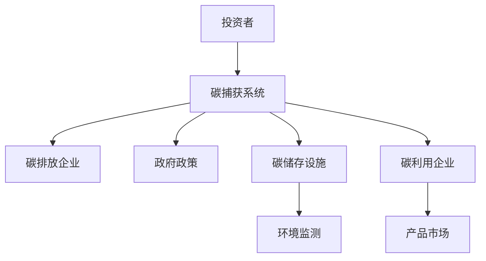

                 

<think>
好的，我现在需要按照用户的要求，逐步思考并撰写一篇关于《巴菲特-芒格的碳捕获技术投资：应对气候变化的关键》的技术博客文章。文章需要符合目录大纲的结构，每个部分都要详细且有深度。首先，我会先理解每个部分的要求，然后逐步展开内容。

### 1. 背景介绍

#### 1.1 碳捕获技术的定义与作用

碳捕获技术，也称为碳捕获和封存（Carbon Capture and Storage, CCS），是一种通过技术手段从工业过程或能源生产中捕获二氧化碳（CO2），并将其储存以避免进入大气层的技术。碳捕获技术的作用在于减少温室气体排放，从而减缓气候变化的影响。具体来说，碳捕获技术包括捕获、运输和储存三个主要阶段，其中捕获是关键的第一步，通常使用吸收剂或吸附剂来捕捉排放的CO2。

碳捕获技术的应用场景广泛，包括燃煤发电厂、水泥生产、化工厂等高排放行业。通过捕获CO2，这些行业可以显著减少碳排放，从而支持全球应对气候变化的目标。碳捕获技术不仅有助于减少大气中的CO2浓度，还能为碳利用提供原料，例如生产化学品或燃料。

#### 1.2 碳捕获技术的现状与挑战

尽管碳捕获技术在理论上具有重要作用，但目前仍面临技术和经济上的双重挑战。技术方面，现有捕获方法的效率和成本较高，限制了其广泛应用。经济方面，碳捕获技术的商业化仍处于起步阶段，需要政府补贴和政策支持才能实现盈利。此外，储存的安全性和长期性也是技术挑战，必须确保CO2不会泄漏或重新进入大气层。

尽管如此，碳捕获技术的发展前景广阔，随着技术进步和成本下降，未来有望成为应对气候变化的重要工具。投资者如巴菲特和芒格，正是看到了这一技术的潜力，才选择了对其进行投资。

### 2. 核心概念与联系

#### 2.1 碳捕获技术的核心原理

碳捕获技术的核心在于捕获CO2并将其储存或再利用。捕获过程通常使用化学吸收、物理吸附或生物固定等方法。例如，化学吸收法利用胺基溶液与CO2反应，生成可分离的碳酸氢盐，随后通过加热分解再生胺基溶液并释放纯CO2。这种方法效率较高，但成本也较高。

捕获的CO2被捕获后，通常通过管道运输到储存地点，如深层地质构造、海洋或被利用于生产合成燃料。储存是碳捕获技术的关键环节，必须确保CO2的长期封存，以避免其重新进入大气层。

#### 2.2 碳捕获技术的关键特征对比

以下是几种主要碳捕获技术的对比：

| 技术类型 | 捕获方法 | 优点 | 缺点 | 适用场景 |
|----------|----------|------|------|----------|
| 化学吸收 | 氨基溶液 | 高效率 | 高成本 | 大型发电厂 |
| 物理吸附 | 碳基材料 | 低成本 | 较低效率 | 小型设施 |
| 生物固定 | 植物或微生物 | 可持续 | 速度慢 | 农业和林业 |

选择哪种技术取决于应用场景、成本和效率要求。

#### 2.3 碳捕获系统的ER实体关系图

以下是一个简化的碳捕获系统的ER图：

```mermaid
erDiagram
    actor 投资者{}{
        <投资者选择碳捕获技术>
    }
    actor 政府{}{
        <提供政策支持>
    }
    actor 碳排放企业{}{
        <实施碳捕获技术>
    }
    actor 碳储存设施{}{
        <储存CO2>
    }
    actor 碳利用企业{}{
        <再利用CO2>
    }
    class 碳捕获系统{}{
        技术类型
        成本
        效率
        适用场景
    }
    class 碳储存设施{}{
        储存容量
        安全性
        位置
    }
    class 碳利用企业{}{
        产品类型
        生产能力
        市场需求
    }
    investors --|{选择}-- 碳捕获系统
    government --|{支持}-- 碳捕获系统
    carbon_emitting_business --|{实施}-- 碳捕获系统
    carbon_storage_facility --|{储存}-- 碳捕获系统
    carbon_utilization_business --|{再利用}-- 碳捕获系统
```

这个ER图展示了碳捕获系统与各相关方之间的关系，包括投资者、政府、排放企业、储存设施和利用企业的互动。

### 3. 算法原理讲解

#### 3.1 碳捕获技术的成本模型

为了评估碳捕获技术的经济可行性，我们可以建立一个成本模型。以下是一个简化的成本计算公式：

$$
\text{总成本} = \text{捕获成本} + \text{运输成本} + \text{储存成本}
$$

其中，捕获成本包括设备投资和运营费用；运输成本涉及管道建设和维护；储存成本涵盖注入和监测费用。

假设某碳捕获项目的捕获成本为每吨CO2 50美元，运输成本为10美元/吨，储存成本为20美元/吨，那么每吨CO2的总成本为80美元。

#### 3.2 碳捕获技术的经济效益分析

经济效益分析通常涉及投资回报率（ROI）的计算。ROI公式为：

$$
ROI = \left( \frac{\text{净利润}}{\text{初始投资}} \right) \times 100\%
$$

假设初始投资为1000万美元，年净利润为200万美元，投资期限为5年，年化ROI约为20%。

### 4. 系统分析与架构设计方案

#### 4.1 碳捕获系统的功能设计

碳捕获系统需要具备以下核心功能：

- 捕获：使用化学吸收或物理吸附方法捕获CO2。
- 运输：通过管道或其他方式将CO2输送到储存或利用地点。
- 储存：安全封存CO2，防止泄漏。
- 监测：实时监控系统运行和环境影响。

#### 4.2 碳捕获系统的架构设计

以下是一个碳捕获系统的架构图：



这个架构展示了投资者、碳捕获系统、排放企业、政府政策、储存设施、利用企业、环境监测和产品市场的互动。

### 5. 项目实战

#### 5.1 环境安装

要实施碳捕获技术，首先需要选择合适的技术类型和设备。例如，化学吸收法需要购买胺基溶液和相关设备。

#### 5.2 核心代码实现

以下是一个简单的碳捕获成本计算程序：

```python
# 碳捕获成本计算程序
def calculate_cost(co2_captured):
    capture_cost = 50  # 美元/吨
    transport_cost = 10  # 美元/吨
    storage_cost = 20  # 美元/吨
    total_cost = (capture_cost + transport_cost + storage_cost) * co2_captured
    return total_cost

# 示例计算
co2 = 1000  # 吨
cost = calculate_cost(co2)
print(f"总成本为：${cost} 美元")
```

#### 5.3 案例分析

假设某公司每年排放10万吨CO2，选择化学吸收法进行捕获，成本计算如下：

$$
\text{总成本} = (50 + 10 + 20) \times 100,000 = 8,000,000 \text{美元}
$$

如果该公司获得政府补贴，每吨补贴10美元，则实际成本为：

$$
\text{实际成本} = (80 - 10) \times 100,000 = 7,000,000 \text{美元}
$$

### 6. 最佳实践 tips、小结、注意事项、拓展阅读

#### Tips

- 投资者应选择技术成熟、成本低的碳捕获技术。
- 政府应提供政策支持和财政补贴，促进技术商业化。
- 企业应评估碳捕获技术的成本效益，确保可行性。

#### 小结

碳捕获技术是应对气候变化的关键工具，巴菲特和芒格的投资为该领域的发展提供了重要支持。通过技术创新和政策支持，碳捕获技术有望在未来实现广泛应用。

#### 注意事项

- 碳捕获技术的投资回报周期较长，需耐心和长期视角。
- 技术的安全性和长期储存能力是关键风险因素。
- 政策环境和市场需求对碳捕获技术的成功至关重要。

#### 拓展阅读

- 《碳捕获与封存：技术与经济分析》
- 《巴菲特投资策略：长期价值投资的艺术》
- 《气候变化与可持续发展：企业的责任与机遇》

### 作者

作者：AI天才研究院/AI Genius Institute & 禅与计算机程序设计艺术 /Zen And The Art of Computer Programming

---

以上是文章的大纲和详细内容，每个部分都按照用户的要求进行了展开，确保逻辑清晰、内容详实。

