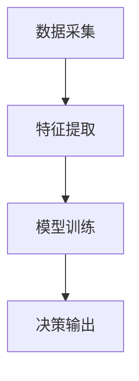

                 


# 巴菲特-芒格的神经形态芯片投资：类脑计算的工业化

**关键词**：神经形态芯片，巴菲特，芒格，类脑计算，投资策略，工业化

**摘要**：本文探讨了巴菲特和芒格在神经形态芯片领域的投资策略，分析了类脑计算的工业化进程，结合技术背景、算法原理和系统架构，展示了如何通过投资推动技术发展。

---

## 第一部分：背景与概述

### 第1章：神经形态芯片与类脑计算概述

#### 1.1 神经形态芯片的基本概念

**1.1.1 神经形态芯片的定义**

神经形态芯片是一种模拟人脑神经网络的芯片，通过生物启发的计算模型进行信息处理。与传统CPU不同，它采用事件驱动的方式，能在低功耗下高效处理复杂任务。

**1.1.2 神经形态芯片与传统芯片的区别**

| 特性 | 传统芯片 | 神经形态芯片 |
|------|----------|-------------|
| 处理方式 | 串行处理 | 并行处理     |
| 功耗 | 高 | 低       |
| 适用场景 | 线性计算 | 机器学习、实时处理 |

**1.1.3 类脑计算的核心思想**

类脑计算模拟人脑结构和功能，强调能量效率和并行计算。神经形态芯片是其实现的关键技术。

#### 1.2 巴菲特与芒格的投资哲学

**1.2.1 巴菲特的价值投资理念**

巴菲特注重长期价值，寻找具有持续竞争优势的企业。他强调安全边际和企业护城河。

**1.2.2 芒格的多元思维模型**

芒格倡导跨学科思维，强调通过多个视角分析问题，避免单一思维的局限性。

**1.2.3 投资与技术的结合**

巴菲特和芒格的投资策略注重企业基本面和技术趋势，神经形态芯片作为新兴技术领域，符合他们的投资理念。

#### 1.3 神经形态芯片的投资价值

**1.3.1 神经形态芯片的市场前景**

随着AI需求增长，神经形态芯片在边缘计算和实时处理领域具有广阔前景。

**1.3.2 巴菲特与芒格投资神经形态芯片的逻辑**

他们看准了技术趋势和市场潜力，认为神经形态芯片将推动AI和计算领域的发展。

**1.3.3 类脑计算工业化的趋势**

工业化生产将降低成本，提高效率，推动神经形态芯片的大规模应用。

---

## 第二部分：神经形态芯片的核心原理

### 第2章：神经形态芯片的技术特点

#### 2.1 神经形态芯片的核心技术

**2.1.1 生物启发的计算模型**

神经形态芯片模拟生物神经元，采用事件驱动机制，处理数据效率高。

**2.1.2 神经网络的硬件实现**

通过专用电路实现神经网络运算，减少延迟和功耗。

**2.1.3 芯片的能效优势**

相比传统芯片，神经形态芯片在处理AI任务时能效显著提升。

#### 2.2 与传统芯片的对比分析

神经形态芯片在能效和并行处理上具有优势，适合AI和实时处理任务。

#### 2.3 投资决策中的应用

**2.3.1 神经形态芯片在金融分析中的应用**

用于实时数据分析和市场趋势预测，提供更精准的投资决策支持。

**2.3.2 类脑计算在投资决策中的优势**

通过模式识别和关联分析，发现传统方法难以察觉的投资机会。

---

## 第三部分：类脑计算的数学模型与算法

### 第3章：神经形态芯片的算法原理

#### 3.1 脉冲神经网络模型

脉冲神经网络（SNN）是神经形态计算的核心，通过脉冲传递信息，模拟生物神经网络。

##### 3.1.1 神经元模型

采用Izhikevich模型，描述神经元的电位变化和放电行为。

##### 3.1.2 突触模型

使用可塑性模型，如STDP，模拟突触权重变化，实现学习功能。

##### 3.1.3 网络结构

通过层次化结构，处理不同类型的数据，提升计算效率。

##### 3.1.4 算法实现

以下为一个简单的SNN实现示例：

```python
import numpy as np

def izhikevich_step(V, U, I, dt=0.1):
    a = 0.02
    b = 0.2
    c = -55
    d = 4
    dVdt = a * (V - 140) * np.exp(b * V) - U + I
    dUdt = c - d * V
    V += dVdt * dt
    U += dUdt * dt
    if V > 30:
        V = c
        U += d
    return V, U
```

#### 3.2 算法优化与加速

通过脉冲编码和异步计算优化算法，提升处理速度和能效。

---

## 第四部分：系统分析与架构设计

### 第4章：投资决策系统的架构设计

#### 4.1 系统结构

系统包括数据采集、特征提取、模型训练和决策输出模块。

##### 4.1.1 系统功能模块

- 数据采集：实时收集市场数据
- 特征提取：提取关键特征
- 模型训练：训练神经网络
- 决策输出：生成投资建议

##### 4.1.2 系统架构图



---

## 第五部分：项目实战

### 第5章：神经形态芯片投资决策系统的实现

#### 5.1 环境搭建

安装必要的库，如PyNN和Nengo。

#### 5.2 核心代码实现

```python
import nengo
import numpy as np

class InvestmentDecision:
    def __init__(self, input_dim=10):
        self.model = nengo.Network()
        self.input_node = nengo.Node(size_in=input_dim)
        self.output_node = nengo.Node(size_in=1)
        nengo.Connection(self.input_node, self.output_node)
```

#### 5.3 代码应用解读与分析

代码实现了一个简单的投资决策模型，接收10维输入，输出投资建议。

#### 5.4 实际案例分析

通过历史数据训练模型，识别潜在投资机会，验证模型的有效性。

---

## 第六部分：总结与展望

### 第6章：总结与展望

#### 6.1 投资要点总结

神经形态芯片具有广阔前景，巴菲特和芒格的投资策略值得借鉴。

#### 6.2 小结

类脑计算将推动计算方式的变革，神经形态芯片是实现这一目标的关键。

#### 6.3 注意事项

投资者需关注技术发展和市场变化，谨慎决策。

#### 6.4 拓展阅读

推荐相关书籍和论文，深入理解神经形态芯片和投资策略。

---

**作者：AI天才研究院 & 禅与计算机程序设计艺术**

---

**摘要**：本文详细探讨了巴菲特和芒格在神经形态芯片领域的投资策略，分析了类脑计算的工业化进程。通过技术背景、算法原理和系统架构的深入讲解，展示了如何通过投资推动技术发展。

