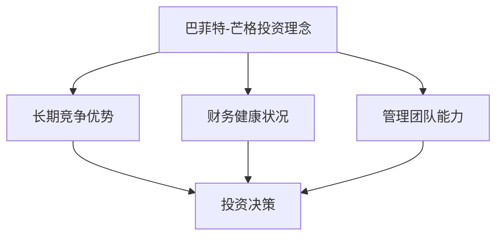
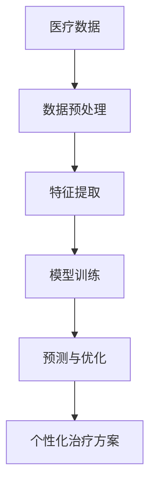
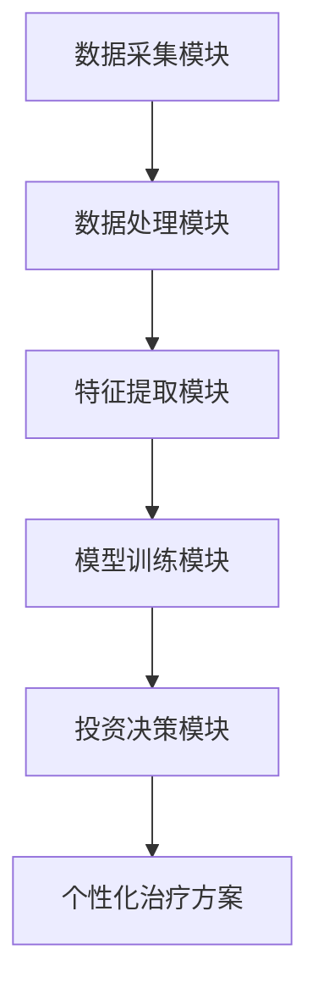
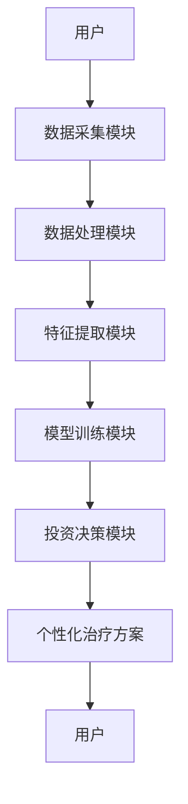

                 

# 巴菲特-芒格的精准医疗AI投资：个性化治疗的新时代

> 关键词：巴菲特，芒格，精准医疗，AI投资，个性化治疗

> 摘要：本文探讨了巴菲特和芒格的投资理念与AI技术在精准医疗中的结合，特别是在个性化治疗领域的应用。通过分析AI在医疗投资中的作用，以及其在疾病预测、诊断和治疗方案优化中的应用，本文揭示了如何利用AI技术优化投资决策，推动个性化治疗的发展。

---

## 第一部分: 巴菲特-芒格投资理念与精准医疗的结合

### 第1章: 巴菲特-芒格投资理念概述

#### 1.1 巴菲特-芒格投资理念的核心思想

##### 1.1.1 巴菲特的价值投资理论

沃伦·巴菲特的价值投资理论是基于长期持有的策略，寻找具有持续竞争优势、良好管理和强大财务状况的公司。他的投资理念强调“以合理的价格买入优秀的公司”，而非仅仅关注短期的股价波动。

##### 1.1.2 芒格的多元思维模型

查理·芒格提出的多元思维模型强调通过多个学科的交叉思考来理解问题。他认为，投资者应该将各个学科的基本原理联系起来，形成一个知识框架，从而做出更明智的决策。

##### 1.1.3 巴菲特-芒格投资理念的现代发展

随着科技的进步，巴菲特和芒格的投资理念也在不断演变。他们开始关注那些能够利用技术优势、特别是在人工智能领域具有竞争优势的公司。这种演变使得他们的投资理念更加注重长期的技术驱动和创新。

#### 1.2 精准医疗与个性化治疗的概念

##### 1.2.1 精准医疗的定义与特点

精准医疗是一种基于患者个体特征（如基因、环境、生活方式等）的个性化医疗方式。其特点是通过精确的诊断和治疗，最大化治疗效果，减少副作用。

##### 1.2.2 个性化治疗的核心要素

个性化治疗的核心要素包括：患者个体特征的全面分析、基于大数据的治疗方案制定、动态调整的治疗策略。

##### 1.2.3 精准医疗与个性化治疗的边界与外延

精准医疗的外延包括基因编辑、液体活检、AI辅助诊断等领域。个性化治疗的边界则涉及如何在大规模人群中实现个体化治疗，以及如何平衡医疗成本与治疗效果。

### 第2章: AI在精准医疗投资中的作用

#### 2.1 AI技术在医疗领域的应用现状

##### 2.1.1 医疗数据分析与AI

AI技术在医疗数据分析中的应用包括：医疗影像识别、电子健康记录分析、基因数据挖掘等。

##### 2.1.2 AI在疾病预测与诊断中的应用

AI在疾病预测中的应用包括：基于机器学习的疾病风险评估、预测模型的构建等。在诊断方面，AI技术可以辅助医生进行疾病诊断，提高诊断的准确性和效率。

##### 2.1.3 AI在治疗方案优化中的作用

AI可以通过分析大量临床数据，优化治疗方案，提高治疗效果。例如，基于AI的治疗方案推荐系统可以根据患者的个体特征，推荐最适合的治疗方案。

#### 2.2 AI在医疗投资中的价值

##### 2.2.1 数据驱动的投资决策

AI可以通过分析医疗行业的数据，帮助投资者发现具有潜力的公司和投资机会。例如，通过分析某家医疗科技公司的技术优势、市场前景等，AI可以提供数据支持的投资决策。

##### 2.2.2 AI在风险评估与投资组合优化中的应用

AI可以帮助投资者进行风险评估，优化投资组合。例如，通过分析某家公司的财务数据、市场风险等因素，AI可以预测投资风险，并提供相应的优化建议。

##### 2.2.3 巴菲特-芒格理念与AI技术的结合

巴菲特和芒格的理念强调长期投资和价值发现，而AI技术可以帮助投资者更快地发现具有长期竞争优势的公司。例如，AI可以通过分析公司的技术创新能力、市场地位等，帮助投资者识别具有长期增长潜力的公司。

---

## 第二部分: 精准医疗AI投资的核心概念与联系

### 第3章: 核心概念与联系

#### 3.1 核心概念原理

##### 3.1.1 巴菲特-芒格投资理念的数学模型

巴菲特-芒格投资理念的数学模型可以表示为：

$$ \text{投资价值} = \text{公司长期竞争优势} \times \text{财务健康状况} \times \text{管理团队能力} $$

##### 3.1.2 AI在精准医疗中的算法原理

AI在精准医疗中的算法原理主要包括数据预处理、特征提取、模型训练和预测等步骤。例如，基于深度学习的图像识别算法可以用于医疗影像分析。

#### 3.2 核心概念属性特征对比表格

表3.1 巴菲特-芒格投资理念与AI技术的对比分析

| 属性        | 巴菲特-芒格投资理念                        | AI技术在精准医疗中的应用                          |
|-------------|-------------------------------------------|----------------------------------------------|
| 核心目标     | 寻找具有长期竞争优势的公司               | 提高疾病预测、诊断和治疗的精准性                |
| 分析方法     | 财务分析、竞争优势分析                     | 数据挖掘、机器学习、深度学习                    |
| 应用领域     | 投资决策                                   | 医疗诊断、治疗方案优化                          |
| 依赖因素     | 公司基本面、管理团队                      | 大数据、算法、计算能力                          |

#### 3.3 ER实体关系图与Mermaid流程图

图3.1 巴菲特-芒格投资理念与AI技术的实体关系图

图3.2 AI在精准医疗中的流程图

---

## 第三部分: 精准医疗AI投资的算法原理

### 第4章: 算法原理讲解

#### 4.1 AI算法在精准医疗中的应用

##### 4.1.1 机器学习模型在疾病预测中的应用

机器学习模型（如随机森林、支持向量机）可以用于疾病风险评估。例如，通过分析患者的基因数据和生活习惯，模型可以预测其患某种疾病的风险。

##### 4.1.2 深度学习在医疗影像识别中的应用

深度学习模型（如卷积神经网络）可以用于医疗影像的自动识别。例如，通过分析CT扫描图像，模型可以辅助医生诊断肿瘤的位置和大小。

#### 4.2 巴菲特-芒格投资策略的数学模型

##### 4.2.1 投资组合优化的数学公式

投资组合优化的数学公式可以表示为：

$$ \text{最大化收益} = \sum_{i=1}^n w_i r_i $$
$$ \text{最小化风险} = \sum_{i=1}^n w_i^2 \sigma_i^2 $$

其中，\( w_i \) 是第i个资产的投资权重，\( r_i \) 是第i个资产的预期收益，\( \sigma_i^2 \) 是第i个资产的风险。

##### 4.2.2 风险评估与收益预测的数学模型

风险评估的数学模型可以表示为：

$$ \text{风险} = \sqrt{\sum_{i=1}^n (r_i - \mu)^2 \times w_i} $$

其中，\( \mu \) 是所有资产的平均收益，\( w_i \) 是第i个资产的投资权重。

#### 4.3 算法流程图

图4.1 精准医疗AI投资的算法流程图

---

## 第四部分: 项目实战

### 第5章: 系统分析与架构设计

#### 5.1 系统功能设计

##### 5.1.1 数据采集与处理模块

数据采集与处理模块负责收集和整理医疗数据，包括患者的基因数据、电子健康记录等。

##### 5.1.2 AI算法实现模块

AI算法实现模块负责对数据进行分析和处理，包括特征提取、模型训练和预测。

##### 5.1.3 投资决策模块

投资决策模块根据AI算法的结果，生成投资建议，优化投资组合。

#### 5.2 系统架构设计

##### 5.2.1 系统架构图

图5.1 系统架构图

##### 5.2.2 模块之间的交互关系

模块之间的交互关系主要包括数据流和控制流。例如，数据采集模块将数据传递给数据处理模块，数据处理模块将处理后的数据传递给特征提取模块，依此类推。

#### 5.3 系统接口设计

##### 5.3.1 数据接口设计

数据接口设计包括数据输入接口和数据输出接口。数据输入接口负责接收医疗数据，数据输出接口负责输出处理后的数据。

##### 5.3.2 用户接口设计

用户接口设计包括用户输入界面和用户输出界面。用户可以通过输入界面输入数据，通过输出界面查看处理结果。

#### 5.4 系统交互序列图

图5.2 系统交互序列图

---

## 第六部分: 最佳实践与小结

### 第6章: 最佳实践与小结

#### 6.1 最佳实践 tips

- 在进行AI投资决策时，建议结合巴菲特-芒格投资理念，寻找具有长期竞争优势的公司。
- 在进行精准医疗AI投资时，建议关注技术的可解释性和数据的隐私保护。

#### 6.2 小结

本文探讨了巴菲特和芒格的投资理念与AI技术在精准医疗中的结合，特别是在个性化治疗领域的应用。通过分析AI在医疗投资中的作用，以及其在疾病预测、诊断和治疗方案优化中的应用，本文揭示了如何利用AI技术优化投资决策，推动个性化治疗的发展。

---

## 作者信息

作者：AI天才研究院/AI Genius Institute & 禅与计算机程序设计艺术 /Zen And The Art of Computer Programming

---

本文通过系统地分析巴菲特和芒格的投资理念，以及AI技术在精准医疗中的应用，展示了如何将传统投资理念与现代技术相结合，推动个性化治疗的发展。希望本文能为读者提供新的视角和思路，帮助他们在精准医疗和AI投资领域取得更大的成功。

