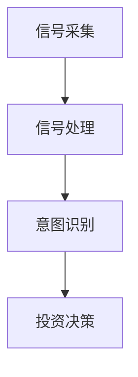

                 


# 巴菲特-芒格的脑机接口伦理投资：增强人类与AI共存

> 关键词：脑机接口，伦理投资，巴菲特，芒格，人工智能，投资策略

> 摘要：本文探讨了脑机接口技术在投资领域的应用，结合巴菲特和芒格的投资哲学，分析了如何通过脑机接口技术增强人类投资决策能力，同时确保投资行为的伦理性和可持续性。文章从脑机接口技术的基本概念、算法原理、系统架构、项目实战等方面展开，深入分析了技术与投资哲学的融合，为未来的投资策略提供了新的视角。

---

## 第一部分：脑机接口与伦理投资的背景与基础

### 第1章：脑机接口技术概述

#### 1.1 脑机接口的定义与核心概念

脑机接口（Brain-Computer Interface, BCI）是一种连接人脑与外部设备的接口技术，通过采集和解析脑电信号，将人的意图转化为设备的控制指令。其核心概念包括：

- **信号采集**：通过 EEG（电极）采集大脑电信号。
- **信号处理**：对采集到的信号进行降噪、特征提取和分类。
- **意图识别**：将大脑电信号转化为具体的意图或指令。
- **输出控制**：将识别的意图转化为设备的控制信号。

**脑机接口的核心要素包括：**
- **硬件设备**：EEG电极、信号采集模块。
- **软件算法**：信号处理算法、分类器、意图识别模型。
- **用户界面**：与用户交互的界面，如虚拟现实设备。

#### 1.2 脑机接口技术的发展历程

脑机接口技术经历了从实验研究到实际应用的演变。早期的研究主要集中在实验室环境下的信号采集与分析，随着技术的进步，脑机接口逐渐应用于医疗康复、游戏娱乐、教育等领域。当前，脑机接口技术在投资领域的应用仍处于探索阶段，但其潜力巨大。

#### 1.3 脑机接口与伦理投资的关联

脑机接口技术在投资中的应用，可以增强人类的投资决策能力。通过实时采集和分析投资者的脑电信号，脑机接口可以帮助投资者更好地理解自己的情绪和决策倾向，从而做出更理性的投资决策。伦理投资的核心理念是追求长期的社会价值和经济价值的统一，而脑机接口技术可以帮助投资者在决策过程中更好地平衡短期利益与长期价值。

---

### 第2章：巴菲特与芒格的投资哲学

#### 2.1 巴菲特的价值投资理念

巴菲特的价值投资理念强调长期投资、安全边际和企业基本面分析。他主张投资那些具有持续竞争优势和良好治理结构的企业，并在市场恐慌时买入，在市场狂热时卖出。

#### 2.2 芒格的多元思维模型

芒格的多元思维模型强调将不同学科的原理和方法结合起来，形成一个多维度的思考框架。他主张投资者应该具备跨学科的知识储备，以便更好地理解企业的经营环境和市场趋势。

#### 2.3 巴菲特与芒格投资理念的现代挑战

在数字化时代，传统投资策略面临新的挑战。AI技术的快速发展可能改变传统的投资方式，但巴菲特和芒格的投资哲学仍然具有重要的指导意义。通过脑机接口技术，投资者可以更好地理解和应用他们的投资理念。

---

## 第二部分：脑机接口技术在投资中的应用

### 第3章：脑机接口技术的算法原理

#### 3.1 脑机接口的核心算法

脑机接口的核心算法包括信号处理算法和意图识别算法。信号处理算法主要用于降噪和特征提取，意图识别算法则通过机器学习模型对特征进行分类。

**步骤说明：**
1. **信号采集**：通过EEG电极采集大脑电信号。
2. **降噪处理**：去除环境噪声和肌肉噪声。
3. **特征提取**：提取信号中的有用特征，如功率谱、时域特征、频域特征等。
4. **分类器训练**：使用机器学习算法（如SVM、随机森林、神经网络）对特征进行分类。
5. **意图识别**：根据分类结果生成控制指令。

**示例：使用Python实现简单的信号处理和分类**

```python
import numpy as np
import matplotlib.pyplot as plt
from sklearn.svm import SVC

# 信号采集和降噪
def preprocess_signal(signal):
    # 假设signal是一个包含EEG数据的数组
    # 这里进行简单的降噪处理，例如去除高频噪声
    filtered_signal = np.convolve(signal, np.ones(5)/5, mode='same')
    return filtered_signal

# 特征提取和分类
def extract_features(signal):
    # 提取信号的均值、方差、峰峰值等特征
    features = []
    for segment in signal:
        mean = np.mean(segment)
        var = np.var(segment)
        ptp = np.ptp(segment)
        features.append([mean, var, ptp])
    return features

# 训练分类器
def train_classifier(features, labels):
    clf = SVC()
    clf.fit(features, labels)
    return clf

# 预测意图
def predict_intention(test_features, clf):
    return clf.predict(test_features)
```

#### 3.2 脑机接口技术的数学模型

在脑机接口系统中，信号处理和分类算法是关键。常用的数学模型包括：

- **傅里叶变换**：用于分析信号的频域特征。
- **小波变换**：用于分析信号的时间-频率特征。
- **线性回归**：用于分类器的训练和预测。

**傅里叶变换示例：**

```python
import numpy as np
import matplotlib.pyplot as plt

# 生成一个简单的信号
sampling_rate = 1000
t = np.linspace(0, 1, sampling_rate)
signal = np.sin(2*np.pi*5*t) + np.sin(2*np.pi*10*t)

# 计算傅里叶变换
 fft = np.fft.fft(signal)
 fft_magnitude = np.abs(fft)
 fft_magnitude = fft_magnitude[:int(len(fft)/2)]  # 取前半部分

# 绘制频谱图
plt.plot(np.linspace(0, sampling_rate/2, len(fft_magnitude)), fft_magnitude)
plt.xlabel('Frequency [Hz]')
plt.ylabel('Magnitude')
plt.show()
```

---

### 第4章：系统架构与项目实战

#### 4.1 系统架构设计

脑机接口投资系统的架构包括信号采集模块、信号处理模块、意图识别模块和投资决策模块。

**系统架构图：**



#### 4.2 项目实战：基于脑机接口的投资决策系统

**环境安装：**
- 安装必要的Python库：numpy、scipy、sklearn、pyplot。
- 安装脑机接口开发工具包（如OpenBCI）。

**核心代码实现：**

```python
import numpy as np
from sklearn import svm

# 信号采集与预处理
def collect_signal():
    # 这里假设已经连接了脑机接口设备
    # 返回预处理后的信号数据
    pass

# 特征提取与分类
def train_model(train_signals, train_labels):
    # 提取特征
    features = extract_features(train_signals)
    # 训练分类器
    clf = svm.SVC()
    clf.fit(features, train_labels)
    return clf

# 投资决策模块
def make_investment决策(clf, test_signal):
    # 提取测试信号的特征
    test_features = extract_features(test_signal)
    # 预测意图
    prediction = clf.predict(test_features)
    return prediction
```

**案例分析：**

假设我们训练了一个分类器，能够识别投资者在看到股票价格波动时的情绪变化。当投资者表现出贪婪情绪时，系统会提醒其注意市场风险；当投资者表现出恐惧情绪时，系统会建议其增加防御性投资。

---

## 第三部分：结论与展望

脑机接口技术在投资领域的应用潜力巨大。通过结合巴菲特和芒格的投资哲学，我们可以更好地理解和应用这一技术。未来，随着脑机接口技术的不断发展，投资者将能够更高效地做出决策，实现人类与AI的和谐共存。

---

## 参考文献

1. 巴菲特《巴菲特致股东的信》
2. 芒格《穷查理宝典》
3. 前沿的脑机接口技术研究论文

---

作者：AI天才研究院/AI Genius Institute & 禅与计算机程序设计艺术 /Zen And The Art of Computer Programming

