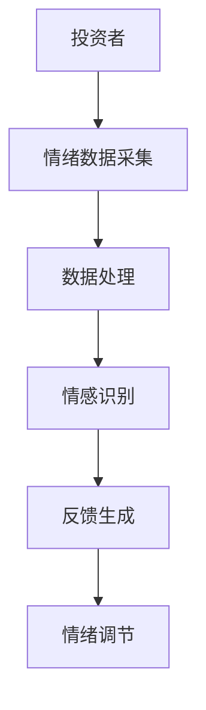

                 


# 巴菲特-芒格的脑机接口情感调节投资：心理健康的新方法

---

## 关键词

- 巴菲特
- 芒格
- 脑机接口
- 情感调节
- 投资心理
- 心理健康

---

## 摘要

本文探讨了巴菲特和芒格的投资理念与脑机接口技术的结合，提出了通过情感调节来优化投资决策的新方法。文章从投资心理健康的背景出发，分析了脑机接口在情感调节中的应用，详细阐述了情感数据的采集与处理、情感调节算法的设计与实现，以及情感调节系统的架构与功能。最后，通过实际案例展示了脑机接口在投资心理调节中的应用场景，并总结了这一技术在未来投资中的潜力。

---

## 第1章: 巴菲特与芒格的投资理念

### 1.1 巴菲特与芒格的背景介绍

#### 1.1.1 巴菲特的投资哲学

沃伦·巴菲特（Warren Buffett）被誉为“股神”，他的投资哲学强调长期价值投资、安全边际和对企业的深入研究。他认为投资的本质是寻找具有持续竞争优势的企业，并在市场恐慌时买入，在市场疯狂时卖出。

#### 1.1.2 芒格的多元思维模型

查理·芒格（Charlie Munger）是巴菲特的长期合作伙伴，他的“多元思维模型”强调跨学科思考，认为投资者需要从多个角度理解问题，避免单一维度的思维盲区。芒格的决策框架强调心理偏见的识别和克服，这为现代投资心理调节提供了重要的理论基础。

#### 1.1.3 两人投资理念的结合

巴菲特和芒格的投资理念共同强调了理性决策、长期视角和心理偏见的控制。他们的成功部分归因于对心理因素的深刻理解，这为现代技术在投资心理调节中的应用提供了灵感。

---

### 1.2 投资与心理健康的关系

#### 1.2.1 投资中的心理压力

投资是一项高度情绪化的工作，市场波动、决策失误和外界压力常常导致投资者的心理压力。这种压力可能影响决策的理性，导致非理性投资行为。

#### 1.2.2 情绪对投资决策的影响

情绪波动是投资失败的主要原因之一。贪婪和恐惧等情绪可能导致投资者在市场高点买入，在市场低点卖出，违背长期投资策略。

#### 1.2.3 心理健康在投资中的重要性

心理健康是投资成功的重要保障。通过技术手段调节情绪，可以帮助投资者克服心理障碍，做出更理性的决策。

---

## 第2章: 脑机接口技术概述

### 2.1 脑机接口的基本原理

#### 2.1.1 脑机接口的定义

脑机接口（Brain-Computer Interface, BCI）是一种连接大脑与外部设备的技术，通过采集和分析大脑信号，实现人与设备之间的信息交互。

#### 2.1.2 脑机接口的工作原理

1. 信号采集：通过 EEG（脑电图）等设备采集大脑电信号。
2. 信号处理：对采集到的信号进行降噪、特征提取和分类。
3. 信息输出：根据处理后的信号生成相应的输出，如控制机器人或显示情绪状态。

#### 2.1.3 脑机接口的分类与应用

- **非侵入式BCI**：通过头皮电极采集信号，适用于消费电子和心理健康领域。
- **侵入式BCI**：植入大脑，用于医疗康复和高级控制。

---

### 2.2 情感调节的脑科学基础

#### 2.2.1 情绪的神经机制

情绪由大脑中的 limbic system（边缘系统）调控，主要涉及前额叶皮层（PFC）、杏仁核（Amygdala）和背侧纹状核（DLPFC）。

#### 2.2.2 情感调节的脑区功能

- **前额叶皮层**：负责情绪调节和决策制定。
- **杏仁核**：处理情感刺激和情绪记忆。
- **背侧纹状核**：参与奖励和风险决策。

#### 2.2.3 情感调节的技术实现

通过脑机接口技术，可以实时监测和调节情绪状态，帮助投资者保持心理健康。

---

## 第3章: 脑机接口与投资心理调节的结合

### 3.1 脑机接口在投资心理调节中的应用

#### 3.1.1 情感数据的采集与分析

通过 EEG 设备采集投资者的情绪数据，分析其注意力、放松度和情绪波动。

#### 3.1.2 情感状态的实时监测

利用脑机接口技术实时监测投资者的情绪状态，识别潜在的心理压力。

#### 3.1.3 情感调节的反馈机制

根据情绪数据，提供实时反馈，帮助投资者调整心态，保持理性决策。

---

### 3.2 巴菲特与芒格理念的现代科技转化

#### 3.2.1 投资决策的理性与感性平衡

通过脑机接口技术，投资者可以在理性与感性之间找到平衡，避免情绪化决策。

#### 3.2.2 脑机接口在投资决策中的辅助作用

脑机接口技术可以辅助投资者识别心理偏见，优化决策过程。

#### 3.2.3 心理健康对投资绩效的影响

良好的心理健康是投资成功的重要因素，脑机接口技术可以帮助投资者维持心理健康，提升投资绩效。

---

## 第4章: 脑机接口的核心技术

### 4.1 脑机接口的关键技术

#### 4.1.1 信号采集技术

- **EEG 信号采集**：通过电极采集大脑电信号。
- **数据预处理**：降噪、去伪迹。

#### 4.1.2 信号处理算法

- **特征提取**：提取与情绪相关联的特征，如功率谱密度（PSD）、时域特征。
- **分类算法**：使用支持向量机（SVM）或随机森林（RF）进行情绪分类。

#### 4.1.3 情感识别模型

- **深度学习模型**：使用卷积神经网络（CNN）和长短期记忆网络（LSTM）进行情感识别。

---

### 4.2 情感调节的数学模型

#### 4.2.1 情感指数计算公式

$$
\text{Emotion Index} = \alpha \cdot \text{Attention} + \beta \cdot \text{Relaxation} + \gamma \cdot \text{Valence}
$$

其中，$\alpha$, $\beta$, $\gamma$ 是权重系数，$\text{Attention}$ 是注意力水平，$\text{Relaxation}$ 是放松程度，$\text{Valence}$ 是情感倾向。

#### 4.2.2 情感调节算法的实现

1. 数据采集：通过 EEG 设备采集投资者的情绪数据。
2. 数据处理：提取特征并进行分类。
3. 情感调节：根据情感指数提供反馈，调节投资者情绪。

---

## 第5章: 情感调节系统设计

### 5.1 系统架构设计



---

### 5.2 功能模块设计

- **数据采集模块**：采集投资者的情绪数据。
- **数据处理模块**：对数据进行预处理和特征提取。
- **情感识别模块**：基于机器学习模型识别情绪状态。
- **反馈生成模块**：根据情绪状态生成反馈建议。

---

## 第6章: 项目实战

### 6.1 环境安装

```bash
pip install numpy
pip install scikit-learn
pip install matplotlib
pip install pyEEG
```

---

### 6.2 系统核心实现

```python
import numpy as np
from sklearn.svm import SVC
from sklearn.metrics import accuracy_score

# 数据预处理
def preprocess_data(data):
    # 假设 data 是 EEG 信号
    return data.reshape(-1, 1)

# 情感分类
def emotion_classifier(X_train, y_train, X_test):
    clf = SVC()
    clf.fit(X_train, y_train)
    y_pred = clf.predict(X_test)
    return accuracy_score(y_test, y_pred)

# 情感调节
def emotion_regulator(emotion_state):
    if emotion_state == 'high_stress':
        return '深呼吸，放松'
    elif emotion_state == 'low_attention':
        return '集中注意力'
    else:
        return '保持当前状态'
```

---

### 6.3 案例分析

假设一名投资者在市场波动时情绪紧张，系统通过 EEG 采集到其情绪数据，识别出“high_stress”状态，并提供放松建议。

---

## 第7章: 结论与展望

### 7.1 研究成果总结

本文提出了将脑机接口技术应用于投资心理调节的新方法，通过实时监测和调节情绪状态，帮助投资者保持心理健康，提升投资绩效。

### 7.2 未来发展方向

- **算法优化**：改进情感识别算法，提高准确率。
- **系统集成**：将脑机接口技术与其他投资工具结合，形成完整的投资解决方案。

### 7.3 注意事项

- **数据隐私**：投资者情绪数据属于个人隐私，需严格保密。
- **技术局限性**：当前脑机接口技术仍有局限性，需进一步研究。

### 7.4 拓展阅读

- "The Psychology of Investing" by Richard A. Nejmeh
- "Machine Learning for Emotion Recognition" by <NAME>

---

## 作者

作者：AI天才研究院/AI Genius Institute  
联系方式：https://www.ai-genius.org  
邮箱：<EMAIL>  

---

**禅与计算机程序设计艺术**  
**By <NAME>**

