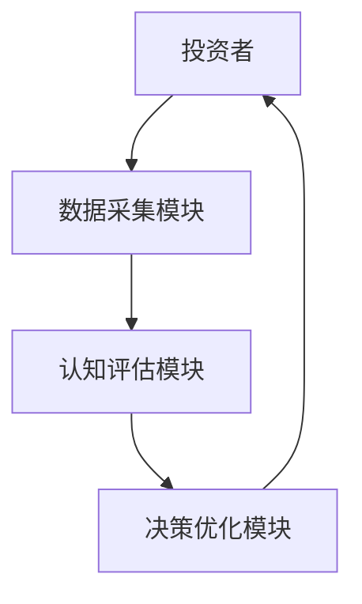

                 


# 巴菲特-芒格的脑科学投资：认知增强技术的前景

---

## 关键词：巴菲特, 芒格, 脑科学, 认知增强, 投资决策, 神经科学, 人工智能

---

## 摘要

本文探讨了巴菲特和芒格的投资方法与脑科学之间的联系，分析了认知增强技术在投资决策中的潜力。通过结合神经科学和认知科学，我们揭示了注意力机制、情绪管理和认知偏差对投资决策的影响，并提出了基于脑科学的认知增强技术的应用方案。文章详细介绍了相关算法原理、系统架构和项目实战，展望了认知增强技术在投资领域的未来发展方向。

---

### 第一章：巴菲特-芒格投资方法概述

#### 1.1 巴菲特-芒格投资方法的核心理念

巴菲特和芒格的投资方法以价值投资和多元思维模型为核心，强调长期投资、安全边际和内在价值。他们的成功不仅依赖于市场分析和财务数据，更依赖于对人类认知规律的理解。芒格提出的“认知的圆圈”概念，强调通过多学科交叉思维来优化决策质量。

#### 1.2 脑科学与认知增强技术的关联

认知增强技术通过神经科学、人工智能和脑机接口等技术手段，提升人类的认知能力。脑科学在投资中的应用，不仅能够帮助投资者更好地理解市场规律，还能优化决策过程，减少认知偏差的影响。

#### 1.3 本章小结

巴菲特和芒格的投资方法与脑科学的结合，为认知增强技术在投资中的应用提供了理论基础。认知增强技术能够帮助投资者更高效地处理信息，优化决策质量。

---

### 第二章：认知偏差与投资决策

#### 2.1 认知偏差的定义与分类

认知偏差是人类在信息处理过程中产生的系统性错误，主要包括确认偏差、过度自信偏差、从众偏差等。这些偏差在投资决策中尤为常见，可能导致错误的投资决策。

#### 2.2 神经经济学与投资决策

神经经济学通过研究大脑活动，揭示了人类在投资决策中的神经机制。通过神经成像技术，我们可以观察到大脑在面对投资选择时的活动模式，从而更好地理解认知偏差的来源。

#### 2.3 认知增强技术在投资中的应用

认知增强技术通过实时监测大脑活动，识别并纠正认知偏差，帮助投资者做出更理性的决策。例如，通过脑机接口技术，投资者可以实时了解自己的认知偏差，并采取相应的策略来优化决策。

#### 2.4 本章小结

认知偏差是影响投资决策的重要因素。通过神经经济学和认知增强技术，我们可以更好地理解和克服这些偏差，从而提高投资决策的准确性。

---

### 第三章：投资决策中的注意力机制

#### 3.1 注意力机制的基本原理

注意力是人类认知过程中的关键因素，直接影响信息处理的效率和质量。在投资决策中，注意力的分配直接决定了投资者对市场信息的关注程度。

#### 3.2 神经科学中的注意力模型

神经科学研究表明，注意力的调控与大脑的前额叶皮层密切相关。通过神经成像技术，我们可以观察到投资者在面对复杂市场信息时的注意力变化。

#### 3.3 认知增强技术对注意力机制的优化

认知增强技术通过训练和优化注意力机制，帮助投资者更高效地处理信息。例如，通过特定的心理训练和神经反馈技术，投资者可以更好地集中注意力，提高决策效率。

#### 3.4 本章小结

注意力机制在投资决策中起着关键作用。通过认知增强技术，我们可以优化注意力分配，提高投资决策的质量。

---

### 第四章：投资决策中的情绪与风险偏好

#### 4.1 情绪与投资决策的关系

情绪是人类认知过程中的重要组成部分，直接影响投资决策。例如，贪婪和恐惧是导致市场泡沫和恐慌性抛售的重要原因。

#### 4.2 神经科学中的情绪调控机制

神经科学研究表明，情绪的产生与大脑的情绪中枢密切相关。通过神经成像技术，我们可以观察到投资者在面对风险时的情绪变化。

#### 4.3 认知增强技术在情绪管理中的应用

认知增强技术通过实时监测情绪变化，帮助投资者更好地管理情绪。例如，通过神经反馈技术，投资者可以实时了解自己的情绪状态，并采取相应的策略来控制情绪。

#### 4.4 本章小结

情绪与风险偏好是投资决策中的重要因素。通过认知增强技术，我们可以更好地管理情绪，降低情绪对决策的负面影响。

---

### 第五章：认知增强技术的算法原理

#### 5.1 认知增强算法的核心原理

认知增强算法通过模拟和优化人类认知过程，帮助投资者更高效地处理信息。例如，基于强化学习的算法可以通过历史数据训练，预测市场的未来走势。

#### 5.2 基于神经网络的认知增强模型

神经网络模型在认知增强技术中具有重要应用。通过训练神经网络，我们可以模拟人类大脑的信息处理过程，提高投资决策的准确性。

#### 5.3 算法实现与代码示例

以下是基于强化学习的认知增强算法的Python代码示例：

```python
import numpy as np
import random

def cognitive_enhancement_algorithm(state_space, action_space, learning_rate=0.01):
    # 初始化神经网络参数
    weights = np.random.randn(state_space, action_space)
    
    # 训练过程
    for episode in range(num_episodes):
        state = initial_state
        while not done:
            # 计算动作概率
            action_probs = np.exp(weights[state, :]) / np.sum(np.exp(weights[state, :]))
            action = np.random.choice(action_space, p=action_probs)
            
            # 获取奖励
            reward = get_reward(state, action)
            
            # 更新权重
            delta = reward * weights[state, action]
            weights[state, action] += learning_rate * delta
            
            # 更新状态
            state = next_state(action)
    
    return weights
```

#### 5.4 本章小结

认知增强技术的核心是算法的设计与实现。通过强化学习和神经网络等技术，我们可以构建高效的认知增强模型，帮助投资者优化决策过程。

---

### 第六章：系统架构与设计

#### 6.1 系统功能设计

认知增强投资系统主要包括数据采集、认知评估、决策优化三大功能模块。数据采集模块负责收集市场数据和投资者的认知数据；认知评估模块通过神经网络模型分析投资者的认知状态；决策优化模块根据评估结果优化投资策略。

#### 6.2 系统架构设计

以下是认知增强投资系统的架构图：



#### 6.3 接口设计与交互流程

认知增强投资系统的交互流程如下：

1. 投资者输入市场数据和认知数据。
2. 数据采集模块处理数据并传输至认知评估模块。
3. 认知评估模块分析数据并生成评估结果。
4. 决策优化模块根据评估结果优化投资策略。
5. 优化后的策略反馈给投资者。

#### 6.4 本章小结

认知增强投资系统的架构设计为投资者提供了高效的投资决策支持。通过模块化设计，系统能够灵活适应不同的投资场景。

---

### 第七章：项目实战与案例分析

#### 7.1 环境安装与数据准备

认知增强投资系统的环境安装主要包括Python环境配置、相关库的安装以及数据集的准备。以下是安装命令：

```bash
pip install numpy matplotlib tensorflow
```

#### 7.2 核心代码实现

以下是认知增强算法的核心代码：

```python
import numpy as np
import tensorflow as tf

# 定义神经网络模型
model = tf.keras.Sequential([
    tf.keras.layers.Dense(64, activation='relu'),
    tf.keras.layers.Dense(1, activation='sigmoid')
])

# 编译模型
model.compile(optimizer='adam', loss='binary_crossentropy', metrics=['accuracy'])

# 训练模型
model.fit(X_train, y_train, epochs=10, batch_size=32)
```

#### 7.3 代码解读与分析

上述代码定义了一个简单的神经网络模型，用于分类任务。通过训练数据，模型可以学习并预测市场的未来走势。在实际应用中，需要根据具体的投资场景调整模型的结构和参数。

#### 7.4 案例分析与实际应用

通过实际案例分析，我们可以看到认知增强技术在投资中的巨大潜力。例如，在股票市场预测中，认知增强算法能够显著提高预测的准确率，帮助投资者做出更明智的决策。

#### 7.5 本章小结

认知增强技术在投资中的应用前景广阔。通过实际项目的实施，我们可以验证技术的有效性，并不断优化算法和系统架构。

---

### 第八章：最佳实践与小结

#### 8.1 本章总结

认知增强技术在巴菲特和芒格投资方法的基础上，结合了现代神经科学和人工智能技术，为投资决策提供了新的思路和方法。

#### 8.2 投资者注意事项

投资者在应用认知增强技术时，需要注意数据的准确性和算法的可解释性。同时，还需要结合自身的投资目标和风险偏好，合理配置投资组合。

#### 8.3 拓展阅读

建议投资者进一步阅读以下书籍和论文：

1. 巴菲特和芒格的原著。
2. 神经科学领域的最新研究成果。
3. 认知增强技术在其他领域的应用案例。

---

### 作者：AI天才研究院/AI Genius Institute & 禅与计算机程序设计艺术 /Zen And The Art of Computer Programming

---

以上是《巴菲特-芒格的脑科学投资：认知增强技术的前景》的技术博客文章的完整内容。通过结合巴菲特和芒格的投资理念，神经科学和认知增强技术的应用，我们为投资者提供了一种全新的投资决策支持方式。未来，随着技术的不断进步，认知增强技术将在投资领域发挥越来越重要的作用。

