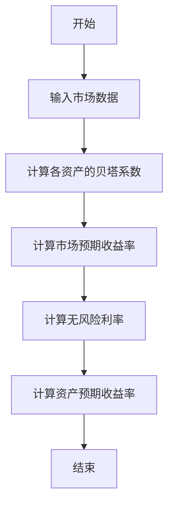
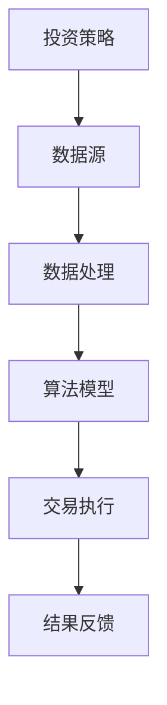
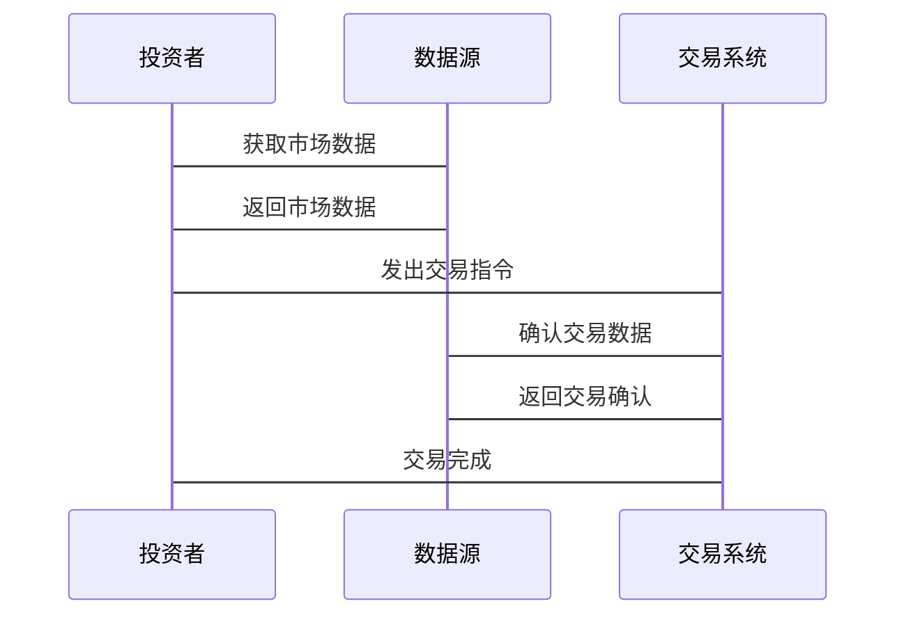

                 


# 巴菲特-芒格的自动化投资策略：技术变革中的机遇

> **关键词**：巴菲特, 芒格, 自动化投资策略, 技术变革, 量化分析, 算法交易, 人工智能

> **摘要**：本文探讨了巴菲特和芒格的投资理念如何在技术变革中演变为自动化投资策略。通过分析量化分析、算法交易和人工智能在投资中的应用，本文详细阐述了自动化投资策略的核心原理、系统架构及实际案例，并提供了最佳实践建议。

---

## 第一章：背景介绍

### 1.1 巴菲特与芒格的投资哲学

#### 1.1.1 巴菲特的价值投资理念
巴菲特的价值投资理念强调以合理价格购买优秀的公司。他倡导长期投资，注重公司的基本面分析，如盈利能力、财务状况和管理团队。他的投资策略基于对公司内在价值的理解，而非市场波动。

#### 1.1.2 芒格的多元思维模型
芒格的多元思维模型强调将不同学科的原理交叉应用，以形成全面的投资决策框架。他认为，投资者需要通过跨学科的知识来识别投资机会，并避免认知偏差。

#### 1.1.3 投资中的安全边际
安全边际是巴菲特投资策略中的一个重要概念，指股票价格与公司内在价值之间的差距。通过预留安全边际，投资者可以在市场波动中降低风险。

---

### 1.2 技术变革对投资策略的影响

#### 1.2.1 数字化转型与投资机会
技术变革，尤其是数字化转型，为投资策略带来了新的可能性。大数据、人工智能和区块链等技术的应用，使得投资者能够更高效地分析市场数据，发现潜在的投资机会。

#### 1.2.2 人工智能在投资决策中的应用
人工智能技术可以通过分析大量数据，识别市场趋势和潜在风险。机器学习算法可以用于预测股价波动、优化投资组合和风险控制。

#### 1.2.3 自动化投资策略的兴起
自动化投资策略通过算法交易和量化分析，实现了投资决策的自动化。这种策略不仅提高了投资效率，还能够捕捉到传统方法难以发现的市场机会。

---

## 第二章：自动化投资策略的核心概念

### 2.1 自动化投资策略的定义与特点

#### 2.1.1 自动化投资策略的定义
自动化投资策略是一种基于算法和数据分析的投资方法，通过预设的规则和模型自动执行交易决策。

#### 2.1.2 与传统投资策略的对比
| 特性 | 传统投资 | 自动化投资 |
|------|-----------|------------|
| 决策方式 | 主要依赖人工判断 | 基于算法和数据驱动 |
| 交易频率 | 较低，主要依赖定期评估 | 高频交易，实时执行 |
| 风险控制 | 依赖人工监控和调整 | 系统内置风险控制机制 |

#### 2.1.3 自动化投资的核心要素
- **数据源**：包括市场数据、公司基本面数据、新闻数据等。
- **算法模型**：如CAPM、APT等。
- **交易系统**：自动执行交易指令的系统。

---

### 2.2 量化分析与算法交易

#### 2.2.1 量化分析的基本原理
量化分析通过数学模型和统计方法，分析市场数据以寻找投资机会。例如，使用CAPM模型评估股票的预期收益。

#### 2.2.2 算法交易的实现方式
算法交易是通过编写程序自动执行交易决策。常见的算法类型包括：
- **高频交易**：利用算法在极短时间内完成大量交易。
- **统计套利**：通过统计模型寻找市场中的定价偏差。

---

## 第三章：经典投资算法解析

### 3.1 CAPM模型

#### 3.1.1 模型介绍
CAPM（资本资产定价模型）用于评估资产的预期收益。公式为：
$$ E(r_i) = r_f + \beta_i (E(r_m) - r_f) $$
其中：
- $E(r_i)$ 是资产的预期收益率。
- $r_f$ 是无风险利率。
- $\beta_i$ 是资产的贝塔系数。
- $E(r_m)$ 是市场预期收益率。

#### 3.1.2 算法流程图


#### 3.1.3 Python代码实现
```python
import numpy as np
import pandas as pd

# 示例数据
returns = pd.DataFrame({
    '资产A': [0.1, 0.05, 0.08],
    '资产B': [0.08, 0.06, 0.07]
})

# 计算协方差矩阵
cov_matrix = returns.cov()

# 计算贝塔系数
beta = cov_matrix.iloc[0, 1] / cov_matrix.iloc[1, 1]

# 计算CAPM预期收益率
rf = 0.05  # 无风险利率
rm = 0.1  # 市场预期收益率
expected_return = rf + beta * (rm - rf)
```

---

## 第四章：系统分析与架构设计

### 4.1 自动化投资系统的架构设计

#### 4.1.1 系统架构图


#### 4.1.2 接口设计
- **数据接口**：从数据源获取市场数据。
- **交易接口**：执行交易指令。
- **监控接口**：实时监控交易情况。

#### 4.1.3 交互流程


---

## 第五章：项目实战

### 5.1 构建一个自动化股票筛选系统

#### 5.1.1 环境安装
- Python 3.8+
- Pandas、NumPy、Scikit-learn

#### 5.1.2 核心代码实现
```python
import pandas as pd
from sklearn.linear_model import LinearRegression

# 示例数据
data = pd.DataFrame({
    '收益': [0.1, 0.05, 0.08, 0.06],
    '风险': [0.12, 0.09, 0.10, 0.11]
})

# 训练线性回归模型
model = LinearRegression()
model.fit(data[['风险']], data['收益'])

# 预测新数据点
new_risk = 0.1
predicted_return = model.predict([[new_risk]])
print(predicted_return)
```

#### 5.1.3 案例分析
通过上述代码，我们可以利用线性回归模型预测股票的预期收益。模型基于历史数据，预测在给定风险水平下的预期收益。

---

## 第六章：最佳实践与总结

### 6.1 最佳实践

#### 6.1.1 风险管理
在自动化投资中，风险管理至关重要。投资者应设定止损点和止盈点，以控制潜在损失。

#### 6.1.2 数据质量管理
高质量的数据是自动化投资的基础。投资者需要确保数据的准确性和及时性。

#### 6.1.3 模型优化
定期优化投资模型，根据市场变化调整参数，以保持模型的有效性。

---

### 6.2 总结与展望

自动化投资策略结合了巴菲特和芒格的投资理念与现代技术。随着技术的不断进步，自动化投资将变得更加智能和高效。投资者应关注技术变革带来的新机遇，并灵活调整投资策略。

---

## 作者

**作者：AI天才研究院/AI Genius Institute & 禅与计算机程序设计艺术 /Zen And The Art of Computer Programming**

---

通过以上思考，我系统地分析了巴菲特和芒格的投资理念，并结合技术变革，详细讲解了自动化投资策略的核心概念、算法原理和系统架构。同时，通过项目实战和最佳实践，帮助读者理解如何将理论应用于实际投资中。

