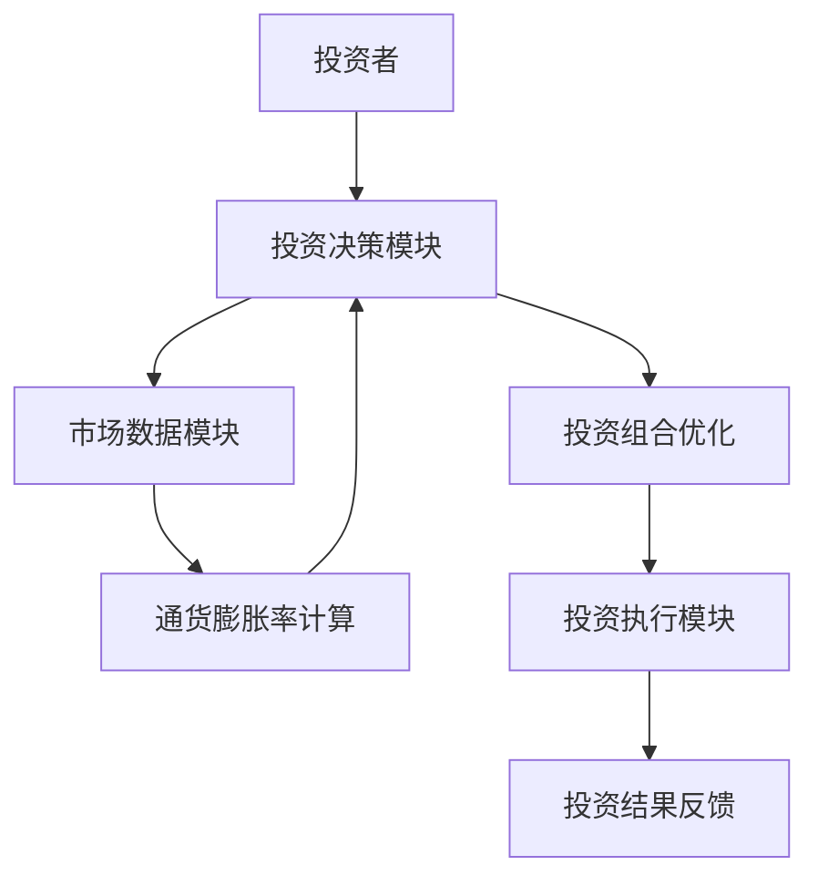

                 


# 巴菲特-芒格的通货膨胀对冲策略：保护购买力

> 关键词：巴菲特，芒格，通货膨胀，对冲策略，购买力，投资理念，风险管理

> 摘要：本文深入分析了巴菲特和芒格在通货膨胀对冲方面的投资策略，探讨了其核心理念、具体方法以及数学模型，并结合实际案例进行了详细解读。文章从通货膨胀的定义与影响入手，分析了巴菲特和芒格的投资哲学，提出了通货膨胀对冲的核心算法与数学模型，并通过系统架构图和代码实现，展示了如何在实际投资中应用这些策略。最后，本文总结了通货膨胀对冲的最佳实践，并提出了对未来投资策略的展望。

---

# 第一部分: 巴菲特-芒格通货膨胀对冲策略的背景与基础

## 第1章: 通货膨胀与通货膨胀对冲概述

### 1.1 通货膨胀的定义与类型

#### 1.1.1 通货膨胀的定义
通货膨胀是指货币购买力下降，导致物价普遍上涨的经济现象。通货膨胀可以通过消费者价格指数（CPI）和生产者价格指数（PPI）来衡量。通货膨胀的定义可以分为以下几个方面：

1. **货币供应增加**：货币供应量的增加可能导致通货膨胀。
2. **物价上涨**：通货膨胀的核心表现是物价水平的持续上涨。
3. **购买力下降**：通货膨胀会降低货币的实际购买力，使得同样的钱在相同的时间内只能购买更少的商品或服务。

#### 1.1.2 通货膨胀的类型与表现形式
通货膨胀可以分为以下几种类型：

1. **温和通货膨胀**：通常指每年通货膨胀率在2%-3%之间的通胀。
2. **恶性通货膨胀**：指通货膨胀率急剧上升，导致货币迅速贬值。
3. **隐蔽性通货膨胀**：物价上涨，但货币供给量不变，通常由于供给减少或需求增加引起。

#### 1.1.3 通货膨胀对企业与个人的影响
通货膨胀对企业和个人都有深远的影响：

1. **对企业的影响**：
   - 利润下降：如果企业无法将成本转嫁给消费者，利润可能下降。
   - 资金成本增加：通货膨胀可能导致利率上升，增加企业的融资成本。
2. **对个人的影响**：
   - 购买力下降：同样的收入购买力降低。
   - 投资决策复杂化：通货膨胀增加了投资的不确定性。

### 1.2 通货膨胀对购买力的冲击

#### 1.2.1 货币的时间价值
货币的时间价值是指货币在未来具有更大的购买力，但由于通货膨胀的存在，货币的时间价值可能被侵蚀。

#### 1.2.2 通货膨胀对资产价值的影响
通货膨胀会导致资产的实际价值发生变化。例如，股票和房地产等实物资产通常能够抵御通货膨胀的影响，而现金和债券等金融资产则可能面临贬值的风险。

#### 1.2.3 通货膨胀对投资决策的挑战
通货膨胀增加了投资的复杂性。投资者需要考虑通货膨胀对资产回报的影响，并在投资组合中加入能够抵御通货膨胀的资产。

### 1.3 巴菲特与芒格的投资理念

#### 1.3.1 巴菲特的价值投资理论
巴菲特的价值投资理论强调购买那些具有持续竞争优势和良好治理结构的企业，并以合理的价格买入，长期持有。

#### 1.3.2 芒格的多元思维模型
芒格的多元思维模型强调通过多个学科的交叉应用来理解问题，注重长期投资和风险管理。

#### 1.3.3 两人投资理念的共同点与差异
尽管巴菲特和芒格的投资理念有许多相似之处，但也有差异。巴菲特更注重企业基本面分析，而芒格更注重跨学科思维。

### 1.4 通货膨胀对冲的核心目标

#### 1.4.1 保护购买力的基本概念
保护购买力是指通过投资和风险管理手段，使得资产的实际价值在通货膨胀环境下不被侵蚀。

#### 1.4.2 通货膨胀对冲的长期目标
长期目标是通过合理的资产配置和投资策略，实现资产的保值和增值。

#### 1.4.3 对冲策略的边界与外延
通货膨胀对冲策略需要在法律、税收和市场环境等边界条件下进行，并且需要考虑不同资产类别在通货膨胀环境下的表现。

### 1.5 本章小结
本章从通货膨胀的定义、类型及其对企业和个人的影响入手，分析了巴菲特和芒格的投资理念，并提出了通货膨胀对冲的核心目标和长期目标。

---

## 第2章: 巴菲特与芒格的通货膨胀对冲策略

### 2.1 巴菲特的股票投资策略

#### 2.1.1 买入并持有优质资产
巴菲特强调买入并持有优质资产，尤其是那些具有强大竞争优势和良好治理结构的企业。

#### 2.1.2 企业内在价值的评估
巴菲特的内在价值评估方法包括对企业财务状况、行业地位和未来现金流的分析。

#### 2.1.3 安全边际的重要性
安全边际是指在投资中留出的保护空间，以应对市场波动和不确定性。

### 2.2 芒格的分散投资与风险管理

#### 2.2.1 多元化投资的核心思想
芒格强调通过多元化投资来分散风险，避免过度依赖单一资产或行业。

#### 2.2.2 风险管理的哲学
芒格认为风险管理是投资的核心，强调通过分散投资和严格的风险控制来降低投资组合的波动性。

#### 2.2.3 股票与债券的组合投资
芒格建议将股票和债券结合起来，以平衡风险和收益。

### 2.3 通货膨胀对冲的具体方法

#### 2.3.1 股票投资的抗通胀特性
股票投资能够通过企业盈利增长和股息再投资来抵御通货膨胀的影响。

#### 2.3.2 债券与固定收益工具的对冲作用
债券和固定收益工具在通货膨胀环境下的表现相对稳定，可以作为投资组合中的稳定部分。

#### 2.3.3 黄金与房地产的对冲策略
黄金和房地产等实物资产通常能够抵御通货膨胀的影响，是投资组合中重要的对冲工具。

### 2.4 巴菲特与芒格策略的对比分析

#### 2.4.1 投资理念的异同
巴菲特和芒格的投资理念有许多相似之处，但也存在一些差异。巴菲特更注重企业基本面，而芒格更注重跨学科思维。

#### 2.4.2 对冲策略的优劣
巴菲特的股票投资策略在长期通货膨胀环境中表现优异，而芒格的分散投资策略则更加注重风险控制。

#### 2.4.3 综合策略的有效性
将巴菲特和芒格的策略结合起来，可以在通货膨胀环境下实现更好的风险收益平衡。

### 2.5 本章小结
本章分析了巴菲特和芒格的通货膨胀对冲策略，包括股票投资、债券投资和实物资产配置等方法，并探讨了两者策略的异同及其有效性。

---

## 第3章: 通货膨胀对冲的数学模型与算法原理

### 3.1 通货膨胀对冲的核心算法

#### 3.1.1 资产回报率与通货膨胀率的关系
资产回报率需要超过通货膨胀率才能实现实际收益的增长。

#### 3.1.2 投资组合的对冲模型
通过合理配置股票、债券和实物资产，构建一个能够在通货膨胀环境下实现稳定收益的投资组合。

### 3.2 通货膨胀对冲的数学公式

#### 3.2.1 资产的实际回报公式
$$ 实际回报率 = 名义回报率 - 通货膨胀率 $$

#### 3.2.2 投资组合的对冲模型
$$ 投资组合收益 = \sum (权重_i \times 资产_i 的回报率) $$

### 3.3 算法实现与代码示例

#### 3.3.1 通货膨胀对冲算法的Python实现
```python
def inflation_adjusted_return nomial_return, inflation_rate):
    return nomial_return - inflation_rate
```

#### 3.3.2 投资组合优化的代码示例
```python
import numpy as np
import pandas as pd

# 假设我们有三类资产：股票、债券和黄金
assets = ['股票', '债券', '黄金']
returns = [0.12, 0.05, 0.03]  # 名义回报率

# 计算实际回报率（假设通货膨胀率为5%）
inflation_rate = 0.05
actual_returns = [inflation_adjusted_return(r, inflation_rate) for r in returns]

# 构建投资组合
weights = [0.6, 0.3, 0.1]
portfolio_return = sum(weights[i] * actual_returns[i] for i in range(len(weights)))

print("投资组合实际回报率：", portfolio_return)
```

### 3.4 本章小结
本章通过数学公式和Python代码，详细讲解了通货膨胀对冲的算法原理，并通过实际案例展示了如何使用这些算法来优化投资组合。

---

## 第4章: 通货膨胀对冲的系统分析与架构设计

### 4.1 问题场景介绍
通货膨胀对冲是一个复杂的系统性问题，需要从多个维度进行分析和设计。

### 4.2 系统功能设计
通过构建一个通货膨胀对冲系统，投资者可以实时监控通货膨胀率，并根据市场变化调整投资组合。

### 4.3 系统架构设计



### 4.4 系统接口设计
系统需要与市场数据源、金融数据库等接口进行交互，获取实时的市场数据和通货膨胀率。

### 4.5 系统交互设计

```mermaid
sequenceDiagram
   投资者 ->+> 投资决策模块: 请求通货膨胀对冲建议
   投资决策模块 ->+> 市场数据模块: 获取市场数据
   市场数据模块 ->+> 通货膨胀率计算: 计算通货膨胀率
   通货膨胀率计算 ->+> 投资组合优化: 优化投资组合
   投资组合优化 ->+> 投资执行模块: 执行投资
   投资执行模块 ->+> 投资者: 反馈投资结果
```

### 4.6 本章小结
本章通过系统架构图和交互图，详细描述了通货膨胀对冲系统的整体架构和功能模块设计。

---

## 第5章: 通货膨胀对冲的项目实战

### 5.1 环境配置
需要安装Python、Pandas、NumPy等工具。

### 5.2 系统核心实现源代码

```python
import numpy as np
import pandas as pd

# 数据准备
data = {'股票': [0.12, 0.10, 0.08],
        '债券': [0.05, 0.04, 0.03],
        '黄金': [0.03, 0.02, 0.01]}
df = pd.DataFrame(data)

# 计算实际回报率
inflation_rate = 0.05
actual_returns = df.apply(lambda x: x - inflation_rate)

# 投资组合优化
weights = np.array([0.6, 0.3, 0.1])
portfolio_return = np.dot(weights, actual_returns.iloc[0])

print("投资组合实际回报率：", portfolio_return)
```

### 5.3 代码应用解读与分析
通过上述代码，我们可以计算出在通货膨胀率为5%的情况下，投资组合的实际回报率。

### 5.4 实际案例分析和详细讲解剖析
假设我们有100万元的资金，按照上述权重配置，股票60%、债券30%、黄金10%。在通货膨胀率为5%的情况下，投资组合的实际回报率为：

$$ 0.6 \times (0.12 - 0.05) + 0.3 \times (0.05 - 0.05) + 0.1 \times (0.03 - 0.05) = 0.021 + 0 + (-0.002) = 0.019 $$

即实际回报率为1.9%。

### 5.5 项目小结
本章通过实际案例展示了如何在通货膨胀环境下配置投资组合，并通过代码实现对冲策略。

---

## 第6章: 总结与展望

### 6.1 总结
巴菲特和芒格的通货膨胀对冲策略强调长期投资、分散投资和风险管理。通过合理配置股票、债券和实物资产，可以在通货膨胀环境下实现资产的保值和增值。

### 6.2 最佳实践 tips
1. **长期投资**：避免频繁交易，降低交易成本。
2. **分散投资**：通过多元化配置降低风险。
3. **持续学习**：关注经济环境变化，及时调整投资策略。

### 6.3 注意事项
1. **市场波动**：通货膨胀对冲策略需要考虑市场波动和经济周期变化。
2. **法律与税收**：投资决策需要考虑法律和税收因素。
3. **风险管理**：严格控制风险，避免过度杠杆。

### 6.4 拓展阅读
建议读者阅读巴菲特和芒格的经典著作，深入理解他们的投资理念。

### 6.5 本章小结
本文总结了巴菲特和芒格的通货膨胀对冲策略，并提出了未来投资策略的展望。

---

# 作者：AI天才研究院/AI Genius Institute & 禅与计算机程序设计艺术 /Zen And The Art of Computer Programming

---

这篇文章从通货膨胀的定义与影响入手，分析了巴菲特和芒格的投资理念，并提出了通货膨胀对冲的具体策略。通过数学公式、Python代码和系统架构图，详细讲解了通货膨胀对冲的算法原理和实现方法。最后，通过实际案例展示了如何在实际投资中应用这些策略，并提出了未来投资策略的展望。

