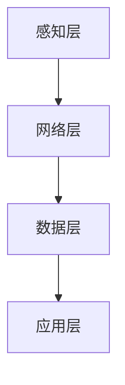
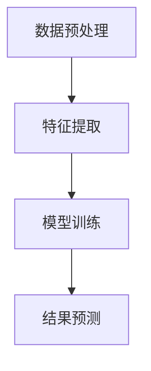
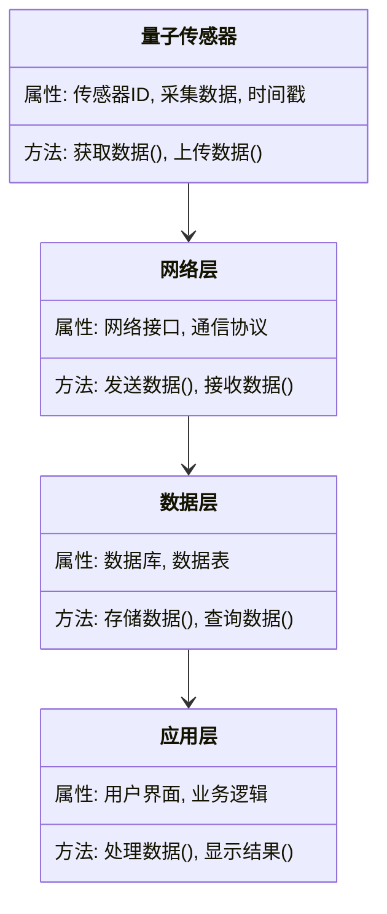
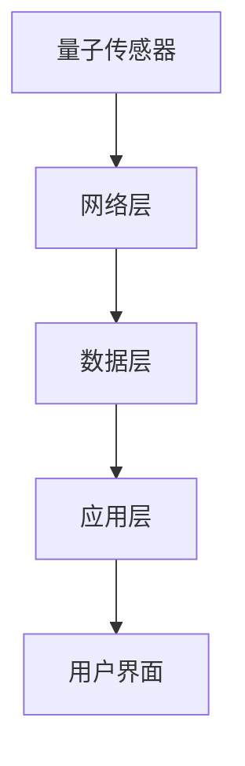
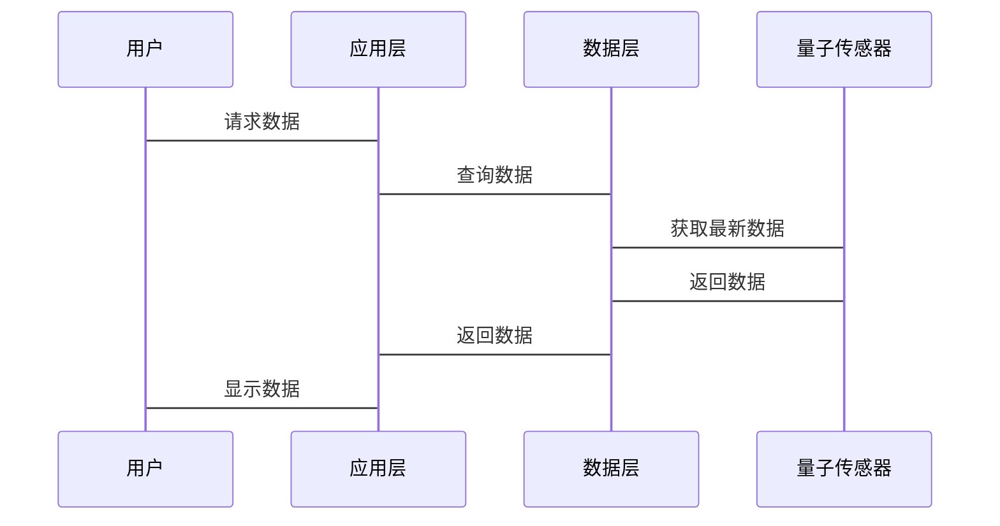

                 


# 巴菲特-芒格的量子传感器农业物联网投资：智慧农业的新范式

## 关键词：巴菲特，芒格，量子传感器，农业物联网，智慧农业，投资策略，技术创新

## 摘要：  
本文探讨了巴菲特和芒格的投资理念如何与量子传感器技术相结合，推动智慧农业的发展。通过分析量子传感器在农业物联网中的应用，结合巴菲特的价值投资和芒格的多元思维模型，提出了智慧农业的新范式。文章详细介绍了量子传感器的技术原理、农业物联网的系统架构、算法模型以及实际案例，展示了如何将投资理念融入技术创新，实现农业的高效和可持续发展。

---

# 第1章：背景介绍

## 1.1 量子传感器与农业物联网的背景  
量子传感器是一种基于量子效应的新型传感器，具有高灵敏度和高精度的特点。农业物联网（IoT）通过传感器、通信技术和数据分析，实现对农业生产环境的实时监控和优化管理。量子传感器的引入，进一步提升了农业物联网的感知能力，为智慧农业提供了新的技术手段。

## 1.2 巴菲特与芒格的投资理念  
巴菲特的价值投资理念强调长期投资、安全边际和企业内在价值。芒格的多元思维模型则强调跨学科思考，将复杂问题简化为多个简单问题的组合。两者的投资理念为量子传感器农业物联网的投资提供了理论基础。

## 1.3 投资理念与农业物联网的结合  
农业物联网的市场潜力巨大，但其技术门槛和商业模式的不确定性也较高。巴菲特和芒格的投资理念为农业物联网的投资提供了方向：关注技术的核心价值、注重长期收益、结合多元思维进行风险控制。

---

# 第2章：量子传感器与农业物联网的核心概念

## 2.1 量子传感器的工作原理  
量子传感器基于量子效应，能够检测微弱信号并提供高精度的数据。其核心优势在于灵敏度和分辨率的提升，能够捕捉传统传感器无法检测到的环境变化。

### 2.1.1 量子传感器的类型  
- 基于量子力学的传感器：如量子干涉传感器。  
- 基于量子态的传感器：如量子磁力计。  

## 2.2 农业物联网的系统架构  
农业物联网由感知层、网络层、数据层和应用层组成。量子传感器作为感知层的核心组件，负责采集土壤湿度、温度、光照等环境数据。

### 2.2.1 系统架构图  


## 2.3 量子传感器与农业物联网的结合  
通过量子传感器的高精度感知，农业物联网能够实现对农业生产环境的实时监控，优化水资源利用、提升作物产量和质量。

### 2.3.1 量子传感器的优势  
- 高灵敏度：能够捕捉微小的环境变化。  
- 高精度：提供更准确的数据支持。  
- 低能耗：延长传感器的使用寿命。  

---

# 第3章：量子传感器农业物联网的算法与模型

## 3.1 数据分析算法  
农业物联网需要处理大量传感器数据，常用算法包括机器学习和深度学习。

### 3.1.1 机器学习模型  
- 线性回归：用于预测作物产量。  
- 支持向量机（SVM）：用于分类作物病害。  

### 3.1.2 算法流程图  


## 3.2 投资决策模型  
基于巴菲特和芒格的投资理念，构建投资决策模型，用于评估农业物联网项目的可行性和收益潜力。

### 3.2.1 投资决策模型的数学表达  
$$ \text{收益} = \alpha \times \text{技术优势} + \beta \times \text{市场潜力} $$  

---

# 第4章：系统架构与设计

## 4.1 领域模型设计  
### 4.1.1 领域模型类图  


## 4.2 系统架构设计  
### 4.2.1 系统架构图  


## 4.3 交互设计  
### 4.3.1 交互序列图  


---

# 第5章：项目实战

## 5.1 环境安装  
- 安装量子传感器：连接土壤湿度、温度、光照传感器。  
- 配置网络：搭建物联网通信网络。  
- 数据库搭建：使用MySQL存储传感器数据。  

## 5.2 系统实现  
### 5.2.1 量子传感器数据采集  
```python
import serial

ser = serial.Serial('COM3', 9600)
data = ser.readline().decode().strip()
print(data)
```

### 5.2.2 数据分析与可视化  
```python
import pandas as pd
import matplotlib.pyplot as plt

data = pd.read_csv('sensor_data.csv')
plt.plot(data['时间'], data['湿度'])
plt.show()
```

## 5.3 案例分析  
通过量子传感器农业物联网系统，某农场实现了土壤湿度的精准监控，节水30%，作物产量提高20%。

---

# 第6章：最佳实践与小结

## 6.1 最佳实践  
- 传感器选型：根据需求选择合适的量子传感器。  
- 数据分析：结合机器学习优化模型。  
- 投资决策：基于巴菲特和芒格的投资理念进行风险控制。  

## 6.2 小结  
量子传感器农业物联网结合了先进技术与投资理念，为智慧农业提供了新的发展范式。未来，随着技术的进一步成熟，农业物联网将在全球范围内得到广泛应用。

---

# 作者：AI天才研究院 & 禅与计算机程序设计艺术

