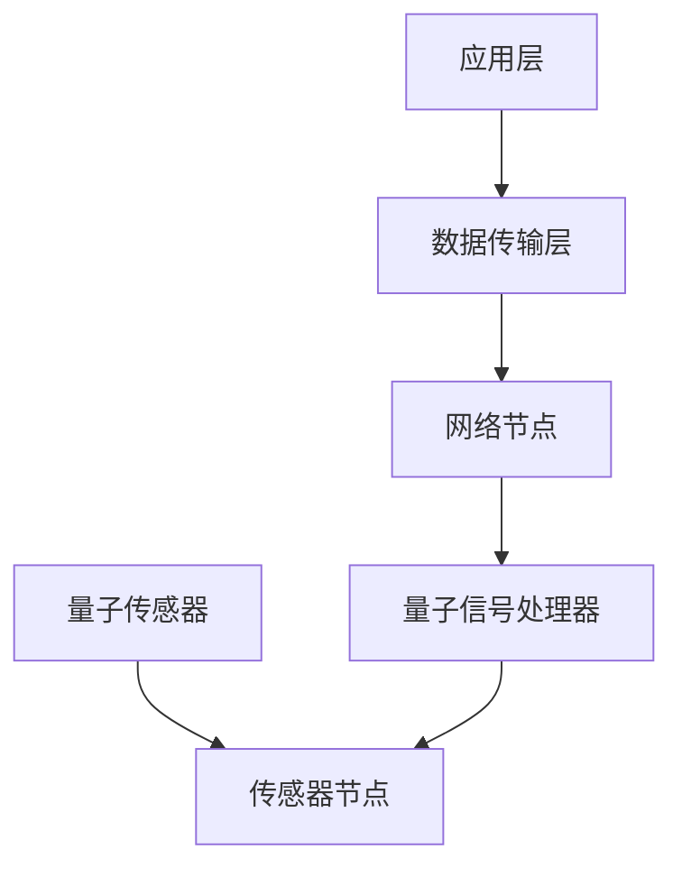
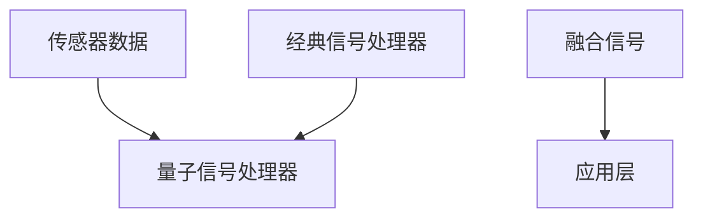
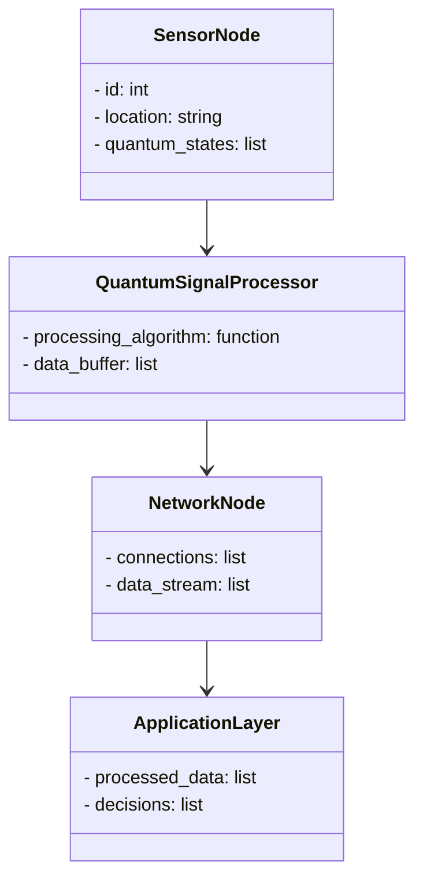
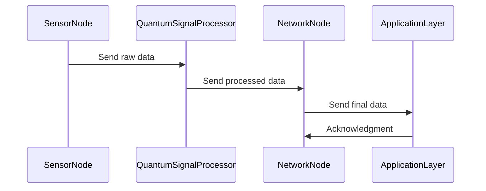

                 


# 巴菲特-芒格的量子传感器网络投资：物联网的下一代基础设施

## 关键词：
量子传感器网络，物联网，巴菲特，芒格，投资策略，下一代基础设施

## 摘要：
本文探讨了量子传感器网络在物联网中的应用及其投资价值，结合巴菲特和芒格的投资理念，分析了量子传感器网络的技术原理、系统架构、应用场景及投资策略。通过详细的理论分析和实际案例，本文为读者提供了如何在物联网的下一代基础设施中把握投资机会的深度见解。

---

# 第一部分: 巴菲特-芒格的量子传感器网络投资概述

## 第1章: 量子传感器网络与物联网的背景介绍

### 1.1 量子传感器网络的定义与特点
#### 1.1.1 量子传感器的基本原理
量子传感器基于量子力学原理，通过测量量子系统的状态变化来感知外部环境的变化。与传统传感器相比，量子传感器具有更高的灵敏度和分辨率，能够在更复杂的环境下检测微小的变化。

#### 1.1.2 量子传感器与传统传感器的对比
| 属性       | 量子传感器 | 传统传感器 |
|------------|------------|------------|
| 灵敏度     | 高         | 中         |
| 响应时间   | 快         | 慢         |
| 适用场景   | 特殊领域   | 广泛领域   |

#### 1.1.3 量子传感器网络的构成要素
量子传感器网络由传感器节点、量子信号处理器、网络节点和数据传输层组成，能够实现对海量数据的实时采集、处理和分析。

### 1.2 物联网的下一代基础设施
#### 1.2.1 物联网的发展历程
物联网从早期的单一传感器应用逐步发展为复杂的网络系统，但其感知能力受限于传统传感器的性能。

#### 1.2.2 量子传感器网络在物联网中的地位
量子传感器网络作为物联网的下一代基础设施，能够显著提升物联网的感知能力和数据处理效率。

#### 1.2.3 量子传感器网络的未来趋势
量子传感器网络将推动物联网向更高精度、更低能耗和更智能化方向发展。

### 1.3 巴菲特-芒格投资理念的核心要素
#### 1.3.1 巴菲特的价值投资理论
巴菲特强调长期投资、价值发现和安全边际，注重企业的基本面和竞争优势。

#### 1.3.2 芒格的多元思维模型
芒格提倡通过跨学科思考，寻找投资中的“圆环”，即多个优势领域的交集。

#### 1.3.3 投资与技术的结合
将巴菲特和芒格的投资理念应用于量子传感器网络的投资中，需要结合技术发展趋势和市场潜力。

### 1.4 量子传感器网络投资的背景与问题
#### 1.4.1 当前物联网投资的痛点
传统传感器的性能瓶颈和数据处理能力不足，限制了物联网的进一步发展。

#### 1.4.2 量子传感器网络的投资机会
量子传感器网络在智慧城市、工业物联网和医疗物联网等领域具有广泛的应用前景。

#### 1.4.3 投资中的主要挑战
量子传感器技术的高成本、技术壁垒和市场不确定性是投资中的主要挑战。

### 1.5 本章小结
量子传感器网络作为物联网的下一代基础设施，具备广阔的投资前景，但需要结合巴菲特和芒格的投资理念，深入分析技术、市场和商业模式。

---

## 第2章: 量子传感器网络的核心概念与联系

### 2.1 核心概念原理
#### 2.1.1 量子传感器的物理基础
量子传感器基于量子叠加态和量子纠缠态的特性，能够实现对微小变化的高精度测量。

#### 2.1.2 传感器网络的构建原理
传感器网络通过分布式部署，实现对物理环境的实时感知和数据传输。

#### 2.1.3 量子传感器网络的信号处理
量子传感器网络通过量子信号处理器对数据进行实时处理，提升数据的准确性和传输效率。

### 2.2 核心概念对比分析
#### 2.2.1 量子传感器与传统传感器的对比表格
| 属性       | 量子传感器 | 传统传感器 |
|------------|------------|------------|
| 灵敏度     | 高         | 中         |
| 响应时间   | 快         | 慢         |
| 适用场景   | 特殊领域   | 广泛领域   |

#### 2.2.2 量子传感器网络的ER实体关系图


---

## 第3章: 量子传感器网络的算法原理讲解

### 3.1 量子传感器网络的信号处理算法
#### 3.1.1 量子增强传感器数据处理算法


#### 3.1.2 量子传感器网络的数学模型
$$ P(x) = \sum_{i=1}^{n} \psi_i(x) $$  
其中，$\psi_i(x)$ 表示第 $i$ 个量子态的概率幅。

#### 3.1.3 算法实现的Python代码
```python
import numpy as np

def quantum_sensor_algorithm(data):
    # 量子信号处理
    quantum_states = np.random.rand(len(data)) * 2 - 1
    # 经典信号处理
    classical_states = np.fft.fft(data)
    # 融合信号
    merged_states = (quantum_states + classical_states) / 2
    return merged_states

# 示例数据
data = np.array([1, 2, 3, 4, 5])
result = quantum_sensor_algorithm(data)
print(result)
```

---

## 第4章: 量子传感器网络的系统分析与架构设计方案

### 4.1 问题场景介绍
#### 4.1.1 智慧城市中的量子传感器网络应用
量子传感器网络可以用于智能交通、环境监测和公共安全等领域。

#### 4.1.2 工业物联网中的应用
在工业设备监测和预测性维护中，量子传感器网络能够显著提升系统的智能化水平。

### 4.2 系统功能设计
#### 4.2.1 领域模型


#### 4.2.2 系统架构设计


#### 4.2.3 接口设计与交互序列图


---

## 第5章: 量子传感器网络的项目实战

### 5.1 环境安装与配置
#### 5.1.1 量子传感器开发框架的安装
```bash
pip install quantum-sensor-sdk
```

#### 5.1.2 系统核心实现
```python
from quantum_sensor_sdk import QuantumSensor

# 初始化量子传感器
sensor = QuantumSensor()
# 收集数据
data = sensor.collect_data()
# 处理数据
processed_data = sensor.process_data(data)
# 输出结果
print(processed_data)
```

### 5.2 代码实现与解读
#### 5.2.1 核心代码实现
```python
class QuantumSensor:
    def __init__(self):
        self.quantum_states = []
    
    def collect_data(self):
        # 模拟量子传感器数据采集
        self.quantum_states = np.random.rand(10) * 2 - 1
        return self.quantum_states
    
    def process_data(self, data):
        # 模拟量子信号处理
        return np.fft.ifft(data)
```

#### 5.2.2 代码功能解读
量子传感器通过采集和处理量子态数据，实现对物理环境的高精度感知。

### 5.3 案例分析与详细解读
#### 5.3.1 智慧城市中的应用案例
在智能交通系统中，量子传感器网络可以实时监测道路状况，优化交通流量。

#### 5.3.2 工业物联网中的应用案例
在工业设备监测中，量子传感器网络可以预测设备故障，降低维护成本。

### 5.4 项目小结
通过实际案例，展示了量子传感器网络在物联网中的广泛应用潜力。

---

## 第6章: 量子传感器网络的投资策略与风险管理

### 6.1 投资策略与最佳实践
#### 6.1.1 巴菲特的价值投资策略
关注具有长期竞争优势和高壁垒的企业，注重企业的基本面和管理团队。

#### 6.1.2 芒格的多元思维模型
从多个角度分析企业的价值，寻找投资的“圆环”，即多个优势领域的交集。

#### 6.1.3 投资中的风险管理
制定科学的投资策略，分散投资风险，注重长期价值。

### 6.2 投资中的注意事项
#### 6.2.1 技术风险
量子传感器技术尚未成熟，存在较高的技术壁垒。

#### 6.2.2 市场风险
市场需求的不确定性可能影响投资回报。

#### 6.2.3 竞争风险
行业内竞争激烈，企业需要具备强大的技术优势和市场竞争力。

### 6.3 投资总结与展望
量子传感器网络作为物联网的下一代基础设施，具备广阔的投资前景。但投资者需要结合技术、市场和商业模式，制定科学的投资策略。

---

## 作者：AI天才研究院 & 禅与计算机程序设计艺术

