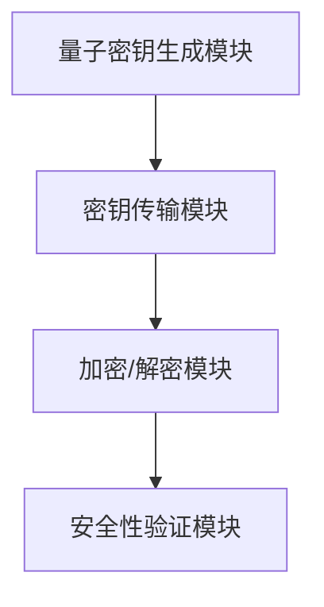
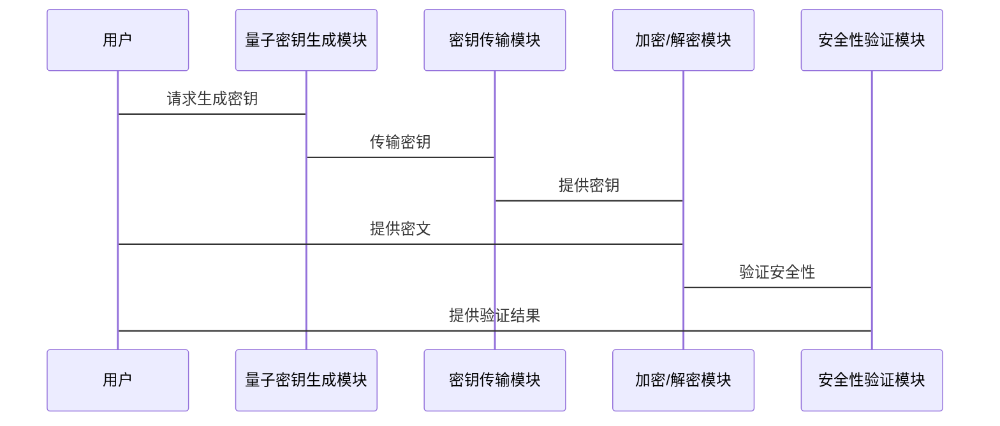

                 


# 巴菲特-芒格的量子加密通信投资：后量子时代的数据安全

---

## 关键词：
量子计算、数据安全、后量子时代、巴菲特、芒格、量子加密通信

---

## 摘要：
本文探讨了巴菲特和芒格的投资理念在量子加密通信领域的应用，分析了后量子时代的数据安全威胁，详细讲解了量子加密通信的核心原理、数学模型和系统架构，并通过实际案例展示了如何在量子加密通信领域进行投资和实践。文章结合理论与实践，为读者提供了全面的视角，帮助其在后量子时代把握数据安全的投资机遇。

---

## 第一部分: 巴菲特-芒格的量子加密通信投资背景

### 第1章: 后量子时代的数据安全威胁

#### 1.1 量子计算的基本原理
量子计算是基于量子力学原理的计算方式，其核心在于量子位（qubit）的叠加态和纠缠态。与经典计算机的二进制位不同，量子位可以同时处于0和1的状态，这种叠加态使得量子计算机在某些特定问题上具有远超经典计算机的计算能力。

#### 1.2 后量子时代的威胁
在后量子时代，传统加密算法（如RSA和椭圆曲线加密）的安全性将被打破。量子计算机可以通过Shor算法在多项式时间内分解大质数，这意味着现有的加密系统将面临前所未有的威胁。数据安全的核心问题在于如何在量子计算机的威胁下保护信息的 confidentiality、integrity 和 availability。

#### 1.3 量子计算机对数据安全的影响
量子计算机的出现将对现有的加密体系造成颠覆性影响。例如，RSA加密的安全性基于大质数分解的难度，而量子计算机可以在合理时间内完成这一任务。因此，传统的公钥加密算法将不再安全，数据泄露的风险将急剧增加。

---

### 第2章: 巴菲特与芒格的投资理念

#### 2.1 巴菲特的价值投资策略
巴菲特的价值投资策略强调长期投资、安全边际和企业基本面分析。他倾向于投资那些具有强大护城河、管理优秀且估值合理的公司。

#### 2.2 芒格的多元思维模型
芒格的多元思维模型强调跨学科思考，将各个领域的知识融会贯通，以形成对问题的全面理解。这种思维方式在投资决策中尤为重要，尤其是在面对复杂的技术领域时。

#### 2.3 巴菲特与芒格投资理念的结合
巴菲特和芒格的投资理念在量子加密通信领域具有重要应用。例如，芒格的多元思维模型可以帮助投资者理解量子计算的技术原理和市场潜力，而巴菲特的价值投资策略则可以用于筛选具有长期增长潜力的量子加密通信企业。

---

### 第3章: 量子加密通信的核心概念

#### 3.1 量子加密通信的定义
量子加密通信是一种基于量子力学原理的通信方式，其安全性基于量子态的不可克隆性和测量干扰性。量子密钥分发（QKD）是其中的核心技术之一，它通过量子态传输密钥，确保只有合法的通信双方能够获取密钥。

#### 3.2 量子加密通信的关键技术
- **量子叠加**：量子位可以同时处于多个状态，这使得量子计算机在某些问题上具有超凡的计算能力。
- **量子纠缠**：纠缠的量子位之间存在关联，一方的状态会直接影响另一方的状态。
- **量子测量**：测量会破坏量子态，这为量子加密通信的安全性提供了保障。

#### 3.3 量子加密通信的优势
量子加密通信具有不可被破解的安全性，通信的实时性以及传输的不可复制性。这些特点使其在金融、政府和医疗等领域具有重要应用。

---

## 第二部分: 量子加密通信的算法原理

### 第4章: 量子加密通信的数学模型

#### 4.1 量子叠加的数学表示
量子叠加可以通过以下公式表示：
$$ |\psi\rangle = \alpha|0\rangle + \beta|1\rangle $$
其中，α 和 β 是概率幅，满足 $|\alpha|^2 + |\beta|^2 = 1$。

#### 4.2 量子纠缠的数学描述
两个纠缠的量子位可以表示为：
$$ |\psi\rangle = \frac{1}{\sqrt{2}}(|00\rangle + |11\rangle) $$

#### 4.3 量子密钥分发的数学模型
量子密钥分发的核心是通过量子态传输密钥，确保只有合法的通信双方能够获取密钥。其数学模型可以表示为：
$$ K = \{k_1, k_2, ..., k_n\} $$
其中，$k_i$ 是二进制密钥位。

---

## 第三部分: 系统分析与架构设计

### 第5章: 系统分析与架构设计

#### 5.1 系统功能设计
量子加密通信系统包括以下几个功能模块：
1. 量子密钥生成模块
2. 密钥传输模块
3. 加密/解密模块
4. 安全性验证模块

#### 5.2 系统架构图
以下是量子加密通信系统的架构图：



#### 5.3 接口设计
量子加密通信系统的接口设计如下：
- 输入接口：接收用户输入的明文和密钥。
- 输出接口：输出加密后的密文和验证结果。

#### 5.4 交互流程图
以下是量子加密通信系统的交互流程图：



---

## 第四部分: 项目实战与最佳实践

### 第6章: 项目实战

#### 6.1 环境安装
要进行量子加密通信的开发，首先需要安装必要的库和工具，例如Q#和Qiskit。

#### 6.2 核心代码实现
以下是量子随机数生成器的Python代码：

```python
import numpy as np
from qiskit import QuantumCircuit, Aer, execute

def quantum_random_number_generator():
    # 创建量子电路
    circuit = QuantumCircuit(1, 1)
    circuit.h(0)
    circuit.measure(0, 0)
    
    # 模拟器
    simulator = Aer.get_backend('qasm_simulator')
    result = execute(circuit, simulator).result()
    counts = result.get_counts()
    
    # 生成随机数
    if '1' in counts:
        return 1
    else:
        return 0

# 测试代码
print(quantum_random_number_generator())
```

#### 6.3 实际案例分析
以金融行业为例，量子加密通信可以用于保护交易数据的安全性。通过量子密钥分发技术，金融机构可以确保交易信息不被窃取或篡改。

#### 6.4 最佳实践
- **技术趋势**：关注量子计算领域的最新技术发展。
- **风险管理**：评估量子加密通信技术的成熟度和市场接受度。
- **持续学习**：保持对量子计算和数据安全领域的关注和学习。

---

## 第五部分: 总结与展望

### 第7章: 总结与展望

#### 7.1 投资策略总结
在后量子时代，量子加密通信的投资机会与挑战并存。投资者应关注具有强大技术研发能力和市场潜力的量子加密通信企业，同时注重风险管理。

#### 7.2 未来展望
随着量子计算技术的不断发展，量子加密通信将在更多领域得到应用。未来的研究方向包括提高量子密钥分发的传输距离和安全性，以及开发更加高效的量子加密算法。

---

## 作者：
AI天才研究院/AI Genius Institute  
禅与计算机程序设计艺术/Zen And The Art of Computer Programming

---

通过以上内容，我们系统地探讨了巴菲特和芒格的投资理念在量子加密通信领域的应用，分析了后量子时代的数据安全威胁，并详细讲解了量子加密通信的核心原理、数学模型和系统架构。希望本文能为读者在后量子时代的投资和实践提供有价值的参考。

