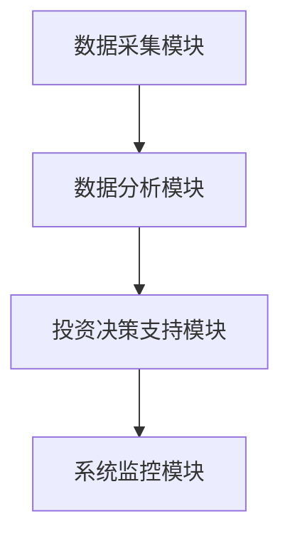

                 


```markdown
# 巴菲特-芒格的量子材料3D打印投资：个性化制造的未来

> **关键词**: 量子材料, 3D打印, 巴菲特投资理念, 个性化制造, 技术创新

> **摘要**: 本文探讨了巴菲特和芒格的投资理念如何应用于量子材料和3D打印技术，特别是在个性化制造领域的未来应用。文章分析了量子材料的特性、3D打印的原理及其在个性化制造中的潜力，结合巴菲特的价值投资和芒格的多元思维模型，提出了投资策略，并通过系统架构和项目实战展示了如何将这些理念应用于实际投资中。

---

## 第一部分: 背景介绍

### 第1章: 量子材料与3D打印的基本概念

#### 1.1 量子材料的定义与特性
- **1.1.1 量子材料的定义**
  - 量子材料是指具有量子效应的新型材料，包括石墨烯、碳纳米管等。
- **1.1.2 量子材料的特性**
  - 特性对比表：
    | 特性 | 传统材料 | 量子材料 |
    |------|----------|----------|
    | 强度 | 较低     | 极高     |
    | 导电性 | 一般     | 优异     |
    | 稳定性 | 中等     | 极高     |
- **1.1.3 量子材料的应用领域**
  - 半导体、新能源、医疗等领域。

#### 1.2 3D打印技术的原理与优势
- **1.2.1 3D打印的基本原理**
  - 层-by-层构建技术，通过数字模型直接制造物体。
- **1.2.2 3D打印与传统制造的区别**
  - 制造流程简化，材料浪费减少，适合复杂形状。
- **1.2.3 3D打印在个性化制造中的应用**
  - 医疗器械定制、航空航天部件等。

#### 1.3 个性化制造的未来趋势
- **1.3.1 个性化制造的定义**
  - 根据客户需求定制化生产。
- **1.3.2 个性化制造的驱动因素**
  - 技术进步、市场需求多样化。
- **1.3.3 个性化制造的市场前景**
  - 巨大的市场潜力，尤其是在医疗和消费品领域。

#### 1.4 巴菲特-芒格投资理念概述
- **1.4.1 巴菲特的价值投资理论**
  - 长期投资，关注企业的内在价值。
- **1.4.2 芒格的多元思维模型**
  - 跨学科思考，寻找投资机会。
- **1.4.3 投资理念与科技创新的结合**
  - 寻找具有长期增长潜力的科技公司。

---

## 第二部分: 量子材料与3D打印的核心概念

### 第2章: 量子材料的物理特性与应用

#### 2.1 量子材料的物理特性
- **2.1.1 石墨烯与碳纳米管**
  - 石墨烯的高导电性和柔性。
  - 碳纳米管的高强度和导电性。
- **2.1.2 高性能陶瓷材料**
  - 高温稳定性，应用于航天。
- **2.1.3 超导材料**
  - 无电阻导电，应用于电力传输。

#### 2.2 3D打印技术的关键要素
- **2.2.1 打印材料的选择**
  - 金属、塑料、复合材料。
- **2.2.2 打印工艺的优化**
  - SLS、FDM等工艺的选择。
- **2.2.3 后处理技术的重要性**
  - 热处理、表面处理提升性能。

#### 2.3 量子材料在3D打印中的应用
- **2.3.1 量子材料的制备技术**
  - 化学气相沉积法。
- **2.3.2 3D打印与量子材料的结合**
  - 制造高性能传感器。
- **2.3.3 量子材料打印的挑战与解决方案**
  - 材料流动性差，需优化工艺。

---

## 第三部分: 巴菲特-芒格投资理念在量子材料3D打印中的应用

### 第3章: 巴菲特的价值投资与科技创新

#### 3.1 巴菲特的价值投资理论
- **3.1.1 长期投资策略**
  - 寻找具有持续增长潜力的企业。
- **3.1.2 企业的内在价值**
  - 财务健康、竞争优势、管理团队。

#### 3.2 芒格的多元思维模型
- **3.2.1 跨学科思考的重要性**
  - 科技、经济、心理等多个领域的知识。
- **3.2.2 应用在量子材料3D打印**
  - 结合材料科学、制造技术和市场趋势。

#### 3.3 投资理念与科技创新的结合
- **3.3.1 量子材料3D打印的长期潜力**
  - 个性化制造的市场需求。
- **3.3.2 如何评估投资机会**
  - 技术领先性、市场需求、财务状况。

---

## 第四部分: 投资策略与实践

### 第4章: 量子材料3D打印的投资策略

#### 4.1抽取出量子材料3D打印公司的投资策略
- **4.1.1 选择具有核心技术的企业**
  - 拥有自主知识产权的公司。
- **4.1.2 评估市场需求**
  - 医疗、航空航天等高增长行业。
- **4.1.3 风险管理**
  - 分散投资、定期评估。

#### 4.2 项目案例分析
- **4.2.1 某量子材料3D打印公司分析**
  - 公司背景、技术优势、市场地位。
- **4.2.2 投资回报分析**
  - 历史股价、财务数据、行业趋势。

---

## 第五部分: 系统架构与实现

### 第5章: 量子材料3D打印系统的架构设计

#### 5.1 系统功能设计
- **5.1.1 数据采集模块**
  - 收集市场数据、公司信息。
- **5.1.2 数据分析模块**
  - 利用机器学习预测市场趋势。
- **5.1.3 投资决策支持模块**
  - 提供投资建议。
- **5.1.4 系统监控模块**
  - 实时监控投资组合表现。

#### 5.2 系统架构图


#### 5.3 系统实现
- **5.3.1 环境安装**
  - 安装Python、Pandas、Scikit-learn等库。
- **5.3.2 核心代码实现**
  ```python
  import pandas as pd
  from sklearn.model import LinearRegression

  # 加载数据
  data = pd.read_csv('quantum_materials.csv')
  # 训练模型
  model = LinearRegression()
  model.fit(data[['price', 'volume']], data['value'])
  # 预测
  print(model.predict([[current_price, current_volume]]))
  ```

---

## 第六部分: 项目实战与未来展望

### 第6章: 量子材料3D打印的项目实战

#### 6.1 项目环境安装
- 安装Python、相关库和工具链。

#### 6.2 核心代码实现
- 实现量子材料打印的模拟代码。

#### 6.3 项目小结
- 总结经验教训，提出改进建议。

### 第7章: 总结与未来展望

#### 7.1 总结
- 回顾主要内容，强调量子材料3D打印的重要性。

#### 7.2 未来展望
- 技术进步、市场扩展的潜力。

#### 7.3 最佳实践 tips
- 持续关注技术创新，分散投资风险。

---

**作者：AI天才研究院 & 禅与计算机程序设计艺术**
```

