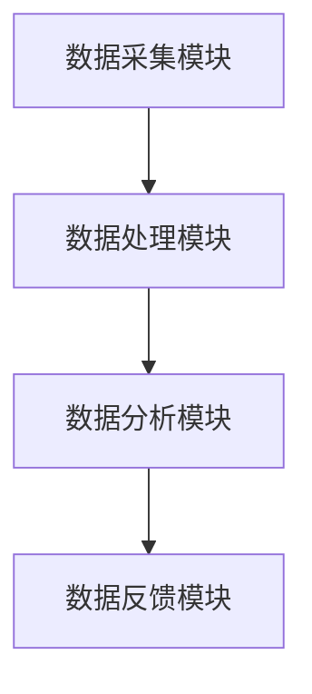
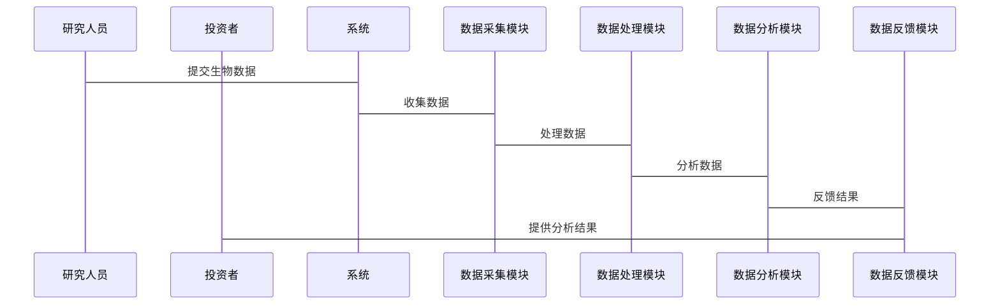

                 


# 巴菲特-芒格的量子生物计算机投资：生命科学与信息技术的终极融合

## 关键词：量子计算，生物技术，信息技术，巴菲特，芒格，投资，生命科学

## 摘要：  
本文探讨了巴菲特和芒格的投资哲学与量子生物计算机投资的结合，分析了量子计算、生物技术和信息技术的融合原理，详细讲解了量子生物计算机的投资策略和系统架构，并通过实际案例展示了量子生物计算机在生命科学领域的应用。

---

# 第一部分：量子生物计算机投资的背景与概念

## 第1章：量子生物计算机投资的背景与概念

### 1.1 量子计算与生物技术的融合

#### 1.1.1 量子计算的基本原理
量子计算是一种基于量子力学原理的计算方式，利用量子位（qubit）的叠加态和纠缠态来实现并行计算。与经典计算机的二进制位不同，量子位可以同时表示0和1，这使得量子计算机在某些特定问题上比经典计算机快得多。

#### 1.1.2 生物技术的核心概念
生物技术是利用生物科学的知识和技术来改良或创造生物产品。DNA、RNA和蛋白质的结构和功能是生物技术的核心研究对象，而基因编辑、蛋白质工程和生物信息学是其主要应用领域。

#### 1.1.3 信息技术与生命科学的结合
信息技术通过数据的收集、处理和分析，为生命科学提供了强大的工具。生物数据的数字化和人工智能技术的应用，使得生命科学的研究更加高效和精准。

---

### 1.2 巴菲特与芒格的投资哲学

#### 1.2.1 巴菲特的价值投资理论
巴菲特的价值投资理论强调长期投资、基本面分析和安全边际。他认为，投资的本质是寻找具有持续竞争优势和良好管理的企业，并以合理的价格买入。

#### 1.2.2 芒格的多元思维模型
芒格的多元思维模型强调跨学科思考，认为投资者需要从多个角度（如物理学、心理学、经济学等）来理解和分析问题。这种思维方式帮助投资者避免认知偏差，并做出更明智的决策。

#### 1.2.3 投资与科技创新的结合
巴菲特和芒格的投资哲学与科技创新的结合，使得他们能够识别那些具有颠覆性技术的公司，并在早期阶段对其进行投资。

---

### 1.3 量子生物计算机投资的定义与特点

#### 1.3.1 量子生物计算机的定义
量子生物计算机是一种结合了量子计算和生物技术的计算机系统，用于解决复杂的生物科学问题，如疾病治疗和基因编辑。

#### 1.3.2 量子生物计算机的核心特点
- 高速计算能力：量子计算机可以在短时间内处理海量生物数据。
- 精准分析：量子计算机能够对生物数据进行深度分析，帮助研究人员发现新的药物和治疗方法。
- 多学科融合：量子生物计算机的开发需要跨学科的合作，包括物理学家、生物学家和计算机科学家。

#### 1.3.3 投资与科技创新的结合
量子生物计算机的投资模式结合了巴菲特的价值投资理论和芒格的多元思维模型，注重长期回报和技术创新。

---

### 1.4 量子生物计算机投资的背景分析

#### 1.4.1 生命科学领域的技术突破
近年来，基因编辑、人工智能和生物信息学的快速发展，为量子生物计算机的投资提供了技术基础。

#### 1.4.2 信息技术的快速发展
量子计算技术的突破和人工智能的普及，使得信息技术在生命科学领域的应用更加广泛。

#### 1.4.3 投资市场的变化与机遇
随着生物技术和信息技术的融合，投资市场涌现出许多新兴的量子生物计算机公司，为投资者提供了新的机遇。

---

## 第2章：量子计算与生物技术的融合原理

### 2.1 量子计算的基本原理

#### 2.1.1 量子位与经典位的对比
- 经典位（bit）只能表示0或1。
- 量子位（qubit）可以同时表示0和1的叠加态。

#### 2.1.2 量子叠加与量子纠缠
量子叠加允许量子位同时处于多个状态，而量子纠缠则使得多个量子位之间形成强大的关联，从而实现并行计算。

#### 2.1.3 量子计算的算法与应用
量子傅里叶变换（QFT）是一种重要的量子算法，用于在量子计算机上实现傅里叶变换。它在信号处理和密码学中有着广泛的应用。

---

### 2.2 生物技术的核心原理

#### 2.2.1 DNA的结构与功能
DNA是由碱基对组成的双螺旋结构，存储着生物的遗传信息。基因编辑技术（如CRISPR）可以通过修改DNA序列来治疗疾病。

#### 2.2.2 生物信息的编码与解码
生物信息的编码是指将生物数据（如DNA序列）转化为数字信息，而解码则是将这些数字信息还原为生物数据。

#### 2.2.3 生物技术在疾病治疗中的应用
生物技术在癌症治疗、基因治疗和疫苗开发等领域有着广泛的应用。例如，CAR-T细胞疗法是一种通过基因编辑技术改造免疫细胞的治疗方法。

---

### 2.3 信息技术与生命科学的结合

#### 2.3.1 生物数据的数字化
生物数据（如基因序列）可以通过测序技术转化为数字信息，这为生物技术的研究提供了强大的工具。

#### 2.3.2 人工智能在生物技术中的应用
人工智能技术（如机器学习）可以用于分析生物数据，预测蛋白质结构和疾病治疗方案。

#### 2.3.3 量子计算在生物技术中的潜力
量子计算机可以用于模拟生物分子的结构和相互作用，从而加速新药的研发。

---

## 第3章：巴菲特与芒格的投资哲学与量子生物计算机投资

### 3.1 巴菲特的价值投资理论

#### 3.1.1 价值投资的核心理念
巴菲特的价值投资理论强调长期投资、基本面分析和安全边际。他认为，投资者应该寻找那些具有持续竞争优势和良好管理的企业，并以合理的价格买入。

#### 3.1.2 巴菲特的选股标准
- 公司具有强大的竞争优势。
- 公司具有良好的财务状况和管理团队。
- 股票价格具有吸引力。

#### 3.1.3 价值投资与科技创新的结合
巴菲特的价值投资理论与科技创新的结合，使得他能够识别那些具有颠覆性技术的公司，并在早期阶段对其进行投资。

---

### 3.2 芒格的多元思维模型

#### 3.2.1 多元思维模型的定义
多元思维模型是一种通过跨学科思考来理解和分析问题的方法。芒格认为，投资者需要从多个角度（如物理学、心理学、经济学等）来分析问题，以避免认知偏差。

#### 3.2.2 多元思维模型在投资中的应用
- 通过跨学科思考，投资者可以更好地理解企业的商业模式和竞争优势。
- 多元思维模型可以帮助投资者识别潜在的风险和机会。

#### 3.2.3 多元思维模型与量子生物计算机投资的结合
芒格的多元思维模型为量子生物计算机投资提供了理论基础。投资者需要从物理学、生物科学和信息技术等多个角度来分析量子生物计算机的投资机会。

---

### 3.3 量子生物计算机投资的哲学基础

#### 3.3.1 投资与科技创新的哲学思考
量子生物计算机的投资需要结合科技创新和投资哲学。投资者需要关注技术的前沿性和商业的可行性。

#### 3.3.2 量子生物计算机投资的长期视角
量子生物计算机的投资需要长期视角。由于技术的复杂性和开发周期的长，投资者需要耐心等待技术成熟和市场认可。

#### 3.3.3 投资中的风险与收益平衡
量子生物计算机的投资需要在风险和收益之间找到平衡。投资者需要关注技术的可行性和商业模式的可持续性。

---

## 第4章：量子生物计算机投资的核心概念与联系

### 4.1 量子计算的核心概念

#### 4.1.1 量子位与量子叠加
量子位可以同时处于多个状态，这使得量子计算机能够实现并行计算。

#### 4.1.2 量子纠缠与量子通信
量子纠缠是一种特殊的量子现象，使得多个量子位之间形成强大的关联，从而实现量子通信和量子计算。

#### 4.1.3 量子计算的算法与应用
量子算法（如量子傅里叶变换）在密码学、优化问题和生物信息学中有着广泛的应用。

---

### 4.2 生物技术的核心概念

#### 4.2.1 DNA的结构与功能
DNA是由碱基对组成的双螺旋结构，存储着生物的遗传信息。基因编辑技术（如CRISPR）可以通过修改DNA序列来治疗疾病。

#### 4.2.2 生物信息的编码与解码
生物信息的编码是指将生物数据（如DNA序列）转化为数字信息，而解码则是将这些数字信息还原为生物数据。

#### 4.2.3 生物技术在疾病治疗中的应用
生物技术在癌症治疗、基因治疗和疫苗开发等领域有着广泛的应用。例如，CAR-T细胞疗法是一种通过基因编辑技术改造免疫细胞的治疗方法。

---

### 4.3 信息技术与生命科学的结合

#### 4.3.1 生物数据的数字化
生物数据（如基因序列）可以通过测序技术转化为数字信息，这为生物技术的研究提供了强大的工具。

#### 4.3.2 人工智能在生物技术中的应用
人工智能技术（如机器学习）可以用于分析生物数据，预测蛋白质结构和疾病治疗方案。

#### 4.3.3 量子计算在生物技术中的潜力
量子计算机可以用于模拟生物分子的结构和相互作用，从而加速新药的研发。

---

## 第5章：量子生物计算机投资的系统架构设计

### 5.1 系统功能设计

#### 5.1.1 数据采集模块
数据采集模块负责收集生物数据（如基因序列、蛋白质结构）和量子计算数据。

#### 5.1.2 数据处理模块
数据处理模块负责对生物数据进行预处理和标准化，为后续分析提供基础。

#### 5.1.3 数据分析模块
数据分析模块利用量子计算技术对生物数据进行深度分析，预测蛋白质结构和疾病治疗方案。

#### 5.1.4 数据反馈模块
数据反馈模块将分析结果反馈给研究人员和投资者，帮助他们做出决策。

---

### 5.2 系统架构设计

#### 5.2.1 系统架构图


#### 5.2.2 系统交互图


---

## 第6章：量子生物计算机投资的项目实战

### 6.1 环境安装

#### 6.1.1 量子计算环境
需要安装量子计算开发工具，如Qiskit（Python量子计算库）和Cirq（Google的量子计算库）。

#### 6.1.2 生物技术环境
需要安装生物信息学工具，如BioPython和NCBI的BLAST工具。

#### 6.1.3 人工智能环境
需要安装机器学习库，如TensorFlow和PyTorch。

---

### 6.2 核心代码实现

#### 6.2.1 量子傅里叶变换算法
```python
from qiskit import QuantumCircuit, execute, Aer

def quantum_fourier_transform(circuit, qubits, n):
    for i in range(n):
        for j in range(i+1, n):
            circuit.cswap(qubits[j], qubits[i], qubits[0])
            circuit.h(qubits[i])
    return circuit
```

#### 6.2.2 生物数据分析
```python
from Bio import Seq

def analyze_genome(sequence):
    # 分析基因序列
    pass
```

---

### 6.3 实际案例分析

#### 6.3.1 癌症治疗案例
通过量子计算模拟抗癌药物的分子结构，寻找最优的治疗方案。

#### 6.3.2 基因编辑案例
利用量子计算优化基因编辑算法，提高基因编辑的精准性。

---

## 第7章：量子生物计算机投资的最佳实践

### 7.1 小结

#### 7.1.1 量子生物计算机投资的核心优势
- 高速计算能力
- 精准分析
- 多学科融合

#### 7.1.2 量子生物计算机投资的挑战
- 技术复杂性
- 开发周期长
- 投资风险高

---

### 7.2 注意事项

#### 7.2.1抽丝剥茧，循序渐进
投资者需要循序渐进，逐步了解量子生物计算机的技术和市场。

#### 7.2.2 风险控制
投资者需要制定合理的风险控制策略，避免过度投资和市场波动带来的损失。

#### 7.2.3 技术创新
投资者需要关注技术创新，选择具有领先技术的公司进行投资。

---

### 7.3 拓展阅读

#### 7.3.1 推荐书籍
- 《量子计算入门》
- 《生物技术投资指南》
- 《巴菲特投资策略》

#### 7.3.2 推荐网站
- [Qiskit官方文档](https://qiskit.org/)
- [生物技术新闻](https://www.nature.com/subjects/biotechnology)
- [量子计算新闻](https://www.wired.com/story/quantum-computing/)

---

## 作者：AI天才研究院 & 禅与计算机程序设计艺术

