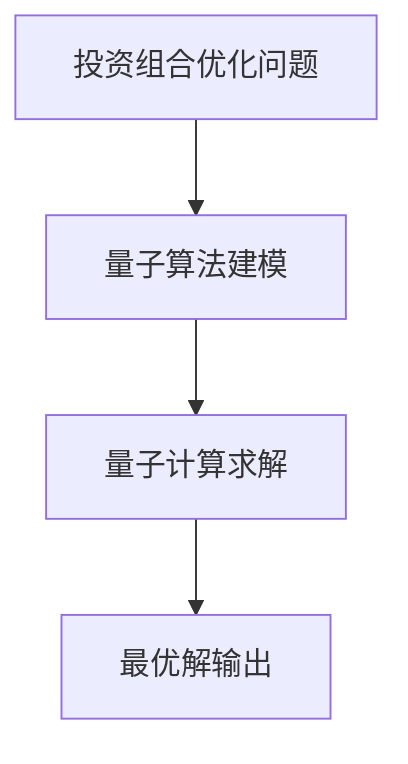
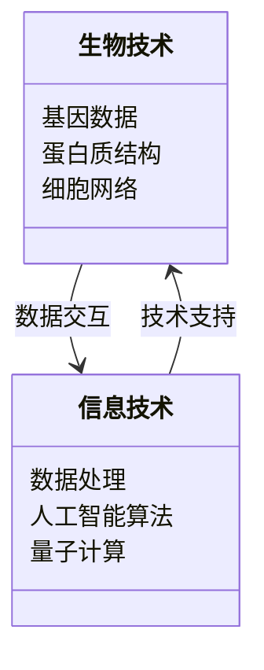

                 


# 巴菲特-芒格的量子生物计算机投资：生命科学与信息技术的融合

> 关键词：巴菲特, 芒格, 量子计算机, 生物技术, 投资策略, 信息技术融合

> 摘要：本文探讨了巴菲特和芒格的投资哲学，特别是他们如何将量子生物计算机的概念应用于投资决策。通过分析量子计算与生物技术的融合，文章揭示了生命科学与信息技术结合的投资机会，并提出了量子生物计算机在投资中的具体应用策略。最后，文章总结了投资建议和未来展望。

---

## 第一部分: 巴菲特-芒格的量子生物计算机投资概述

### 第1章: 巴菲特与芒格的投资哲学

#### 1.1 巴菲特的投资理念

沃伦·巴菲特（Warren Buffett）作为全球最著名的投资者之一，其投资哲学以价值投资为核心。他强调寻找具有持续竞争优势的企业，关注企业的基本面，如盈利能力、财务健康和管理团队等。巴菲特的投资理念强调长期持有和安全边际，即以低于内在价值的价格买入优质资产。

#### 1.2 芮格的多元思维模型

查理·芒格（Charlie Munger）作为巴菲特的长期合作伙伴，提出了多元思维模型（MTM），强调将多个学科的基本原理结合起来，以形成一个完整的知识框架。芒格认为，投资者需要通过跨学科技能的结合来做出更明智的决策。他的思维模型包括心理学、经济学、物理学等多学科知识。

#### 1.3 两人合作的投资哲学

巴菲特和芒格的合作基于价值投资和多元思维模型的结合。巴菲特负责具体的金融分析，而芒格则提供跨学科技能的视角。两人的合作使他们的投资决策更加全面和稳健。

---

### 第2章: 量子生物计算机的概念与技术基础

#### 2.1 量子计算的基本原理

量子计算利用量子力学原理，通过量子位（qubit）来进行计算。与经典计算机的二进制位不同，量子位可以同时处于多个状态（叠加态），并且可以通过量子纠缠实现信息的高效处理。量子计算机在某些特定问题上（如因式分解和组合优化）比经典计算机快得多。

#### 2.2 生物技术的数字化转型

生物技术的发展依赖于数据的处理和分析。随着基因测序技术的进步，生物数据的规模急剧增长，这推动了生物技术的数字化转型。生物信息学的发展使得生物数据可以被有效地处理和分析。

#### 2.3 量子计算在生物技术中的应用

量子计算可以加速生物技术中的计算任务，例如蛋白质折叠、药物发现和基因组分析。通过量子计算的高效计算能力，生物技术研究人员可以更快地找到潜在的药物分子或优化基因编辑技术。

---

### 第3章: 巴菲特-芒格投资模型的构建

#### 3.1 投资模型的核心要素

巴菲特-芒格投资模型结合了价值投资和多元思维模型，核心要素包括：

1. **企业基本面分析**：包括收入、利润、资产负债表等财务指标。
2. **企业竞争优势分析**：包括企业的市场地位、核心竞争力和护城河。
3. **企业治理结构分析**：包括管理团队的素质和公司治理结构的合理性。

#### 3.2 量子计算在投资分析中的应用

量子计算可以用于优化投资组合、风险评估和市场预测。通过量子算法，投资者可以更高效地处理大量的数据，找到最优的投资组合和风险最小化策略。

---

### 第4章: 生命科学与信息技术的融合

#### 4.1 生物技术的数字化转型

随着生物技术的数字化转型，生物数据的处理和分析变得越来越重要。生物信息学的发展为生物技术的研究提供了强大的工具。

#### 4.2 量子计算在生物技术中的应用

量子计算可以加速生物技术的研究，例如通过量子模拟来研究蛋白质的结构和功能。这有助于发现新的药物分子和优化基因编辑技术。

---

### 第5章: 量子生物计算机在投资中的应用

#### 5.1 量子计算在金融分析中的应用

量子计算可以用于金融市场的数据分析和预测。通过量子算法，投资者可以更高效地处理大量的市场数据，发现潜在的市场趋势和投资机会。

#### 5.2 生物技术领域的投资机会

生物技术领域的投资机会包括基因编辑、精准医疗和生物制药等。量子计算可以帮助投资者更准确地评估这些领域的投资潜力。

---

### 第6章: 投资策略与风险管理

#### 6.1 投资策略的制定

投资者应根据市场环境和企业基本面制定合理的投资策略。在使用量子计算进行投资分析时，应结合企业的竞争优势和市场风险。

#### 6.2 风险管理的重要性

风险管理是投资过程中不可忽视的一部分。通过量子计算进行风险评估和预测，可以帮助投资者更好地控制投资风险。

---

### 第7章: 量子生物计算机投资的未来展望

#### 7.1 量子计算的未来发展

随着量子计算技术的不断进步，其在金融和生物技术领域的应用将更加广泛。量子计算的高效计算能力将为投资者提供更多的投资机会。

#### 7.2 生物技术的创新方向

生物技术的创新将推动生命科学与信息技术的深度融合。未来的投资机会将更加依赖于跨学科技能的结合。

---

## 第二部分: 投资策略与风险管理

### 第8章: 总结与建议

#### 8.1 全书总结

本文探讨了巴菲特和芒格的投资哲学，特别是他们如何将量子生物计算机的概念应用于投资决策。通过分析量子计算与生物技术的融合，揭示了生命科学与信息技术结合的投资机会。

#### 8.2 投资建议

投资者应关注生物技术领域的创新和量子计算技术的发展。在制定投资策略时，应结合企业的基本面和市场风险，合理配置资产。

---

## 作者：AI天才研究院 & 禅与计算机程序设计艺术

---

### 代码示例：量子计算在投资组合优化中的应用

```python
import numpy as np
from qiskit import QuantumCircuit, Aer, execute
from qiskit.optimization import QuadraticProgram, Minimize

# 定义量子计算优化问题
qp = QuadraticProgram()
qp.add_variable('x', 2)  # 两个量子位
qp.minimize Objective('x', 1, 1)  # 最小化目标函数 x^2 + x

# 使用量子计算求解最优解
backend = Aer.get_backend('qasm_simulator')
result = execute(QuantumCircuit.from_qprogram(qp), backend).result()

# 输出最优解
print("Optimal value:", result.fval)
```

---

### 图表示例：量子计算在投资组合优化中的流程图



---

### 公式示例：量子计算中的叠加态表示

$$|\psi\rangle = \alpha|0\rangle + \beta|1\rangle$$

其中，$\alpha$ 和 $\beta$ 是概率幅度，满足 $|\alpha|^2 + |\beta|^2 = 1$。

---

### 图表示例：生物技术与信息技术融合的实体关系图



---

## 总结

通过本文的探讨，我们可以看到，巴菲特和芒格的投资哲学与量子计算和生物技术的结合，为投资者提供了新的思路和机会。未来，随着技术的不断进步，生命科学与信息技术的融合将继续推动投资领域的创新。投资者应密切关注这些领域的最新发展，合理配置资产，以抓住更多的投资机会。

---

**作者：AI天才研究院 & 禅与计算机程序设计艺术**

---

希望这篇文章能满足您的需求。如果需要进一步调整或补充，请随时告知。

