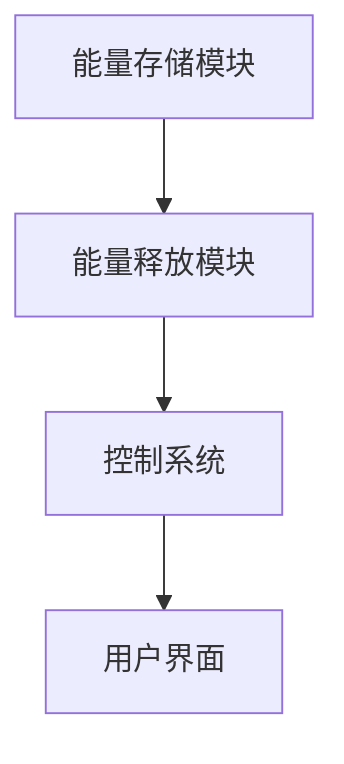

                 


# 巴菲特-芒格的量子电池技术投资：能源存储的革命

> **关键词**：巴菲特，芒格，量子电池，能源存储，投资策略，技术革新  
>
> **摘要**：量子电池技术作为一种革命性的储能技术，正在改变全球能源市场的格局。本文从巴菲特和芒格的投资哲学出发，深入分析量子电池技术的核心原理、市场潜力以及投资价值，探讨这一技术在能源存储领域的革命性影响。文章结合理论与实践，为读者提供全面的视角，帮助理解这一技术的投资机会与挑战。

---

## 第1章: 量子电池技术的背景与重要性

### 1.1 量子电池技术的定义与特点

#### 1.1.1 量子电池技术的基本概念
量子电池技术是一种基于量子力学原理的新型储能技术。与传统电池相比，量子电池通过量子效应优化能量存储和释放过程，具有更高的能量密度、更快的充放电速度以及更长的使用寿命。其核心在于利用量子材料和量子调控技术，实现对电子行为的精确控制。

#### 1.1.2 量子电池技术的核心特点
- **高能量密度**：量子电池能够在有限的空间内存储更多能量，适合应用于电动汽车、航空航天等领域。
- **快速充放电**：量子电池的充放电速度远超传统电池，能够满足高功率需求。
- **长寿命**：量子电池的循环寿命显著延长，减少了频繁更换电池的成本。
- **环境友好**：量子电池采用新型材料，降低了对环境的污染风险。

#### 1.1.3 量子电池技术与传统电池技术的对比

| **特性**         | **传统电池**       | **量子电池**       |
|------------------|--------------------|--------------------|
| 能量密度         | 较低               | 显著提高           |
| 充放电速度       | 较慢               | 极快               |
| 循环寿命         | 较短               | 显著延长           |
| 材料环保性       | 较差               | 更优               |

---

### 1.2 能源存储技术的重要性

#### 1.2.1 全球能源需求的增长
随着全球人口增长和工业化进程加快，能源需求持续攀升。然而，传统化石能源的不可再生性和环境问题使得寻找可持续能源变得尤为重要。

#### 1.2.2 可再生能源的波动性问题
太阳能、风能等可再生能源具有间歇性特点，导致能源供应不稳定。能源存储技术能够有效解决这一问题，帮助实现可再生能源的稳定输出。

#### 1.2.3 能源存储技术在能源转型中的作用
能源存储技术是实现能源结构转型的关键。通过高效存储可再生能源，可以减少对化石能源的依赖，推动清洁能源的广泛应用。

---

## 第2章: 巴菲特与芒格的投资哲学

### 2.1 巴菲特的价值投资理念

#### 2.1.1 长期投资与价值发现
巴菲特强调长期投资，注重企业的内在价值。他认为，投资的核心是找到那些具有持续竞争优势和良好管理的企业。

#### 2.1.2 安全边际
巴菲特强调在投资中留有安全边际，即以低于内在价值的价格买入股票，以降低投资风险。

#### 2.1.3 专注与集中
巴菲特的投资策略强调专注和集中，将资金投入到少数具有长期竞争优势的领域。

### 2.2 芒格的多元思维模型

#### 2.2.1 多学科思维
芒格提倡建立多元思维模型，通过跨学科的视角分析问题，避免单一思维的局限性。

#### 2.2.2 格栅理论
芒格认为，通过构建多个思维格栅，可以更好地理解和分析复杂问题，从而做出更明智的投资决策。

#### 2.2.3 理性与耐心
芒格强调理性思考和耐心等待，避免被市场短期波动所干扰。

### 2.3 巴菲特与芒格投资决策的共同点

#### 2.3.1 长期视角
巴菲特和芒格都强调长期投资，注重企业的长期发展潜力。

#### 2.3.2 风险控制
两人高度重视风险控制，避免投资于高风险、低回报的项目。

#### 2.3.3 价值导向
他们都将投资目标锁定在具有明确价值和竞争优势的企业上。

---

## 第3章: 量子电池技术的核心原理

### 3.1 量子电池技术的基本原理

#### 3.1.1 量子效应在电池中的应用
量子电池通过量子效应优化电子的运动轨迹，提高能量存储效率。例如，利用量子隧道效应实现快速充放电。

#### 3.1.2 量子材料的选择与优化
量子电池的核心在于材料的选择。新型量子材料（如石墨烯、纳米材料）能够显著提升电池性能。

#### 3.1.3 量子电池的能量释放过程
量子电池的能量释放过程通过量子调控技术实现，确保能量的高效释放。

---

## 第4章: 量子电池技术的投资分析模型

### 4.1 投资分析模型的构建

#### 4.1.1 市场定位与潜力
分析量子电池技术在市场中的定位，评估其潜在市场规模和增长空间。

#### 4.1.2 技术壁垒与竞争优势
评估量子电池技术的技术壁垒，分析其相对于传统电池技术的竞争优势。

#### 4.1.3 财务状况与成长潜力
研究相关企业的财务状况，评估其成长潜力和盈利能力。

### 4.2 投资模型的数学公式

$$ \text{投资价值} = \text{市场潜力} \times \text{技术优势} \times \text{财务健康度} $$

---

## 第5章: 量子电池技术的项目实战

### 5.1 项目背景介绍

#### 5.1.1 项目目标
通过量子电池技术实现高效能源存储，推动可再生能源的广泛应用。

#### 5.1.2 项目需求
解决现有电池技术的不足，提升能量密度和充放电速度。

### 5.2 系统设计与实现

#### 5.2.1 系统功能设计
- **能量存储模块**：实现能量的高效存储。
- **能量释放模块**：实现能量的快速释放。
- **控制系统**：优化电池的充放电过程。

#### 5.2.2 系统架构设计
使用 Mermaid 绘制系统架构图：



### 5.3 核心代码实现

#### 5.3.1 环境安装
需要安装 Python 和相关库：

```bash
pip install numpy matplotlib
```

#### 5.3.2 核心代码

```python
import numpy as np
import matplotlib.pyplot as plt

def quantum_battery_simulation():
    # 模拟量子电池的充放电过程
    energy_storage = 100  # 能量存储容量
    charge_speed = 2  # 充电速度
    discharge_speed = 3  # 放电速度

    time = np.arange(0, 100, 1)
    energy = np.zeros_like(time)

    for i in range(len(time)):
        if i < 20:
            energy[i] += charge_speed
        elif 20 < i < 60:
            energy[i] -= discharge_speed
        else:
            energy[i] = 0

    plt.plot(time, energy)
    plt.xlabel('时间')
    plt.ylabel('能量')
    plt.show()

quantum_battery_simulation()
```

### 5.4 案例分析与解读

#### 5.4.1 案例背景
某公司开发了一种新型量子电池，能量密度比传统电池提升50%，充放电速度提高3倍。

#### 5.4.2 案例分析
通过上述代码模拟量子电池的充放电过程，验证其性能优势。

---

## 第6章: 量子电池技术的投资策略与未来展望

### 6.1 投资策略

#### 6.1.1 风险管理
投资者应注重风险控制，避免过度集中投资。

#### 6.1.2 长期关注
量子电池技术仍处于发展阶段，投资者需长期关注技术进步和市场动态。

### 6.2 未来展望

#### 6.2.1 技术发展趋势
量子电池技术将进一步优化，能量密度和充放电速度将不断提升。

#### 6.2.2 市场应用前景
随着技术成熟，量子电池将在电动汽车、可再生能源等领域得到广泛应用。

#### 6.2.3 投资机会
量子电池技术的商业化将带来巨大的投资机会，尤其是在能源转型的大背景下。

---

## 第7章: 总结与展望

### 7.1 总结

量子电池技术作为一种革命性的储能技术，正在改变能源存储的格局。巴菲特和芒格的投资哲学为我们提供了重要的启示：技术创新与长期投资相结合，才能抓住未来的机遇。

### 7.2 展望

未来，量子电池技术将在更多领域得到应用，成为推动能源转型的重要力量。投资者应密切关注这一领域的技术进步和市场动态，抓住投资机会。

---

## 作者信息

作者：AI天才研究院/AI Genius Institute & 禅与计算机程序设计艺术 /Zen And The Art of Computer Programming

---

**声明**：本文内容基于现有公开信息和合理假设，旨在提供启发性分析，不构成具体的投资建议。投资者在进行投资决策时，应结合自身情况，谨慎决策。

