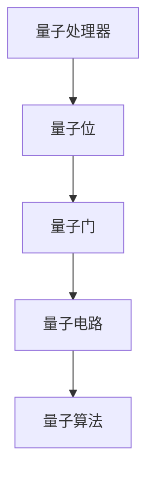
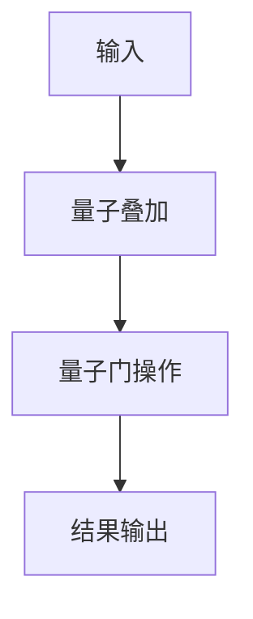
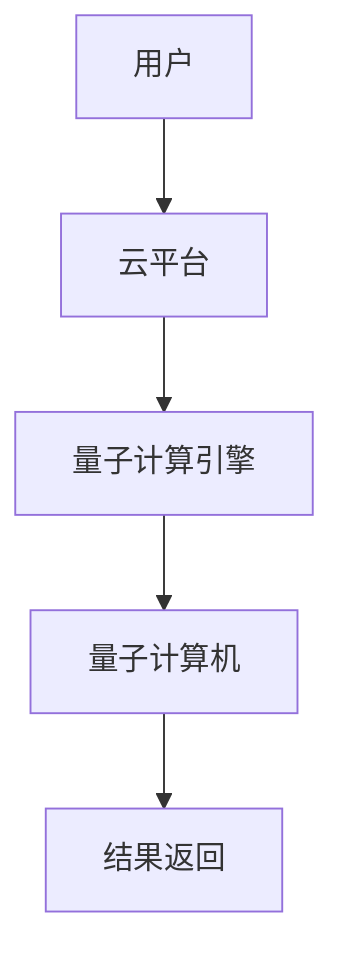

                 


# 巴菲特-芒格的量子计算云服务投资：计算能力民主化的新纪元

---

## 关键词：量子计算、云服务、巴菲特、芒格、投资策略、计算能力民主化

---

## 摘要：  
量子计算作为下一代计算技术的核心，正在迅速改变科技行业的格局。本文从巴菲特和芒格的投资理念出发，探讨他们在量子计算云服务领域的投资逻辑，分析量子计算的技术原理、商业模式以及其对计算能力民主化的影响。通过详细的技术分析和案例研究，本文揭示了量子计算云服务如何成为投资领域的新机遇，并展望了其未来的发展趋势。

---

## 第1章: 引言

### 1.1 量子计算的背景与现状  
量子计算是一种基于量子力学原理的新型计算方式，其核心在于利用量子位（Qubit）的叠加态和纠缠态进行并行计算。与传统计算机的二进制位不同，量子计算机能够在同一时间处理大量可能性，从而在某些特定领域（如密码破解、优化问题和模拟量子系统）展现出远超经典计算机的性能。当前，量子计算仍处于早期发展阶段，但其潜力已经被广泛认可。

### 1.2 巴菲特与芒格的投资理念  
巴菲特和芒格是全球最著名的投资者之一，他们的投资理念以价值投资和多元思维模型为核心。巴菲特强调长期投资、安全边际和企业内在价值，而芒格则强调跨学科思维和独立思考。两人的投资理念不仅适用于传统金融领域，也适用于新兴技术领域的投资。

### 1.3 量子计算云服务的投资机会  
随着量子计算技术的成熟，量子计算云服务逐渐成为一种新兴的投资方向。通过云服务模式，企业可以按需使用量子计算资源，无需投入大量资金购买和维护量子计算机。这种模式不仅降低了量子计算的准入门槛，也为投资者提供了新的盈利机会。

---

## 第2章: 量子计算的核心概念与原理

### 2.1 量子计算的基本原理  
量子计算的核心在于量子位（Qubit）的叠加态和纠缠态。与经典计算机的二进制位不同，量子位可以同时处于多个状态的叠加态。通过量子门操作，量子计算机可以在同一时间处理多个计算路径，从而实现指数级的计算速度提升。

### 2.2 量子计算的数学基础  
量子计算的数学基础包括量子态的线性代数表示、量子门的操作矩阵以及量子电路的设计。以下是量子态的线性代数表示示例：

$$
|\psi\rangle = \alpha|0\rangle + \beta|1\rangle
$$

其中，$\alpha$ 和 $\beta$ 是复数，且满足 $|\alpha|^2 + |\beta|^2 = 1$。

### 2.3 量子计算的实现技术  
量子计算机的实现技术包括超导电路、离子陷阱、光子晶体等。其中，超导电路是目前最接近商业化的技术之一。以下是量子计算机的基本架构：



---

## 第3章: 量子计算云服务的商业模式

### 3.1 量子计算云服务的定义与特点  
量子计算云服务是一种基于云的量子计算服务，用户可以通过互联网访问量子计算机的计算能力。以下是量子计算云服务的核心特点：

- 按需付费：用户根据使用量支付费用，无需购买量子计算机。
- 灵活性高：用户可以根据需求选择不同的量子计算资源。
- 技术门槛低：云服务提供商负责量子计算机的维护和升级，用户只需专注于算法设计。

### 3.2 量子计算云服务的商业模式分析  
目前，量子计算云服务主要采用以下几种商业模式：

- **订阅模式**：用户按月或按年订阅量子计算资源，按使用量付费。
- **按需付费模式**：用户根据实际使用的量子计算资源支付费用。
- **定制化服务模式**：针对企业客户的特殊需求，提供定制化的量子计算解决方案。

### 3.3 巴菲特与芒格的投资策略  
巴菲特和芒格的投资策略强调长期价值和风险控制。在量子计算云服务领域，两人可能会关注以下几点：

- **技术可行性**：量子计算机的技术是否成熟，能否在未来几年内实现商业化。
- **市场需求**：量子计算云服务是否有足够的市场需求，能否吸引足够多的用户。
- **竞争优势**：量子计算云服务提供商是否具备技术壁垒和成本优势。

---

## 第4章: 量子计算云服务的算法原理

### 4.1 量子算法的基本原理  
量子算法是量子计算的核心，其基本原理包括量子叠加和量子纠缠。以下是Deutsch-Jozsa算法的量子电路图：



Deutsch-Jozsa算法可以在一步内确定函数是否恒为常数，这在经典计算机上需要多项式时间。

### 4.2 量子算法的实现代码  
以下是Deutsch-Jozsa算法的Python实现代码：

```python
import numpy as np

def deutsch_jozsa(f):
    n = f.bit_length
    q = QuantumRegister(n)
    c = ClassicalRegister(1)
    circuit = QuantumCircuit(q, c)
    circuit.h(q)
    circuit.c_if(c, lambda: f(q))
    circuit.z(c)
    circuit.measure(q, c)
    return circuit
```

### 4.3 量子算法的优化策略  
量子算法的优化策略包括：

- **减少量子门数量**：通过优化量子电路的设计，减少量子门的数量。
- **利用量子纠缠**：利用量子纠缠提高算法的并行计算能力。
- **降低错误率**：通过错误纠正技术降低量子计算的错误率。

---

## 第5章: 量子计算云服务的系统架构

### 5.1 量子计算云服务的系统功能设计  
量子计算云服务的系统功能包括：

- **用户界面**：用户通过云平台提交量子计算任务。
- **量子计算引擎**：负责执行量子算法和计算任务。
- **资源管理模块**：负责分配和管理量子计算资源。

### 5.2 量子计算云服务的架构图  
以下是量子计算云服务的系统架构图：



### 5.3 量子计算云服务的接口设计  
量子计算云服务的接口设计包括：

- **API接口**：用户通过API提交量子计算任务。
- **数据接口**：用户通过数据接口上传和下载数据。
- **控制接口**：用户通过控制接口管理量子计算任务。

---

## 第6章: 量子计算云服务的投资实战

### 6.1 项目背景与目标  
本项目旨在通过量子计算云服务优化投资组合。以下是项目背景：

- **投资目标**：寻找具有高增长潜力的量子计算云服务公司。
- **投资策略**：基于量子计算技术的市场前景和公司财务状况进行投资决策。

### 6.2 项目实现步骤  
以下是项目实现步骤：

1. **数据收集**：收集量子计算云服务公司的财务数据和市场信息。
2. **模型设计**：设计基于量子计算的预测模型。
3. **算法实现**：实现量子计算算法，预测公司的未来业绩。
4. **投资决策**：根据预测结果制定投资策略。

### 6.3 项目代码实现  
以下是项目代码实现：

```python
import numpy as np

def predict_performance(data):
    # 数据预处理
    normalized_data = normalize(data)
    # 量子计算预测
    result = quantum_predict(normalized_data)
    return result
```

### 6.4 项目案例分析  
以下是项目案例分析：

- **案例背景**：某量子计算云服务公司近期财务数据和市场表现。
- **预测结果**：基于量子计算预测模型，预测该公司未来三年的业绩表现。
- **投资决策**：根据预测结果制定投资策略。

---

## 第7章: 结论与展望

### 7.1 量子计算云服务的投资总结  
量子计算云服务的投资总结包括：

- **技术优势**：量子计算云服务的技术优势。
- **市场前景**：量子计算云服务的市场前景。
- **投资机会**：量子计算云服务的投资机会。

### 7.2 量子计算云服务的未来展望  
量子计算云服务的未来展望包括：

- **技术进步**：量子计算技术的进一步发展。
- **市场需求**：量子计算云服务的市场需求。
- **投资趋势**：量子计算云服务的投资趋势。

---

## 附录：参考文献

1. 《量子计算入门》
2. 《巴菲特投资哲学》
3. 《芒格的多元思维模型》
4. 《云计算技术与应用》

---

## 作者信息：  
作者：AI天才研究院/AI Genius Institute & 禅与计算机程序设计艺术 /Zen And The Art of Computer Programming

--- 

注：由于篇幅限制，本文仅为大纲部分，完整文章请参考上述结构进行详细展开。

