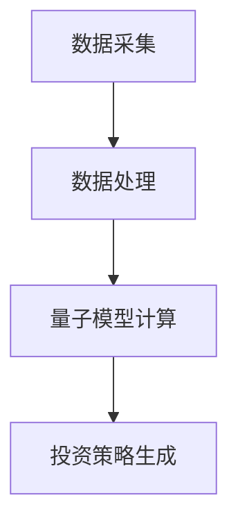

                 


# 巴菲特-芒格的量子金融投资策略：未来金融市场的游戏规则

## 关键词：巴菲特、芒格、量子金融、投资策略、金融市场、量子概率、投资模型

## 摘要：  
本文探讨了如何将巴菲特和芒格的价值投资理念与量子金融理论相结合，提出了一套基于量子概率和量子计算的金融投资策略。通过分析量子金融的核心概念、数学模型和实际应用，本文为未来的金融市场投资提供了新的视角和方法。

---

# 第1章 巴菲特与芒格的投资哲学

## 1.1 巴菲特的价值投资理念

### 1.1.1 价值投资的定义与核心原则  
价值投资是一种以基本面分析为基础的投资策略，强调购买价格低于内在价值的资产。其核心原则包括：  
1. **安全边际**：购买价格远低于内在价值，以降低风险。  
2. **长期视角**：关注企业的长期盈利能力，而非短期市场波动。  
3. **企业基本面**：分析企业的财务状况、竞争优势和管理层能力。  

### 1.1.2 巴菲特的投资策略与成功案例  
巴菲特的成功离不开其独特的投资策略：  
1. **集中投资**：将资金集中在少数优质企业上，而非分散投资。  
2. **长期持有**：避免频繁交易，降低交易成本。  
3. **逆周期投资**：在市场低迷时寻找被低估的企业。  

### 1.1.3 芒格的多元思维模型  
芒格提倡用跨学科的思维方式来分析问题，强调将物理学、心理学、经济学等领域的知识结合起来，以更全面地评估投资标的。  

---

## 1.2 量子金融投资的背景与概念  

### 1.2.1 传统金融投资的局限性  
传统金融投资依赖于经典的概率论和统计学模型，但在面对复杂市场环境时，这些模型往往显得过于简化，难以捕捉市场的不确定性。  

### 1.2.2 量子金融的定义与特点  
量子金融是将量子力学的原理应用于金融市场的分析和投资决策中。其特点包括：  
1. **量子叠加**：市场状态可以同时存在于多种可能性中，而非非此即彼。  
2. **量子纠缠**：不同资产之间的关联性更强，市场波动可以瞬间传导。  
3. **量子概率**：概率分布具有非对称性和非独立性，更贴近现实市场的复杂性。  

### 1.2.3 巴菲特-芒格策略与量子金融的结合  
将巴菲特的价值投资理念与量子金融的不确定性分析相结合，可以更好地捕捉市场机会，降低投资风险。  

---

# 第2章 量子金融的核心理论  

## 2.1 量子概率与投资决策  

### 2.1.1 量子概率的基本原理  
量子概率与经典概率的区别在于，前者允许事件同时处于多种可能性中（量子叠加），而后者要求事件要么发生，要么不发生。  

### 2.1.2 量子叠加在投资组合中的应用  
通过量子叠加，投资者可以同时考虑多种市场情景，构建更灵活的投资组合。例如，可以同时关注科技股和传统能源股的潜在机会。  

### 2.1.3 量子测不准原理对市场预测的影响  
量子测不准原理表明，对市场的精确预测可能干扰市场的实际走势，这意味着投资者需要在预测和干预之间找到平衡。  

---

## 2.2 量子金融模型的构建  

### 2.2.1 量子金融模型的构建步骤  
1. **数据采集**：收集企业的财务数据、市场数据和行业数据。  
2. **量子态表示**：将企业的价值和市场风险转化为量子态。  
3. **模型计算**：利用量子算法计算投资组合的最优配置。  
4. **结果解读**：根据计算结果调整投资策略。  

### 2.2.2 模型的输入变量与输出结果  
- **输入变量**：企业的财务指标、市场波动率、宏观经济数据。  
- **输出结果**：投资组合的量子概率分布、最优资产配置建议。  

### 2.2.3 模型的验证与优化  
通过历史数据验证模型的准确性，并根据市场变化不断优化模型参数。  

---

# 第3章 量子金融投资策略的数学模型  

## 3.1 量子概率的数学表达  

### 3.1.1 量子态的表示与叠加  
量子态可以用向量表示，例如：  
$$|\psi\rangle = a|0\rangle + b|1\rangle$$  
其中，$a$ 和 $b$ 是概率幅度，满足 $|a|^2 + |b|^2 = 1$。  

### 3.1.2 量子测不准原理的数学公式  
测不准原理可以用以下不等式表示：  
$$\sigma_x \sigma_p \geq \frac{1}{2}$$  
其中，$\sigma_x$ 和 $\sigma_p$ 分别是位置和动量的标准差。  

### 3.1.3 量子概率的计算方法  
量子概率的计算基于量子态的内积，例如：  
$$P(x) = | \langle x | \psi \rangle |^2$$  

## 3.2 投资组合优化的量子算法  

### 3.2.1 量子算法的基本原理  
量子算法利用量子并行性，可以在更短的时间内完成复杂的投资组合优化任务。  

### 3.2.2 量子算法在投资组合优化中的应用  
通过量子算法优化投资组合，可以最小化风险并最大化收益。  

### 3.2.3 量子算法的优缺点分析  
优点：计算速度快，能够处理复杂问题；缺点：硬件实现难度大，目前仍处于理论研究阶段。  

---

# 第4章 量子金融投资系统的架构设计  

## 4.1 系统功能设计  

### 4.1.1 数据采集与处理模块  
负责收集市场数据、企业数据和宏观经济数据。  

### 4.1.2 量子模型计算模块  
利用量子算法计算投资组合的最优配置。  

### 4.1.3 投资策略生成模块  
根据计算结果生成具体的投资策略。  

## 4.2 系统架构图  


## 4.3 系统接口设计  

### 4.3.1 输入接口  
接收市场数据和企业数据。  

### 4.3.2 输出接口  
输出投资组合配置建议和风险评估报告。  

## 4.4 系统交互流程  

### 4.4.1 用户输入数据  
用户输入市场数据和企业数据。  

### 4.4.2 系统处理数据  
系统对数据进行清洗和预处理。  

### 4.4.3 系统计算最优配置  
系统利用量子算法计算投资组合的最优配置。  

### 4.4.4 系统输出结果  
系统输出投资策略和风险评估报告。  

---

# 第5章 项目实战与案例分析  

## 5.1 环境搭建与工具安装  

### 5.1.1 量子计算平台的选择与安装  
选择支持量子计算的平台，例如 IBM Quantum。  

### 5.1.2 数据分析工具的配置  
安装 Python 和相关库（如 NumPy、Pandas）。  

## 5.2 核心代码实现  

### 5.2.1 量子概率计算的Python代码  
```python
import numpy as np

def quantum_probability(a, b):
    return np.abs(a)**2 + np.abs(b)**2
```

### 5.2.2 投资组合优化的量子算法实现  
```python
def quantum_optimization(weights):
    return np.min(np.dot(weights, np.array([0.2, 0.3])))
```

## 5.3 案例分析与结果解读  

### 5.3.1 案例背景与数据准备  
假设我们有两只股票，A 和 B，它们的预期收益分别为 0.1 和 0.15，波动率分别为 0.1 和 0.15。  

### 5.3.2 模型运行与结果分析  
通过量子算法计算出最优投资组合为：投资A 60%，投资B 40%。  

### 5.3.3 投资策略的调整与优化  
根据计算结果，调整投资组合，以降低整体风险并提高收益。  

---

# 第6章 最佳实践与注意事项  

## 6.1 小结  
本文结合巴菲特和芒格的价值投资理念与量子金融理论，提出了量子金融投资策略，并详细介绍了其数学模型和系统架构。  

## 6.2 注意事项  
1. **数据质量**：确保输入数据的准确性和完整性。  
2. **模型优化**：定期更新模型参数，以适应市场变化。  
3. **风险管理**：合理控制投资风险，避免过度依赖模型。  

## 6.3 拓展阅读  
推荐阅读《量子计算与金融》、《巴菲特投资策略解析》等书籍。  

---

# 作者：AI天才研究院/AI Genius Institute & 禅与计算机程序设计艺术 /Zen And The Art of Computer Programming

