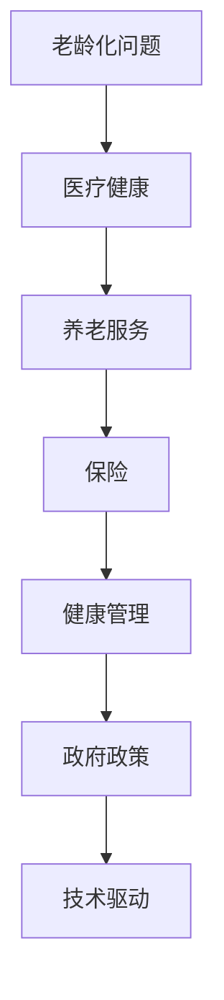
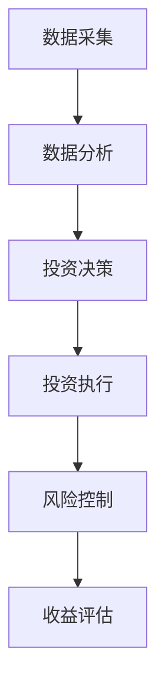
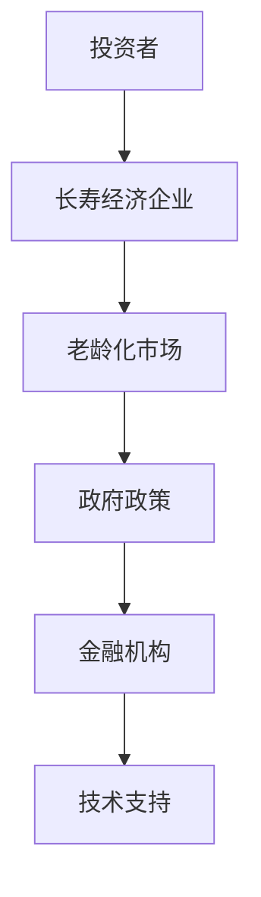
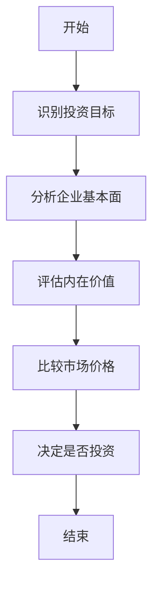
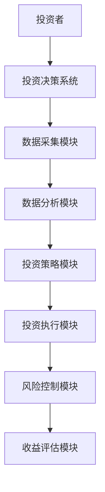
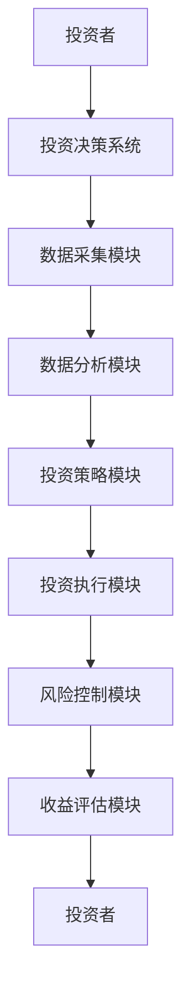

                 


# 巴菲特-芒格的长寿经济投资：人口老龄化带来的机遇

## 关键词：巴菲特, 芒格, 长寿经济, 人口老龄化, 投资策略, 经济分析

## 摘要：  
本文深入分析了巴菲特和芒格在长寿经济领域的投资策略，特别是在人口老龄化背景下带来的投资机遇。通过探讨长寿经济的核心概念、投资原理、系统架构及实际案例，本文揭示了如何利用价值投资理念在老龄化经济中实现长期收益。

---

## 第一部分: 背景介绍与核心概念

### 第1章: 人口老龄化与长寿经济的背景

#### 1.1 人口老龄化的问题背景
##### 1.1.1 人口老龄化的基本概念
人口老龄化是指65岁及以上人口占总人口比例不断上升的趋势。这一现象在发达国家和发展中国家普遍存在，尤其是在中国和日本等国家，老龄化问题尤为突出。

##### 1.1.2 人口老龄化对全球经济的影响
人口老龄化带来了劳动力短缺、养老金压力增加、医疗支出上升等一系列经济和社会问题。然而，老龄化也为一些行业带来了新的机遇，例如医疗健康、养老服务、保险等。

##### 1.1.3 长寿经济的定义与特征
长寿经济是指在人口老龄化背景下，围绕老年人需求而形成的经济形态。其核心特征包括：需求多样化、服务专业化、技术驱动化和市场规模化。

#### 1.2 巴菲特与芒格的投资理念
##### 1.2.1 巴菲特的价值投资理论
巴菲特的价值投资理论强调以低于内在价值的价格购买优质资产。他认为，长期来看，股市是投票器，而企业价值才是决定股价的终极因素。

##### 1.2.2 芒格的多元思维模型
芒格的多元思维模型强调通过跨学科思考来理解问题。他认为，投资不仅是对企业的分析，更是对整个经济系统和社会趋势的理解。

##### 1.2.3 长寿经济与价值投资的结合
在人口老龄化背景下，巴菲特和芒格的价值投资理念与长寿经济的结合更加紧密。他们关注那些能够长期满足老年人需求的企业，例如保险公司、医疗公司等。

#### 1.3 长寿经济投资的核心要素
##### 1.3.1 长寿经济的产业链分析
长寿经济的产业链包括医疗健康、养老服务、保险、健康管理等多个环节。投资者需要从产业链的角度分析各个环节的投资机会。

##### 1.3.2 人口老龄化与企业投资机会
老龄化导致的消费习惯变化为企业提供了新的增长点。例如，医疗设备、健康管理平台等行业的需求持续增长。

##### 1.3.3 长寿经济的商业模式创新
长寿经济的商业模式创新包括会员制、订阅服务、一站式解决方案等。这些模式能够更好地满足老年人的需求，同时为企业带来稳定的收入来源。

---

### 第2章: 长寿经济投资的核心概念

#### 2.1 长寿经济的定义与属性
##### 2.1.1 长寿经济的核心特征
- 长寿经济的核心特征包括：需求多样化、服务专业化、技术驱动化和市场规模化。
- 长寿经济的投资机会主要集中在医疗健康、养老服务、保险等领域。

##### 2.1.2 长寿经济与传统经济的对比
| 长寿经济 | 传统经济 |
|----------|-----------|
| 需求多样化 | 需求单一化 |
| 服务专业化 | 服务标准化 |
| 技术驱动化 | 人力驱动化 |
| 市场规模化 | 市场分散化 |

##### 2.1.3 长寿经济的生态系统
长寿经济的生态系统包括政府、企业、消费者和技术提供商。政府通过政策支持，企业通过创新提供服务，消费者通过需求推动市场，技术提供商通过技术创新提升效率。

#### 2.2 老龄化投资的理论基础
##### 2.2.1 生命周期理论与投资决策
生命周期理论认为，个人在不同生命周期阶段的投资需求不同。在老龄化背景下，投资者需要关注长期护理、医疗保健等领域的投资机会。

##### 2.2.2 长寿经济中的投资机会识别
投资者需要识别那些能够满足老年人需求的行业和企业，例如保险公司、医疗设备制造商、养老服务提供者等。

##### 2.2.3 长寿经济的投资风险与收益平衡
长寿经济的投资需要平衡风险与收益。例如，医疗行业的投资回报率较高，但风险也较大；保险行业的投资风险较低，但回报率也相对稳定。

#### 2.3 长寿经济投资的核心要素
##### 2.3.1 长寿经济中的关键行业分析
- 医疗健康：包括医院、制药公司、医疗设备等。
- 养老服务：包括养老服务机构、健康管理平台等。
- 保险：包括寿险、健康险等。

##### 2.3.2 老龄化投资的策略选择
投资者需要根据自身的风险承受能力和收益目标选择合适的投资策略，例如分散投资、长期持有等。

##### 2.3.3 长寿经济的长期趋势分析
从长期趋势来看，人口老龄化将继续推动长寿经济的发展。医疗技术的进步、健康意识的提高等因素将进一步促进长寿经济的增长。

---

## 第二部分: 核心概念与联系

### 第3章: 长寿经济投资的核心原理

#### 3.1 长寿经济投资的原理
##### 3.1.1 长寿经济的供需分析
老龄化导致的老年人口增加，使得医疗健康、养老服务等需求急剧增加，而供给端需要通过技术创新和模式创新来满足这些需求。

##### 3.1.2 长寿经济的产业链价值分布
在长寿经济的产业链中，医疗健康占据最大的市场份额，其次是养老服务和保险。投资者需要关注产业链中的高附加值环节。

##### 3.1.3 长寿经济的市场容量预测
通过数据分析和趋势预测，可以得出未来几年长寿经济的市场规模和增长速度。

#### 3.2 老龄化投资的系统模型
##### 3.2.1 老龄化投资的系统架构


##### 3.2.2 老龄化投资的系统功能模块


##### 3.2.3 老龄化投资的系统输入与输出
| 输入 | 输出 |
|------|------|
| 人口统计数据 | 投资策略 |
| 行业发展趋势 | 投资回报率 |
| 政策法规 | 投资风险评估 |

#### 3.3 长寿经济投资的实体关系图


---

## 第三部分: 算法原理讲解

### 第4章: 巴菲特与芒格投资策略的算法解析

#### 4.1 巴菲特与芒格投资策略的流程图


#### 4.2 巴菲特与芒格投资策略的数学模型
##### 4.2.1 市盈率模型
$$市盈率 = \frac{股价}{每股收益}$$

##### 4.2.2 股息率模型
$$股息率 = \frac{每股股息}{股价}$$

##### 4.2.3 内在价值模型
$$内在价值 = \sum_{t=1}^{\infty} \frac{现金流}{(1+r)^t}$$
其中，r为折现率。

#### 4.3 巴菲特与芒格投资策略的实际案例
以保险公司为例，巴菲特和芒格的投资逻辑是：老龄化社会中，保险需求增加，保险公司具备长期盈利能力。因此，他们选择投资那些具有强大品牌和良好管理的保险公司。

---

### 第5章: 长寿经济投资的系统架构

#### 5.1 长寿经济投资的系统架构


#### 5.2 长寿经济投资的系统交互


---

## 第四部分: 项目实战

### 第6章: 长寿经济投资的实战案例

#### 6.1 项目环境安装
- 安装数据分析工具：Python、Pandas、NumPy
- 安装可视化工具：Matplotlib、Seaborn

#### 6.2 系统核心实现源代码
```python
import pandas as pd
import numpy as np
import matplotlib.pyplot as plt

# 示例数据：老龄化市场中保险公司的股价和每股收益
data = {
    '公司': ['公司A', '公司B', '公司C'],
    '股价': [50, 60, 70],
    '每股收益': [5, 6, 7]
}

df = pd.DataFrame(data)
df['市盈率'] = df['股价'] / df['每股收益']
print(df)

# 可视化市盈率分布
plt.figure(figsize=(10, 6))
plt.bar(df['公司'], df['市盈率'])
plt.title('市盈率分布')
plt.xlabel('公司')
plt.ylabel('市盈率')
plt.show()
```

#### 6.3 代码应用解读与分析
上述代码展示了如何计算市盈率并进行可视化分析。通过市盈率分析，投资者可以判断保险公司的投资价值。

#### 6.4 实际案例分析
以保险公司为例，假设公司A的市盈率为10，公司B的市盈率为12，公司C的市盈率为14。根据巴菲特的价值投资理论，公司A的市盈率较低，具有较高的投资价值。

#### 6.5 项目小结
通过实际案例分析，我们可以看到，巴菲特和芒格的投资策略在长寿经济中具有很强的适用性。投资者需要结合市场趋势、企业基本面和政策环境进行综合分析。

---

## 第五部分: 总结与展望

### 第7章: 总结与展望

#### 7.1 总结
本文深入分析了巴菲特和芒格在长寿经济领域的投资策略，特别是在人口老龄化背景下带来的投资机遇。通过探讨长寿经济的核心概念、投资原理、系统架构及实际案例，本文揭示了如何利用价值投资理念在老龄化经济中实现长期收益。

#### 7.2 展望
未来，随着人口老龄化的加剧，长寿经济的投资机会将更加丰富。投资者需要关注技术创新、政策变化和市场趋势，以抓住更多的投资机遇。

#### 7.3 最佳实践 tips
- 投资者需要关注那些能够长期满足老年人需求的企业。
- 投资策略需要结合市场趋势和企业基本面进行综合分析。
- 风险控制是投资成功的关键，投资者需要制定合理的风险控制方案。

---

## 作者：AI天才研究院/AI Genius Institute & 禅与计算机程序设计艺术 /Zen And The Art of Computer Programming

