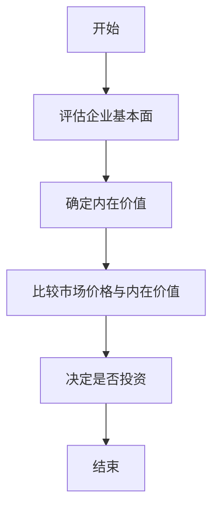
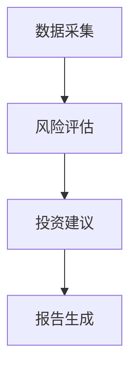

                 


# 巴菲特-芒格看待金融创新：保持谨慎和理性

## 关键词：巴菲特，芒格，金融创新，投资原则，风险控制

## 摘要：本文深入探讨巴菲特和芒格对金融创新的看法，分析他们在投资过程中如何保持谨慎和理性。通过介绍金融创新的基本概念、核心概念的联系、算法原理、数学模型、系统架构设计、项目实战以及最佳实践，本文为读者提供了全面的理解和实用的指导。

---

# 第一部分：背景介绍

## 第1章：巴菲特与芒格的背景介绍

### 1.1 巴菲特与芒格的生平与投资理念

#### 1.1.1 巴菲特的生平与投资历程

沃伦·巴菲特（Warren Buffett）是世界著名投资家，1934年出生于美国奥马哈。他从10岁开始投资，1956年创立了合伙公司，并在1965年收购了伯克希尔哈撒韦公司，开始转型为价值投资者。巴菲特的投资理念以“价值投资”为核心，强调购买被市场低估的公司，并长期持有。

#### 1.1.2 芮格·芒格（Charlie Munger）的哲学与决策思维

查尔斯·芒格（Charlie Munger）是巴菲特的长期合作伙伴，1924年出生于美国密歇根州。他是伯克希尔哈撒韦公司的副主席，以其独特的决策思维和哲学闻名。芒格强调“逆向思维”，即从反方向思考问题，寻找别人忽略的机会。

#### 1.1.3 巴菲特与芒格的合作模式

巴菲特和芒格的合作基于对价值投资的共同理念，芒格负责提供多元化的思考方式，巴菲特则负责具体的选股和投资决策。两人共同的理念是寻找具有持续竞争优势、良好管理和合理估值的企业。

### 1.2 金融创新的基本概念

#### 1.2.1 金融创新的定义

金融创新是指在金融领域中，通过技术、产品、市场或管理等创新手段，创造出新的金融工具、市场结构或服务模式的过程。

#### 1.2.2 金融创新的驱动因素

金融创新的驱动因素包括技术进步、市场需求、监管变化和市场竞争等。技术进步如金融科技的发展，市场需求如对多样化投资工具的需求，以及监管变化如放松管制都推动了金融创新。

#### 1.2.3 金融创新的双刃剑效应

金融创新带来新的投资机会和风险管理工具，但也可能导致过度风险承担和系统性风险。例如，衍生品的过度使用可能引发市场波动，甚至导致金融危机。

---

## 第2章：巴菲特与芒格如何看待金融创新

### 2.1 巴菲特对金融创新的态度

巴菲特对金融创新持谨慎态度，他认为许多金融创新只是“卖出了更好的金融工具”，并不能真正创造价值。他更关注企业的基本面，而非复杂的金融工具。

### 2.2 芮格·芒格对金融创新的见解

芒格强调金融创新中的风险，他认为许多创新只是复杂化的表现，真正的价值创造来自于企业基本面的改善，而非金融工具的创新。

---

# 第二部分：核心概念与联系

## 第3章：巴菲特与芒格的投资原则

### 3.1 投资原则的核心要素

#### 3.1.1 价值投资的核心要素

价值投资强调购买低于内在价值的股票，长期持有优质企业，避免短期波动。巴菲特和芒格认为，内在价值是企业未来现金流的现值。

#### 3.1.2 投资中的安全边际

安全边际是指股票价格与内在价值之间的差距，确保在市场价格波动时仍能获得收益。芒格强调安全边际的重要性，认为这是避免重大损失的关键。

### 3.2 投资原则与金融创新的关系

#### 3.2.1 金融创新对投资原则的挑战

金融创新引入了新的金融工具和市场结构，但这些创新可能偏离基本面，增加投资风险。例如，复杂的衍生品可能掩盖企业的实际风险。

#### 3.2.2 巴菲特与芒格的应对策略

巴菲特和芒格通过关注企业的基本面和长期价值，避免参与高风险的金融创新。他们更倾向于投资那些具有稳定现金流和竞争优势的企业。

---

## 第4章：核心概念的联系与对比

### 4.1 核心概念的对比分析

#### 4.1.1 投资原则与金融创新的对比

巴菲特和芒格的投资原则以基本面分析为核心，而金融创新则强调工具和市场的创新。两者的目标都是创造价值，但方法和侧重点不同。

#### 4.1.2 投资原则在金融创新中的应用

巴菲特和芒格的投资原则在金融创新中仍适用，例如关注企业的现金流、竞争优势和管理团队。即使面对复杂的金融工具，他们仍以基本面分析为基础进行评估。

---

# 第三部分：算法原理与数学模型

## 第5章：巴菲特与芒格投资策略的算法原理

### 5.1 投资策略的算法流程

#### 5.1.1 投资策略的流程图



#### 5.1.2 投资策略的Python实现

```python
def calculate_intrinsic_value(company_data):
    # 假设公司数据包括现金流、增长率等
    cash_flow = company_data['cash_flow']
    growth_rate = company_data['growth_rate']
    discount_rate = company_data['discount_rate']
    
    # 内在价值计算
    intrinsic_value = 0
    for year in range(5):
        cash_flow *= (1 + growth_rate)
        present_value = cash_flow / (1 + discount_rate)**year
        intrinsic_value += present_value
    return intrinsic_value

# 示例数据
company_data = {
    'cash_flow': 100,
    'growth_rate': 0.05,
    'discount_rate': 0.08
}

intrinsic_value = calculate_intrinsic_value(company_data)
print(f"内在价值为：{intrinsic_value}")
```

### 5.2 数学模型与公式

#### 5.2.1 内在价值公式

$$ \text{内在价值} = \sum_{t=1}^{n} \frac{\text{现金流}_t}{(1 + r)^t} $$

其中，\( r \) 是折现率，\( n \) 是预测年数。

---

# 第四部分：系统分析与架构设计

## 第6章：金融创新评估的系统架构

### 6.1 问题场景描述

评估金融创新项目时，需要考虑市场风险、流动性风险和信用风险。系统需提供多维度的分析工具，帮助投资者做出理性决策。

### 6.2 系统功能设计

#### 6.2.1 功能模块

- 数据采集：收集企业财务数据、市场数据。
- 风险评估：计算市场风险、信用风险。
- 投资建议：基于数据分析提出投资建议。
- 报告生成：生成详细的分析报告。

#### 6.2.2 功能流程图



### 6.3 系统架构设计

#### 6.3.1 系统架构图

```mermaid
graph LR
    Client --> API Gateway
    API Gateway --> Data Layer
    Data Layer --> Processing Layer
    Processing Layer --> Report Layer
    Report Layer --> Client
```

---

## 第7章：项目实战

### 7.1 环境安装

安装必要的Python库，如Pandas、NumPy、Scipy等。

```bash
pip install pandas numpy scipy
```

### 7.2 核心代码实现

```python
import pandas as pd
import numpy as np
from scipy.stats import norm

def calculate_value_at_risk(returns, confidence_level=0.95):
    alpha = 1 - confidence_level
    VaR = returns.quantile(alpha)
    return VaR

# 示例数据
returns = pd.Series([0.05, 0.03, -0.02, 0.01, 0.04])
VaR = calculate_value_at_risk(returns)
print(f"VaR在95%置信水平下的值为：{VaR}")
```

### 7.3 实际案例分析

分析某金融创新项目，评估其风险和回报。通过VaR模型计算风险，评估其是否在可接受范围内。

---

## 第8章：最佳实践与小结

### 8.1 最佳实践

- 保持谨慎和理性，避免盲目跟风。
- 注重基本面分析，选择优质企业。
- 定期评估投资组合，调整策略。

### 8.2 注意事项

- 风险控制是关键，避免过度杠杆。
- 保持长期视角，避免短期波动干扰。

### 8.3 拓展阅读

推荐阅读《巴菲特致股东的信》和《芒格主义：查理·芒格的终身箴言》。

---

# 作者：AI天才研究院 & 禅与计算机程序设计艺术

---

通过以上内容，读者可以全面理解巴菲特和芒格看待金融创新的视角，掌握他们在投资中的谨慎和理性原则，以及如何将这些原则应用到实际的金融创新评估中。

