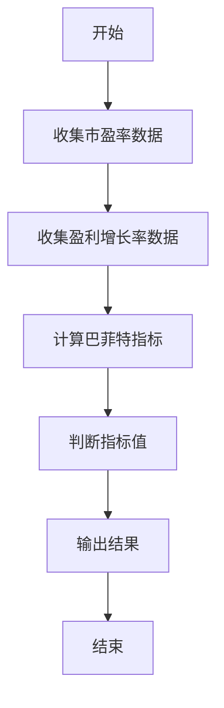
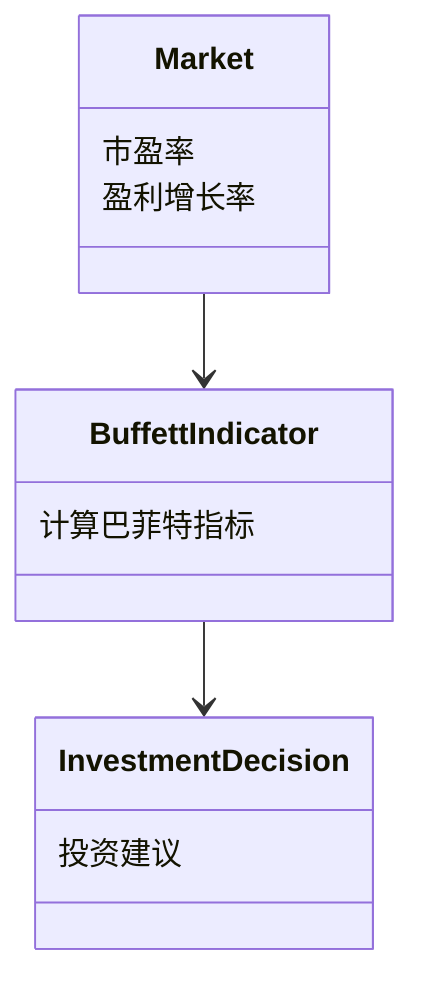

                 


# 巴菲特指标: 评估市场估值的有效工具

> 关键词：巴菲特指标、市场估值、投资分析、财务指标、价值投资

> 摘要：巴菲特指标是一种简单而有效的市场估值工具，能够帮助投资者评估市场的整体估值水平。本文将从巴菲特指标的背景、核心公式、算法原理、系统分析、项目实战等方面进行详细探讨，结合实际案例和代码实现，帮助读者全面理解并掌握如何利用巴菲特指标进行市场估值分析。

---

## 第一部分: 巴菲特指标的背景与核心概念

### 第1章: 市场估值的重要性

#### 1.1 投资的基本逻辑

##### 1.1.1 投资的基本概念
投资是将资金投入某种资产或项目，以期望在未来获得收益或资本增值的行为。在金融市场中，投资者通过购买股票、债券、基金等资产来实现财富增值。

##### 1.1.2 市场估值的核心作用
市场估值是评估市场整体或单个资产价格水平的重要工具。它帮助投资者判断市场是否被高估或低估，从而做出合理的投资决策。

##### 1.1.3 巴菲特指标的起源与发展
巴菲特指标由股神沃伦·巴菲特提出，主要用于评估市场的整体估值水平。该指标基于市盈率（P/E）和盈利增长率（EPS growth）的概念，结合市场整体的市盈率和长期增长率来判断市场的估值。

---

#### 1.2 巴菲特指标的定义与特点

##### 1.2.1 巴菲特指标的定义
巴菲特指标是一种衡量市场整体估值的指标，公式为：
$$
\text{巴菲特指标} = \frac{\text{市盈率} \times \text{盈利增长率}}{10}
$$
其中，市盈率（P/E）是股票价格与每股收益的比率，盈利增长率是公司过去5年净利润的复合增长率。

##### 1.2.2 巴菲特指标的核心特点
- 简单易用：巴菲特指标仅涉及两个关键指标，计算过程简单。
- 综合性：结合市盈率和盈利增长率，能够更全面地评估市场的估值水平。
- 长期视角：基于过去5年的盈利增长率，具有一定的历史参考价值。

##### 1.2.3 巴菲特指标与其他估值方法的对比
与其他估值方法（如市净率、股息率等）相比，巴菲特指标的独特之处在于它将市盈率与盈利增长率结合起来，能够更好地反映市场的长期增长潜力。

---

### 第2章: 巴菲特指标的核心公式与计算方法

#### 2.1 巴菲特指标的数学模型

##### 2.1.1 巴菲特指标的公式推导
巴菲特指标的公式可以表示为：
$$
\text{巴菲特指标} = \frac{P/E \times g}{10}
$$
其中，$P/E$ 是市盈率，$g$ 是盈利增长率。

##### 2.1.2 公式中的变量与参数
- 市盈率（P/E）：计算公式为 $P/E = \frac{\text{股价}}{\text{每股收益}}$。
- 盈利增长率（g）：计算公式为 $g = \left( \frac{\text{第5年净利润}}{\text{第1年净利润}} \right)^{1/4} - 1$。

##### 2.1.3 公式的数学推导
通过将市盈率和盈利增长率结合，巴菲特指标能够反映出市场的估值水平与盈利能力之间的关系。当指标低于1时，市场可能被低估；当指标接近1时，市场处于合理估值水平；当指标超过1时，市场可能被高估。

---

#### 2.2 巴菲特指标的计算流程

##### 2.2.1 数据收集与处理
- 收集市场整体的市盈率数据。
- 收集市场整体的盈利增长率数据。

##### 2.2.2 公式应用与计算
根据公式 $\frac{P/E \times g}{10}$，计算巴菲特指标的值。

##### 2.2.3 结果分析与解读
- 当巴菲特指标低于1时，市场估值较低，投资机会较多。
- 当巴菲特指标接近1时，市场估值合理，适合长期投资。
- 当巴菲特指标高于1时，市场估值较高，需谨慎投资。

---

## 第二部分: 巴菲特指标的算法原理

### 第3章: 巴菲特指标的算法流程图

#### 3.1 算法流程图的绘制
以下是巴菲特指标的算法流程图：



#### 3.2 算法流程图的解释
1. **开始**：启动巴菲特指标的计算过程。
2. **收集数据**：获取市场整体的市盈率和盈利增长率数据。
3. **计算指标**：根据公式计算巴菲特指标的值。
4. **判断指标值**：根据指标值判断市场的估值水平。
5. **输出结果**：根据判断结果输出投资建议。
6. **结束**：完成计算过程。

---

### 第4章: 巴菲特指标的系统分析与架构设计

#### 4.1 问题场景介绍

##### 4.1.1 问题背景
在金融市场中，投资者需要一种简单有效的工具来评估市场的整体估值水平。巴菲特指标作为一种经典的估值工具，能够帮助投资者做出更明智的投资决策。

##### 4.1.2 问题描述
如何利用巴菲特指标评估市场的整体估值水平？如何通过系统化的方法实现巴菲特指标的计算与分析？

##### 4.1.3 问题解决
通过构建基于巴菲特指标的估值系统，投资者可以快速评估市场的估值水平，并做出相应的投资决策。

---

#### 4.2 系统功能设计

##### 4.2.1 领域模型设计
以下是领域模型设计的mermaid图：



##### 4.2.2 功能模块划分
- 数据采集模块：负责收集市场数据。
- 计算模块：负责计算巴菲特指标。
- 分析模块：负责分析指标值并生成投资建议。

##### 4.2.3 模块之间的关系
- 数据采集模块向计算模块提供必要的数据。
- 计算模块向分析模块提供指标值。
- 分析模块向用户输出投资建议。

---

#### 4.3 系统架构设计

##### 4.3.1 系统架构图
以下是系统架构图的mermaid图：


##### 4.3.2 系统接口设计
- 数据采集接口：用于获取市场数据。
- 计算接口：用于计算巴菲特指标。
- 分析接口：用于生成投资建议。

##### 4.3.3 系统交互流程
1. 用户发起估值请求。
2. 数据采集模块获取市场数据。
3. 数据处理模块对数据进行预处理。
4. 计算模块计算巴菲特指标。
5. 分析模块生成投资建议。
6. 输出模块将结果返回给用户。

---

## 第三部分: 巴菲特指标的项目实战

### 第5章: 巴菲特指标的项目实战

#### 5.1 环境安装与配置

##### 5.1.1 环境搭建
- 操作系统：Windows/Mac/Linux
- 开发工具：Python、Jupyter Notebook
- 数据源：股票数据 API（如Yahoo Finance）

##### 5.1.2 工具安装
- Python安装：使用pip安装必要的库，如pandas、numpy、requests。

##### 5.1.3 数据准备
- 下载市场整体的市盈率和盈利增长率数据。

---

#### 5.2 核心实现源代码

##### 5.2.1 数据获取与处理
```python
import requests
import pandas as pd

def get_market_pe():
    # 获取市场市盈率数据
    url = "https://query1.finance.yahoo.com/ws/v1/finance/pe"
    params = {
        "region": "US",
        "lang": "en-US",
        "symbol": "^GSPC"  # 标普500指数
    }
    response = requests.get(url, params=params)
    data = response.json()
    pe = data["quoteResponse"]["result"][0]["TrailingPE"]
    return pe

def get_market_growth():
    # 获取市场盈利增长率数据
    url = "https://query1.finance.yahoo.com/ws/v1/finance/growth"
    params = {
        "region": "US",
        "lang": "en-US",
        "symbol": "^GSPC"
    }
    response = requests.get(url, params=params)
    data = response.json()
    growth = data["quoteResponse"]["result"][0]["RevenueGrowth"]
    return growth
```

##### 5.2.2 巴菲特指标计算
```python
def calculate_buffett_indicator():
    pe = get_market_pe()
    growth = get_market_growth()
    indicator = (pe * growth) / 10
    return indicator

# 示例计算
indicator = calculate_buffett_indicator()
print(f"巴菲特指标为：{indicator}")
```

---

#### 5.3 实际案例分析

##### 5.3.1 案例背景
以标普500指数为例，假设当前市盈率为20，盈利增长率为5%。

##### 5.3.2 计算过程
$$
\text{巴菲特指标} = \frac{20 \times 5}{10} = 10
$$

##### 5.3.3 分析结果
巴菲特指标为10，远高于1，说明当前市场估值较高，需谨慎投资。

---

## 第四部分: 巴菲特指标的最佳实践

### 第6章: 巴菲特指标的最佳实践

#### 6.1 小结
巴菲特指标是一种简单而有效的市场估值工具，能够帮助投资者快速判断市场的估值水平。通过结合市盈率和盈利增长率，巴菲特指标能够反映出市场的长期增长潜力。

#### 6.2 注意事项
- 巴菲特指标仅适用于长期投资分析。
- 需结合其他估值指标（如市净率、股息率等）进行综合判断。
- 数据来源和计算方法会影响指标的准确性。

#### 6.3 拓展阅读
- 《巴菲特选股之道》
- 《价值投资实战》
- 《投资学基础》

---

## 作者信息

作者：AI天才研究院/AI Genius Institute & 禅与计算机程序设计艺术 /Zen And The Art of Computer Programming

---

通过本文的详细讲解，读者可以全面理解巴菲特指标的背景、核心公式、算法原理、系统设计和实际应用，从而掌握如何利用这一工具进行市场估值分析。

