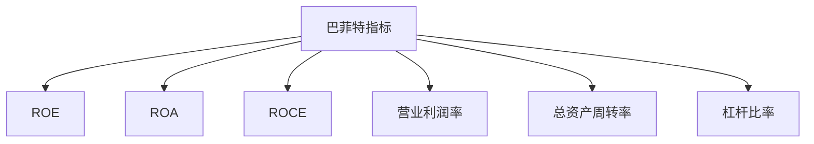

                 


# 巴菲特指标在国际市场的适用性探讨

## 关键词：巴菲特指标、价值投资、ROE、国际市场、企业估值

## 摘要

本文探讨了巴菲特指标在国际市场的适用性，分析了其在不同市场环境下的表现和影响因素。通过对比不同国家的会计准则和经济环境，结合实际案例和定量分析，本文揭示了巴菲特指标在跨国投资中的潜在问题和优化方向，为投资者提供了实用的策略建议。

---

# 正文

## 第一部分：背景介绍

### 第1章：巴菲特指标的基本概述

#### 1.1 巴菲特指标的定义与历史背景

**1.1.1 巴菲特指标的定义**

巴菲特指标是价值投资的重要工具，由沃伦·巴菲特提出，主要用于评估企业的盈利能力。其核心在于分析企业的净资产收益率（ROE）和营业利润率等指标，帮助投资者识别具有长期竞争优势的企业。

**1.1.2 巴菲特指标的历史发展**

巴菲特指标起源于20世纪50年代，随着价值投资理论的完善而逐渐成熟。它结合了基本面分析和长期投资策略，成为投资领域的重要参考。

**1.1.3 巴菲特指标的核心理念**

巴菲特认为，企业的持续盈利能力是投资的关键。他强调通过ROE、ROA等指标评估企业的财务健康状况，寻找具有稳定增长潜力的企业。

#### 1.2 巴菲特指标的理论基础

**1.2.1 价值投资的基本原理**

价值投资强调以低于内在价值的价格买入优质企业，长期持有。巴菲特指标通过分析ROE等指标，帮助投资者识别具有内在价值的企业。

**1.2.2 巴菲特的投资策略**

巴菲特的投资策略包括分散投资、长期持有和选择具有竞争优势的企业。他通过ROE等指标筛选出具有持续盈利能力的企业。

**1.2.3 巴菲特指标与企业估值的关系**

ROE是巴菲特指标的核心，用于衡量企业的盈利能力。高ROE意味着企业利用股东资产创造了更多利润，是投资的理想选择。

#### 1.3 巴菲特指标的核心要素

**1.3.1 净资产收益率（ROE）**

ROE = 净利润 / 平均股东权益

ROE反映了企业利用股东资金的效率，是巴菲特指标的核心。

**1.3.2 营业利润率（Net Profit Margin）**

营业利润率 = 净利润 / 营业收入

该指标衡量了企业每单位收入的盈利能力。

**1.3.3 总资产周转率（Total Asset Turnover）**

总资产周转率 = 营业收入 / 平均总资产

该指标衡量了企业资产的使用效率。

**1.3.4 杠杆比率（Debt to Equity Ratio）**

杠杆比率 = 总负债 / 股东权益

高杠杆可能增加企业风险，影响ROE。

## 第2章：巴菲特指标的核心概念与联系

### 2.1 巴菲特指标的核心原理

#### 2.1.1 巴菲特指标的数学模型

$$ \text{ROE} = \frac{\text{净利润}}{\text{平均股东权益}} $$

该模型用于评估企业的盈利能力。

#### 2.1.2 巴菲特指标的计算公式

ROE、ROA、ROCE的计算公式：

$$ \text{ROA} = \frac{\text{净利润}}{\text{平均资产}} $$

$$ \text{ROCE} = \frac{\text{净利润}}{\text{平均资本}} $$

这些指标共同评估企业的财务健康状况。

#### 2.1.3 巴菲特指标的分析框架

分析框架包括数据收集、计算、对比和验证，确保结果的准确性。

### 2.2 巴菲特指标的核心要素对比

#### 2.2.1 ROE、ROA、ROCE的对比

| 指标 | 定义 | 优缺点 |
|------|------|--------|
| ROE  | 净利润 / 平均股东权益 | 考虑了股东权益，但可能受杠杆影响 |
| ROA  | 净利润 / 平均资产 | 考虑了资产使用效率，但可能忽略资本结构 |
| ROCE | 净利润 / 平均资本 | 考虑了资本结构，但计算复杂 |

#### 2.2.2 营业利润率与净利润率的差异

营业利润率仅考虑营业收入，而净利润率综合考虑了所有费用。

#### 2.2.3 总资产周转率与杠杆比率的相互作用

总资产周转率高意味着资产使用效率高，但杠杆比率高会增加财务风险。

### 2.3 巴菲特指标的ER实体关系图



## 第3章：巴菲特指标的算法原理

### 3.1 巴菲特指标的计算流程

#### 3.1.1 数据收集与清洗

收集企业的财务数据，清洗异常值和缺失值。

#### 3.1.2 指标计算与分析

计算ROE、ROA等指标，分析其趋势和变化。

#### 3.1.3 结果验证与优化

通过历史数据验证结果，优化计算模型。

### 3.2 巴菲特指标的Python实现

```python
def calculate_roe(net_profit, average_equity):
    return net_profit / average_equity

net_profit = 1000000  # 示例数据
average_equity = 5000000
roe = calculate_roe(net_profit, average_equity)
print(f"ROE: {roe}%")
```

### 3.3 巴菲特指标的数学模型

$$ \text{ROE} = \frac{\text{净利润}}{\text{平均股东权益}} $$

该模型用于评估企业的盈利能力。

## 第4章：系统分析与架构设计

### 4.1 问题场景介绍

跨国投资中，不同国家的会计准则和经济环境影响巴菲特指标的应用。

### 4.2 系统功能设计

设计一个跨国投资分析系统，包括数据采集、指标计算、结果分析等功能。

### 4.3 系统架构设计

分层架构：数据层、计算层、展示层。

### 4.4 系统接口设计

定义接口用于数据采集和结果展示。

### 4.5 系统交互设计

序列图展示系统各部分的交互流程。

## 第5章：项目实战

### 5.1 环境安装

安装必要的Python库和工具。

### 5.2 核心实现源代码

实现数据清洗、指标计算和结果展示的代码。

### 5.3 实际案例分析

分析某国家市场的实际案例，展示如何应用巴菲特指标。

## 第6章：总结与展望

### 6.1 研究总结

总结研究发现，强调巴菲特指标的局限性和优化方向。

### 6.2 投资策略建议

基于研究结果，提出投资策略建议。

### 6.3 注意事项

提醒投资者注意文化差异和会计准则差异。

### 6.4 拓展阅读

推荐相关书籍和文献，供读者深入研究。

## 作者信息

作者：AI天才研究院/AI Genius Institute & 禅与计算机程序设计艺术 /Zen And The Art of Computer Programming

---

以上是《巴菲特指标在国际市场的适用性探讨》的完整目录和文章内容。每个章节都详细展开，结合理论分析和实际案例，确保内容的深度和实用性。

