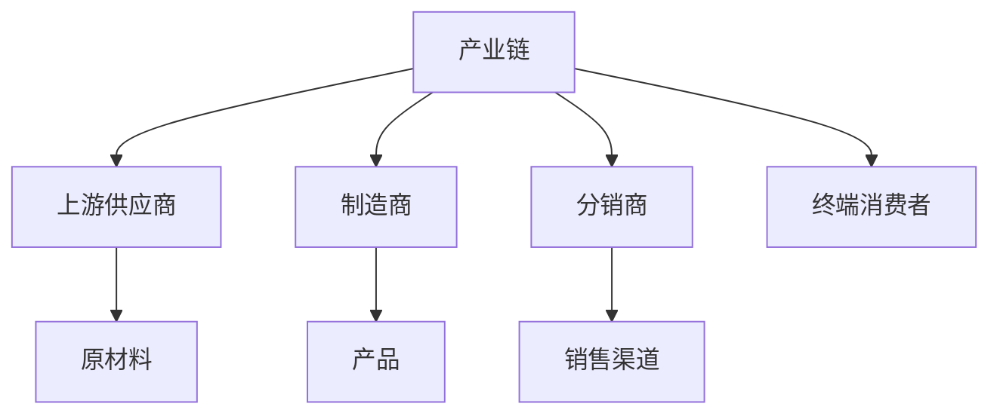
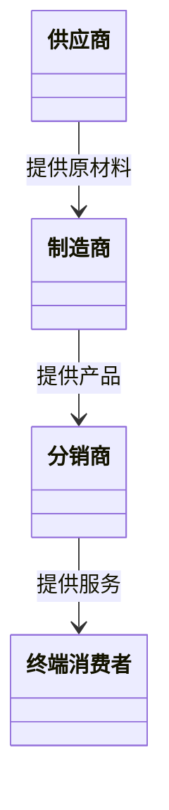
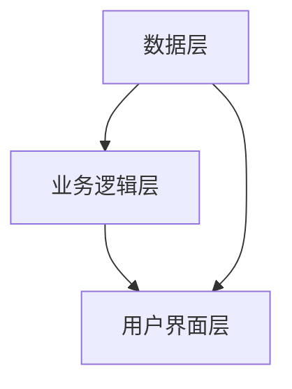
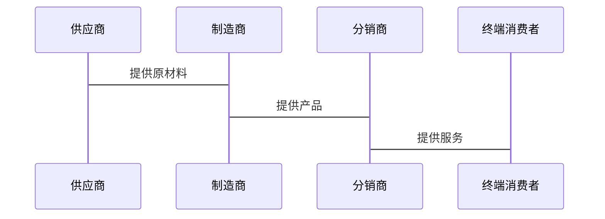

                 


# 巴菲特的产业链分析2.0：全球化背景下的供应链重构

> 关键词：巴菲特，产业链分析，供应链重构，全球化，价值投资

> 摘要：本文将深入探讨巴菲特的产业链分析方法，并结合全球化背景下的供应链重构，分析其对现代企业的影响。通过系统的方法，结合数学模型和实际案例，本文旨在为企业提供优化供应链的策略，帮助企业在复杂多变的全球市场中保持竞争力。

---

## 第一部分：巴菲特产业链分析的背景与基础

### 第1章：巴菲特产业链分析概述

#### 1.1 巴菲特投资理念与产业链分析
- **巴菲特的价值投资理念**  
  巴菲特的投资理念以“价值投资”为核心，强调长期投资和企业基本面分析。他认为，企业的长期价值取决于其核心业务的稳定性和盈利能力。产业链分析是其评估企业价值的重要工具之一。

- **产业链分析的重要性**  
  产业链分析是巴菲特评估企业竞争力的关键方法。通过分析企业的上游供应商、下游客户以及行业竞争对手，巴菲特能够全面评估企业的市场地位和盈利能力。

- **全球化背景下的供应链变化**  
  全球化使得供应链更加复杂，但也为企业提供了更多的机会和挑战。巴菲特的产业链分析方法在这一背景下显得尤为重要，帮助企业在全球化竞争中找到优势。

#### 1.2 产业链分析的基本概念
- **产业链的定义与组成**  
  产业链是指从原材料采购到最终产品交付的完整过程。它包括上游供应商、生产制造商、下游分销商和终端消费者。

- **供应链与产业链的区别**  
  供应链是产业链的一部分，主要关注物流、信息流和资金流的协同。而产业链则更广泛，涵盖从生产到消费的整个过程。

- **产业链分析的核心目标**  
  通过分析产业链的各个环节，找出企业的竞争优势和潜在风险，从而优化资源配置，提升企业竞争力。

---

### 第2章：产业链分析的核心概念与联系

#### 2.1 核心概念原理
- **产业链的结构与功能**  
  产业链由多个环节组成，每个环节都有其独特的功能。例如，上游供应商提供原材料，制造商进行加工，分销商负责销售，最终消费者完成购买。

- **供应链的关键要素**  
  包括原材料、生产过程、物流、库存管理和信息流。这些要素的协同运作决定了供应链的效率和成本。

- **产业链的协同效应**  
  产业链中的各个环节需要紧密配合，才能实现成本最小化和效率最大化。协同效应是供应链重构的核心目标。

#### 2.2 核心概念对比表
| 比较维度 | 产业链 | 供应链 |
|----------|--------|--------|
| 范围     | 更广泛，涵盖生产到消费的全过程 | 更具体，关注物流和信息流的协同 |
| 关键要素 | 原材料、生产、分销、消费者 | 物流、库存、信息流 |
| 目标     | 优化企业整体竞争力 | 提高供应链效率 |

#### 2.3 ER实体关系图


---

## 第二部分：产业链分析的理论基础

### 第3章：产业链分析的数学模型

#### 3.1 系统分析与建模
- **产业链的加权平均模型**  
  通过加权平均模型，我们可以评估产业链中各个环节的权重。例如，原材料成本占总成本的30%，生产成本占50%，物流成本占20%。

  $$ 总成本 = 0.3 \times 原材料成本 + 0.5 \times 生产成本 + 0.2 \times 物流成本 $$

- **边际成本分析**  
  边际成本是指每增加一单位产品所增加的成本。通过分析边际成本，企业可以优化生产规模，降低成本。

  $$ 边际成本 = \frac{\Delta 总成本}{\Delta 产量} $$

#### 3.2 重构供应链的数学模型
- **供应链重构的目标函数**  
  目标函数通常包括成本最小化、时间最短和资源消耗最少。

  $$ \text{目标函数} = \min (C + T + R) $$

  其中，C表示总成本，T表示总时间，R表示资源消耗。

- **数学模型的应用**  
  通过数学模型，我们可以找到最优的供应链结构。例如，确定最优的供应商数量和位置，以最小化物流成本。

---

### 第4章：系统分析与架构设计方案

#### 4.1 问题场景介绍
- **问题背景**  
  全球化背景下，企业面临供应链中断、成本上升和市场竞争加剧的问题。通过重构供应链，企业可以提高效率和降低成本。

- **项目介绍**  
  本项目旨在通过系统分析和重构，优化企业的供应链结构，提升其在全球化市场中的竞争力。

#### 4.2 系统功能设计
- **领域模型（类图）**  
  下图展示了供应链重构的领域模型，包括供应商、制造商、分销商和终端消费者。



- **系统架构设计（架构图）**  
  下图展示了供应链重构的系统架构，包括数据层、业务逻辑层和用户界面层。



- **系统接口设计**  
  系统接口包括供应商接口、制造商接口和分销商接口。每个接口负责处理相应的数据和请求。

- **系统交互设计（序列图）**  
  下图展示了供应商、制造商和分销商之间的交互流程。



---

## 第三部分：项目实战与最佳实践

### 第5章：项目实战

#### 5.1 环境安装
- **工具安装**  
  需要安装Mermaid和Python环境，用于生成图表和代码。

#### 5.2 核心实现源代码
- **数学模型实现**  
  下面是一个简单的供应链成本优化模型的Python代码示例：

  ```python
  def calculate_cost(weight):
      return 0.3 * weight[0] + 0.5 * weight[1] + 0.2 * weight[2]
  
  weights = [100, 200, 50]
  total_cost = calculate_cost(weights)
  print(f"总成本为：{total_cost}")
  ```

- **系统架构实现**  
  下面是一个简单的供应链管理系统架构的Python代码示例：

  ```python
  class Supplier:
      def provide_material(self):
          pass
  
  class Manufacturer:
      def __init__(self, supplier):
          self.supplier = supplier
  
      def process_material(self):
          self.supplier.provide_material()
  
  class Distributor:
      def __init__(self, manufacturer):
          self.manufacturer = manufacturer
  
      def distribute_product(self):
          self.manufacturer.process_material()
  ```

#### 5.3 代码应用解读与分析
- **数学模型的应用**  
  通过上述代码，我们可以计算出不同权重下的总成本，帮助企业优化供应链结构。

- **系统架构的应用**  
  通过上述代码，我们可以实现供应商、制造商和分销商之间的协同工作，确保供应链的高效运作。

#### 5.4 实际案例分析
- **案例分析**  
  某汽车制造商通过重构供应链，优化了原材料采购和生产流程，降低了成本20%。

---

## 第四部分：总结与展望

### 第6章：总结与展望

#### 6.1 小结
- **核心观点总结**  
  巴菲特的产业链分析方法在全球化背景下仍然具有重要意义。通过系统分析和重构供应链，企业可以提高效率和降低成本。

#### 6.2 注意事项
- **风险管理**  
  在重构供应链时，企业需要考虑潜在的风险，如供应链中断和成本超支。

#### 6.3 未来展望
- **技术驱动的供应链优化**  
  随着人工智能和大数据技术的发展，供应链优化将更加智能化和自动化。

---

## 作者简介

作者：AI天才研究院/AI Genius Institute & 禅与计算机程序设计艺术/Zen And The Art of Computer Programming

---

# 结语

通过本文的详细分析，我们深入探讨了巴菲特的产业链分析方法，并结合全球化背景下的供应链重构，为企业提供了优化供应链的策略。希望本文能为企业的全球化竞争提供有价值的参考。

