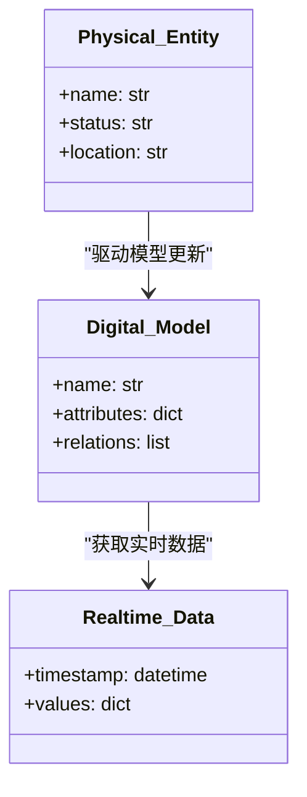

                 


# 巴菲特的产业链分析4.0：数字孪生技术在供应链中的应用

## 关键词：数字孪生技术、供应链管理、巴菲特投资理念、算法优化、系统架构设计、实时数据分析

## 摘要：  
本文探讨了数字孪生技术如何 revolutionize 巴菲特的产业链分析方法，特别是在供应链管理中的应用。通过详细分析数字孪生技术的核心概念、算法原理、系统架构设计以及实际案例，本文展示了如何利用数字孪生技术实现供应链的可视化、预测和优化，从而提升投资决策的精准性和效率。文章还结合了巴菲特的投资理念，探讨了数字孪生技术如何帮助投资者更好地理解和评估企业的价值，为投资决策提供更强大的数据支持。

---

# 第一部分：数字孪生技术与供应链管理

## 第1章：数字孪生技术的定义与背景

### 1.1 数字孪生技术的定义与核心概念

#### 1.1.1 数字孪生技术的定义  
数字孪生（Digital Twin）是一种通过物理实体、数字模型和实时数据的结合，实现对物理世界进行实时仿真、预测和优化的技术。它利用物联网（IoT）、大数据和人工智能（AI）等技术，构建一个动态的数字化镜像，以反映物理实体的状态、行为和属性。

#### 1.1.2 数字孪生技术的核心要素  
数字孪生技术的核心要素包括：  
1. **物理实体**：供应链中的各个节点，如供应商、制造商、物流节点等。  
2. **数字模型**：基于物理实体构建的数字化模型，包括结构、行为和关系。  
3. **实时数据**：通过传感器、物联网设备等采集的实时数据，用于驱动数字模型的动态更新。  

#### 1.1.3 数字孪生与供应链管理的结合  
供应链管理的核心目标是优化资源分配、降低运营成本和提升客户满意度。数字孪生技术通过实时数据和动态仿真，能够帮助企业在供应链的各个环节中做出更明智的决策。

---

## 第2章：数字孪生技术的核心概念与原理

### 2.1 数字孪生技术的实现原理

#### 2.1.1 实现流程  
1. **数据采集**：通过传感器、IoT设备等采集物理实体的实时数据。  
2. **模型构建**：基于历史数据和实时数据，构建数字模型。  
3. **实时仿真**：利用数字模型进行实时仿真，预测供应链的未来状态。  
4. **优化与反馈**：通过仿真结果优化供应链的运营，并将优化结果反馈到物理实体中。  

#### 2.1.2 数字孪生系统的架构  
数字孪生系统的架构通常包括以下三层：  
1. **数据层**：负责数据的采集、存储和管理。  
2. **模型层**：负责构建和维护数字模型，进行数据的分析和处理。  
3. **服务层**：提供基于数字模型的仿真、预测和优化服务。  

#### 2.1.3 关键技术  
- **物联网（IoT）**：实现物理实体与数字模型之间的实时数据传输。  
- **大数据技术**：处理和分析海量数据，支持模型的构建和优化。  
- **人工智能（AI）**：通过机器学习算法，提升模型的预测精度和优化效果。  

---

## 第3章：数字孪生技术在供应链中的应用

### 3.1 供应链管理的核心挑战

#### 3.1.1 信息孤岛问题  
供应链涉及多个环节和参与者，传统的供应链管理往往存在信息孤岛，导致决策滞后和效率低下。  

#### 3.1.2 预测准确性问题  
传统的供应链预测方法依赖于历史数据和经验判断，难以应对市场波动和突发事件。  

#### 3.1.3 运营成本问题  
供应链的复杂性导致运营成本居高不下，如何通过技术手段降低成本是企业关注的重点。  

---

### 3.2 数字孪生技术在供应链中的具体应用

#### 3.2.1 供应链可视化  
数字孪生技术可以通过3D模型和实时数据，将供应链的各个环节可视化，帮助企业更好地监控和管理供应链的状态。  

#### 3.2.2 供应链预测  
通过数字孪生技术，企业可以基于实时数据和历史数据，构建预测模型，预测供应链的未来状态，如库存需求、物流延迟等。  

#### 3.2.3 供应链优化  
数字孪生技术可以通过仿真和优化算法，找到最优的供应链运营方案，例如最优的库存策略、物流路径和生产计划。  

#### 3.2.4 供应链风险防控  
数字孪生技术可以通过仿真和预测，帮助企业识别潜在风险，并制定应急方案，降低供应链中断的风险。  

---

## 第4章：数字孪生技术与巴菲特投资理念的结合

### 4.1 巴菲特投资理念的核心思想

#### 4.1.1 价值投资  
巴菲特的价值投资理念强调通过深入分析企业的基本面，找到具有持续竞争优势和良好管理的公司。  

#### 4.1.2 企业竞争优势  
巴菲特认为，企业的竞争优势是决定其长期价值的关键因素，例如成本优势、品牌优势、技术优势等。  

#### 4.1.3 产业链分析  
巴菲特的产业链分析方法强调从产业链的角度，分析企业的上游、中游和下游，评估其在产业链中的地位和竞争力。  

---

### 4.2 数字孪生技术如何提升产业链分析的深度

#### 4.2.1 通过数字孪生技术实现产业链的动态仿真  
数字孪生技术可以构建一个动态的数字化产业链模型，帮助企业更好地理解产业链的运作机制和潜在风险。  

#### 4.2.2 通过实时数据分析优化投资决策  
数字孪生技术可以通过实时数据分析，帮助企业更准确地评估企业的竞争优势和潜在风险，从而优化投资决策。  

#### 4.2.3 通过预测模型提升投资判断的准确性  
数字孪生技术可以通过构建预测模型，预测产业链的未来趋势，帮助巴菲特等投资者做出更准确的投资判断。  

---

## 第5章：数字孪生技术的算法原理与实现

### 5.1 数字孪生技术的算法原理

#### 5.1.1 数据采集与预处理  
- 数据采集：通过传感器、IoT设备等采集物理实体的实时数据。  
- 数据预处理：对采集到的数据进行清洗、归一化和特征提取。  

#### 5.1.2 数字模型的构建  
- 基于历史数据和实时数据，构建数字模型。  
- 使用机器学习算法（如线性回归、随机森林等）进行模型训练。  

#### 5.1.3 实时仿真与预测  
- 利用数字模型进行实时仿真，预测供应链的未来状态。  
- 使用优化算法（如遗传算法、模拟退火等）进行供应链优化。  

---

### 5.2 数字孪生技术的代码实现

#### 5.2.1 环境安装  
- Python 3.8+  
- NumPy、Pandas、Matplotlib  
- Scikit-learn、XGBoost  

#### 5.2.2 核心代码实现  

```python
import numpy as np
import pandas as pd
from sklearn.linear_model import LinearRegression
from sklearn.metrics import mean_squared_error

# 示例数据：供应链库存预测
data = pd.DataFrame({
    'month': [1, 2, 3, 4, 5, 6],
    'demand': [100, 120, 110, 130, 140, 150]
})

# 训练线性回归模型
model = LinearRegression()
model.fit(data[['month']], data['demand'])

# 预测未来需求
future_month = np.array([[7], [8]])
predicted_demand = model.predict(future_month)

print(f"预测需求：{predicted_demand}")
print(f"均方误差：{mean_squared_error([160, 170], predicted_demand)}")
```

#### 5.2.3 代码解读与优化  
- 代码通过线性回归模型，基于历史需求数据，预测未来的需求。  
- 使用均方误差（MSE）评估模型的预测精度，并通过优化算法（如随机森林）进一步提升预测准确性。  

---

## 第6章：数字孪生技术的系统架构设计

### 6.1 系统功能设计

#### 6.1.1 领域模型设计  


#### 6.1.2 系统架构设计  


---

## 第7章：项目实战与案例分析

### 7.1 项目环境与核心代码实现

#### 7.1.1 环境安装  
- Python 3.8+  
- Jupyter Notebook  
- TensorFlow、Keras  

#### 7.1.2 核心代码实现  

```python
import tensorflow as tf
from tensorflow.keras import layers

# 示例项目：供应链需求预测
model = tf.keras.Sequential([
    layers.Dense(64, activation='relu', input_shape=(n_features,)),
    layers.Dense(1)
])

model.compile(optimizer='adam', loss='mean_squared_error')
model.fit(X_train, y_train, epochs=100, batch_size=32)
```

---

## 第8章：总结与展望

### 8.1 总结  
数字孪生技术通过实时数据和动态仿真，显著提升了供应链管理的效率和准确性。结合巴菲特的投资理念，数字孪生技术为投资者提供了更强大的工具，帮助他们在复杂的市场环境中做出更明智的投资决策。

### 8.2 展望  
随着人工智能和物联网技术的进一步发展，数字孪生技术在供应链管理中的应用将更加广泛和深入。未来，数字孪生技术将与区块链、5G等新兴技术结合，推动供应链管理进入一个新的智能化时代。

---

## 作者：AI天才研究院/AI Genius Institute & 禅与计算机程序设计艺术 /Zen And The Art of Computer Programming

