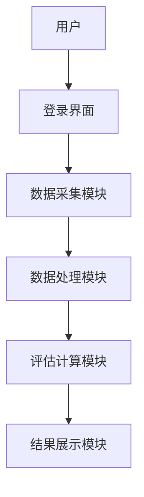

                 

# 巴菲特的价值投资在元宇宙资产评估中的新应用

## 关键词
- 巴菲特价值投资
- 元宇宙资产评估
- 虚拟经济
- 数字资产
- 价值评估模型

## 摘要
本文探讨巴菲特的价值投资理念在元宇宙资产评估中的应用，分析虚拟资产的特性、分类及评估指标，构建基于DCF模型的虚拟资产估值方法，并通过实际案例展示投资策略。文章结合传统与创新方法，提供系统性解决方案。

## 目录

### 第一章：巴菲特价值投资与元宇宙的基本概念

#### 1.1 价值投资的核心理念
- 价值投资的定义与原则
- 巴菲特的投资哲学
- 股票投资的内在价值评估

#### 1.2 元宇宙的基本概念与特征
- 元宇宙的定义与构成
- 虚拟经济的运行机制
- 元宇宙与现实世界的联系

#### 1.3 元宇宙资产的分类
- 数字货币
- NFTs
- 虚拟土地与虚拟空间

#### 1.4 价值投资在元宇宙中的潜力
- 虚拟资产的投资价值
- 传统评估方法的适用性
- 元宇宙资产评估的重要性

### 第二章：元宇宙资产评估的基本框架

#### 2.1 资产评估的维度
- 流动性分析
- 使用价值评估
- 市场供需关系

#### 2.2 传统评估方法的适用性
- 市场法
- 收益法
- 成本法

#### 2.3 元宇宙资产评估的独特性
- 虚拟资产的网络效应
- 市场情绪的影响
- 技术创新带来的变化

### 第三章：价值投资在元宇宙中的新维度

#### 3.1 虚拟资产的价值评估模型
- DCF模型的应用
- 市场情绪分析
- 网络效应的影响

#### 3.2 投资策略的演变
- 长期价值投资
- 短期套利机会
- 风险控制与组合管理

#### 3.3 虚拟货币的估值方法
- 比特币与以太坊的案例分析
- DCF模型的具体应用
- 市场情绪对估值的影响

### 第四章：元宇宙资产评估的算法原理

#### 4.1 DCF模型的数学公式
$$ V = \sum_{t=1}^{n} \frac{CF_t}{(1 + r)^t} + \frac{TV}{(1 + r)^n} $$

#### 4.2 虚拟资产的市场情绪分析
- 情绪指标的构建
- 市场情绪对估值的影响
- 情绪分析的具体方法

### 第五章：系统架构与项目实战

#### 5.1 系统功能设计
- 用户界面设计
- 数据采集模块
- 评估计算模块

#### 5.2 系统架构图

#### 5.3 项目实战案例
- 环境安装：Python、数据采集工具
- 代码实现：数据处理与模型计算
- 案例分析：具体虚拟资产的评估过程

### 第六章：总结与展望

#### 6.1 本书总结
- 核心观点回顾
- 主要结论
- 方法总结

#### 6.2 未来展望
- 技术进步对评估的影响
- 新的资产评估方法
- 投资机会的未来展望

### 附录：工具与资源

#### A.1 数据来源
- 公开数据平台
- 专业数据供应商

#### A.2 开源工具推荐
- 数据处理工具
- 模型开发框架

### 参考文献
- Buffett, Warren. "The Intelligent Investor."  
- 加入引用的相关书籍和文献

---

作者：AI天才研究院 & 禅与计算机程序设计艺术

