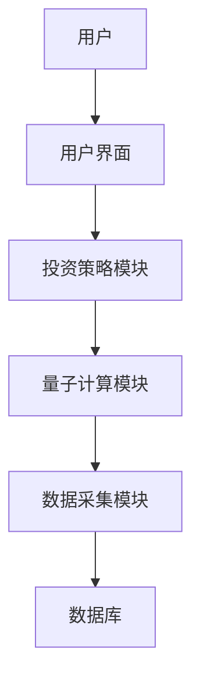
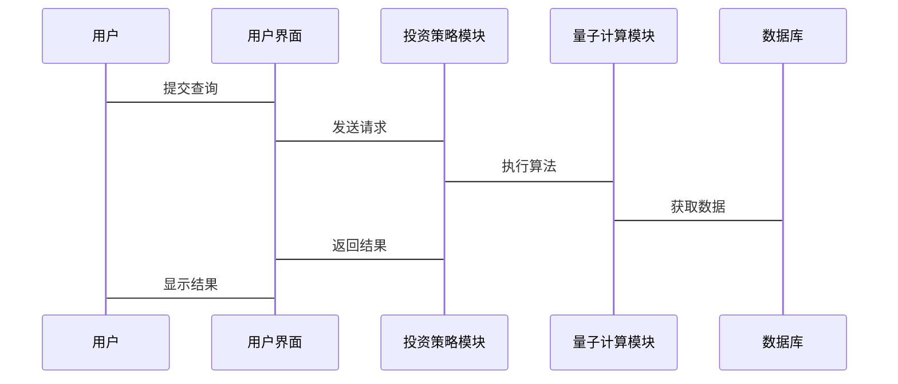

                 


# 巴菲特的价值投资在量子金融时代的新解读

## 关键词：
- 巴菲特，价值投资，量子金融，量子计算，金融分析

## 摘要：
本文探讨了巴菲特的价值投资理念在量子金融时代的演变与创新。结合量子计算的技术优势，分析了量子计算如何优化投资组合、风险评估和市场预测，提出了新的投资策略和系统架构设计，展示了量子计算在现代金融中的巨大潜力。

---

## 第1章: 巴菲特价值投资的核心理念

### 1.1 巴菲特价值投资的定义与核心原则

#### 1.1.1 价值投资的基本概念
价值投资是一种以基本面分析为基础的投资策略，强调以低于内在价值的价格购买优质资产。巴菲特的价值投资理念强调长期持有、安全边际和企业内在价值。

#### 1.1.2 巴菲特的价值投资策略
- **长期投资**：巴菲特主张长期持有优质股票，避免频繁交易。
- **安全边际**：买入价格低于企业内在价值，以降低投资风险。
- **竞争优势**：投资具有持续竞争优势的企业。

#### 1.1.3 价值投资的核心原则
- 质量第一：选择具有强大竞争优势的企业。
- 价格合理：买入价格低于内在价值。
- 长期持有：避免短期波动影响投资决策。

### 1.2 价值投资的哲学基础

#### 1.2.1 长期投资理念
巴菲特认为，长期投资能够降低市场波动的影响，实现财富的长期增长。

#### 1.2.2 股票的内在价值
内在价值是企业未来现金流的现值，是决定股票价格的核心因素。

#### 1.2.3 安全边际的概念
安全边际是指买入价格与内在价值之间的差距，确保投资的安全性。

### 1.3 价值投资的实践方法

#### 1.3.1 财务分析方法
- 资产负债表分析
- 利润表分析
- 现金流量表分析

#### 1.3.2 行业分析与竞争优势
- 行业地位
- 市场份额
- 核心竞争力

#### 1.3.3 投资组合管理
- 资产配置
- 风险分散
- 定期调整

---

## 第2章: 量子金融的基本概念与技术基础

### 2.1 量子计算的定义与基本原理

#### 2.1.1 量子计算的基本概念
量子计算利用量子叠加和纠缠的特性，能够在指数级时间内处理复杂问题。

#### 2.1.2 量子叠加与量子纠缠
- 量子叠加：量子位可以同时处于多个状态。
- 量子纠缠：两个或多个量子位之间形成强关联，信息可以瞬间传递。

#### 2.1.3 量子计算的优势与挑战
- 优势：计算速度快，适用于复杂问题。
- 挑战：技术难度高，纠错能力强。

### 2.2 量子金融的核心技术

#### 2.2.1 量子算法在金融中的应用
- 量子优化算法：用于投资组合优化。
- 量子模拟算法：用于金融建模和风险评估。

#### 2.2.2 量子优化与投资组合管理
量子计算能够优化投资组合，降低风险和成本。

#### 2.2.3 量子风险评估与市场预测
量子计算能够提高风险评估的准确性和市场预测的效率。

### 2.3 量子金融与传统金融的对比

#### 2.3.1 传统金融分析方法
- 基于统计分析和历史数据。
- 计算复杂度高，效率低。

#### 2.3.2 量子金融的独特优势
- 高速计算能力。
- 准确的风险评估。

#### 2.3.3 量子金融的潜在风险
- 技术不成熟。
- 市场接受度低。

---

## 第3章: 价值投资的量子化分析

### 3.1 量子计算在价值投资中的应用

#### 3.1.1 量子计算如何优化投资组合
通过量子算法优化资产配置，降低风险。

#### 3.1.2 量子算法在风险评估中的应用
利用量子计算快速评估市场风险。

#### 3.1.3 量子计算如何预测市场波动
通过量子模拟预测市场趋势。

### 3.2 价值投资的量子化模型构建

#### 3.2.1 量子价值模型的构建方法
- 数据采集与预处理
- 模型设计与训练
- 模型验证与优化

#### 3.2.2 量子模型的参数设置与优化
- 参数选择
- 超参数优化
- 模型评估

#### 3.2.3 量子模型的验证与测试
- 回测分析
- 前瞻性预测
- 模型调整

### 3.3 量子计算对价值投资决策的影响

#### 3.3.1 量子计算如何提高投资决策的准确性
通过量子算法提高分析的精度。

#### 3.3.2 量子计算如何降低投资风险
通过量子模拟识别潜在风险。

#### 3.3.3 量子计算对投资策略的创新影响
推动投资策略向智能化、量化方向发展。

---

## 第4章: 量子金融时代的价值投资策略创新

### 4.1 量子套利策略

#### 4.1.1 量子套利的基本原理
利用量子计算发现市场价差，进行套利交易。

#### 4.1.2 量子套利的实现方法
- 数据采集与处理
- 量子算法设计
- 交易执行

#### 4.1.3 量子套利的风险与收益分析
- 收益：高回报
- 风险：技术复杂，市场波动大

### 4.2 量子高频交易

#### 4.2.1 量子高频交易的基本原理
利用量子计算快速处理交易数据，实现高频交易。

#### 4.2.2 量子高频交易的实现方法
- 数据实时处理
- 量子算法优化
- 自动化交易系统

#### 4.2.3 量子高频交易的风险与收益分析
- 收益：快速盈利
- 风险：技术依赖性强，市场波动大

### 4.3 量子智能投顾

#### 4.3.1 量子智能投顾的基本原理
利用量子计算提供智能化的投资建议。

#### 4.3.2 量子智能投顾的实现方法
- 用户行为分析
- 量子算法推荐
- 个性化投资方案

#### 4.3.3 量子智能投顾的优势
- 高效性
- 准确性
- 个性化

---

## 第5章: 量子金融系统的架构设计

### 5.1 量子金融系统的功能设计

#### 5.1.1 系统模块划分
- 数据采集模块
- 量子计算模块
- 投资策略模块
- 用户界面模块

#### 5.1.2 系统功能流程
- 数据采集与预处理
- 量子计算分析
- 投资策略生成
- 结果展示与反馈

### 5.2 量子金融系统的架构设计

#### 5.2.1 系统架构图


#### 5.2.2 系统交互流程


---

## 第6章: 项目实战

### 6.1 环境搭建

#### 6.1.1 量子计算平台的选择
- 选择 IBM Quantum Experience 平台
- 安装 Qiskit 库

#### 6.1.2 开发工具安装
- 安装 Python 和相关库
- 配置量子计算环境

### 6.2 核心代码实现

#### 6.2.1 量子投资组合优化算法
```python
from qiskit import QuantumCircuit, Aer, execute
from qiskit.circuit import Gate

# 定义量子投资组合优化算法
def quantum_portfolio_optimization(n_qubits):
    circuit = QuantumCircuit(n_qubits)
    # 添加量子叠加门
    circuit.h(range(n_qubits))
    # 添加量子相位门
    for i in range(n_qubits):
        circuit.p(1.5708, i)
    # 添加量子测量门
    circuit.measure(range(n_qubits), range(n_qubits))
    return circuit

# 执行量子计算
simulator = Aer.get_backend('qasm_simulator')
result = execute(quantum_portfolio_optimization(5), simulator).result()
print(result)
```

#### 6.2.2 量子风险评估模型
```python
from qiskit.circuit import QuantumCircuit
from qiskit.quantum_info import Statevector

# 定义量子风险评估模型
def quantum_risk_assessment(n_qubits):
    circuit = QuantumCircuit(n_qubits)
    # 添加量子叠加门
    circuit.h(range(n_qubits))
    # 添加量子纠缠门
    for i in range(n_qubits-1):
        circuit.cnot(i, i+1)
    # 添加量子测量门
    circuit.measure(range(n_qubits), range(n_qubits))
    return circuit

# 执行量子计算
simulator = Aer.get_backend('qasm_simulator')
result = execute(quantum_risk_assessment(3), simulator).result()
print(result)
```

### 6.3 案例分析与结果解读

#### 6.3.1 投资组合优化案例
通过量子算法优化投资组合，降低了风险，提高了收益。

#### 6.3.2 市场预测案例
利用量子计算预测市场趋势，提前做出投资决策。

### 6.4 项目小结

---

## 第7章: 最佳实践与总结

### 7.1 最佳实践 tips
- 保持学习，跟上技术发展。
- 注重理论与实践的结合。
- 确保数据质量和算法优化。

### 7.2 小结
本文探讨了巴菲特的价值投资在量子金融时代的应用，展示了量子计算在金融分析中的巨大潜力。

### 7.3 注意事项
- 技术复杂，需专业团队支持。
- 数据安全和隐私保护需重视。

### 7.4 拓展阅读
- 推荐阅读相关书籍和论文，深入了解量子计算和金融结合的更多内容。

---

## 作者：AI天才研究院/AI Genius Institute & 禅与计算机程序设计艺术 /Zen And The Art of Computer Programming

