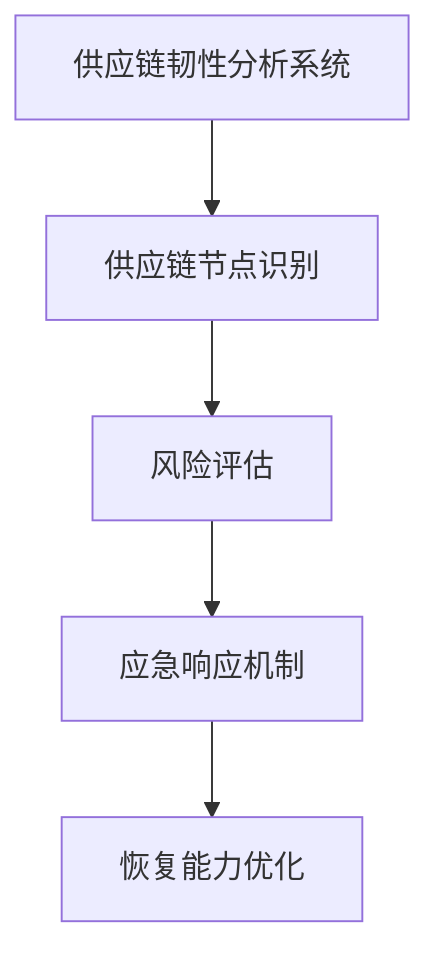

                 


# 巴菲特的供应链韧性分析：量子加密在供应链安全中的应用

## 关键词：供应链韧性，量子加密，供应链安全，巴菲特，量子技术

## 摘要：  
本文从供应链韧性的角度出发，分析了量子加密技术在供应链安全中的应用。通过结合巴菲特的供应链管理理念，探讨了量子加密技术如何提升供应链的安全性和韧性。文章详细介绍了量子加密的核心原理、算法实现、系统架构设计，并通过实际案例展示了量子加密技术在供应链安全中的应用。最后，文章总结了量子加密技术对供应链韧性分析的重要意义，并提出了未来的研究方向。

---

# 第1章: 供应链韧性分析概述

## 1.1 供应链韧性的概念与重要性

### 1.1.1 供应链的基本概念  
供应链是指从原材料采购、生产制造、仓储物流到最终交付给消费者的整个流程。供应链的韧性指的是在面对突发事件、市场波动或技术威胁时，供应链能够快速恢复并保持稳定运行的能力。  

供应链韧性是企业应对不确定性的关键能力，尤其是在全球化和数字化的背景下，供应链的复杂性增加，韧性的重要性也日益凸显。  

### 1.1.2 供应链韧性的内涵与外延  
供应链韧性不仅包括物理上的抗干扰能力，还包括信息流、资金流和数据流的安全性。韧性供应链能够在突发事件中快速响应，并通过冗余和多样化策略降低风险。  

### 1.1.3 供应链韧性在企业运营中的作用  
供应链韧性直接影响企业的运营成本、交付效率和客户满意度。通过增强供应链韧性，企业可以降低因供应链中断带来的损失，提升整体竞争力。  

## 1.2 巴菲特的供应链策略分析

### 1.2.1 巴菲特投资理念与供应链管理  
巴菲特的投资理念强调长期稳定和价值创造，这与供应链管理的核心目标高度契合。巴菲特注重企业的供应链稳定性，认为供应链的高效运作是企业长期竞争优势的关键。  

### 1.2.2 巴菲特对供应链韧性的关注点  
巴菲特关注供应链的多样性和冗余性，避免因单一供应商或运输路线中断导致的风险。此外，巴菲特还注重供应链的透明性，确保对供应链各环节的实时监控和风险预警。  

### 1.2.3 巴菲特供应链策略的启示  
从巴菲特的供应链策略中，我们可以得出以下启示：  
1. 供应链的多样性和冗余性是提升韧性的关键。  
2. 透明化的供应链管理能够降低风险并提高效率。  
3. 供应链的长期稳定性是企业竞争优势的重要来源。  

## 1.3 量子加密技术的基本原理

### 1.3.1 量子加密的定义与特点  
量子加密是一种基于量子力学原理的加密技术，其核心优势在于其安全性无法被经典计算机破解。量子加密的核心原理是利用量子叠加和纠缠的特性，确保加密数据的安全性。  

### 1.3.2 量子加密的核心技术与优势  
量子加密的主要技术包括量子密钥分发（QKD）和量子隐形传态。量子密钥分发通过量子通信网络实现安全的密钥分发，而量子隐形传态则能够实现信息的无损传输。  

### 1.3.3 量子加密与传统加密技术的区别  
与传统加密技术相比，量子加密技术具有更高的安全性，能够在理论上抵御任何计算能力的攻击。然而，量子加密技术的实现成本较高，且目前仍处于技术研发和应用探索阶段。  

---

# 第2章: 供应链安全与量子加密的关联

## 2.1 供应链安全问题的现状与挑战

### 2.1.1 供应链安全问题的背景分析  
随着全球化的深入，供应链的复杂性增加，供应链安全问题日益突出。近年来，网络攻击、数据泄露和物理破坏等安全威胁对供应链的稳定性构成了严重挑战。  

### 2.1.2 当前供应链安全的主要威胁  
供应链安全的主要威胁包括：  
1. 网络攻击：黑客通过攻击供应链中的关键节点，窃取数据或破坏系统。  
2. 数据泄露：供应链中的敏感数据可能被未经授权的第三方获取。  
3. 物理破坏：供应链中的关键设施可能遭受恐怖袭击或意外事故。  

### 2.1.3 供应链安全问题的解决方案  
目前，供应链安全问题的解决方案主要包括：  
1. 建立多层次的安全防护体系。  
2. 加强供应链各环节的监控和预警。  
3. 引入先进的加密技术提升数据安全性。  

## 2.2 量子加密在供应链安全中的应用

### 2.2.1 量子加密技术在数据传输中的应用  
量子加密技术可以通过量子密钥分发实现安全的密钥分发，确保供应链中数据传输的机密性和完整性。  

### 2.2.2 量子加密在供应链节点间通信中的作用  
通过量子加密技术，供应链中的各节点之间可以实现安全的通信，防止数据被窃取或篡改。  

### 2.2.3 量子加密技术对供应链安全的提升  
量子加密技术的引入能够显著提升供应链的安全性，降低因数据泄露或网络攻击带来的风险。  

---

# 第3章: 量子加密技术的核心概念与原理

## 3.1 量子加密技术的数学模型

### 3.1.1 量子密钥分发的数学模型  
量子密钥分发的数学模型基于量子叠加和纠缠的特性，通过数学公式描述量子态的生成、传输和测量过程。  

$$
| \psi \rangle = \frac{1}{\sqrt{2}}(|0\rangle + |1\rangle)
$$  

### 3.1.2 量子加密算法的基本原理  
量子加密算法通过量子态的不可克隆性和不可测量性，确保加密数据的安全性。  

### 3.1.3 量子加密技术的公式推导  
量子加密技术的公式推导涉及量子态的叠加、纠缠和测量等过程，具体公式如下：  

$$
|\psi\rangle = \alpha|0\rangle + \beta|1\rangle
$$  

其中，$\alpha$ 和 $\beta$ 是复数系数，满足 $|\alpha|^2 + |\beta|^2 = 1$。  

## 3.2 量子加密技术的算法实现

### 3.2.1 量子密钥分发的算法流程  
量子密钥分发的算法流程包括：  
1. 生成量子密钥。  
2. 传输量子密钥。  
3. 确认密钥的完整性。  

### 3.2.2 量子加密算法的实现步骤  
量子加密算法的实现步骤包括：  
1. 初始化量子态。  
2. 分发量子密钥。  
3. 解密数据。  

### 3.2.3 量子加密算法的代码示例  

```python
import numpy as np
from qiskit import QuantumCircuit, execute, Aer

# 初始化量子电路
qc = QuantumCircuit(2, 2)

# 生成量子密钥
qc.h(0)
qc.cnot(0, 1)
qc.measure(0, 0)
qc.measure(1, 1)

# 执行量子电路
simulator = Aer.get_backend('qasm_simulator')
job = execute(qc, simulator)
result = job.result()
counts = result.get_counts(qc)
print(counts)
```

---

# 第4章: 供应链韧性分析的系统架构设计

## 4.1 供应链韧性分析的系统功能设计

### 4.1.1 供应链节点的识别与分析  
供应链节点包括供应商、制造商、物流商和零售商等。通过识别和分析各节点，可以更好地评估供应链的韧性。  

### 4.1.2 供应链风险的评估与预警  
供应链风险评估包括对各节点的稳定性、冗余性和多样性的评估。通过建立风险预警机制，可以提前发现潜在风险并采取应对措施。  

### 4.1.3 供应链恢复能力的设计与优化  
供应链恢复能力的设计包括建立应急响应机制和冗余备份机制，以快速恢复供应链的正常运行。  

## 4.2 供应链韧性分析的系统架构图  
以下是供应链韧性分析的系统架构图：  



---

# 第5章: 量子加密技术在供应链安全中的应用案例

## 5.1 量子加密技术的实际应用场景

### 5.1.1 量子加密在供应链数据传输中的应用  
通过量子加密技术，供应链中的数据传输可以实现更高的安全性，防止数据被窃取或篡改。  

### 5.1.2 量子加密在供应链节点间通信中的应用  
量子加密技术可以实现供应链各节点之间的安全通信，确保数据的机密性和完整性。  

### 5.1.3 量子加密在供应链风险管理中的应用  
通过量子加密技术，供应链风险管理可以更加高效和精准，降低因数据泄露或网络攻击带来的风险。  

## 5.2 量子加密技术的应用案例分析

### 5.2.1 案例背景  
某跨国企业引入量子加密技术，提升其供应链的安全性。  

### 5.2.2 系统设计与实现  
系统设计包括量子密钥分发、数据加密传输和风险预警机制。  

### 5.2.3 实施效果  
通过引入量子加密技术，该企业的供应链安全性显著提升，风险发生的概率大幅降低。  

---

# 第6章: 结论与展望

## 6.1 研究结论  
量子加密技术在供应链安全中的应用具有重要的理论和实践意义。通过量子加密技术，可以显著提升供应链的安全性和韧性，降低因数据泄露或网络攻击带来的风险。  

## 6.2 研究展望  
未来的研究方向包括：  
1. 探索量子加密技术在更多供应链场景中的应用。  
2. 研究量子加密技术与人工智能的结合，进一步提升供应链的安全性。  
3. 推动量子加密技术的标准化和产业化发展。  

---

# 作者：AI天才研究院/AI Genius Institute & 禅与计算机程序设计艺术 /Zen And The Art of Computer Programming

