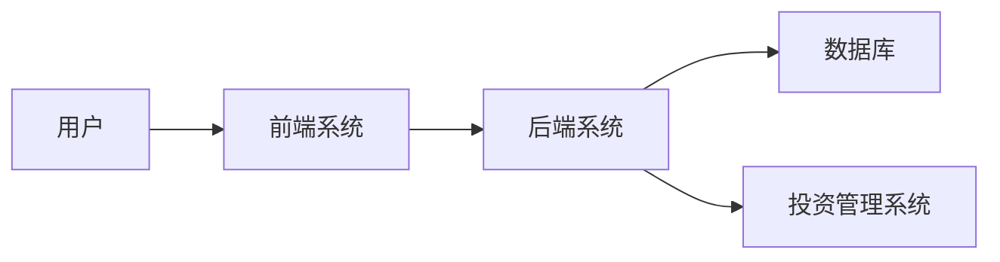
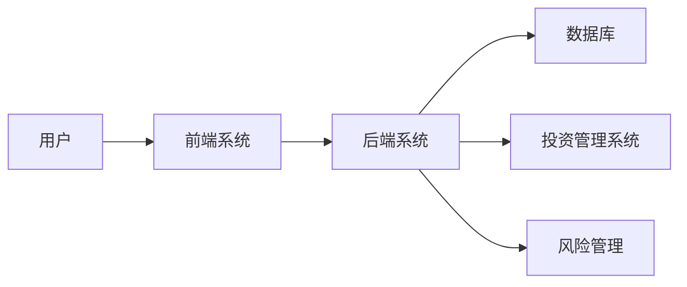

                 


# 巴菲特的保险行业投资逻辑

---

## 关键词：巴菲特，保险行业，投资逻辑，价值投资，财务分析，投资策略

---

## 摘要

本文系统地分析了巴菲特在保险行业的投资逻辑，从其独特的价值投资理念出发，结合保险行业的内在逻辑、财务分析方法、投资策略以及经典案例，深入探讨了巴菲特如何通过长期、稳健的投资策略在保险行业中实现卓越收益。文章结合理论与实践，提供了详细的分析框架和方法论，为读者理解巴菲特的投资智慧提供了全面的视角。

---

## 第1章: 巴菲特投资理念与保险行业的结合

### 1.1 巴菲特的生平与投资哲学

#### 1.1.1 巴菲特的早期经历与投资理念的形成

沃伦·巴菲特（Warren Buffett）是全球最著名的投资者之一，他的投资哲学始于对价值投资的深刻理解。巴菲特的价值投资理念强调购买低于内在价值的资产，并长期持有。这种理念源于他的导师本杰明·格雷厄姆（Benjamin Graham）的教导，即寻找具有安全边际的投资标的。

#### 1.1.2 巴菲特的价值投资理论

巴菲特的价值投资理论的核心是寻找具有强大竞争优势的企业，并以合理的价格买入。他认为，市场的短期波动是不可预测的，但企业的内在价值可以通过基本面分析来评估。这种理论强调长期投资，而非短期交易。

#### 1.1.3 巴菲特对保险行业的独特见解

保险行业是巴菲特投资组合中的重要组成部分。他认为，保险公司是天然的“浮存金”（Float）持有者，这种资金可以以极低的成本用于长期投资。此外，保险公司还具有较强的防御性和稳定性，能够在经济低迷时期提供稳定的收益。

---

### 1.2 保险行业的特点与投资价值

#### 1.2.1 保险行业的定义与分类

保险行业是指通过契约形式，为被保险人提供风险保障的行业。主要分类包括财产保险、人寿保险、健康保险和责任保险等。保险行业的核心是通过分散风险来实现收益。

#### 1.2.2 保险行业的商业模式与财务特征

保险公司的商业模式主要包括保费收入、投资收益和理赔支出。其财务特征包括高杠杆、低资本消耗和长期稳定的现金流。

#### 1.2.3 保险行业在巴菲特投资组合中的地位

在巴菲特的投资组合中，保险行业占据了重要地位。他通过投资保险公司，利用其浮存金进行长期投资，同时享受保险行业的稳定收益。

---

### 1.3 巴菲特保险投资逻辑的核心要素

#### 1.3.1 保险行业的内在价值评估

巴菲特通过分析保险公司的保费收入、投资收益和理赔支出来评估其内在价值。他特别关注保险公司的资本充足率和偿付能力。

#### 1.3.2 保险行业的竞争优势分析

巴菲特寻找具有强大竞争优势的保险公司，例如那些具有强大的品牌影响力、市场份额和成本优势的企业。

#### 1.3.3 保险行业的长期投资价值

巴菲特认为，保险行业的长期投资价值在于其稳定的现金流和长期的增长潜力。他倾向于投资那些具有长期竞争优势的企业。

---

## 第2章: 保险行业的内在逻辑与巴菲特的投资策略

### 2.1 保险行业的核心业务与财务指标

#### 2.1.1 保险产品的基本分类

保险产品可以分为人寿保险、财产保险、健康保险和年金保险等。每种保险产品的风险和收益特征不同。

#### 2.1.2 保险公司的主要财务指标

- **ROE（净资产收益率）**：衡量保险公司盈利能力的重要指标。
- **ROA（资产净利率）**：衡量资产使用效率的指标。
- **保费收入增长率**：衡量保险公司业务增长的速度。

#### 2.1.3 保险行业的周期性与波动性

保险行业具有一定的周期性，受到宏观经济波动的影响。然而，由于保险行业的稳定性和长期性，其波动性相对较低。

---

### 2.2 巴菲特的保险投资标准

#### 2.2.1 寻找具有持续竞争优势的保险公司

巴菲特倾向于投资那些具有强大竞争优势的保险公司，例如那些具有强大的品牌影响力和市场份额的企业。

#### 2.2.2 评估保险公司的财务健康状况

巴菲特通过分析保险公司的财务报表，评估其资本充足率、偿付能力和盈利能力。

#### 2.2.3 保险公司的管理层与治理结构

巴菲特认为，保险公司的管理层质量和治理结构是影响公司长期表现的重要因素。他倾向于投资那些由优秀管理层领导的公司。

---

### 2.3 巴菲特保险投资的长期视角

#### 2.3.1 长期投资与复利效应

巴菲特强调长期投资的重要性，认为复利效应是实现财富增长的关键。

#### 2.3.2 保险行业的防御性与稳定性

保险行业的防御性特征使其在经济低迷时期能够提供稳定的收益。

#### 2.3.3 保险投资的组合管理策略

巴菲特通过分散投资来降低风险，同时集中投资于具有长期竞争优势的企业。

---

## 第3章: 保险企业的财务分析与巴菲特的投资决策

### 3.1 保险企业的财务报表分析

#### 3.1.1 资产负债表的核心指标

- **资产**：包括投资资产、应收保费等。
- **负债**：包括应付保费、理赔负债等。
- **股东权益**：包括资本公积、盈余公积等。

#### 3.1.2 利润表的关键数据

- **营业收入**：包括保费收入和投资收益。
- **净利润**：衡量公司盈利能力的核心指标。

#### 3.1.3 现金流量表的重要性

现金流量表反映了保险公司的现金流状况，包括经营活动、投资活动和筹资活动的现金流。

---

### 3.2 巴菲特的保险投资评估模型

#### 3.2.1 内在价值的计算方法

内在价值是企业未来现金流的现值。巴菲特通过DCF模型来计算内在价值。

$$ V = \frac{CF}{(r - g)} $$

其中，$CF$ 是未来现金流，$r$ 是折现率，$g$ 是增长率。

#### 3.2.2 股东权益与资产质量的评估

巴菲特关注保险公司的资产质量，特别是其投资组合的构成和风险。

#### 3.2.3 保险公司的偿付能力与风险控制

巴菲特通过分析保险公司的偿付能力比率来评估其风险控制能力。

---

### 3.3 巴菲特保险投资的数学模型与公式

#### 3.3.1 内在价值计算公式

$$ V = \sum_{t=1}^{\infty} \frac{CF_t}{(1 + r)^t} $$

其中，$CF_t$ 是第$t$年的现金流，$r$ 是折现率。

#### 3.3.2 市盈率与市净率

市盈率（P/E）= 股价 / 每股收益  
市净率（P/B）= 股价 / 每股净资产

---

## 第4章: 巴菲特保险投资的系统架构与案例分析

### 4.1 保险行业的系统架构

#### 4.1.1 系统功能设计

保险系统的功能包括保费收取、理赔处理、投资管理等。



#### 4.1.2 系统架构设计



---

### 4.2 经典案例分析

#### 4.2.1 巴菲特投资的具体保险公司

巴菲特通过投资美国运通（American Express）和通用再保险公司（General Re）等企业，展示了其保险投资策略的成功。

#### 4.2.2 投资决策的详细分析

通过分析这些案例，我们可以看到巴菲特如何通过基本面分析和长期投资实现收益。

---

## 第5章: 巴菲特保险投资的项目实战

### 5.1 环境安装

#### 5.1.1 安装Python环境

使用Anaconda安装Python环境，并安装必要的库，如Pandas、NumPy等。

### 5.2 系统核心实现源代码

#### 5.2.1 内在价值计算代码

```python
import pandas as pd
import numpy as np

def calculate_intrinsic_value(cash_flows, discount_rate, growth_rate):
    return sum(cash_flows / (1 + discount_rate) ** t for t in range(len(cash_flows)))

cash_flows = [100, 150, 200, 250]
discount_rate = 0.08
growth_rate = 0.05

intrinsic_value = calculate_intrinsic_value(cash_flows, discount_rate, growth_rate)
print(f"内在价值为：{intrinsic_value}")
```

#### 5.2.2 财务指标计算代码

```python
def calculate_roe(net_income, equity):
    return net_income / equity

net_income = 100
equity = 500

roe = calculate_roe(net_income, equity)
print(f"ROE为：{roe}")
```

---

### 5.3 案例分析与代码解读

#### 5.3.1 某保险公司财务数据的分析

通过分析某保险公司的财务数据，计算其ROE、ROA等指标，并评估其内在价值。

#### 5.3.2 代码实现与结果解读

展示如何通过代码计算保险公司的内在价值，并与市场价格进行对比。

---

## 第6章: 小结与展望

### 6.1 小结

本文系统地分析了巴菲特在保险行业的投资逻辑，从其价值投资理念到具体的财务分析方法，再到实际案例分析，为读者提供了全面的视角。

### 6.2 最佳实践 tips

- **长期投资**：巴菲特的成功在于长期投资，而非短期交易。
- **风险管理**：通过分散投资和风险控制来降低风险。
- **深入分析**：通过基本面分析和长期跟踪来选择优质企业。

### 6.3 未来展望

未来，随着保险行业的不断发展，巴菲特的投资逻辑将为企业和投资者提供更多的启示。

---

## 作者：AI天才研究院/AI Genius Institute & 禅与计算机程序设计艺术 /Zen And The Art of Computer Programming

---

通过以上分析，我们全面探讨了巴菲特在保险行业的投资逻辑，从理论到实践，从分析到案例，为读者提供了丰富的视角和实用的工具。

