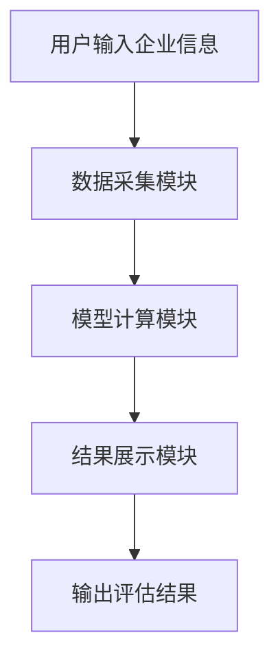
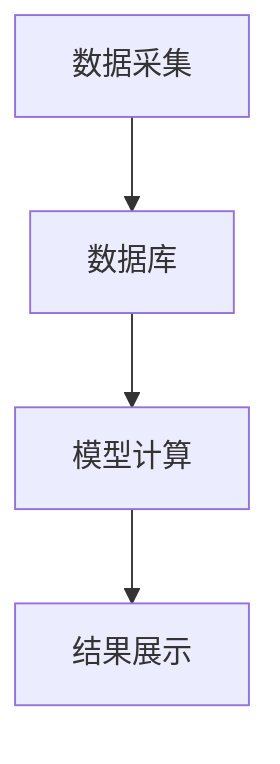
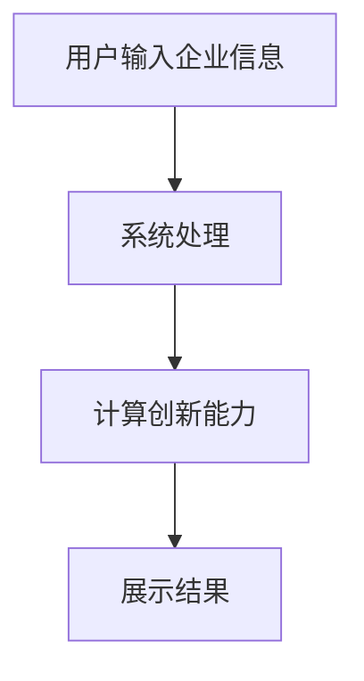

                 


# 巴菲特的创新能力评估：如何判断公司的长期竞争力

## 关键词：创新、巴菲特、企业竞争力、投资、评估方法、长期价值

## 摘要：本文系统地介绍了如何基于巴菲特的投资理念，评估公司的创新能力，构建创新评估框架，分析创新文化、研发投入、管理层素质、市场竞争地位、财务表现等多个维度，结合数学模型和算法，提供了一套完整的评估方法和系统设计方案，帮助投资者和企业管理者更好地判断公司的长期竞争力。

---

# 第一部分: 巴菲特创新能力评估的背景与核心概念

## 第1章: 创新能力评估的重要性

### 1.1 创新能力的定义与内涵

#### 1.1.1 创新能力的定义
创新能力是指企业或组织在市场中不断提出新想法、新产品、新技术或新方法的能力。它是企业在竞争中保持优势的核心竞争力之一。

#### 1.1.2 创新能力的核心要素
创新能力的核心要素包括：
- 创新文化：企业是否鼓励创新，员工是否有创新意识。
- 研发投入：企业在研发上的资金和资源投入。
- 管理层素质：领导层是否具备创新战略眼光。
- 市场竞争地位：企业在市场中的创新表现和竞争对手对比。

#### 1.1.3 创新能力与企业竞争力的关系
创新能力是企业竞争力的关键因素。创新能力强的企业能够更快响应市场变化，推出新产品，满足客户需求，从而在竞争中占据优势。

### 1.2 巴菲特创新能力评估的背景

#### 1.2.1 巴菲特投资理念概述
巴菲特的投资理念以价值投资为核心，注重企业的长期盈利能力、管理层素质和竞争优势。

#### 1.2.2 巴菲特创新能力评估的提出
在传统价值投资中，创新能力是企业长期竞争力的重要组成部分，巴菲特的评估体系需要考虑企业的创新能力。

#### 1.2.3 创新能力评估在投资决策中的作用
创新能力评估帮助投资者识别具备持续竞争优势的企业，从而做出更明智的投资决策。

---

## 第2章: 巴菲特创新能力评估的核心概念

### 2.1 巴菲特创新能力评估的维度

#### 2.1.1 创新文化
- 企业文化是否鼓励创新。
- 员工是否有创新意识。

#### 2.1.2 研发投入
- 企业的研发投入占比。
- 研发团队的规模和能力。

#### 2.1.3 管理层素质
- 管理层是否具备创新战略眼光。
- 管理层的决策能力和执行力。

#### 2.1.4 市场竞争地位
- 企业在市场中的创新表现。
- 与竞争对手的创新对比。

#### 2.1.5 财务表现
- 创新带来的财务收益。
- 研发投入与收益的平衡。

### 2.2 巴菲特创新能力评估的框架

#### 2.2.1 评估框架的构建
构建一个包含创新文化、研发投入、管理层素质等多维度的评估框架。

#### 2.2.2 评估框架的组成部分
- 创新文化：企业文化、员工创新意识。
- 研发投入：研发投入占比、研发团队能力。
- 管理层素质：管理层决策能力、创新战略。
- 市场竞争地位：市场份额、创新表现。
- 财务表现：创新能力对财务的影响。

#### 2.2.3 评估框架的适用范围
适用于各个行业的企业，特别是技术驱动型行业。

---

# 第二部分: 巴菲特创新能力评估的算法与数学模型

## 第3章: 巴菲特创新能力评估的算法原理

### 3.1 创新能力评分系统

#### 3.1.1 创新能力评分标准
- 创新文化：0-20分。
- 研发投入：0-30分。
- 管理层素质：0-20分。
- 市场竞争地位：0-20分。
- 财务表现：0-10分。

#### 3.1.2 创新能力总分计算
$$总分 = \sum \text{各维度评分}$$

### 3.2 创新能力加权模型

#### 3.2.1 加权系数设定
- 创新文化：权重0.2。
- 研发投入：权重0.3。
- 管理层素质：权重0.2。
- 市场竞争地位：权重0.2。
- 财务表现：权重0.1。

#### 3.2.2 加权评分公式
$$加权总分 = \sum (\text{各维度评分} \times \text{权重})$$

---

## 第4章: 创新能力评估的数学模型

### 4.1 创新能力指数计算公式
$$C = \sum_{i=1}^{n} w_i \times s_i$$
其中：
- $C$ 是创新能力指数。
- $w_i$ 是第i个维度的权重。
- $s_i$ 是第i个维度的评分。

### 4.2 创新能力预测模型
$$P = a \times C + b$$
其中：
- $P$ 是预测的创新能力指数。
- $a$ 和 $b$ 是回归系数。

---

# 第三部分: 创新能力评估系统的架构设计

## 第5章: 创新能力评估系统的设计与实现

### 5.1 系统功能设计

#### 5.1.1 系统功能模块
- 数据采集模块：采集企业创新相关的数据。
- 模型计算模块：计算创新能力指数。
- 结果展示模块：展示评估结果。

#### 5.1.2 系统功能流程图



### 5.2 系统架构设计

#### 5.2.1 系统架构图



### 5.3 系统接口设计

#### 5.3.1 数据接口
- 输入接口：企业创新数据。
- 输出接口：评估结果。

#### 5.3.2 API接口
- RESTful API：用于数据交互。

### 5.4 系统交互流程图



---

# 第四部分: 创新能力评估的项目实战

## 第6章: 创新能力评估的实战分析

### 6.1 环境安装

```bash
pip install numpy pandas matplotlib
```

### 6.2 核心代码实现

```python
def calculate_innovation_score(data, weights):
    return sum(data[i] * weights[i] for i in range(len(data)))

# 示例数据
data = [15, 25, 18, 12, 7]
weights = [0.2, 0.3, 0.2, 0.2, 0.1]
score = calculate_innovation_score(data, weights)
print(f"创新能力指数: {score}")
```

### 6.3 案例分析

#### 6.3.1 苹果公司的创新能力评估
- 创新文化：20分。
- 研发投入：30分。
- 管理层素质：18分。
- 市场竞争地位：15分。
- 财务表现：8分。

$$创新能力指数 = 0.2 \times 20 + 0.3 \times 30 + 0.2 \times 18 + 0.2 \times 15 + 0.1 \times 8 = 25.2$$

### 6.4 项目总结
通过实际案例分析，展示了如何使用创新能力评估模型对企业进行评估，帮助企业识别自身优势和改进方向。

---

# 第五部分: 创新能力评估的最佳实践

## 第7章: 创新能力评估的优化与应用

### 7.1 小结
创新能力评估是企业长期竞争力的关键因素，本文通过构建评估框架和数学模型，提供了一套完整的评估方法。

### 7.2 注意事项
- 数据准确性：确保输入数据的准确性。
- 持续优化：根据实际情况调整评估模型。

### 7.3 拓展阅读
推荐阅读《巴菲特投资策略》和《创新管理》等书籍，深入理解创新能力评估的理论与实践。

---

# 作者：AI天才研究院 & 禅与计算机程序设计艺术

---

以上是文章的完整目录大纲和详细内容，希望对您有所帮助！

