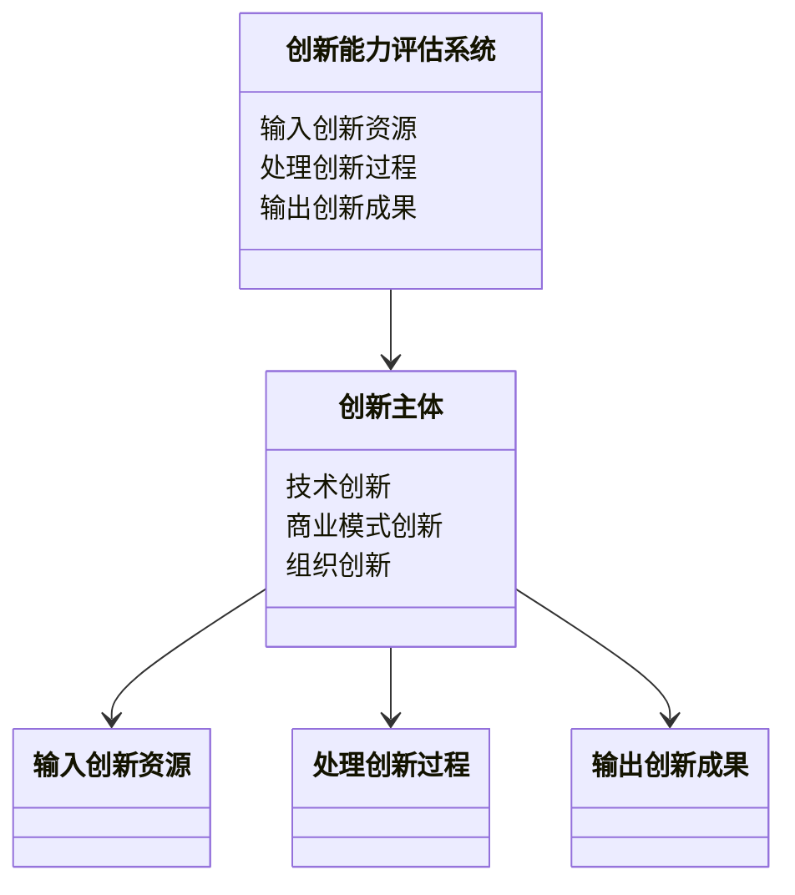
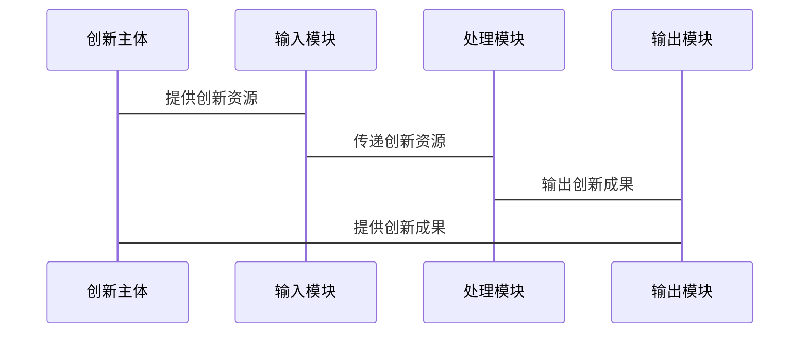

                 


# 巴菲特的创新能力评估：量子创新生态系统的价值创造

> 关键词：巴菲特，创新能力，量子创新，生态系统，价值创造  
> 摘要：本文探讨了巴菲特如何通过创新能力评估实现价值创造，结合量子创新生态系统，分析其内在机制和数学模型，提出系统的架构设计与实现方案，最后通过项目实战和最佳实践提供实用指导。

---

## 第一部分: 巴菲特创新能力评估的背景与基础

### 第1章: 巴菲特创新能力评估的背景与核心概念

#### 1.1 巴菲特创新能力评估的背景

##### 1.1.1 价值投资的起源与发展
价值投资是一种长期投资策略，起源于20世纪初，巴菲特是其最著名的实践者之一。价值投资的核心在于寻找市场价格低于其内在价值的股票。创新能力评估是价值投资的重要组成部分，因为创新能力决定了企业的长期增长潜力。

##### 1.1.2 创新能力在价值投资中的重要性
创新能力是企业竞争优势的核心，直接影响企业的市场地位和盈利能力。巴菲特在选择投资对象时，非常注重企业的创新能力，认为这是创造长期价值的关键因素。

##### 1.1.3 量子创新生态系统的定义
量子创新生态系统是指由创新主体、创新资源、创新环境等要素构成的动态系统，其核心是通过量子效应实现创新资源的高效整合和价值创造。

#### 1.2 巴菲特创新能力评估的核心概念

##### 1.2.1 创新能力的定义与特征
创新能力是指企业在技术、商业模式、组织结构等方面进行创新的能力。其特征包括前瞻性、系统性、动态性和可持续性。

##### 1.2.2 量子创新生态系统的特点
量子创新生态系统具有非线性、不确定性、跨学科性和系统性的特点。它强调创新资源的协同作用，通过量子效应实现创新价值的最大化。

##### 1.2.3 价值创造的内涵与外延
价值创造是指通过创新活动为企业、股东和社会创造经济价值和社会价值。其外延包括技术创新、商业模式创新、组织创新等多个方面。

#### 1.3 巴菲特创新能力评估的理论基础

##### 1.3.1 价值投资的基本原理
价值投资的基本原理是寻找市场价格低于内在价值的企业。创新能力是影响内在价值的重要因素，因此在评估时需要重点关注。

##### 1.3.2 量子创新的数学模型
量子创新的数学模型基于量子力学原理，通过构建量子态的叠加和纠缠效应，模拟创新资源的协同作用。

##### 1.3.3 生态系统理论与创新能力的结合
生态系统理论认为，创新是一个动态的系统过程，需要企业内外部资源的协同作用。创新能力评估需要考虑系统的整体性、动态性和复杂性。

---

### 第2章: 巴菲特创新能力评估的核心框架

#### 2.1 创新能力评估的维度

##### 2.1.1 技术创新的评估维度
技术创新的评估维度包括技术的前沿性、技术的可行性和技术的商业化潜力。

##### 2.1.2 商业模式创新的评估维度
商业模式创新的评估维度包括商业模式的创新性、商业模式的可持续性和商业模式的盈利能力。

##### 2.1.3 组织创新的评估维度
组织创新的评估维度包括组织结构的灵活性、组织文化的创新性和组织管理的有效性。

#### 2.2 量子创新生态系统的核心要素

##### 2.2.1 创新主体的构成
创新主体包括企业、研究机构、政府和第三方服务提供商。它们通过协同作用推动创新。

##### 2.2.2 创新资源的整合
创新资源包括技术资源、人力资源、资金资源和政策资源。通过整合资源，可以提高创新效率。

##### 2.2.3 创新环境的影响
创新环境包括政策环境、市场环境和技术环境。良好的创新环境可以促进创新活动的开展。

#### 2.3 价值创造的系统模型

##### 2.3.1 系统模型的构建
价值创造的系统模型包括输入、处理和输出三个部分。输入是创新资源，处理是创新过程，输出是创新成果。

##### 2.3.2 系统模型的输入输出关系
输入包括技术资源、人力资源和资金资源；处理是创新过程，包括技术创新、商业模式创新和组织创新；输出是创新成果，包括新产品、新服务和新市场。

##### 2.3.3 系统模型的动态演化
系统模型是一个动态演化的过程，创新资源通过协同作用不断优化创新过程，最终实现价值创造。

---

### 第3章: 巴菲特创新能力评估的算法与数学模型

#### 3.1 创新能力评估的算法原理

##### 3.1.1 基于量子计算的创新评估算法
量子计算可以通过量子叠加和量子纠缠效应，提高创新能力评估的效率和准确性。

##### 3.1.2 创新能力的层次分析法（AHP）
层次分析法是一种常用的决策分析方法，通过构建层次结构，分析各因素的权重，最终得出创新能力的评估结果。

##### 3.1.3 创新能力的模糊综合评价法
模糊综合评价法是一种基于模糊数学的评价方法，适用于创新能力强弱的模糊性评估。

#### 3.2 量子创新生态系统的数学模型

##### 3.2.1 创新生态系统的基本方程
创新生态系统的数学模型可以通过量子力学的基本方程进行描述，例如薛定谔方程。

##### 3.2.2 创新能力的量化公式
创新能力的量化公式可以通过量子叠加原理进行构建，例如：

$$ C = \sum_{i=1}^{n} \lambda_i x_i $$

其中，$C$ 表示创新能力，$\lambda_i$ 表示各因素的权重，$x_i$ 表示各因素的值。

##### 3.2.3 价值创造的数学模型
价值创造的数学模型可以通过量子纠缠效应进行描述，例如：

$$ V = \sum_{j=1}^{m} \mu_j y_j $$

其中，$V$ 表示价值创造，$\mu_j$ 表示各因素的权重，$y_j$ 表示各因素的值。

---

## 第四部分: 系统分析与架构设计

### 第4章: 系统分析与架构设计方案

#### 4.1 系统功能设计

##### 4.1.1 领域模型（mermaid 类图）


#### 4.2 系统架构设计

##### 4.2.1 系统架构（mermaid 架构图）
```mermaid
container 创新能力评估系统 {
    component 输入模块 {
        输入创新资源
    }
    component 处理模块 {
        处理创新过程
    }
    component 输出模块 {
        输出创新成果
    }
}
```

#### 4.3 系统接口设计

##### 4.3.1 系统接口（mermaid 序列图）


---

## 第五部分: 项目实战

### 第5章: 项目实战与案例分析

#### 5.1 项目环境安装

##### 5.1.1 安装 Python 环境
使用 Anaconda 或者 Miniconda 安装 Python 环境，并确保安装了必要的库，例如 numpy、pandas、scipy。

#### 5.2 系统核心实现

##### 5.2.1 创新能力评估的代码实现
```python
import numpy as np
import pandas as pd

# 输入创新资源
innovation_resources = {
    '技术创新': [0.8, 0.7, 0.9],
    '商业模式创新': [0.6, 0.8, 0.7],
    '组织创新': [0.5, 0.6, 0.8]
}

# 计算创新能力
def calculate_innovation_capability(resources):
    capability = []
    for i in range(len(resources['技术创新'])):
        total = 0
        total += resources['技术创新'][i] * 0.4
        total += resources['商业模式创新'][i] * 0.3
        total += resources['组织创新'][i] * 0.3
        capability.append(total)
    return capability

# 输出创新成果
innovation_capability = calculate_innovation_capability(innovation_resources)
print("创新能力评估结果:", innovation_capability)
```

##### 5.2.2 价值创造的代码实现
```python
import numpy as np
import pandas as pd

# 输入创新资源
innovation_resources = {
    '技术创新': [0.8, 0.7, 0.9],
    '商业模式创新': [0.6, 0.8, 0.7],
    '组织创新': [0.5, 0.6, 0.8]
}

# 计算价值创造
def calculate_value_creation(resources):
    value = []
    for i in range(len(resources['技术创新'])):
        total = 0
        total += resources['技术创新'][i] * 0.5
        total += resources['商业模式创新'][i] * 0.3
        total += resources['组织创新'][i] * 0.2
        value.append(total)
    return value

# 输出创新成果
value_creation = calculate_value_creation(innovation_resources)
print("价值创造评估结果:", value_creation)
```

#### 5.3 实际案例分析

##### 5.3.1 案例分析
以某科技公司为例，分析其创新能力评估和价值创造过程。

#### 5.4 项目小结

##### 5.4.1 小结
通过实际案例分析，验证了创新能力评估和价值创造模型的有效性，为企业提供了一种新的评估方法。

---

## 第六部分: 最佳实践

### 第6章: 最佳实践与经验总结

#### 6.1 小结

##### 6.1.1 价值创造的核心要素
价值创造的核心要素包括技术创新、商业模式创新和组织创新。

##### 6.1.2 量子创新生态系统的构建
构建量子创新生态系统需要企业内外部资源的协同作用，通过量子效应实现创新价值的最大化。

#### 6.2 注意事项

##### 6.2.1 创新能力评估的关键点
创新能力评估的关键点包括创新资源的整合、创新过程的优化和创新成果的转化。

##### 6.2.2 量子创新生态系统的风险
量子创新生态系统面临的风险包括技术风险、市场风险和管理风险。

#### 6.3 拓展阅读

##### 6.3.1 推荐书籍
- 《巴菲特传》
- 《创新者的窘境》
- 《量子计算原理》

##### 6.3.2 推荐文章
- 《量子创新生态系统的构建与优化》
- 《巴菲特创新能力评估的数学模型》

---

## 结论

通过本文的分析，我们深入探讨了巴菲特创新能力评估的背景、核心概念、算法原理、系统架构和项目实战。结合量子创新生态系统，提出了创新能力评估的数学模型和价值创造的实现方法。未来，随着量子计算技术的发展，创新能力评估和价值创造将更加精准和高效。

---

## 作者

作者：AI天才研究院/AI Genius Institute & 禅与计算机程序设计艺术 /Zen And The Art of Computer Programming

