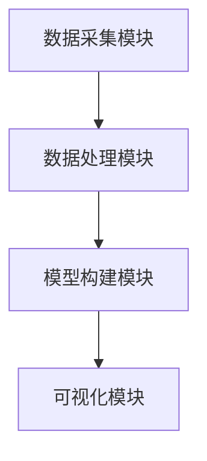

                 


# 巴菲特的品牌价值评估更新：数字化时代的品牌资产

> 关键词：品牌价值评估，巴菲特，数字化时代，品牌资产，数据分析，人工智能

> 摘要：本文系统阐述了巴菲特品牌价值评估方法在数字化时代的更新与演变。通过分析品牌资产的数字化特征、模型构建与优化、系统实现与实战案例，探讨了如何在数字化时代准确评估品牌价值，并为企业提供实践指导。

---

## 第1章: 品牌价值评估的背景与意义

### 1.1 品牌价值评估的背景与意义

#### 1.1.1 品牌价值评估的定义与重要性
品牌价值是企业核心竞争力的重要组成部分，是企业在市场中获得超额收益的能力体现。品牌价值评估是企业决策的重要依据，直接影响企业的战略规划、并购定价和资本运作。

#### 1.1.2 巴菲特投资理念中的品牌价值
巴菲特的投资理念以“价值投资”为核心，注重企业的内在价值和长期盈利能力。品牌价值作为企业内在价值的重要组成部分，在巴菲特的估值体系中占据重要地位。

#### 1.1.3 数字化时代对品牌价值评估的影响
在数字化时代，品牌价值的构成和表现形式发生了深刻变化。社交媒体、大数据和人工智能等技术的广泛应用，使得品牌价值的测量更加精确和动态化。

---

## 第2章: 数字化时代的品牌资产特征

### 2.1 数字化品牌资产的核心概念

#### 2.1.1 数字化品牌资产的定义
数字化品牌资产是指企业在数字化环境中积累的无形资产，包括品牌知名度、品牌忠诚度、品牌影响力等，这些资产通过数据化的方式进行测量和管理。

#### 2.1.2 数字化品牌资产的构成要素
- **品牌知名度**：通过社交媒体、搜索引擎等数据衡量。
- **品牌忠诚度**：通过用户行为数据和情感分析衡量。
- **品牌影响力**：通过传播力和互动频率衡量。

#### 2.1.3 数字化品牌资产与传统品牌资产的对比
| 特性 | 传统品牌资产 | 数字化品牌资产 |
|------|---------------|----------------|
| 数据来源 | 财务数据、市场调研 | 大数据、社交媒体、用户行为 |
| 测量方式 | 定性与定量结合 | 以数据驱动为主 |
| 动态性 | 较低 | 高 |

### 2.2 数字化品牌资产的关键特征

#### 2.2.1 数据驱动性
数字化品牌资产的测量依赖于大数据分析，通过收集和处理海量数据，提取品牌价值的关键指标。

#### 2.2.2 实时性与动态性
数字化品牌资产能够实时更新，反映品牌在市场中的动态变化，帮助企业及时调整策略。

#### 2.2.3 可测量性与可量化性
通过数字化技术，品牌资产可以被精确测量和量化，为企业决策提供数据支持。

---

## 第3章: 巴菲特品牌价值评估模型的数字化更新

### 3.1 传统品牌价值评估模型回顾

#### 3.1.1 基于财务指标的传统模型
传统品牌价值评估模型主要依赖于企业的财务数据，如净利润、市场份额等，但忽略了品牌本身的无形价值。

#### 3.1.2 基于市场表现的传统模型
市场表现模型通过股票价格、市盈率等指标评估企业价值，但难以反映品牌在市场中的具体影响力。

### 3.2 数字化时代品牌价值评估模型的改进

#### 3.2.1 数据分析驱动的模型优化
通过大数据分析，将品牌相关的社交媒体数据、用户行为数据纳入模型，提高评估的准确性。

#### 3.2.2 结合社交媒体与用户行为数据的新模型
新模型引入社交媒体数据、用户评论和互动频率，构建更加全面的品牌价值评估体系。

#### 3.2.3 巴菲特方法的数字化调整
在传统巴菲特估值方法的基础上，加入数字化指标，如品牌影响力指数、用户忠诚度指数等，优化品牌价值的估算。

---

## 第4章: 数字化品牌价值评估的关键指标与方法

### 4.1 数字化品牌价值评估的关键指标

#### 4.1.1 品牌知名度的数字化测量
品牌知名度可以通过社交媒体提及量、搜索引擎排名等指标衡量。

#### 4.1.2 品牌忠诚度的数字化评估
品牌忠诚度可以通过用户购买频率、复购率、用户满意度等数据评估。

#### 4.1.3 品牌影响力与传播力的数字化指标
品牌影响力可以通过社交媒体传播广度、品牌提及量、用户互动频率等指标衡量。

### 4.2 数字化品牌价值评估的具体方法

#### 4.2.1 基于大数据分析的方法
通过收集和分析社交媒体数据、用户行为数据，构建品牌价值评估的数学模型。

#### 4.2.2 基于人工智能的预测模型
利用机器学习算法，预测品牌在不同市场环境下的价值变化。

#### 4.2.3 结合传统与数字化指标的混合方法
将传统财务指标与数字化指标相结合，构建全面的品牌价值评估体系。

---

## 第5章: 品牌价值评估的系统架构与实现

### 5.1 数字化品牌价值评估系统的总体架构

#### 5.1.1 系统模块划分
- 数据采集模块：负责收集社交媒体数据、用户行为数据。
- 数据处理模块：对数据进行清洗、特征提取。
- 模型构建模块：构建品牌价值评估模型。
- 可视化模块：生成评估报告和可视化图表。

#### 5.1.2 数据流与信息处理流程
1. 数据采集模块从多个渠道获取数据。
2. 数据处理模块对数据进行清洗和预处理。
3. 模型构建模块基于处理后的数据构建评估模型。
4. 可视化模块生成报告并展示结果。

#### 5.1.3 系统架构的Mermaid图示


### 5.2 系统实现的关键技术

#### 5.2.1 数据采集与处理技术
- 数据采集：使用API接口获取社交媒体数据。
- 数据清洗：去除无效数据，处理缺失值。

#### 5.2.2 机器学习算法在品牌价值评估中的应用
- 使用随机森林、支持向量机等算法进行预测。
- 通过特征工程优化模型性能。

#### 5.2.3 可视化展示与报告生成
- 使用图表展示品牌价值评估结果。
- 自动生成评估报告，提供决策支持。

---

## 第6章: 项目实战——基于数字化的品牌价值评估案例

### 6.1 项目背景与目标

#### 6.1.1 项目背景介绍
以某知名消费品牌为例，分析其在数字化转型中的品牌价值评估问题。

#### 6.1.2 项目目标与范围
目标：构建品牌价值评估模型，优化品牌管理策略。
范围：包括数据采集、模型构建、结果分析。

### 6.2 数据收集与预处理

#### 6.2.1 数据来源与采集方法
- 数据来源：社交媒体、电商平台、用户调查。
- 采集方法：API接口、爬虫技术、问卷调查。

#### 6.2.2 数据清洗与特征提取
- 去除重复数据、缺失值。
- 提取关键词、情感分析结果。

### 6.3 模型构建与训练

#### 6.3.1 模型选择与优化
- 选择随机森林算法进行分类。
- 调整模型参数，优化性能。

#### 6.3.2 模型训练与评估
- 划分训练集和测试集。
- 评估模型准确率、召回率。

#### 6.3.3 模型实现与解读
```python
import pandas as pd
from sklearn.ensemble import RandomForestClassifier
from sklearn.metrics import accuracy_score

# 加载数据
data = pd.read_csv('brand_value.csv')

# 特征工程
X = data.drop('target', axis=1)
y = data['target']

# 模型训练
model = RandomForestClassifier()
model.fit(X, y)

# 模型评估
y_pred = model.predict(X)
print("Accuracy:", accuracy_score(y, y_pred))
```

---

## 第7章: 总结与展望

### 7.1 总结
本文系统介绍了巴菲特品牌价值评估方法在数字化时代的更新与优化。通过分析品牌资产的数字化特征、模型构建与优化、系统实现与实战案例，探讨了如何在数字化时代准确评估品牌价值。

### 7.2 展望
未来，随着人工智能和大数据技术的进一步发展，品牌价值评估将更加精确和动态化。企业需要结合自身特点，优化品牌价值评估体系，提升品牌管理能力。

---

## 作者：AI天才研究院/AI Genius Institute & 禅与计算机程序设计艺术 /Zen And The Art of Computer Programming

