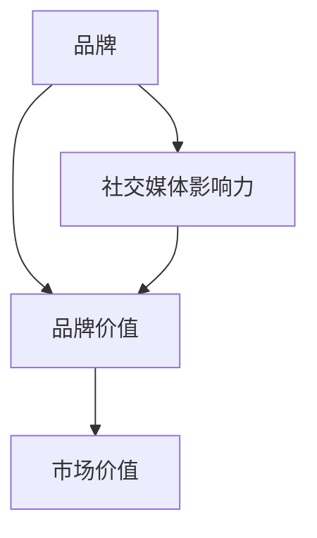
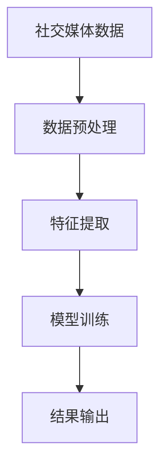

                 


# 巴菲特的品牌价值评估：社交媒体影响力的量化

> 关键词：品牌价值，社交媒体影响力，巴菲特，投资分析，影响力量化

> 摘要：本文深入探讨了巴菲特的品牌价值评估方法，并结合社交媒体影响力这一新兴指标，提出了品牌价值量化的新思路。通过分析社交媒体影响力的核心概念、算法原理以及实际应用场景，本文为投资者提供了全新的视角和方法，以更精准地评估品牌价值。

---

# 第1章: 品牌价值与社交媒体影响力的概述

## 1.1 品牌价值的定义与重要性

### 1.1.1 品牌价值的定义

品牌价值是衡量品牌在市场中的核心竞争力和市场地位的重要指标。它反映了消费者对品牌的认知、忠诚度以及品牌在市场中的影响力。品牌价值不仅包括品牌带来的直接收益，还包括品牌未来的潜在价值。

### 1.1.2 品牌价值的核心要素

品牌价值的核心要素包括：

1. **品牌认知度**：消费者对品牌的识别和记忆能力。
2. **品牌忠诚度**：消费者对品牌的偏好和重复购买意愿。
3. **品牌声誉**：品牌在市场中的信誉和形象。
4. **品牌创新力**：品牌在市场中的创新能力。

### 1.1.3 品牌价值与企业长期发展的关系

品牌价值是企业长期发展的基石。高品牌价值意味着企业具有更强的市场竞争力、客户忠诚度和抗风险能力。巴菲特在投资过程中，始终将品牌价值作为评估企业的重要指标。

---

## 1.2 社交媒体影响力的定义与特征

### 1.2.1 社交媒体影响力的定义

社交媒体影响力是指品牌在社交媒体平台上所获得的关注度、互动量和传播效果。它反映了品牌在社交媒体上的影响力和话语权。

### 1.2.2 社交媒体的核心属性特征对比表格

| **属性**        | **品牌价值**                  | **社交媒体影响力**                  |
|------------------|------------------------------|--------------------------------------|
| 核心目标         | 提升品牌市场地位               | 提升品牌在线上渠道的影响力           |
| 衡量指标         | 市场份额、品牌忠诚度           | 粉丝数量、互动频率、传播广度         |
| 影响范围         | 整体市场                     | 线上社交平台                      |
| 时间维度         | 长期                         | 短期至长期                         |

### 1.2.3 品牌价值与社交媒体影响力的关系

社交媒体影响力是品牌价值的重要组成部分。通过社交媒体，品牌可以快速传播信息、提升知名度和美誉度，从而影响品牌价值。同时，品牌价值的提升也会反过来增强社交媒体影响力。

---

## 1.3 巴菲特的品牌价值评估方法

### 1.3.1 巴菲特的品牌价值评估模型

巴菲特的品牌价值评估模型基于以下几个核心要素：

1. **品牌认知度**：品牌在市场中的知名度。
2. **品牌忠诚度**：消费者对品牌的忠诚程度。
3. **品牌创新能力**：品牌在市场中的创新能力。
4. **品牌盈利能力**：品牌的盈利能力。

### 1.3.2 巴菲特评估品牌价值的核心要素

- **品牌认知度**：高品牌认知度意味着品牌更容易被消费者识别和选择。
- **品牌忠诚度**：高品牌忠诚度意味着消费者更愿意为品牌支付溢价。
- **品牌创新能力**：持续创新的品牌更具市场竞争力。
- **品牌盈利能力**：盈利能力是品牌价值的最终体现。

### 1.3.3 巴菲特品牌价值评估方法的实际应用

以苹果公司为例，巴菲特的品牌价值评估方法可以帮助我们理解苹果品牌的成功：

1. **品牌认知度**：苹果是全球知名的科技品牌。
2. **品牌忠诚度**：苹果拥有一大批忠实的粉丝，他们愿意为苹果产品支付溢价。
3. **品牌创新能力**：苹果不断创新，推出革命性产品。
4. **品牌盈利能力**：苹果的盈利能力持续领先于行业。

---

## 1.4 社交媒体对品牌价值的影响机制

### 1.4.1 社交媒体对品牌认知的影响

社交媒体通过信息传播和互动，快速提升品牌的知名度和认知度。例如，一个品牌的社交媒体营销活动可以迅速吸引大量关注，提升品牌知名度。

### 1.4.2 社交媒体对品牌忠诚度的影响

社交媒体上的互动和个性化服务可以增强消费者对品牌的忠诚度。例如，通过社交媒体与消费者互动，可以建立更紧密的联系，增强品牌忠诚度。

### 1.4.3 社交媒体对品牌声誉的影响

社交媒体上的口碑传播可以直接影响品牌声誉。正面的社交媒体评价可以提升品牌声誉，负面评价则可能损害品牌声誉。

---

## 1.5 本章小结

本章介绍了品牌价值和社交媒体影响力的基本概念，并分析了社交媒体影响力对品牌价值的影响机制。通过巴菲特的品牌价值评估方法，我们可以更好地理解品牌价值的核心要素。

---

# 第2章: 社交媒体影响力量化的核心概念

## 2.1 核心概念与原理

### 2.1.1 品牌价值的核心概念

品牌价值是品牌在市场中的核心竞争力和市场地位的体现。它不仅包括当前的市场表现，还包括未来的潜在价值。

### 2.1.2 社交媒体影响力的核心概念

社交媒体影响力是品牌在社交媒体平台上所获得的关注度、互动量和传播效果的总和。

### 2.1.3 品牌价值与社交媒体影响力的关联性分析

社交媒体影响力是品牌价值的重要组成部分。通过社交媒体，品牌可以快速传播信息、提升知名度和美誉度，从而影响品牌价值。

---

## 2.2 核心概念属性特征对比表格

| **属性**        | **品牌价值**                  | **社交媒体影响力**                  |
|------------------|------------------------------|--------------------------------------|
| 核心目标         | 提升品牌市场地位               | 提升品牌在线上渠道的影响力           |
| 衡量指标         | 市场份额、品牌忠诚度           | 粉丝数量、互动频率、传播广度         |
| 影响范围         | 整体市场                     | 线上社交平台                      |
| 时间维度         | 长期                         | 短期至长期                         |

---

## 2.3 实体关系图（ER图）

以下是品牌价值和社交媒体影响力之间的关系图：



---

## 2.4 本章小结

本章通过对比分析品牌价值和社交媒体影响力的核心概念，明确了两者之间的关联性。社交媒体影响力是品牌价值的重要组成部分，两者在品牌建设中具有密不可分的关系。

---

# 第3章: 社交媒体影响力量化模型的算法原理

## 3.1 算法原理概述

### 3.1.1 基于社交媒体数据的品牌价值评估算法

品牌价值评估算法基于社交媒体数据，通过分析粉丝数量、互动频率、传播广度等指标，量化品牌价值。

### 3.1.2 算法的核心思想

通过社交媒体数据，计算品牌影响力指数，进而量化品牌价值。

### 3.1.3 算法的适用场景

适用于社交媒体数据丰富的品牌，尤其是互联网公司和科技品牌。

---

## 3.2 算法流程图

以下是品牌价值评估算法的流程图：



---

## 3.3 算法实现代码

以下是一个简单的品牌价值评估算法实现：

```python
def calculate_brand_value(social_data):
    # 数据预处理
    preprocessed_data = preprocess(social_data)
    # 特征提取
    features = extract_features(preprocessed_data)
    # 模型训练
    model = train_model(features)
    # 结果输出
    brand_value = model.predict(features)
    return brand_value
```

---

## 3.4 数学模型与公式

### 3.4.1 品牌价值评估公式

$$ brand\_value = \alpha \times social\_influence + \beta \times brand\_loyalty $$

其中，$\alpha$ 和 $\beta$ 是模型参数，$social\_influence$ 是社交媒体影响力，$brand\_loyalty$ 是品牌忠诚度。

---

## 3.5 本章小结

本章通过算法原理和数学模型，详细阐述了基于社交媒体数据的品牌价值评估方法。通过社交媒体数据，我们可以量化品牌价值，为投资者提供更精准的决策依据。

---

# 结语

通过本文的分析，我们可以看到，社交媒体影响力是品牌价值的重要组成部分。通过量化社交媒体影响力，我们可以更精准地评估品牌价值，为投资决策提供有力支持。未来，随着社交媒体的不断发展，品牌价值评估将更加依赖于社交媒体数据。

---

**作者：AI天才研究院/AI Genius Institute & 禅与计算机程序设计艺术/Zen And The Art of Computer Programming**

