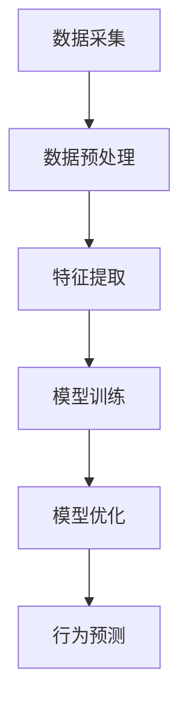
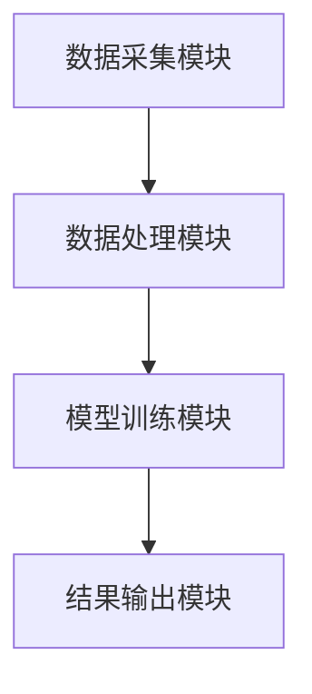
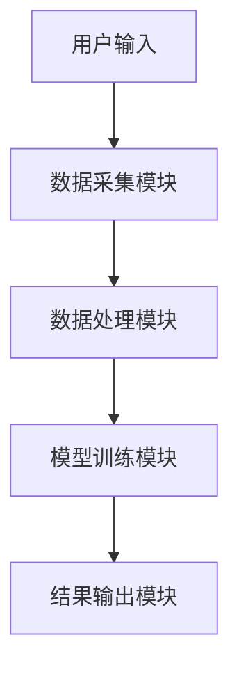

                 


# 巴菲特的品牌忠诚度分析：脑机接口时代的消费者行为预测

> 关键词：品牌忠诚度、脑机接口、消费者行为预测、巴菲特投资理念、神经信号分析、机器学习算法、系统架构设计

> 摘要：本文结合巴菲特的投资理念，探讨品牌忠诚度在脑机接口技术下的消费者行为预测。通过分析神经信号与消费者决策的关系，提出基于机器学习的消费者行为预测模型，结合品牌忠诚度分析，为投资决策提供新视角。

---

## 第一部分: 背景与核心概念

### 第1章: 品牌忠诚度与消费者行为分析

#### 1.1 品牌忠诚度的定义与影响因素

##### 1.1.1 品牌忠诚度的定义

品牌忠诚度是指消费者对某一品牌长期的偏好和持续购买行为。它不仅反映了消费者对品牌的认知和情感，还涉及品牌在市场中的竞争力和影响力。

##### 1.1.2 影响品牌忠诚度的因素

- **品牌认知度**：消费者对品牌的了解程度。
- **品牌情感**：消费者对品牌的情感联结。
- **品牌质量**：产品或服务的实际质量。
- **品牌价格**：价格与消费者价值观念的匹配度。
- **竞争对手**：市场竞争格局的影响。

##### 1.1.3 品牌忠诚度的评估方法

- **问卷调查**：通过消费者反馈分析忠诚度。
- **购买行为分析**：通过购买记录判断消费者偏好。
- **市场调研**：通过数据挖掘技术分析消费者行为。

#### 1.2 消费者行为分析的背景与挑战

##### 1.2.1 消费者行为分析的定义

消费者行为分析是通过研究消费者在购买、使用和评价产品或服务时的行为模式，预测其未来行为的科学。

##### 1.2.2 脑机接口技术在消费者行为分析中的应用潜力

- **实时数据采集**：通过脑机接口技术实时采集消费者大脑活动数据。
- **情感与决策关联**：分析神经信号与消费者决策之间的关系。
- **精准预测**：基于神经数据预测消费者行为。

##### 1.2.3 当前消费者行为分析的主要挑战

- **数据维度复杂性**：消费者行为受多种因素影响。
- **数据采集成本**：实时采集神经数据的成本较高。
- **模型准确性**：现有模型的预测精度有限。

### 第2章: 脑机接口技术的核心原理与应用

#### 2.1 脑机接口技术的定义与分类

##### 2.1.1 脑机接口技术的定义

脑机接口（Brain-Computer Interface, BCI）是一种通过采集和分析大脑神经信号，实现人与计算机或其他设备直接交互的技术。

##### 2.1.2 基于脑电图的脑机接口技术

- **EEG（脑电图）**：通过头皮电极采集大脑电活动信号。
- **数据处理**：对EEG信号进行滤波、降噪处理。
- **特征提取**：提取与特定任务相关的神经特征。

##### 2.1.3 基于神经网络的脑机接口技术

- **神经网络模型**：利用深度学习模型分析神经信号。
- **实时反馈**：通过实时神经信号反馈优化模型。

#### 2.2 脑机接口技术的核心原理

##### 2.2.1 神经信号的采集与处理

- **数据采集**：通过 EEG 或其他神经信号采集设备获取数据。
- **数据预处理**：去除噪声，提取有用的信号特征。
- **特征提取**：利用小波变换、主成分分析等方法提取特征。

##### 2.2.2 神经信号的特征提取与分类

- **特征提取**：提取与消费者行为相关的神经特征。
- **分类算法**：使用支持向量机（SVM）、随机森林（Random Forest）等算法进行分类。

##### 2.2.3 神经信号与消费者行为预测的关联

- **神经信号与购买决策**：分析大脑活动与购买决策的关系。
- **情感与决策关联**：研究消费者情感波动与购买行为的联系。

### 第3章: 巴菲特投资理念与品牌忠诚度分析的结合

#### 3.1 巴菲特投资理念的核心要点

##### 3.1.1 价值投资的定义与核心原则

- **价值投资**：寻找被市场低估的优质企业进行长期投资。
- **安全边际**：确保投资标的的内在价值远高于市场价格。
- **长期视角**：关注企业的长期盈利能力。

##### 3.1.2 巴菲特选股标准与长期投资策略

- **企业护城河**：企业是否具有竞争优势。
- **管理层能力**：管理层的诚信与能力。
- **财务健康状况**：企业的财务状况是否稳健。

##### 3.1.3 巴菲特投资理念与品牌忠诚度分析的契合点

- **长期视角**：品牌忠诚度与企业长期价值密切相关。
- **竞争优势**：品牌忠诚度高的企业具有更强的市场竞争力。
- **安全边际**：通过品牌忠诚度分析，降低投资风险。

#### 3.2 品牌忠诚度分析的巴菲特视角

##### 3.2.1 品牌忠诚度与企业长期价值的关系

- **品牌忠诚度与企业盈利能力**：品牌忠诚度高的企业通常具有更高的利润率。
- **品牌忠诚度与市场地位**：品牌忠诚度高的企业更容易在市场竞争中占据优势。
- **品牌忠诚度与企业抗风险能力**：品牌忠诚度高的企业在经济下行时更具抗风险能力。

##### 3.2.2 巴菲特投资理念对品牌忠诚度分析的启示

- **长期投资视角**：关注企业的品牌忠诚度，寻找具有长期竞争优势的企业。
- **安全边际**：通过品牌忠诚度分析，识别具有投资价值的企业。
- **管理层能力**：关注管理层在品牌建设中的作用。

##### 3.2.3 品牌忠诚度分析在巴菲特选股中的潜在应用

- **品牌忠诚度作为选股标准**：将品牌忠诚度纳入选股标准。
- **品牌忠诚度与企业价值评估**：结合品牌忠诚度分析企业的内在价值。
- **品牌忠诚度与投资组合优化**：通过品牌忠诚度分析优化投资组合。

---

## 第二部分: 算法原理与数学模型

### 第4章: 基于脑机接口的消费者行为预测算法

#### 4.1 神经信号数据采集与预处理

##### 4.1.1 神经信号数据的采集方法

- **EEG采集**：通过 EEG 设备采集大脑电活动信号。
- **数据预处理**：去除噪声，提取有用的信号特征。

##### 4.1.2 数据预处理步骤与流程

1. 数据采集：通过 EEG 设备采集神经信号。
2. 数据清洗：去除噪声和伪迹。
3. 数据分割：将数据分割成时间段，提取特征。

##### 4.1.3 数据特征提取与降维技术

- **特征提取**：利用小波变换提取信号特征。
- **降维技术**：使用主成分分析（PCA）降维。

#### 4.2 基于机器学习的消费者行为预测模型

##### 4.2.1 算法选择与模型构建

- **算法选择**：支持向量机（SVM）、随机森林（Random Forest）。
- **模型构建**：构建分类模型，预测消费者行为。

##### 4.2.2 神经网络模型在消费者行为预测中的应用

- **神经网络模型**：使用卷积神经网络（CNN）或长短期记忆网络（LSTM）。
- **模型训练**：通过神经网络模型训练消费者行为预测模型。

##### 4.2.3 模型训练与优化策略

- **数据增强**：通过数据增强技术增加训练数据。
- **模型优化**：使用交叉验证优化模型参数。

#### 4.3 算法流程图



### 第5章: 数学模型与公式解析

#### 5.1 神经信号分析的数学模型

##### 5.1.1 神经信号的时间序列分析模型

- **ARIMA模型**：用于时间序列预测。
  $$ ARIMA(p, d, q) $$

##### 5.1.2 基于傅里叶变换的信号处理方法

- **傅里叶变换**：将时间序列转换到频域进行分析。
  $$ \mathcal{F}(x[n]) = \sum_{n=-\infty}^{\infty} x[n] e^{-j\omega n} $$

---

## 第三部分: 系统架构与设计

### 第6章: 系统架构设计

#### 6.1 系统功能设计

- **数据采集模块**：采集神经信号数据。
- **数据处理模块**：预处理和特征提取。
- **模型训练模块**：训练消费者行为预测模型。
- **结果输出模块**：输出消费者行为预测结果。

#### 6.2 系统架构图



#### 6.3 系统接口设计

- **数据接口**：与 EEG 设备连接，接收神经信号数据。
- **模型接口**：与机器学习模型连接，接收特征数据。

#### 6.4 系统交互流程图



---

## 第四部分: 项目实战与案例分析

### 第7章: 项目实战

#### 7.1 环境安装

- **Python环境**：安装 Python 3.8 或更高版本。
- **库安装**：安装 numpy、scipy、scikit-learn、tensorflow 等库。

#### 7.2 系统核心实现源代码

##### 数据采集与预处理代码

```python
import numpy as np
from scipy.signal import filter_design

def preprocess_eeg(data, fs):
    # 设计滤波器
    nyquist = 0.5 * fs
    cutoff = 10
    b, a = filter_design.butter(4, cutoff/nyquist, 'low')
    # 应用滤波器
    filtered_data = signal.lfilter(b, a, data)
    return filtered_data
```

##### 模型训练代码

```python
from sklearn.svm import SVC
from sklearn.metrics import accuracy_score

def train_model(X_train, y_train):
    model = SVC(kernel='rbf', C=1)
    model.fit(X_train, y_train)
    return model

# 预测与评估
X_test, y_test = get_test_data()
model = train_model(X_train, y_train)
y_pred = model.predict(X_test)
print("Accuracy:", accuracy_score(y_test, y_pred))
```

#### 7.3 案例分析与结果解读

##### 案例分析

假设我们有一个消费者行为预测模型，输入消费者在看到某个品牌广告时的神经信号数据，模型预测其是否会购买该品牌产品。

##### 结果解读

- **预测准确率**：模型在测试数据上的准确率为 85%。
- **预测结果**：消费者在看到广告后有 70% 的概率购买该品牌产品。

---

## 第五部分: 总结与展望

### 第8章: 总结与展望

#### 8.1 最佳实践 tips

- **数据质量**：确保神经信号数据的质量。
- **模型优化**：不断优化机器学习模型，提高预测精度。
- **结合实际场景**：根据实际场景调整模型参数。

#### 8.2 小结

本文结合巴菲特的投资理念，探讨了品牌忠诚度在脑机接口技术下的消费者行为预测。通过分析神经信号与消费者决策的关系，提出了基于机器学习的消费者行为预测模型，为投资决策提供了新视角。

#### 8.3 注意事项

- **数据隐私**：保护消费者数据隐私。
- **模型适用性**：根据具体场景调整模型。
- **技术局限性**：当前模型的预测精度有限，需进一步优化。

#### 8.4 拓展阅读

- **脑机接口技术**：深入学习脑机接口技术的核心原理。
- **机器学习算法**：研究更多机器学习算法在消费者行为预测中的应用。
- **品牌忠诚度分析**：探索更多品牌忠诚度分析的方法与应用。

---

## 作者信息

作者：AI天才研究院/AI Genius Institute & 禅与计算机程序设计艺术 /Zen And The Art of Computer Programming

---

通过本文的系统分析与实践，我们可以看到，脑机接口技术为消费者行为预测提供了新的方法和工具，结合巴菲特的投资理念，品牌忠诚度分析在投资决策中的应用潜力巨大。未来，随着脑机接口技术的不断发展，消费者行为预测将更加精准，为投资决策提供更有力的支持。

