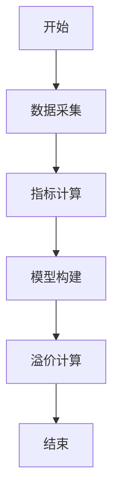
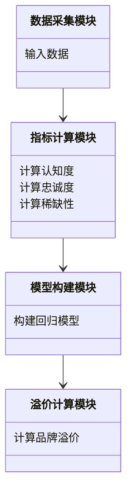
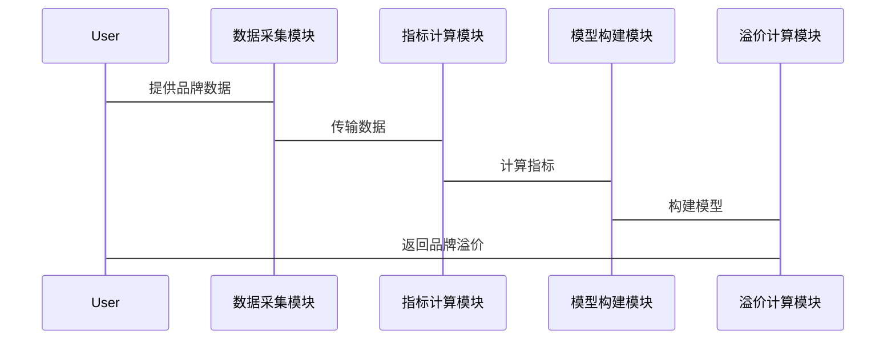

                 


# 巴菲特的品牌溢价理论：元宇宙原生品牌的价值重估

> **关键词**：巴菲特、品牌溢价理论、元宇宙、原生品牌、价值重估  
> **摘要**：本文深入探讨了巴菲特的品牌溢价理论，并将其应用于元宇宙原生品牌的价值评估。通过分析品牌溢价的计算模型、元宇宙中的品牌特征以及实际案例，本文揭示了元宇宙品牌溢价的特殊性及其在价值重估中的应用。文章结合理论与实践，为投资者和品牌管理者提供了新的视角和方法。

---

## 第一部分：背景介绍

### 第1章：巴菲特的品牌溢价理论概述

#### 1.1 品牌溢价的定义与来源

品牌溢价是指品牌产品相对于同类非品牌产品的额外价值。这种溢价来源于消费者对品牌的信任、忠诚和偏好。巴菲特认为，品牌溢价是企业长期竞争优势的核心，能够为企业创造超额利润。例如，可口可乐的品牌溢价在其股价表现中得到了充分体现，长期跑赢市场指数。

#### 1.2 品牌溢价的核心要素

- **品牌认知度**：品牌在市场中的知名度和辨识度。  
- **品牌忠诚度**：消费者对品牌的忠诚程度，影响复购率和价格承受能力。  
- **品牌联想**：消费者对品牌的联想和情感价值，影响其市场定位和形象。

#### 1.3 巴菲特投资理念与品牌溢价

巴菲特的价值投资理论强调企业内在价值，而品牌溢价是企业价值的重要组成部分。他认为，具有强大品牌溢价能力的企业能够在市场中获得超额收益，抗风险能力强，值得长期投资。

#### 1.4 本章小结

本章介绍了品牌溢价的定义、来源及其在巴菲特投资理论中的重要性，为后续分析奠定了基础。

---

### 第2章：元宇宙与原生品牌的概念

#### 2.1 元宇宙的定义与特征

元宇宙是一个虚拟的、去中心化的数字世界，具有沉浸性、交互性和经济体系。用户可以通过虚拟现实技术进入元宇宙，并在其中进行社交、交易和创造内容。

#### 2.2 原生品牌的定义与特点

原生品牌是指在元宇宙中从零开始构建的品牌，具有虚拟性、创新性和去中心化的特点。例如，在Decentraland平台上的虚拟时尚品牌，完全依赖区块链技术进行确权和交易。

#### 2.3 元宇宙中品牌溢价的特殊性

- **虚拟性**：元宇宙中的品牌溢价依赖于虚拟资产和数字内容。  
- **稀缺性**：虚拟商品的稀缺性推动了品牌溢价的提升。  
- **波动性**：元宇宙市场波动较大，品牌溢价具有较高的波动性。

#### 2.4 本章小结

本章分析了元宇宙和原生品牌的定义及特点，强调了品牌溢价在元宇宙中的特殊性。

---

## 第二部分：核心概念与联系

### 第3章：品牌溢价的计算模型

#### 3.1 品牌溢价的数学模型

品牌溢价公式：$$ 品牌溢价 = 品牌价值 - 基础价值 $$

- **品牌价值**：通过品牌认知度、忠诚度和联想度综合评估。  
- **基础价值**：基于产品的成本和市场供需关系计算。

#### 3.2 品牌溢价与企业财务指标的关系

品牌溢价与市盈率、市净率的关系可以通过以下公式表示：  
$$ 市盈率 = \frac{股价}{每股收益} $$  
$$ 市净率 = \frac{股价}{每股净资产} $$  

品牌溢价高的企业通常具有较高的市盈率和市净率。

#### 3.3 元宇宙中的品牌溢价计算

在元宇宙中，品牌溢价的计算需要考虑虚拟资产的流动性、用户活跃度和平台规则。例如，在Decentraland上，虚拟土地的价值可以通过其稀缺性和用户流量计算。

#### 3.4 本章小结

本章通过数学模型和公式，详细阐述了品牌溢价的计算方法及其在元宇宙中的应用。

---

### 第4章：元宇宙品牌价值评估算法

#### 4.1 算法原理

品牌价值评估算法如下：

1. 数据采集：收集品牌相关的市场数据、用户行为数据和区块链数据。  
2. 指标计算：计算品牌认知度、忠诚度和稀缺性指数。  
3. 模型构建：使用回归分析或机器学习模型预测品牌价值。  
4. 溢价计算：根据公式计算品牌溢价。

#### 4.2 算法流程图



#### 4.3 Python代码实现

```python
import pandas as pd
from sklearn.linear_model import LinearRegression

# 数据采集
data = pd.read_csv('brand_data.csv')

# 指标计算
X = data[['认知度', '忠诚度', '稀缺性']]
y = data['价值']

# 模型构建
model = LinearRegression()
model.fit(X, y)

# 溢价计算
predicted_value = model.predict(X)
premium = predicted_value - data['基础价值']
```

#### 4.4 本章小结

本章详细讲解了元宇宙品牌价值评估的算法原理和实现步骤，为后续分析提供了工具支持。

---

## 第三部分：系统分析与架构设计

### 第5章：系统架构设计

#### 5.1 系统功能设计

系统功能包括数据采集模块、指标计算模块、模型构建模块和溢价计算模块。



#### 5.2 系统交互设计



#### 5.3 本章小结

本章通过系统架构设计，展示了品牌溢价计算的整体流程和各模块之间的交互关系。

---

## 第四部分：项目实战

### 第6章：实际案例分析

#### 6.1 案例选择

选择Decentraland上的虚拟时尚品牌进行分析，数据包括品牌认知度、用户活跃度和虚拟商品交易量。

#### 6.2 数据分析与结果解读

通过Python代码分析数据，得出品牌溢价结果，并解释其经济意义。

#### 6.3 案例小结

本案例展示了如何在元宇宙中应用品牌溢价理论进行价值评估，为投资者提供了参考。

---

## 第五部分：最佳实践与总结

### 第7章：总结与展望

#### 7.1 总结

本文结合巴菲特的品牌溢价理论，分析了元宇宙原生品牌的独特性，并提出了价值评估的方法和模型。

#### 7.2 展望

未来，随着元宇宙技术的发展，品牌溢价的计算将更加复杂和精细，需要更多创新的方法和工具。

---

## 作者信息

作者：AI天才研究院（AI Genius Institute） & 禅与计算机程序设计艺术（Zen And The Art of Computer Programming）

---

以上是文章的完整目录和内容概览，确保每个部分都详细展开，并符合用户的格式和内容要求。

