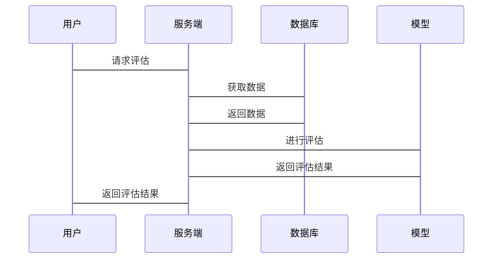

                 


# 巴菲特的品牌溢价理论：数字原生品牌的价值重估

## 关键词：品牌溢价，数字原生品牌，巴菲特投资理论，价值评估，算法模型

## 摘要：本文深入探讨了巴菲特的品牌溢价理论在数字原生品牌中的应用，通过分析数字原生品牌的特征与价值评估，结合层次分析法和模糊综合评价法，构建了品牌价值评估的数学模型，并通过实际案例分析，展示了如何在数字化时代重估数字原生品牌的价值。

---

# 第一章: 巴菲特的品牌溢价理论概述

## 1.1 巴菲特品牌溢价理论的核心概念

### 1.1.1 品牌溢价的定义与本质
品牌溢价是指消费者对某一品牌的产品或服务愿意支付的价格超过同类产品或服务的基准价格。这种溢价反映了品牌在市场上的独特价值和消费者对品牌的信任与忠诚。巴菲特认为，品牌溢价是企业长期价值的重要组成部分，优质品牌能够为企业带来持续的超额利润。

### 1.1.2 巴菲特投资理念中的品牌价值
巴菲特的投资理念强调长期价值和品牌的重要性。他认为，拥有强大品牌溢价能力的企业能够在市场中占据优势，抵御价格竞争，并在经济低迷时保持稳定的收益。品牌不仅是企业的资产，更是企业长期竞争优势的体现。

### 1.1.3 品牌溢价与企业长期价值的关系
品牌溢价通过提升产品的定价能力、增加客户忠诚度和市场份额，直接推动企业的长期价值增长。巴菲特认为，品牌溢价能力越强，企业抵御风险的能力也越强，从而在长期投资中更具吸引力。

---

## 1.2 数字原生品牌的兴起

### 1.2.1 数字原生品牌的定义与特征
数字原生品牌是指完全基于互联网和数字化技术构建的品牌。它们通常以数据驱动的方式运作，利用社交媒体、电子商务和大数据分析等工具快速崛起。数字原生品牌的特征包括：高度依赖数字化渠道、用户参与度高、数据驱动决策等。

### 1.2.2 数字化时代品牌价值的重构
在数字化时代，品牌价值的评估不再仅仅依赖于传统指标，如市场份额和历史业绩，而是更加关注用户互动、数据资产和品牌影响力。数字原生品牌的崛起重新定义了品牌价值，强调用户参与和数据驱动的创新。

### 1.2.3 数字原生品牌与传统品牌的异同
数字原生品牌与传统品牌的异同主要体现在品牌构建方式、用户互动模式和数据依赖程度上。数字原生品牌更加注重用户参与和数据驱动，而传统品牌则更依赖于线下渠道和历史积累。然而，两者在品牌溢价的追求上是相同的。

---

## 1.3 品牌溢价理论在数字时代的演变

### 1.3.1 巴菲特理论的数字化延伸
巴菲特的品牌溢价理论在数字时代得到了新的发展。数字原生品牌通过数据驱动的方式，进一步放大了品牌溢价的潜力。例如，通过精准营销和个性化推荐，数字原生品牌能够更有效地提升用户的购买意愿和品牌忠诚度。

### 1.3.2 数字原生品牌溢价的形成机制
数字原生品牌溢价的形成机制主要包括以下几点：
1. **用户参与度**：通过社交媒体和互动营销，数字原生品牌能够与用户建立深度连接，增强品牌认知和忠诚度。
2. **数据驱动的精准营销**：利用大数据分析和人工智能技术，数字原生品牌能够实现精准营销，提升品牌溢价能力。
3. **品牌故事与文化塑造**：通过独特的品牌故事和文化输出，数字原生品牌能够建立情感连接，进一步提升品牌溢价。

### 1.3.3 品牌溢价与用户心智占领的关系
数字原生品牌通过占领用户心智，实现品牌溢价的最大化。用户心智的占领不仅需要品牌故事的传播，还需要通过持续的用户互动和优质的产品体验来巩固。

---

## 1.4 本章小结

---

# 第二章: 数字原生品牌的特征与价值评估

## 2.1 数字原生品牌的特征分析

### 2.1.1 数字化驱动的品牌构建
数字原生品牌的核心竞争力在于其数字化驱动的品牌构建能力。通过数据分析和技术创新，数字原生品牌能够快速响应市场变化，实现精准的品牌定位。

### 2.1.2 用户参与度与品牌忠诚度
数字原生品牌通过社交媒体、用户生成内容（UGC）等方式，与用户建立深度互动，从而提升用户参与度和品牌忠诚度。

### 2.1.3 数据驱动的品牌决策
数字原生品牌依赖于数据驱动的决策，通过分析用户行为数据和市场趋势，优化品牌策略和营销活动。

---

## 2.2 数字原生品牌的价值评估维度

### 2.2.1 用户价值评估
用户价值评估包括用户留存率、用户活跃度和用户生命周期价值（CLV）等指标。这些指标能够反映出数字原生品牌的用户粘性和长期价值。

### 2.2.2 市场价值评估
市场价值评估主要关注品牌的市场份额和品牌影响力。通过分析品牌在市场中的地位和竞争对手的表现，可以评估数字原生品牌的价值。

### 2.2.3 长期价值评估
长期价值评估关注品牌的可持续发展能力和未来的增长潜力。数字原生品牌通过持续创新和用户互动，能够实现长期价值的提升。

---

## 2.3 数字原生品牌溢价的实现路径

### 2.3.1 用户体验优化
通过优化用户体验，数字原生品牌能够提升用户满意度和品牌忠诚度，从而实现品牌溢价。

### 2.3.2 数据驱动的精准营销
利用大数据分析和人工智能技术，数字原生品牌能够实现精准营销，提升品牌溢价能力。

### 2.3.3 品牌故事与文化塑造
通过独特的品牌故事和文化输出，数字原生品牌能够建立情感连接，进一步提升品牌溢价。

---

## 2.4 本章小结

---

# 第三章: 品牌价值评估的数学模型与算法

## 3.1 品牌价值评估的核心指标

### 3.1.1 用户留存率
用户留存率是衡量数字原生品牌用户粘性的重要指标。留存率越高，品牌溢价能力越强。

### 3.1.2 用户转化率
用户转化率反映了品牌营销活动的 effectiveness。高转化率意味着品牌溢价能力较强。

### 3.1.3 品牌忠诚度指数
品牌忠诚度指数是通过分析用户的重复购买率和推荐行为来衡量的。高忠诚度指数意味着品牌溢价能力较强。

---

## 3.2 品牌价值评估的层次分析法（AHP）

### 3.2.1 层次分析法的基本原理
层次分析法是一种用于多指标决策的定性分析方法。通过构建层次结构，将品牌价值评估的指标分为目标层、准则层和方案层，进而计算各指标的权重。

### 3.2.2 品牌价值评估的指标权重分配
品牌价值评估的指标包括用户价值、市场价值和长期价值等。通过层次分析法，可以确定各指标的权重，并进行品牌价值的综合评估。

### 3.2.3 层次分析法的计算步骤
1. 构建层次结构。
2. 确定各指标的权重。
3. 计算各品牌的综合得分。
4. 根据得分进行排序。

---

## 3.3 基于模糊综合评价的品牌价值模型

### 3.3.1 模糊综合评
（注：此处需要详细阐述模糊综合评价法的原理和应用步骤，包括如何将模糊评价结果转化为具体数值，以及如何结合层次分析法进行品牌价值评估。）

---

## 3.4 本章小结

---

# 第四章: 数字原生品牌溢价的实现路径

## 4.1 数字原生品牌溢价的核心策略

### 4.1.1 用户体验优化
通过优化用户体验，数字原生品牌能够提升用户满意度和品牌忠诚度，从而实现品牌溢价。

### 4.1.2 数据驱动的精准营销
利用大数据分析和人工智能技术，数字原生品牌能够实现精准营销，提升品牌溢价能力。

### 4.1.3 品牌故事与文化塑造
通过独特的品牌故事和文化输出，数字原生品牌能够建立情感连接，进一步提升品牌溢价。

---

## 4.2 数字原生品牌溢价的实现路径

### 4.2.1 用户参与度提升
通过社交媒体和互动营销，数字原生品牌能够与用户建立深度连接，增强品牌认知和忠诚度。

### 4.2.2 数据驱动的精准营销
通过分析用户行为数据和市场趋势，数字原生品牌能够优化品牌策略和营销活动，实现精准营销。

### 4.2.3 品牌故事与文化塑造
通过独特的品牌故事和文化输出，数字原生品牌能够建立情感连接，进一步提升品牌溢价。

---

## 4.3 本章小结

---

# 第五章: 数字原生品牌价值评估的系统架构

## 5.1 问题场景介绍
数字原生品牌的崛起带来了新的品牌价值评估需求。传统的评估方法难以满足数字化时代的需求，因此需要构建一个基于数据驱动的系统架构。

---

## 5.2 系统功能设计

### 5.2.1 领域模型（Mermaid类图）


---

## 5.3 系统架构设计（Mermaid架构图）


---

## 5.4 系统交互设计（Mermaid序列图）



---

## 5.5 本章小结

---

# 第六章: 项目实战

## 6.1 环境安装

### 6.1.1 安装Python
```bash
python --version
pip install numpy
pip install scikit-learn
pip install matplotlib
```

---

## 6.2 核心代码实现

### 6.2.1 层次分析法（AHP）的实现
```python
import numpy as np
from sklearn.preprocessing import normalize

def calculate_weights(criteria_matrix):
    # 归一化
    normalized_matrix = normalize(criteria_matrix)
    # 计算权重
    weights = normalized_matrix.mean(axis=0)
    return weights

# 示例
criteria_matrix = np.array([
    [3, 2, 1],
    [4, 3, 2],
    [2, 1, 1]
])

weights = calculate_weights(criteria_matrix)
print("权重:", weights)
```

---

## 6.3 案例分析

### 6.3.1 案例选择
选择一个数字原生品牌，如某电商平台，进行品牌价值评估。

---

## 6.4 本章小结

---

# 第七章: 总结与展望

## 7.1 总结

## 7.2 展望

---

## 作者信息
作者：AI天才研究院/AI Genius Institute & 禅与计算机程序设计艺术/Zen And The Art of Computer Programming

---

通过以上结构，您可以逐步展开每一部分内容，确保每章节都详细且符合逻辑，满足您的要求。

