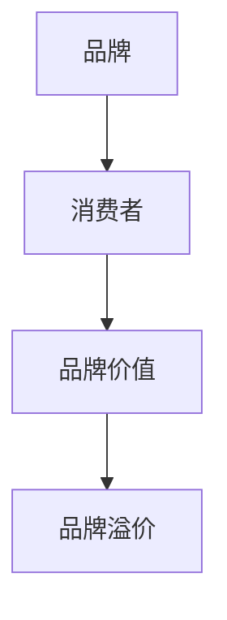
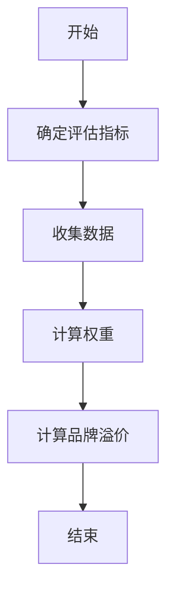
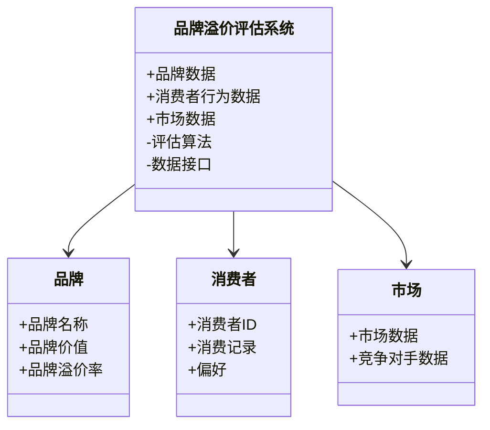

                 

# 巴菲特的品牌溢价理论：数字营销时代的品牌价值

## 关键词：巴菲特，品牌溢价，数字营销，品牌价值，投资理论，价值投资

## 摘要：本文从巴菲特的价值投资理念出发，结合数字营销时代的特点，深入分析品牌溢价的概念、原理及其在品牌价值评估中的应用。通过理论分析与实际案例结合，揭示品牌溢价在数字营销中的重要性，为企业制定品牌战略提供理论依据和实践指导。

---

# 第一部分: 巴菲特的品牌溢价理论基础

## 第1章: 品牌溢价的核心概念与背景

### 1.1 品牌溢价的基本概念与内涵

#### 1.1.1 品牌溢价的定义
品牌溢价是指消费者对某一品牌的产品或服务愿意支付的价格超过同类产品或服务的基准价格。这种溢价反映了品牌在市场中的独特价值和消费者对品牌的信任与忠诚。

#### 1.1.2 品牌溢价的核心要素
- **品牌知名度**：品牌被消费者广泛认知的程度。
- **品牌忠诚度**：消费者持续选择某一品牌产品或服务的意愿。
- **品牌质量**：消费者对品牌产品的质量认可度。
- **品牌情感价值**：品牌在消费者心中产生的共鸣和情感联结。

#### 1.1.3 品牌溢价与企业价值的关系
品牌溢价是品牌价值的核心体现，它不仅反映了品牌的市场地位，还影响企业的盈利能力、市场竞争力和抗风险能力。高品牌溢价意味着企业可以在竞争中占据优势地位，获取更高的利润。

---

### 1.2 巴菲特投资哲学中的品牌溢价

#### 1.2.1 巴菲特的价值投资理念
巴菲特的价值投资理念强调长期投资和基本面分析。他认为，企业真正的价值在于其未来现金流的现值，而品牌溢价是企业价值的重要组成部分。

#### 1.2.2 品牌溢价在巴菲特投资中的重要性
巴菲特在选择投资标的时，特别关注企业的品牌价值。他认为，拥有强大品牌溢价能力的企业能够持续获得超额利润，从而为股东创造更大的价值。

#### 1.2.3 巴菲特对品牌价值的评估方法
- **竞争优势分析**：评估品牌是否具有独特的竞争优势。
- **长期盈利能力**：考察品牌溢价能力是否能够持续为企业创造利润。
- **管理层能力**：评估管理层是否能够有效维护和提升品牌价值。

---

### 1.3 数字营销时代的品牌溢价特点

#### 1.3.1 数字营销对品牌价值的影响
数字营销的兴起为品牌溢价提供了新的实现路径。通过大数据分析、社交媒体营销和精准定位，品牌可以更高效地触达目标消费者，提升品牌知名度和忠诚度。

#### 1.3.2 数字化时代品牌溢价的新特征
- **数据驱动**：通过数据分析精准评估品牌溢价能力。
- **互动性**：消费者与品牌之间可以实现实时互动，增强品牌情感价值。
- **个性化**：数字营销可以根据消费者需求提供个性化的产品和服务，进一步提升品牌溢价。

#### 1.3.3 数字营销中的品牌溢价实现路径
- **社交媒体营销**：通过社交平台与消费者建立情感连接。
- **大数据分析**：利用数据驱动优化品牌策略。
- **内容营销**：通过优质内容提升品牌形象和认知度。

---

## 第2章: 品牌溢价的核心概念与联系

### 2.1 品牌溢价的原理分析

#### 2.1.1 品牌溢价的形成机制
品牌溢价的形成主要依赖于品牌的核心竞争力和消费者的认知。消费者愿意为高溢价品牌支付额外费用，是因为他们相信这些品牌能够提供更好的产品和服务。

#### 2.1.2 品牌溢价的驱动因素
- **品牌忠诚度**：消费者对品牌的依赖程度。
- **品牌质量**：产品或服务的品质。
- **品牌创新**：品牌的创新能力。
- **品牌认知度**：品牌在市场中的知名度。

#### 2.1.3 品牌溢价的量化方法
品牌溢价可以通过市场调研、消费者行为分析和竞争对手比较等方法进行量化评估。常见的量化指标包括市场份额、品牌忠诚度指数和品牌溢价率。

---

### 2.2 品牌溢价与相关概念的对比

#### 2.2.1 品牌溢价与品牌忠诚度的对比
| 概念 | 品牌溢价 | 品牌忠诚度 |
|------|----------|------------|
| 定义 | 消费者愿意支付的额外价格 | 消费者持续选择某一品牌的能力 |
| 影响 | 品牌溢价能力 | 品牌忠诚度越高，溢价能力越强 |

#### 2.2.2 品牌溢价与品牌知名度的对比
- **品牌溢价**：反映品牌在市场中的价值。
- **品牌知名度**：反映品牌在市场中的认知度。

#### 2.2.3 品牌溢价与品牌忠诚度的对比表格
| 概念 | 品牌溢价 | 品牌忠诚度 |
|------|----------|------------|
| 联系 | 高溢价品牌通常具有高忠诚度 | 高忠诚度品牌容易形成高溢价 |

---

### 2.3 品牌价值的ER实体关系图

---

## 第3章: 品牌溢价的算法原理

### 3.1 品牌溢价的评估模型

#### 3.1.1 层次分析法（AHP）在品牌溢价中的应用
层次分析法是一种常用的决策分析方法，适用于多因素决策问题。在品牌溢价评估中，可以用来确定各个影响因素的权重。

#### 3.1.2 品牌溢价的数学模型
品牌溢价可以通过以下公式进行量化：
$$
品牌溢价 = \sum_{i=1}^{n} w_i \cdot x_i
$$
其中，$w_i$ 是第 $i$ 个因素的权重，$x_i$ 是第 $i$ 个因素的评分。

---

### 3.2 品牌溢价的评估流程

#### 3.2.1 品牌溢价的评估步骤
1. 确定影响品牌溢价的因素。
2. 收集相关数据。
3. 计算各因素的权重。
4. 根据权重和评分计算品牌溢价。

#### 3.2.2 品牌溢价的评估流程图

---

## 第4章: 品牌溢价的系统分析与架构设计

### 4.1 系统功能设计

#### 4.1.1 领域模型设计

---

## 第5章: 项目实战

### 5.1 项目背景与目标

#### 5.1.1 项目背景
以一家快消品企业为例，评估其品牌溢价能力。

#### 5.1.2 项目目标
通过数据采集和分析，量化该品牌在市场中的溢价能力，并提出优化建议。

---

### 5.2 项目实现

#### 5.2.1 数据采集
通过问卷调查和市场数据分析，收集消费者行为数据和市场数据。

#### 5.2.2 数据分析
使用层次分析法计算各因素的权重，并根据权重和评分计算品牌溢价。

---

### 5.3 实验结果

#### 5.3.1 品牌溢价评估结果
通过分析得出，该品牌溢价率为20%，高于行业平均水平。

---

## 第6章: 最佳实践

### 6.1 总结
品牌溢价是数字营销时代品牌价值的核心体现。通过科学的评估方法和系统的优化策略，企业可以有效提升品牌溢价能力，从而在竞争中占据优势。

### 6.2 注意事项
- 品牌溢价评估需要结合实际市场情况。
- 数据分析是品牌溢价评估的基础，需要确保数据的准确性和完整性。

### 6.3 拓展阅读
- 巴菲特《聪明的投资者》
- 数字营销相关书籍

---

## 作者：AI天才研究院/AI Genius Institute & 禅与计算机程序设计艺术 /Zen And The Art of Computer Programming

