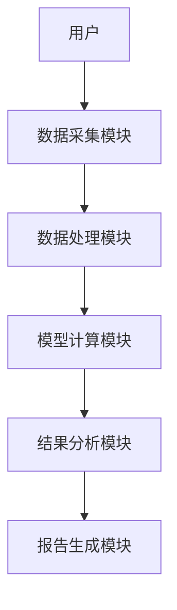

                 

# 巴菲特的品牌溢价理论：无形资产创造超额回报

## 关键词：品牌溢价，巴菲特，超额回报，无形资产，价值投资

## 摘要：本文深入探讨巴菲特的品牌溢价理论，分析如何通过无形资产如品牌忠诚度、市场地位和产品差异化创造超额回报。通过数学模型、系统架构和实际案例分析，揭示品牌溢价的内在逻辑和实现路径，为投资者和企业管理者提供理论支持和实践指导。

---

# 第一部分: 巴菲特的品牌溢价理论基础

## 第1章: 巴菲特投资理念与品牌溢价概述

### 1.1 巴菲特的生平与投资风格
沃伦·巴菲特是世界著名投资家，以价值投资闻名。他注重企业的内在价值，而非市场波动，强调购买优秀企业的一部分，而非价格便宜的股票。巴菲特的投资理念基于长期稳健的增长，而非短期收益。

### 1.2 品牌溢价的定义与内涵
品牌溢价是指消费者愿意为某一品牌支付的价格超过其产品实际成本或市场平均价格的现象。这种溢价源于品牌在市场中的独特地位和消费者的忠诚度。

### 1.3 品牌溢价的背景与发展
品牌溢价并非新兴概念，但随着市场竞争加剧，品牌的重要性愈发凸显。企业通过建立强大的品牌，能够在市场中获得更高的定价权，从而创造超额回报。

---

## 第2章: 品牌溢价的核心概念与理论框架

### 2.1 品牌溢价的核心要素
- **品牌忠诚度**：消费者对品牌的偏好程度直接影响其愿意支付的价格。
- **市场地位**：强大的市场地位使品牌能够制定更高的价格。
- **产品差异化**：独特的卖点使产品在竞争中脱颖而出。

### 2.2 品牌溢价的理论模型
通过构建品牌溢价的数学模型，我们可以量化其对超额回报的贡献。公式如下：
$$
\text{品牌价值} = \text{品牌忠诚度} \times \text{市场地位} \times \text{产品差异化}
$$

---

# 第二部分: 品牌溢价的数学模型与分析方法

## 第3章: 品牌溢价的数学模型构建

### 3.1 品牌价值的公式推导
品牌价值可以通过以下公式计算：
$$
V = P \times (1 + \beta)
$$
其中，\( V \) 为品牌价值，\( P \) 为产品基本价值，\( \beta \) 为品牌溢价系数。

### 3.2 品牌溢价的计算公式
品牌溢价的计算公式为：
$$
\text{品牌溢价} = \frac{V - P}{P} \times 100\%
$$

### 3.3 案例分析
以苹果公司为例，假设其产品基本价值为100美元，品牌价值为150美元，则品牌溢价为：
$$
\text{品牌溢价} = \frac{150 - 100}{100} \times 100\% = 50\%
$$

---

## 第4章: 品牌溢价的系统架构设计

### 4.1 系统功能设计
- **数据采集**：收集市场数据、消费者行为数据。
- **模型计算**：使用数学模型计算品牌溢价。
- **结果分析**：分析品牌溢价对企业价值的影响。

### 4.2 系统架构图

### 4.3 系统接口设计
- **输入接口**：市场数据、消费者行为数据。
- **输出接口**：品牌溢价报告。

---

## 第5章: 项目实战

### 5.1 案例分析：苹果公司的品牌溢价
- **市场分析**：苹果在高端市场的定位使其具备强大的品牌溢价能力。
- **竞争对手分析**：与三星相比，苹果的品牌忠诚度更高，溢价能力更强。
- **品牌忠诚度评估**：通过调查问卷和市场数据，评估苹果的品牌忠诚度。

### 5.2 实战步骤
1. 收集数据：获取苹果和竞争对手的市场数据。
2. 构建模型：使用品牌溢价公式进行计算。
3. 分析结果：评估苹果的品牌溢价能力。
4. 提出建议：优化品牌策略，提升溢价能力。

---

## 第6章: 总结与展望

### 6.1 本章小结
品牌溢价是企业创造超额回报的重要途径。通过价值投资和品牌建设，企业可以在竞争中占据优势。

### 6.2 未来展望
随着数字化转型，品牌溢价将更加依赖于创新和消费者体验。未来，企业需要更加注重品牌建设，以应对市场的变化。

---

作者：AI天才研究院 & 禅与计算机程序设计艺术

