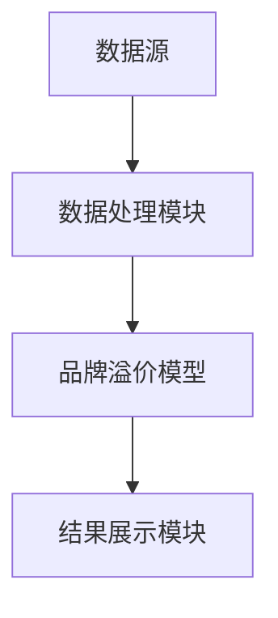
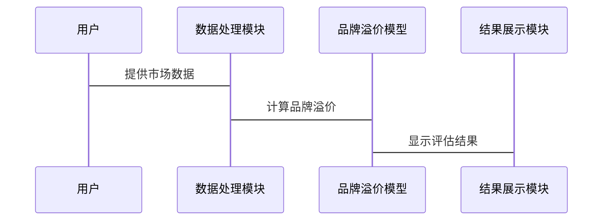

                 


# 巴菲特的品牌溢价理论：量子科技公司的品牌价值重估

## 关键词：
- 巴菲特投资理论
- 品牌溢价
- 量子科技
- 品牌价值评估
- 市场估值
- 企业价值

## 摘要：
本文深入探讨巴菲特的品牌溢价理论，并将其应用于量子科技公司的品牌价值评估。通过分析品牌溢价的核心概念、量子科技行业的特点、品牌溢价的数学模型、评估系统的架构设计以及实际案例分析，本文旨在为量子科技公司提供一种基于品牌溢价的重估方法，以提升企业的市场估值和长期价值。

---

## 第一部分: 巴菲特的品牌溢价理论概述

### 第1章: 巴菲特的品牌溢价理论基础

#### 1.1 巴菲特的投资理念与品牌价值

##### 1.1.1 巴菲特的价值投资理论
巴菲特的价值投资理论强调以低于内在价值的价格购买优质资产。他的核心理念是寻找具有持续竞争优势和良好治理结构的企业，并长期持有这些股票。品牌作为企业的一项无形资产，在他的投资决策中占据了重要地位。

##### 1.1.2 品牌价值在巴菲特投资理念中的地位
品牌价值是企业长期竞争优势的体现。巴菲特认为，强大的品牌可以带来客户忠诚度和定价能力，从而提高企业的盈利能力。品牌溢价是品牌价值的重要组成部分，反映了消费者对品牌的额外支付意愿。

##### 1.1.3 品牌溢价的定义与核心要素
品牌溢价是指消费者在购买某一品牌产品时愿意支付的价格高于同类产品的差额。其核心要素包括品牌认知度、品牌忠诚度、品牌联想和品牌资产。

#### 1.2 品牌溢价的来源与影响

##### 1.2.1 品牌溢价的来源分析
品牌溢价来源于品牌的核心竞争力、市场地位和消费者信任。优质的品牌能够通过创新、质量和服务赢得消费者的青睐。

##### 1.2.2 品牌溢价对市场估值的影响
品牌溢价直接影响企业的市场估值。具有强大品牌溢价能力的企业通常享有更高的市盈率和市净率。

##### 1.2.3 品牌溢价与企业长期价值的关系
品牌溢价是企业长期价值的重要组成部分。强大的品牌溢价能力能够提升企业的抗风险能力和市场地位。

### 第2章: 品牌溢价的核心概念与理论框架

#### 2.1 品牌溢价的核心概念

##### 2.1.1 品牌溢价的定义
品牌溢价是消费者对某一品牌产品支付的额外价格，反映了品牌在市场中的附加价值。

##### 2.1.2 品牌溢价的衡量指标
品牌溢价的衡量指标包括价格差、市场份额和品牌忠诚度等。

##### 2.1.3 品牌溢价与企业市场价值的关系
品牌溢价通过影响企业的定价能力和市场份额，进而影响其市场价值。

#### 2.2 品牌溢价的理论模型

##### 2.2.1 品牌溢价的构成要素
品牌溢价由品牌认知度、品牌忠诚度、品牌联想和品牌资产构成。

##### 2.2.2 品牌溢价与企业财务表现的关联
品牌溢价通过影响收入和利润，进而影响企业的财务表现。

##### 2.2.3 品牌溢价的动态变化机制
品牌溢价会随着市场环境和企业战略的变化而动态调整。

---

## 第二部分: 量子科技公司的品牌价值评估

### 第3章: 量子科技行业的特点与品牌价值

#### 3.1 量子科技行业的特点
量子科技行业具有高技术门槛、高创新能力和高成长性。品牌在该行业中尤为重要，因为技术复杂性和消费者信任度直接影响市场表现。

#### 3.2 量子科技公司的品牌价值
量子科技公司的品牌价值包括技术优势、市场地位和创新能力。品牌溢价是品牌价值的重要组成部分。

#### 3.3 品牌溢价在量子科技公司中的作用
品牌溢价能够提升量子科技公司的市场估值，增强消费者信任，并巩固市场地位。

### 第4章: 品牌溢价的数学模型与评估方法

#### 4.1 品牌溢价的数学模型

##### 4.1.1 品牌溢价的计算公式
$$ \text{品牌溢价} = \text{品牌产品价格} - \text{同类产品价格} $$

##### 4.1.2 品牌溢价的影响因素
品牌溢价的影响因素包括品牌认知度、品牌忠诚度和市场竞争力。

#### 4.2 品牌溢价的评估方法

##### 4.2.1 定性评估
定性评估包括品牌声誉和消费者信任度的分析。

##### 4.2.2 定量评估
定量评估包括市场份额和品牌忠诚度的分析。

##### 4.2.3 综合评估
综合评估结合定性和定量方法，全面评估品牌溢价。

---

## 第三部分: 量子科技公司的品牌溢价评估系统

### 第5章: 品牌溢价评估系统的架构设计

#### 5.1 问题场景介绍
量子科技公司的品牌溢价评估需要考虑技术复杂性和市场不确定性。

#### 5.2 系统功能设计

##### 5.2.1 数据采集模块
数据采集模块包括市场数据和消费者反馈的收集。

##### 5.2.2 模型计算模块
模型计算模块基于品牌溢价的数学模型进行计算。

##### 5.2.3 结果展示模块
结果展示模块以可视化方式呈现评估结果。

#### 5.3 系统架构设计

##### 5.3.1 系统架构图


##### 5.3.2 系统接口设计
系统接口包括数据输入接口和结果输出接口。

##### 5.3.3 系统交互流程


### 第6章: 项目实战

#### 6.1 环境配置
安装必要的数据分析工具和编程语言，如Python和Pandas。

#### 6.2 数据采集与预处理
采集量子科技公司的市场数据和消费者反馈，进行清洗和转换。

#### 6.3 品牌溢价模型实现
基于数学模型，使用Python代码实现品牌溢价计算。

##### 代码实现
```python
import pandas as pd

# 数据加载
data = pd.read_csv('market_data.csv')

# 品牌溢价计算
def calculate_brand_premium(data):
    brand_prices = data['品牌产品价格']
    competitor_prices = data['同类产品价格']
    brand_premium = brand_prices - competitor_prices
    return brand_premium

# 结果展示
prem = calculate_brand_premium(data)
print(prem)
```

#### 6.4 结果分析
分析品牌溢价的结果，评估品牌价值和市场地位。

---

## 第四部分: 总结与展望

### 第7章: 总结与最佳实践

#### 7.1 总结
本文深入探讨了巴菲特的品牌溢价理论，并将其应用于量子科技公司的品牌价值评估。通过数学模型和系统架构的设计，本文提出了一种品牌溢价评估方法。

#### 7.2 最佳实践 tips
- 定期评估品牌溢价，保持市场竞争力。
- 注重品牌建设，提升品牌认知度和忠诚度。
- 结合定量和定性方法，全面评估品牌价值。

#### 7.3 未来展望
随着量子科技的快速发展，品牌溢价评估将变得更加重要。未来的研究可以进一步完善数学模型，探索更多品牌价值的影响因素。

---

## 作者：
AI天才研究院/AI Genius Institute & 禅与计算机程序设计艺术 /Zen And The Art of Computer Programming

---

以上是《巴菲特的品牌溢价理论：量子科技公司的品牌价值重估》的技术博客文章大纲。如需进一步扩展或调整，请随时告知。

