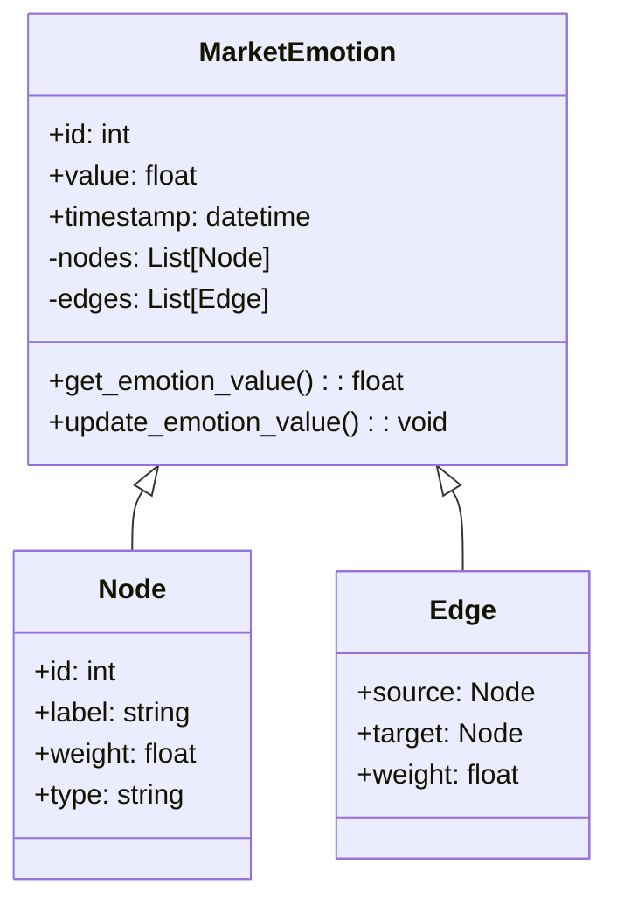
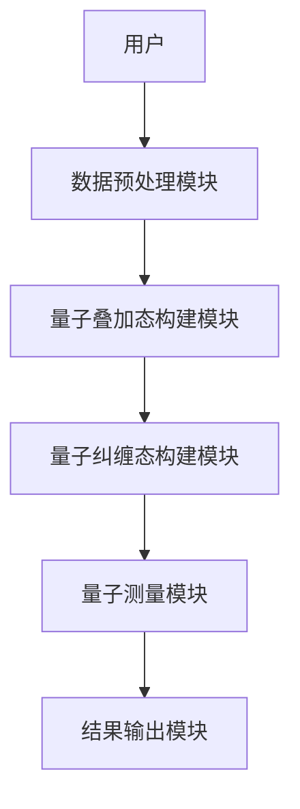
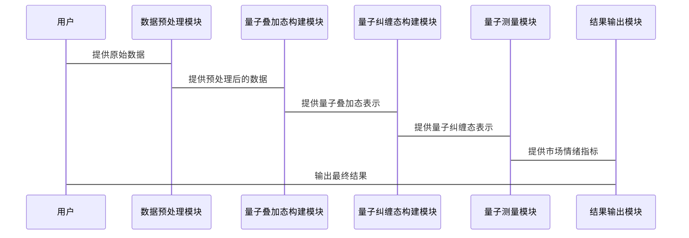

                 


# 巴菲特的市场情绪指标7.0：量子社会网络分析的金融应用

> 关键词：市场情绪指标，巴菲特，量子社会网络分析，金融应用，量子计算，算法实现

> 摘要：本文深入探讨了巴菲特的市场情绪指标7.0版本，结合量子社会网络分析的理论与实践，详细阐述了其在金融领域的应用价值。通过分析市场情绪指标的传统方法与量子社会网络分析的结合，本文提出了全新的金融分析框架，并通过具体案例展示了其实际应用效果。

---

## 第一部分: 市场情绪指标的背景与演变

### 第1章: 市场情绪指标的背景与演变

#### 1.1 巴菲特投资理论与市场情绪指标

##### 1.1.1 巴菲特投资理论的核心思想
巴菲特的投资理论以“价值投资”为核心，强调通过分析企业的基本面，寻找具有长期竞争优势的企业进行投资。市场情绪指标在他的投资策略中扮演着重要角色，帮助他判断市场的非理性波动，从而做出更为稳健的投资决策。

##### 1.1.2 市场情绪指标在巴菲特理论中的地位
市场情绪指标是巴菲特用来衡量市场非理性波动的重要工具。通过分析市场情绪，巴菲特能够在市场恐慌或狂热时，做出更为理性的投资决策。

##### 1.1.3 市场情绪指标的历史演变
市场情绪指标经历了从简单的情绪调查到复杂的情绪分析模型的演变。从传统的市场情绪指标到现代的量子社会网络分析，市场情绪指标的理论与实践不断进步。

---

### 第2章: 量子社会网络分析的引入

#### 2.1 量子社会网络分析的基本概念

##### 2.1.1 量子计算与社会网络分析的结合
量子计算的并行性和高效性为社会网络分析提供了新的可能性。通过量子计算，我们可以更高效地分析大规模的社会网络数据，提取出传统方法难以发现的模式和关联。

##### 2.1.2 量子社会网络分析的基本原理
量子社会网络分析基于量子计算的核心原理，利用量子叠加态和量子纠缠态来表示和处理社会网络中的复杂关系。

##### 2.1.3 量子社会网络分析在金融领域的应用前景
通过量子社会网络分析，我们可以在金融领域实现更加精准的市场情绪分析，帮助投资者做出更为科学的投资决策。

---

## 第二部分: 市场情绪指标7.0的核心概念

### 第3章: 量子社会网络分析的原理与算法

#### 3.1 量子社会网络分析的核心算法

##### 3.1.1 量子叠加态的数学表达
量子叠加态的数学表达为：$$|\psi\rangle = \alpha|0\rangle + \beta|1\rangle$$
其中，$\alpha$ 和 $\beta$ 是复数，且满足归一化条件：$$|\alpha|^2 + |\beta|^2 = 1$$

##### 3.1.2 量子纠缠态的构建
量子纠缠态的构建可以通过以下步骤实现：
1. 初始化两个量子位，使其处于基态 $|0\rangle$。
2. 对第一个量子位应用哈adamard门，得到叠加态：$$|+\rangle = \frac{1}{\sqrt{2}}(|0\rangle + |1\rangle)$$
3. 对第二个量子位应用CNOT门，得到纠缠态：$$|\psi\rangle = \frac{1}{\sqrt{2}}(|00\rangle + |11\rangle)$$

##### 3.1.3 量子测量的实现
量子测量的实现可以通过以下步骤完成：
1. 对量子态进行测量操作，得到测量结果。
2. 根据测量结果，确定量子态的坍缩状态。

---

### 第4章: 市场情绪指标7.0的量子社会网络分析框架

#### 4.1 量子社会网络分析的架构

##### 4.1.1 量子社会网络分析的层次结构
量子社会网络分析的层次结构包括数据层、计算层和应用层。

##### 4.1.2 量子社会网络分析的核心模块
量子社会网络分析的核心模块包括数据预处理、量子叠加态构建、量子纠缠态构建和量子测量。

##### 4.1.3 量子社会网络分析的实现步骤
1. 数据预处理：对原始数据进行清洗和归一化处理。
2. 量子叠加态构建：利用量子叠加态表示社会网络中的节点关系。
3. 量子纠缠态构建：通过量子纠缠态捕捉社会网络中的复杂关联。
4. 量子测量：对量子态进行测量，得到最终的市场情绪指标。

---

## 第三部分: 量子社会网络分析的系统设计与实现

### 第5章: 量子社会网络分析的系统设计

#### 5.1 系统功能设计

##### 5.1.1 领域模型类图


#### 5.2 系统架构设计

##### 5.2.1 系统架构图


#### 5.3 接口设计

##### 5.3.1 接口设计
1. 数据预处理模块接口：
   - 输入：原始数据
   - 输出：预处理后的数据
2. 量子叠加态构建模块接口：
   - 输入：预处理后的数据
   - 输出：量子叠加态表示
3. 量子纠缠态构建模块接口：
   - 输入：量子叠加态表示
   - 输出：量子纠缠态表示
4. 量子测量模块接口：
   - 输入：量子纠缠态表示
   - 输出：市场情绪指标

#### 5.4 交互序列图

##### 5.4.1 交互序列图


---

## 第四部分: 量子社会网络分析的项目实战

### 第6章: 项目实战

#### 6.1 环境安装与配置

##### 6.1.1 环境安装
1. 安装Python
2. 安装量子计算相关库（如Qiskit）
3. 安装社会网络分析相关库（如NetworkX）

#### 6.2 核心代码实现

##### 6.2.1 数据预处理代码
```python
import networkx as nx
import numpy as np
from qiskit import QuantumCircuit, execute, Aer

def preprocess_data(data):
    # 数据清洗和归一化处理
    pass
```

##### 6.2.2 量子叠加态构建代码
```python
def build_quantum_superposition(n):
    qc = QuantumCircuit(n)
    # 初始化量子位
    for i in range(n):
        qc.h(i)
    return qc
```

##### 6.2.3 量子纠缠态构建代码
```python
def build_quantum_entanglement(n):
    qc = QuantumCircuit(n)
    # 初始化量子位
    for i in range(n):
        qc.h(i)
    # 构建纠缠态
    qc.cnot(0, 1)
    return qc
```

##### 6.2.4 量子测量代码
```python
def measure_quantum_state(qc):
    backend = Aer.get_backend('qasm_simulator')
    result = execute(qc, backend).result()
    return result.get_counts()
```

#### 6.3 实际案例分析与解读

##### 6.3.1 案例分析
假设我们有一个社交网络数据集，包含用户的情感评分和社交关系。通过量子社会网络分析，我们可以更准确地预测市场情绪的变化。

##### 6.3.2 代码解读与分析
1. 数据预处理：清洗和归一化处理原始数据。
2. 量子叠加态构建：利用量子叠加态表示社会网络中的节点关系。
3. 量子纠缠态构建：通过量子纠缠态捕捉社会网络中的复杂关联。
4. 量子测量：对量子态进行测量，得到最终的市场情绪指标。

---

## 第五部分: 总结与展望

### 第7章: 总结与展望

#### 7.1 小结
本文详细探讨了巴菲特的市场情绪指标7.0版本，结合量子社会网络分析的理论与实践，提出了全新的金融分析框架。通过量子社会网络分析，我们可以在金融领域实现更加精准的市场情绪分析，帮助投资者做出更为科学的投资决策。

#### 7.2 注意事项
1. 量子社会网络分析需要高性能的计算资源。
2. 数据质量和数据隐私问题需要重点关注。
3. 量子社会网络分析的解释性需要进一步提升。

#### 7.3 拓展阅读
1. 量子计算在金融领域的应用
2. 社会网络分析的最新进展
3. 市场情绪指标的其他应用领域

---

## 参考文献

1.巴菲特投资理论的相关书籍和论文。
2.量子计算与社会网络分析的最新研究成果。
3.相关金融分析工具和技术的文献。

---

作者：AI天才研究院/AI Genius Institute & 禅与计算机程序设计艺术 /Zen And The Art of Computer Programming

