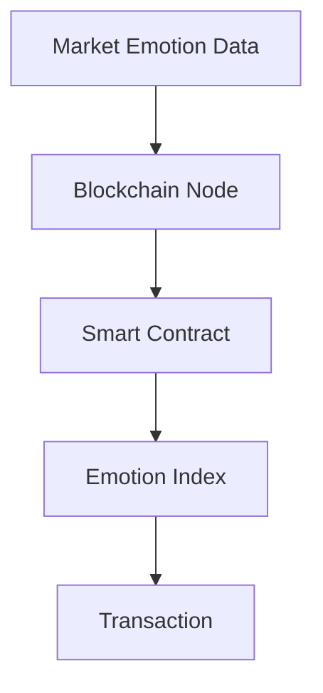
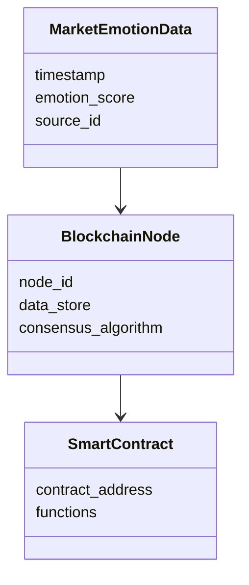
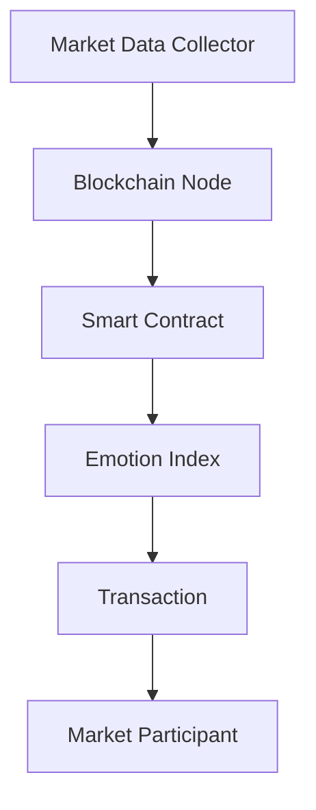

                 


# 巴菲特的市场情绪指标：区块链技术在金融市场的应用

> 关键词：市场情绪指标，区块链技术，金融市场，投资策略，数据分析，金融应用

> 摘要：本文探讨了市场情绪指标在金融投资中的重要性，并分析了区块链技术如何增强市场情绪指标的准确性和实时性。通过结合巴菲特的投资理念，文章详细阐述了区块链技术在市场情绪分析中的应用，包括数据采集、情绪计算、共识机制等关键环节，并提供了具体的算法实现和系统架构设计。文章还通过实际案例展示了区块链技术在市场情绪分析中的优势，并提出了未来的发展方向。

---

# 第一部分：市场情绪指标与区块链技术基础

## 第1章：市场情绪指标概述

### 1.1 市场情绪指标的定义与作用

#### 1.1.1 市场情绪指标的定义
市场情绪指标是用来量化市场参与者情绪状态的工具，反映了市场参与者对市场走势的乐观或悲观程度。市场情绪指标可以帮助投资者理解市场的心理状态，从而做出更明智的投资决策。

#### 1.1.2 市场情绪指标的作用与意义
市场情绪指标在金融投资中具有重要意义。它可以帮助投资者预测市场的短期波动、识别市场拐点，并辅助制定投资策略。市场情绪指标还能帮助投资者在市场恐慌时保持冷静，在市场狂热时保持警惕。

#### 1.1.3 市场情绪指标在投资决策中的应用
市场情绪指标在投资决策中的应用非常广泛。例如，投资者可以通过市场情绪指标来判断市场的风险水平，从而调整投资组合的配置。此外，市场情绪指标还可以用于验证市场是否处于非理性状态，从而为投资决策提供参考。

### 1.2 巴菲特的市场情绪指标理论

#### 1.2.1 巴菲特的投资理念与市场情绪的关系
巴菲特的投资理念强调长期价值投资，但他也高度重视市场情绪对投资决策的影响。他认为，市场情绪的波动会导致市场的短期非理性波动，而这种波动为长期投资者提供了低位买入的机会。

#### 1.2.2 巴菲特市场情绪指标的核心观点
巴菲特认为，市场情绪指标可以帮助投资者识别市场的过度乐观或过度悲观状态。当市场情绪过于乐观时，投资者应该保持警惕；当市场情绪过于悲观时，投资者可以寻找低估的投资机会。

#### 1.2.3 巴菲特市场情绪指标的量化方法
巴菲特市场情绪指标的量化方法主要包括以下几个方面：
1. 市场情绪指数的计算：通过分析市场参与者的交易行为、新闻媒体的情绪倾向等多维度数据，计算市场情绪指数。
2. 市场情绪周期的分析：通过分析市场情绪指数的变化趋势，识别市场的周期性波动。
3. 市场情绪与资产价格的相关性分析：研究市场情绪指数与资产价格之间的相关性，从而为投资决策提供依据。

## 第2章：区块链技术基础

### 2.1 区块链的基本概念

#### 2.1.1 区块链的定义与特点
区块链是一种去中心化的分布式账本技术，具有去中心化、不可篡改、透明性等特点。区块链通过分布式账本记录数据，并通过共识机制保证数据的真实性和完整性。

#### 2.1.2 区块链的核心技术原理
区块链的核心技术原理包括以下几个方面：
1. 分布式账本：区块链通过多个节点共同维护一个分布式账本，确保数据的去中心化和不可篡改。
2. 共识机制：区块链通过共识机制（如PoW、PoS等）确保所有节点达成一致，保证账本的一致性。
3. 加密算法：区块链通过加密算法（如哈希函数、数字签名等）确保数据的安全性和隐私性。

#### 2.1.3 区块链的分类与应用场景
区块链可以分为公链、私链和联盟链。公链（如比特币、以太坊）适用于去中心化应用，私链适用于企业内部应用，联盟链适用于特定机构之间的协作应用。

### 2.2 区块链在金融市场的潜力

#### 2.2.1 区块链在金融交易中的优势
区块链在金融交易中的优势主要体现在以下方面：
1. 提高交易效率：区块链通过智能合约自动执行交易，减少中间环节，提高交易效率。
2. 降低交易成本：区块链去中心化的特性可以降低交易成本，减少中间机构的参与。
3. 提高交易透明性：区块链的透明性和不可篡改性可以提高交易的透明性，减少欺诈行为。

#### 2.2.2 区块链在金融数据管理中的应用
区块链在金融数据管理中的应用包括：
1. 资产登记与转让：通过区块链技术实现资产的登记、转让和追踪。
2. 数据共享与隐私保护：通过区块链技术实现数据的安全共享，同时保护数据隐私。

#### 2.2.3 区块链对金融市场效率的提升
区块链技术可以提高金融市场的效率，主要体现在以下方面：
1. 提高交易结算速度：区块链通过智能合约实现快速结算，提高交易效率。
2. 降低交易成本：区块链通过去中心化减少中间机构的参与，降低交易成本。
3. 提高市场透明性：区块链的透明性和不可篡改性可以提高市场的信任度。

---

# 第二部分：市场情绪指标与区块链技术的结合

## 第3章：市场情绪指标的区块链实现

### 3.1 市场情绪指标的区块链数据模型

#### 3.1.1 数据模型的设计原则
市场情绪指标的区块链数据模型设计需要遵循以下原则：
1. 数据的实时性：市场情绪指标需要实时更新，反映市场的最新动态。
2. 数据的准确性：区块链的不可篡改性可以保证市场情绪指标的准确性。
3. 数据的可扩展性：数据模型需要支持市场的多样化数据来源和分析需求。

#### 3.1.2 数据模型的实体关系图（ER图）

```mermaid
erDiagram
    participant P : Participant
    participant T : Transaction
    participant E : Emotion
    P --> T : Participates in
    P --> E : Expressed
    T --> E : Generates
```

#### 3.1.3 数据模型的区块链结构设计



### 3.2 区块链在市场情绪指标中的应用

#### 3.2.1 数据采集与区块链存储
市场情绪指标的区块链实现需要通过分布式节点采集市场数据，包括新闻、社交媒体、交易数据等，并将这些数据存储在区块链上。

#### 3.2.2 情绪指标的计算与区块链共识机制
市场情绪指标的计算需要通过区块链的共识机制确保数据的准确性和一致性。通过智能合约自动计算市场情绪指数，并将结果存储在区块链上。

#### 3.2.3 情绪指标的实时更新与区块链网络
市场情绪指标需要实时更新，区块链网络通过共识机制保证数据的实时性和一致性。

## 第4章：区块链技术在市场情绪分析中的算法实现

### 4.1 情绪指标计算算法

#### 4.1.1 算法原理与流程
市场情绪指标的计算算法主要包括数据采集、情绪分析、指数计算三个步骤。

#### 4.1.2 算法的数学模型与公式
市场情绪指数的计算公式如下：

$$
\text{Market Emotion Index} = \sum_{i=1}^{n} w_i \times s_i
$$

其中，$w_i$ 是第$i$个数据源的权重，$s_i$ 是第$i$个数据源的情绪评分。

#### 4.1.3 算法的Python实现代码
以下是一个简单的市场情绪指数计算的Python代码示例：

```python
def calculate_market_emotion_index(data_sources):
    emotion_scores = []
    for source in data_sources:
        # 假设每个数据源的情绪评分已经计算完成
        emotion_scores.append(source['emotion_score'])
    # 根据权重计算指数
    index = sum(w * s for w, s in zip(weights, emotion_scores))
    return index

# 示例数据源
data_sources = [
    {'name': 'News', 'emotion_score': 0.8},
    {'name': 'Social Media', 'emotion_score': 0.6},
    {'name': 'Transaction Data', 'emotion_score': 0.7}
]

# 权重
weights = [0.5, 0.3, 0.2]

index = calculate_market_emotion_index(data_sources)
print(f"Market Emotion Index: {index}")
```

### 4.2 区块链共识算法与市场情绪指标的关系

#### 4.2.1 共识算法的基本原理
区块链共识算法（如PoW、PoS）通过确保所有节点达成一致，保证区块链数据的准确性和一致性。

#### 4.2.2 共识算法对市场情绪指标的影响
共识算法可以确保市场情绪指标的计算结果准确无误，并实时更新。

#### 4.2.3 共识算法的选择与优化
根据具体应用场景选择合适的共识算法，例如在高并发场景下选择高效共识算法（如GHOST）。

---

# 第三部分：系统架构与项目实战

## 第5章：系统架构设计与实现

### 5.1 系统功能设计

#### 5.1.1 领域模型设计
以下是市场情绪指标区块链系统的领域模型：



#### 5.1.2 系统架构设计
以下是市场情绪指标区块链系统的架构图：



### 5.2 项目实战

#### 5.2.1 环境安装
需要安装的环境包括Python、区块链框架（如以太坊）、数据分析库（如Pandas）等。

#### 5.2.2 系统核心实现源代码

以下是市场情绪指标区块链系统的Python实现代码：

```python
from web3 import Web3
from web3.ethereum import contract

# 连接到区块链节点
w3 = Web3(Web3.HTTPProvider('http://localhost:8545'))

# 定义智能合约接口
contract_address = '0x123456789abc'
contract_instance = w3.eth.contract(address=contract_address, abi=contract_abi)

# 发送交易
def update_emotion_index(emotion_score):
    transaction = contract_instance.functions.updateEmotionIndex(emotion_score).buildTransaction({
        'from': '0x123456789abc',
        'gas': 100000,
        'gasPrice': w3.toWei('1', 'gwei'),
        'value': 0
    })
    signed_txn = w3.eth.account.signTransaction(transaction, 'your_private_key')
    tx_hash = w3.eth.sendTransaction(signed_txn)
    return tx_hash

# 示例调用
emotion_score = 0.75
tx_hash = update_emotion_index(emotion_score)
print(f"Transaction Hash: {tx_hash}")
```

#### 5.2.3 案例分析与解读
通过实际案例分析，展示区块链技术在市场情绪指标中的应用优势。例如，通过区块链实现市场情绪指数的实时更新和共享，确保数据的准确性和透明性。

#### 5.2.4 项目小结
总结项目实现的关键点，包括数据采集、智能合约设计、共识机制选择等。

---

# 第四部分：总结与展望

## 第6章：总结与展望

### 6.1 总结
本文探讨了市场情绪指标在金融投资中的重要性，并分析了区块链技术如何增强市场情绪指标的准确性和实时性。通过结合巴菲特的投资理念，文章详细阐述了区块链技术在市场情绪分析中的应用，包括数据采集、情绪计算、共识机制等关键环节，并提供了具体的算法实现和系统架构设计。

### 6.2 展望
未来，随着区块链技术的不断发展，市场情绪指标在金融投资中的应用将更加广泛和深入。可以通过以下方面进一步研究：
1. 增强市场情绪指标的实时性和准确性。
2. 探索区块链技术在市场情绪分析中的更多应用场景。
3. 研究如何通过区块链技术实现更高效的市场情绪指标计算。

---

# 作者

作者：AI天才研究院/AI Genius Institute & 禅与计算机程序设计艺术/Zen And The Art of Computer Programming

