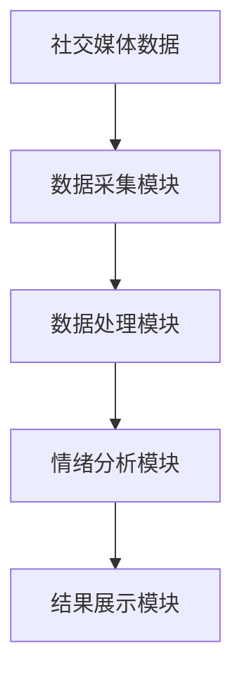

                 


# 巴菲特的市场情绪指标：社交媒体情绪分析的新维度

**关键词**：巴菲特，市场情绪指标，社交媒体，情绪分析，投资决策，自然语言处理，价值投资

**摘要**：本文探讨了如何利用社交媒体数据来分析市场情绪，并结合巴菲特的市场情绪指标进行投资决策。通过介绍社交媒体情绪分析的技术和方法，构建了一个结合巴菲特投资理念的市场情绪分析模型，展示了如何通过社交媒体数据捕捉市场情绪变化，从而辅助投资决策。

---

## 第1章: 市场情绪分析的背景与重要性

### 1.1 情绪分析的定义与核心概念

#### 1.1.1 情绪分析的定义
情绪分析（Sentiment Analysis）是自然语言处理（NLP）中的一个分支，旨在识别和分析文本中的情感倾向。它通过分析语言中的情感色彩，判断文本是正面、负面还是中性。

**例子**：例如，在股票论坛上，投资者可能会发布“这个股票看起来不错”（正面）或“我觉得这个股票会下跌”（负面）的评论。

#### 1.1.2 市场情绪分析的核心要素
市场情绪分析是一种通过分析市场参与者的情绪变化来预测市场行为的方法。其核心要素包括：
- **情绪强度**：情绪的强烈程度，例如“极度乐观”或“极度悲观”。
- **情绪倾向**：情绪的方向，例如正面或负面。
- **情绪变化速率**：情绪变化的速度，例如情绪从正面迅速转向负面可能预示市场波动。

#### 1.1.3 情绪分析在投资决策中的作用
情绪分析可以帮助投资者识别市场情绪的波动，从而提前做出投资决策。例如，当市场情绪过于乐观时，投资者可能需要警惕市场的潜在回调风险。

### 1.2 巴菲特的市场情绪指标

#### 1.2.1 巴菲特投资理念概述
沃伦·巴菲特（Warren Buffett）是世界上最著名的投资者之一，他的投资理念以“价值投资”为核心。他认为市场情绪是投资决策中的重要因素，尤其是当市场情绪过于乐观或悲观时，可能是一个投资机会或风险提示。

#### 1.2.2 市场情绪指标的核心概念
巴菲特认为，市场情绪可以通过市场参与者的言论和行为来判断。他提出了几个市场情绪指标，包括：
- **市场恐慌指数**：反映市场参与者对风险的厌恶程度。
- **市场贪婪指数**：反映市场参与者对收益的渴望程度。

#### 1.2.3 巴菲特情绪指标与传统技术分析的对比
与传统技术分析不同，巴菲特的情绪指标更关注市场参与者的心理状态，而不是市场的价格走势。传统技术分析关注价格、成交量等指标，而巴菲特的情绪指标关注市场的心理和情绪。

### 1.3 社交媒体作为情绪数据源的潜力

#### 1.3.1 社交媒体数据的特点
社交媒体数据具有实时性、广泛性和多样性。通过社交媒体，投资者可以实时了解市场参与者的看法和情绪。

#### 1.3.2 社交媒体数据在情绪分析中的优势
社交媒体数据可以提供大量的非结构化数据，这些数据可以用来分析市场情绪的变化。例如，投资者可以在社交媒体上发表对某只股票的看法，这些看法可以用来判断市场的整体情绪。

#### 1.3.3 社交媒体情绪分析的挑战与解决方案
社交媒体数据具有噪音多、数据量大、数据实时性高等特点。为了应对这些挑战，可以采用以下解决方案：
- 数据清洗：去除无关信息和噪音。
- 数据挖掘：使用机器学习算法从大量数据中提取有用信息。
- 数据可视化：将分析结果以图表形式展示，便于理解。

---

## 第2章: 巴菲特市场情绪指标与社交媒体的结合

### 2.1 巴菲特投资理念与社交媒体数据的关联

#### 2.1.1 巴菲特的价值投资理念
巴菲特的价值投资理念强调长期投资，寻找具有内在价值的股票。他认为市场情绪的波动是投资机会的来源。

#### 2.1.2 社交媒体数据如何反映市场情绪
社交媒体上的言论可以反映市场参与者的心理状态。例如，当许多投资者在社交媒体上表达对某只股票的乐观看法时，可以判断市场情绪为乐观。

#### 2.1.3 巴菲特情绪指标在社交媒体分析中的应用
通过分析社交媒体上的数据，可以构建与巴菲特情绪指标相关的情绪指标。例如，可以通过分析社交媒体上的评论，判断市场的恐慌指数和贪婪指数。

### 2.2 社交媒体情绪分析的指标体系

#### 2.2.1 情绪强度指标
情绪强度指标反映市场情绪的强烈程度。例如，正面情绪强度高可能意味着市场参与者对某只股票的乐观情绪强烈。

#### 2.2.2 情绪倾向指标
情绪倾向指标反映市场情绪的方向。例如，正面情绪倾向可能意味着市场参与者对某只股票的看法较为积极。

#### 2.2.3 情绪变化速率指标
情绪变化速率指标反映市场情绪变化的速度。例如，情绪从正面迅速转向负面可能预示市场的波动。

### 2.3 巴菲特情绪指标在社交媒体分析中的应用案例

#### 2.3.1 真实案例分析
例如，在2020年新冠疫情爆发期间，社交媒体上的评论可能反映出市场的恐慌情绪。通过分析这些评论，可以判断市场的恐慌指数较高，从而为投资者提供投资决策的参考。

#### 2.3.2 案例分析中的数据处理方法
- 数据清洗：去除无关信息和噪音。
- 数据挖掘：使用机器学习算法从大量数据中提取有用信息。
- 数据可视化：将分析结果以图表形式展示，便于理解。

---

## 第3章: 基于社交媒体的情绪分析算法

### 3.1 情绪分析的核心算法

#### 3.1.1 基于规则的情绪分析
基于规则的情绪分析是通过预定义的规则来判断文本的情绪。例如，如果文本中包含“乐观”、“积极”等关键词，则判断为正面情绪。

#### 3.1.2 基于机器学习的情绪分析
基于机器学习的情绪分析使用训练好的模型来预测文本的情绪。例如，使用支持向量机（SVM）或深度学习模型（如LSTM）来预测文本的情绪。

### 3.2 使用Python进行社交媒体情绪分析

#### 3.2.1 数据预处理
- 数据清洗：去除无关信息和噪音。
- 分词：将文本分解成词语或短语。
- 停用词处理：去除常见停用词，例如“的”、“是”等。

#### 3.2.2 情感分类模型
- 使用机器学习算法（如SVM、随机森林）进行情感分类。
- 使用深度学习模型（如LSTM、Transformer）进行情感分类。

#### 3.2.3 模型训练与评估
- 数据集划分：将数据集划分为训练集和测试集。
- 模型训练：使用训练集训练情感分类模型。
- 模型评估：使用测试集评估模型的性能，例如准确率、召回率等。

---

## 第4章: 系统架构设计与实现

### 4.1 系统功能设计

#### 4.1.1 数据采集模块
- 数据来源：社交媒体API（如Twitter API、Facebook API）。
- 数据类型：文本评论、点赞、分享等。

#### 4.1.2 数据处理模块
- 数据清洗：去除无关信息和噪音。
- 数据转换：将数据转换为模型可接受的格式。

#### 4.1.3 情绪分析模块
- 情绪分类：使用机器学习模型进行情绪分类。
- 情绪指标计算：计算市场恐慌指数和贪婪指数。

#### 4.1.4 结果展示模块
- 数据可视化：将分析结果以图表形式展示。
- 报告生成：生成情绪分析报告，供投资者参考。

### 4.2 系统架构设计

#### 4.2.1 系统架构图


#### 4.2.2 数据流图


### 4.3 系统实现

#### 4.3.1 环境配置
- 安装必要的Python库：如`requests`、`pandas`、`numpy`、`scikit-learn`、`tensorflow`等。

#### 4.3.2 数据处理代码
```python
import pandas as pd
import numpy as np

# 数据清洗
def clean_data(text):
    # 去除特殊符号
    cleaned_text = re.sub(r'[^\w\s]', '', text)
    return cleaned_text

# 分词
def tokenize(text):
    words = text.split()
    return words

# 停用词处理
stop_words = set(['的', '是', '在', '我', '他', '她', '它', '们', '你', '我', '他', '她', '它', '们', '你', '我', '他', '她', '它', '们', '你'])
def remove_stopwords(words):
    filtered_words = [word for word in words if word not in stop_words]
    return filtered_words
```

#### 4.3.3 情绪分类模型
```python
from sklearn.feature_extraction.text import TfidfVectorizer
from sklearn.svm import SVC
from sklearn.metrics import accuracy_score

# 特征提取
vectorizer = TfidfVectorizer()
X = vectorizer.fit_transform(corpus)

# 模型训练
model = SVC()
model.fit(X, labels)

# 模型预测
test_corpus = ["我非常乐观", "我对市场感到担忧"]
test_X = vectorizer.transform(test_corpus)
predicted_labels = model.predict(test_X)

# 模型评估
accuracy = accuracy_score(true_labels, predicted_labels)
print("Accuracy:", accuracy)
```

---

## 第5章: 项目实战与案例分析

### 5.1 项目背景
本项目旨在通过分析社交媒体上的数据，构建一个基于巴菲特市场情绪指标的情绪分析系统。通过这个系统，投资者可以实时了解市场情绪的变化，并据此做出投资决策。

### 5.2 数据采集
我们选择Twitter作为数据源，使用Twitter API采集与某只股票相关的评论和转发。

### 5.3 数据处理
对采集到的数据进行清洗、分词和去停用词处理，得到可用于模型训练的文本数据。

### 5.4 模型训练
使用TF-IDF特征提取方法，结合支持向量机（SVM）进行情绪分类。通过训练模型，我们可以预测每条评论的情绪倾向。

### 5.5 结果展示
将分析结果以图表形式展示，例如生成市场恐慌指数和贪婪指数的动态图表，帮助投资者直观了解市场情绪的变化。

---

## 第6章: 实际应用中的注意事项

### 6.1 数据质量
社交媒体数据可能存在噪音和偏差。为了提高分析结果的准确性，需要对数据进行清洗和预处理。

### 6.2 模型优化
情绪分析模型的性能直接影响分析结果。可以通过调整模型参数、尝试不同的算法等方法来优化模型性能。

### 6.3 结果验证
在实际应用中，需要对分析结果进行验证。例如，可以通过回测历史数据，验证情绪分析结果是否与实际市场行为一致。

---

## 第7章: 小结与展望

### 7.1 小结
本文探讨了如何利用社交媒体数据进行市场情绪分析，并结合巴菲特的市场情绪指标提出了一个新的分析方法。通过构建情绪分析模型，我们可以实时了解市场情绪的变化，并据此做出投资决策。

### 7.2 展望
未来，随着人工智能技术的发展，社交媒体情绪分析将更加精准和高效。我们可以进一步研究如何结合更多的市场数据，如新闻、财报等，构建更加全面的市场情绪分析系统。

---

## 作者

作者：AI天才研究院/AI Genius Institute & 禅与计算机程序设计艺术 /Zen And The Art of Computer Programming

---

**注**：本文是基于假设的系统设计和案例分析，实际应用中需要结合具体数据和实际情况进行调整和优化。

