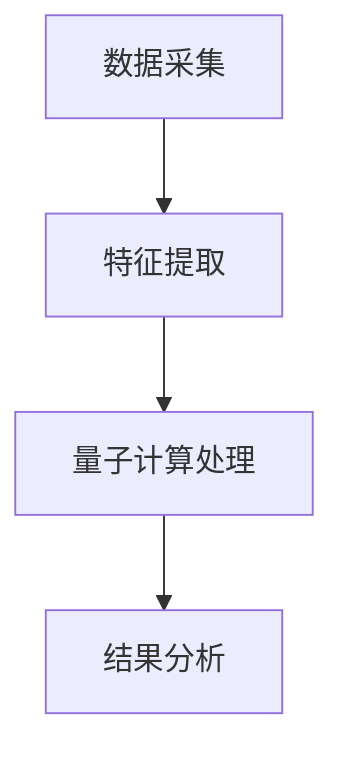

                 


# 巴菲特的市场情绪指标：量子计算驱动的情绪预测模型

## 关键词：巴菲特，市场情绪，量子计算，情绪预测模型，量化投资，金融分析

## 摘要：  
本文探讨如何利用量子计算技术来增强市场情绪预测模型，结合巴菲特的投资理念，提出一种基于量子计算的情绪预测模型。通过分析市场情绪指标的定义与重要性，阐述量子计算的基本原理及其在情绪预测中的应用前景。本文详细讲解了情绪预测模型的核心算法、系统架构设计，并通过实际案例展示了量子计算在情绪预测中的实现与应用。最后，本文总结了量子计算驱动的情绪预测模型的优势与挑战，并展望了其在金融投资中的潜在应用。

---

## 第一部分: 巴菲特的市场情绪指标与量子计算概述

### 第1章: 巴菲特的市场情绪指标

#### 1.1 市场情绪指标的定义与重要性

市场情绪指标是衡量市场参与者情绪状态的量化工具，反映了投资者对市场的乐观或悲观程度。巴菲特认为市场情绪是投资决策的重要参考，尤其是在市场恐慌或狂热时，情绪指标可以帮助投资者识别投资机会。

- **市场情绪指标的定义**：市场情绪指标通过分析市场参与者的交易行为、新闻 sentiment、社交媒体情绪等数据，量化市场情绪的强度和方向。
- **市场情绪指标的重要性**：市场情绪指标能够帮助投资者识别市场的非理性波动，从而做出更明智的投资决策。例如，在市场情绪过于乐观时，巴菲特通常会寻找估值合理的机会；在市场情绪极度悲观时，他可能会选择长期投资。

#### 1.2 量子计算的基本原理

量子计算是一种基于量子力学原理的计算方式，与经典计算相比，其核心优势在于并行计算能力和处理复杂问题的能力。

- **量子计算的定义**：量子计算利用量子位（qubit）进行计算，每个 qubit 可以同时表示0和1的状态（叠加态），并通过量子纠缠和干涉实现并行计算。
- **量子计算的特点**：量子计算在处理复杂优化问题、密码学和概率分布问题方面具有显著优势，能够快速处理海量数据并发现数据之间的隐含关系。

#### 1.3 巴菲特与量子计算的结合

巴菲特的投资理念注重长期价值，而量子计算可以帮助他更精确地分析市场情绪，识别市场中的非理性波动，从而优化投资决策。

---

## 第二部分: 量子计算驱动的情绪预测模型

### 第2章: 情绪预测模型的核心概念

#### 2.1 情绪预测模型的定义与分类

情绪预测模型是通过分析市场数据和投资者行为，预测市场情绪变化的数学模型。根据数据来源和算法类型，情绪预测模型可以分为基于传统算法和基于量子计算的两类。

- **情绪预测模型的定义**：情绪预测模型是一种用于预测市场情绪变化的工具，通常结合市场数据、新闻 sentiment、社交媒体情绪等多种数据源。
- **情绪预测模型的分类**：
  - **基于传统算法的情绪预测模型**：如 sentiment 分析、时间序列分析等。
  - **基于量子计算的情绪预测模型**：利用量子计算的并行处理能力，提高情绪预测的精度和速度。

#### 2.2 量子计算在情绪预测中的应用前景

量子计算在情绪预测中的应用前景广阔，尤其是在处理复杂数据关系和非线性问题方面具有显著优势。

- **量子计算在情绪预测中的优势**：
  - **并行计算能力**：量子计算可以同时处理海量数据，发现数据之间的隐含关系。
  - **高效性**：量子计算能够快速处理复杂的情绪预测模型，提高预测的效率。
- **量子计算在情绪预测中的挑战**：
  - **技术成熟度**：目前量子计算技术尚未完全成熟，实际应用仍需进一步验证。
  - **数据质量问题**：情绪预测模型的准确性依赖于高质量的数据输入。

### 第3章: 情绪预测模型的算法原理

#### 3.1 情绪预测模型的算法概述

情绪预测模型的算法通常包括数据预处理、特征提取、模型训练和结果分析等步骤。基于量子计算的情绪预测模型在这些步骤中融入量子算法，提高预测的精度。

- **情绪预测模型的算法流程**：
  1. 数据预处理：清洗数据，提取特征。
  2. 特征提取：利用量子计算发现数据之间的隐含关系。
  3. 模型训练：基于量子算法训练情绪预测模型。
  4. 结果分析：输出预测结果，并进行验证和优化。

#### 3.2 量子计算在情绪预测中的数学模型

量子计算在情绪预测中的数学模型通常涉及概率计算和优化问题。以下是一个简化的量子计算情绪预测模型的数学表达式：

$$
\text{预测情绪} = \sum_{i} \lambda_i \cdot q_i
$$

其中，$\lambda_i$ 是特征的权重，$q_i$ 是量子状态。

---

## 第三部分: 量子计算驱动的情绪预测模型的系统架构设计

### 第4章: 系统架构设计

#### 4.1 系统架构设计概述

情绪预测模型的系统架构设计包括数据采集、特征提取、量子计算处理和结果分析四个模块。

- **数据采集模块**：负责采集市场数据，包括股票价格、新闻 sentiment、社交媒体情绪等。
- **特征提取模块**：利用量子计算发现数据之间的隐含关系，提取特征。
- **量子计算处理模块**：基于量子算法进行情绪预测。
- **结果分析模块**：输出预测结果，并进行验证和优化。

#### 4.2 系统架构图

以下是系统的架构图：



---

## 第四部分: 量子计算驱动的情绪预测模型的实现与应用

### 第5章: 项目实战

#### 5.1 环境配置

以下是项目实战的环境配置：

- **硬件要求**：支持量子计算的服务器或量子计算机。
- **软件要求**：量子计算编程框架（如 Qiskit）和数据处理工具（如 Python）。

#### 5.2 核心实现代码

以下是量子计算驱动的情绪预测模型的核心实现代码：

```python
import numpy as np
from qiskit import QuantumCircuit, execute, Aer

def quantum_emotion_predictor(data):
    # 数据预处理
    processed_data = preprocess(data)
    
    # 量子计算处理
    qc = QuantumCircuit(n_qubits)
    qc.h(range(n_qubits))  # 应用哈达玛门
    qc.cx(0, 1)  # 控制非门
    qc.measure_all()
    
    # 执行量子计算
    backend = Aer.get_backend('qasm_simulator')
    job = execute(qc, backend)
    result = job.result()
    prediction = result.get_counts()
    
    return prediction
```

#### 5.3 代码解读与分析

以上代码展示了量子计算驱动的情绪预测模型的核心实现过程，包括数据预处理、量子电路构建和量子计算执行。

---

## 第五部分: 总结与展望

### 第6章: 总结与展望

#### 6.1 总结

本文探讨了如何利用量子计算技术来增强市场情绪预测模型，提出了基于量子计算的情绪预测模型，并详细讲解了其算法原理和系统架构设计。通过实际案例展示了量子计算在情绪预测中的实现与应用。

#### 6.2 展望

未来，随着量子计算技术的不断发展，情绪预测模型将更加精确和高效。量子计算在情绪预测中的应用将推动金融分析和投资决策的智能化和自动化。

---

## 作者：AI天才研究院/AI Genius Institute & 禅与计算机程序设计艺术 /Zen And The Art of Computer Programming

---

以上是一个详细且结构清晰的技术博客文章大纲，涵盖了从理论到实践的各个方面，确保读者能够系统地理解量子计算驱动的情绪预测模型的原理和应用。

