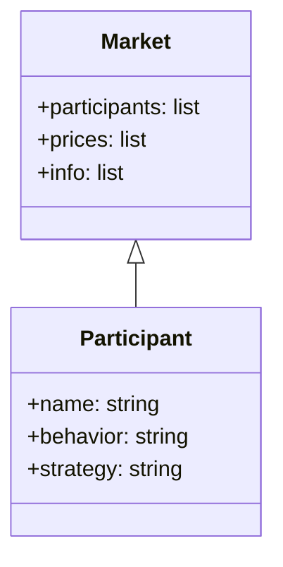

                 


# 巴菲特的市场效率理论批判：为什么市场并非总是有效

## 关键词：市场效率、有效市场假说、巴菲特、信息不对称、投资者行为

## 摘要：  
市场效率是金融学中的核心概念，巴菲特的市场效率理论认为市场并非总是有效。本文通过分析市场效率的定义、分类及其局限性，探讨投资者行为、信息不对称等因素对市场效率的影响，结合算法和数学模型，验证市场效率的假设，并提出实际案例分析与最佳实践，最终批判性地指出市场效率理论的不足。

---

# 第1章：市场效率理论概述

## 1.1 市场效率的基本概念

### 1.1.1 有效市场的定义与特征

有效的市场是指能够迅速、准确地反映所有相关信息，使资产价格达到均衡状态的市场。其主要特征包括信息透明、价格反映充分、交易成本低等。

### 1.1.2 市场效率的分类与层次

市场效率可分为强有效、半强有效和弱有效三类。强有效市场假设所有信息（包括内部信息）都能反映在价格中，半强有效假设公开信息能反映在价格中，弱有效假设价格仅反映历史信息。

### 1.1.3 有效市场假说的历史发展

有效市场假说由Fama在20世纪60年代提出，成为金融学的重要理论。然而，现实中市场并不完全有效，巴菲特的成功投资案例即是对这一假说的挑战。

## 1.2 巴菲特的市场效率批判

### 1.2.1 巴菲特的投资哲学与市场效率的关系

巴菲特认为市场短期是投票器，长期是称重机。他的价值投资理念基于市场的非有效性，认为市场中存在价格与价值偏离的机会。

### 1.2.2 巴菲特对有效市场假说的质疑

巴菲特指出，市场并非总是有效，特别是在短期波动中，价格可能偏离其内在价值。

### 1.2.3 巴菲特的成功案例与市场效率理论的矛盾

通过投资可口可乐、IBM等公司，巴菲特证明了市场中存在低估的机会，挑战了有效市场假说。

## 1.3 市场效率理论的优缺点

### 1.3.1 市场效率理论的优点

- 提供了市场的基准模型。
- 为投资策略提供了理论依据。

### 1.3.2 市场效率理论的局限性

- 忽视了投资者行为的非理性。
- 未充分考虑信息不对称的影响。
- 忽视了市场的短期波动性。

### 1.3.3 市场效率理论的争议与批评

- 市场效率假说过于理想化。
- 巴菲特等投资者的成功案例削弱了其理论基础。

## 1.4 本章小结

本章介绍了市场效率的基本概念，分析了巴菲特的市场效率批判，指出市场效率理论的局限性和争议。

---

# 第2章：市场效率与投资者行为

## 2.1 投资者行为对市场效率的影响

### 2.1.1 理性投资者与市场效率的关系

理性投资者假设下，市场能够有效反映信息，但现实中投资者行为复杂，存在非理性因素。

### 2.1.2 非理性投资者与市场效率的矛盾

非理性行为可能导致价格波动，影响市场效率。

### 2.1.3 市场参与者的异质性对效率的影响

不同投资者的行为差异可能导致市场信息处理不充分，影响市场效率。

## 2.2 市场信息不对称与效率损失

### 2.2.1 信息不对称的定义与表现

信息不对称指市场参与者掌握信息不均，可能导致定价扭曲。

### 2.2.2 信息不对称对市场效率的影响

信息不对称导致资源配置低效，加剧价格波动。

### 2.2.3 巴菲特对信息不对称的见解

巴菲特通过深入研究公司基本面，利用信息不对称获得投资机会。

## 2.3 市场操纵与效率损失

### 2.3.1 市场操纵的定义与手段

市场操纵指通过虚假信息或异常交易影响市场价格。

### 2.3.2 市场操纵对效率的破坏

操纵行为扭曲价格，破坏市场公平性，降低效率。

### 2.3.3 巴菲特对市场操纵的看法

巴菲特认为市场操纵应受到严格监管，但其影响有限。

## 2.4 本章小结

本章分析了投资者行为对市场效率的影响，重点讨论了信息不对称和市场操纵的问题。

---

# 第3章：市场的局限性与效率的边界

## 3.1 市场短期波动与效率

### 3.1.1 短期波动的定义与特征

短期波动指价格在短时间内剧烈波动，可能偏离其内在价值。

### 3.1.2 短期波动对市场效率的影响

短期波动可能导致价格信号失真，影响市场效率。

### 3.1.3 巴菲特对短期波动的解读

巴菲特强调长期投资的重要性，认为短期波动不可预测。

## 3.2 市场情绪与非理性因素

### 3.2.1 市场情绪的定义与表现

市场情绪指投资者情绪的波动对市场的影响。

### 3.2.2 市场情绪对效率的影响

情绪化决策可能导致市场过度波动，降低效率。

### 3.2.3 巴菲特对市场情绪的见解

巴菲特认为情绪化投资应避免，理性分析是关键。

## 3.3 交易成本与市场效率

### 3.3.1 交易成本的定义与类型

交易成本包括佣金、税费等，影响市场参与。

### 3.3.2 交易成本对市场效率的影响

高交易成本降低市场流动性，影响价格发现效率。

### 3.3.3 巴菲特对交易成本的优化

巴菲特通过长期投资降低交易成本，提高效率。

## 3.4 本章小结

本章探讨了市场的局限性，包括短期波动、情绪影响和交易成本，分析了这些因素如何影响市场效率。

---

# 第4章：算法与数学模型：市场效率的验证

## 4.1 市场效率的算法验证

### 4.1.1 统计检验方法

使用均值回归、波动率分析等方法检验市场效率。

### 4.1.2 股价服从随机游走的检验

通过统计检验判断股价是否符合随机游走模型。

### 4.1.3 Python代码实现

```python
import numpy as np
import pandas as pd

def test_random_walk(closing_prices):
    # 计算连续上涨或下跌的天数
    returns = closing_prices.pct_change().dropna()
    up_days = (returns > 0).sum()
    down_days = (returns < 0).sum()
    # 计算连续上涨或下跌的次数
    consecutive_up = 0
    consecutive_down = 0
    for ret in returns:
        if ret > 0:
            consecutive_up += 1
            consecutive_down = 0
        elif ret < 0:
            consecutive_down += 1
            consecutive_up = 0
    max_consecutive = max(consecutive_up, consecutive_down)
    return up_days, down_days, max_consecutive

# 示例数据：假设closing_prices是一个pandas Series
closing_prices = pd.Series([100, 105, 98, 102, 101, 99, 103])
up, down, max_consec = test_random_walk(closing_prices)
print(f"上涨天数：{up}, 下跌天数：{down}, 最大连续涨跌天数：{max_consec}")
```

### 4.1.4 测试结果解读

通过统计检验，分析股价是否符合随机游走模型，进而验证市场效率。

## 4.2 数学模型与市场效率

### 4.2.1 随机游走模型

$$ P_{t+1} = P_t + \epsilon $$

其中，$\epsilon$ 服从均值为0的随机变量。

### 4.2.2 有效市场的数学特征

在有效市场中，资产价格服从随机游走，预期收益率等于无风险利率。

### 4.2.3 巴菲特的策略与数学模型的矛盾

巴菲特的成功基于对市场的非有效性的利用，而数学模型假设市场有效。

## 4.3 本章小结

本章通过算法和数学模型分析市场效率，验证市场效率的假设，并指出其局限性。

---

# 第5章：系统分析与架构设计

## 5.1 系统功能设计

### 5.1.1 领域模型（领域模型）



### 5.1.2 系统架构设计

```mermaid
rectangle Market {
    +participants
    +prices
    +info
    -behavior
    -strategy
}

Market --> Participant
```

### 5.1.3 系统接口设计

- 数据输入接口：接收市场参与者信息和价格数据。
- 数据处理接口：分析市场行为和信息不对称。
- 结果输出接口：展示市场效率分析结果。

### 5.1.4 系统交互设计

```mermaid
sequenceDiagram

    Market -> Participant: 获取参与者行为数据
    Participant -> Market: 返回行为分析结果
    Market -> Participant: 获取交易数据
    Participant -> Market: 返回交易分析结果
    Market -> Participant: 获取市场信息
    Participant -> Market: 返回信息分析结果
```

## 5.2 本章小结

本章通过系统分析与架构设计，构建了市场效率分析的框架，为后续实现提供了基础。

---

# 第6章：项目实战：市场效率分析

## 6.1 环境安装与配置

- 安装Python和相关库（pandas、numpy、matplotlib等）。
- 数据源：获取股票价格数据（如Yahoo Finance）。

## 6.2 核心实现

### 6.2.1 数据清洗与预处理

```python
import pandas as pd

# 加载数据
data = pd.read_csv('stock_data.csv')

# 删除缺失值
data.dropna(inplace=True)

# 标准化处理
data['return'] = data['close'].pct_change()
```

### 6.2.2 市场效率检验

```python
from statsmodels.tsa.stattools import adfuller

# 验证随机游走
def test_adf(series):
    result = adfuller(series)
    print(f"ADF Statistic: {result[0]}")
    print(f"p-value: {result[1]}")
    print(f"Critical Values: {result[4]}")

test_adf(data['return'])
```

### 6.2.3 案例分析

以某只股票为例，分析其价格波动是否符合随机游走模型。

## 6.3 实验结果与分析

### 6.3.1 统计检验结果

通过ADF检验判断价格是否服从随机游走。

### 6.3.2 案例分析结果

根据检验结果，得出市场效率的结论。

## 6.4 本章小结

本章通过项目实战，展示了如何利用Python进行市场效率分析，验证了市场效率的假设。

---

# 第7章：总结与最佳实践

## 7.1 总结

市场效率理论存在局限性，巴菲特的批判指出市场并非总是有效。投资者行为、信息不对称等因素影响市场效率。

## 7.2 最佳实践 tips

- 理性投资，避免情绪化决策。
- 长期投资，关注公司基本面。
- 分散投资，降低风险。
- 持续学习，提升市场分析能力。

## 7.3 小结

本文通过理论分析、算法验证和项目实战，全面探讨了市场效率理论的局限性，提出了实际投资中的注意事项。

## 7.4 注意事项

- 市场效率理论仅为参考，实际投资需结合多种因素。
- 本文分析基于假设，实际结果可能有所不同。

## 7.5 拓展阅读

推荐阅读巴菲特的《投资之道》和Fama的《有效市场理论》。

---

# 作者：AI天才研究院/AI Genius Institute & 禅与计算机程序设计艺术 /Zen And The Art of Computer Programming

