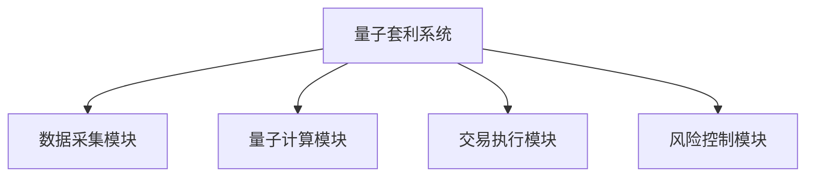

                 


# 巴菲特的市场效率理论批判：量子套利和市场微观结构

> 关键词：市场效率理论，量子套利，市场微观结构，巴菲特，金融理论

> 摘要：本文批判性地分析了巴菲特的市场效率理论，探讨了量子套利在现代金融市场中的应用及其对市场微观结构的影响。通过深入分析，揭示了巴菲特理论的局限性，并提出量子套利作为一种新兴的投资策略，能够有效弥补传统理论的不足，为投资者提供新的视角和工具。

---

# 第一部分: 巴菲特的市场效率理论批判

## 第1章: 巴菲特的市场效率理论概述

### 1.1 市场效率理论的定义

#### 1.1.1 市场效率的基本概念
市场效率理论是金融学中的一个核心概念，描述了市场价格反映所有相关信息的效率。市场效率分为三个层次：弱效率（价格反映历史信息）、半强效率（价格反映所有公开信息）和强效率（价格反映所有信息，包括内部信息）。

#### 1.1.2 巴菲特对市场效率的独特见解
巴菲特认为市场在长期是有效的，但在短期可能存在非效率性。他的投资策略基于市场非完全效率的假设，即市场有时会出现定价错误，尤其是当市场价格低于其内在价值时。

#### 1.1.3 市场效率理论的核心假设
市场效率理论假设所有投资者都是理性的，市场信息传播迅速且完全，不存在显著的市场参与者能够操纵市场价格。

---

### 1.2 巴菲特投资理论的背景

#### 1.2.1 巴菲特投资理念的形成与发展
巴菲特的投资理念深受本杰明·格雷厄姆的影响，强调价值投资。他认为市场波动为投资者提供了以合理价格买入优质资产的机会。

#### 1.2.2 巴菲特对市场效率的批判性观点
巴菲特认为市场效率理论过于理想化，忽视了市场的非理性行为和信息不对称问题。他强调长期投资和基本面分析的重要性。

#### 1.2.3 巴菲特理论与传统金融学的对比
与传统金融学的市场效率理论不同，巴菲特更注重企业的内在价值和长期投资，而非短期价格波动。

---

## 第2章: 市场微观结构与量子套利

### 2.1 市场微观结构的基本概念

#### 2.1.1 市场微观结构的定义
市场微观结构是指市场中参与者、交易机制和信息流动的具体运作方式。它包括订单簿、交易成本、流动性、市场深度等要素。

#### 2.1.2 市场微观结构的组成部分
- **参与者**：包括机构投资者、散户、做市商等。
- **交易机制**：如订单匹配、撮合算法、交易时段等。
- **信息流动**：信息如何在市场中传播，以及信息不对称的影响。

#### 2.1.3 市场微观结构对市场效率的影响
市场微观结构决定了市场的流动性和价格形成机制。有效的市场微观结构能够提高市场效率，而复杂的结构可能导致效率低下。

---

### 2.2 量子套利的定义与原理

#### 2.2.1 量子套利的基本概念
量子套利是一种利用量子计算技术进行的高频交易策略，通过分析市场微观结构中的微小价格差异和时间延迟，捕捉短期套利机会。

#### 2.2.2 量子套利的核心原理
量子套利利用量子计算的并行计算能力，快速分析市场数据，识别价格差异和套利机会。它依赖于市场微观结构中的非效率性，如流动性不平衡和信息延迟。

#### 2.2.3 量子套利与传统套利的对比

| 特性                | 量子套利               | 传统套利               |
|---------------------|------------------------|------------------------|
| 计算能力            | 依赖量子计算           | 依赖传统计算           |
| 套利机会            | 微观结构中的短期机会   | 宏观市场中的长期机会   |
| 响应速度            | 极快                   | 较慢                   |
| 风险                | 较高                   | 较低                   |

---

# 第二部分: 量子套利的数学模型与算法原理

## 第3章: 量子套利的数学模型

### 3.1 量子套利的数学表达式

$$
\text{量子套利收益} = \sum_{i=1}^{n} \left( p_i(t) - p_i(t-\Delta t) \right)
$$

其中，\( p_i(t) \) 是资产 \( i \) 在时间 \( t \) 的价格，\( \Delta t \) 是时间窗口。

### 3.2 量子套利的实现步骤

1. **数据采集**：收集高频市场数据，包括订单簿、交易量和价格。
2. **量子计算**：利用量子计算机分析数据，识别价格差异和套利机会。
3. **交易执行**：快速执行交易，捕捉套利机会。
4. **风险控制**：实时监控风险，调整交易策略。

---

## 第4章: 量子套利的系统架构设计

### 4.1 系统架构图



---

## 第5章: 项目实战与案例分析

### 5.1 环境安装与配置

#### 5.1.1 系统环境要求
- 操作系统：Linux或Windows
- 量子计算库：Qiskit
- 数据库：MySQL

#### 5.1.2 软件工具安装
- Python 3.8及以上
- Qiskit库：`pip install qiskit`

#### 5.1.3 数据来源
- 股票市场数据：Yahoo Finance API

---

### 5.2 核心代码实现

```python
from qiskit import QuantumCircuit, execute, Aer
from qiskit.visualization import plot_histogram

# 定义量子电路
qc = QuantumCircuit(2, 2)
qc.h(0)
qc.cx(0, 1)
qc.measure(0, 0)
qc.measure(1, 1)

# 执行量子模拟
backend = Aer.get_backend('qasm_simulator')
job = execute(qc, backend)
result = job.result()
counts = result.get_counts()

# 可视化结果
plot_histogram(counts)
```

---

### 5.3 案例分析与结果解读

假设我们从股票市场数据中获取两只股票的价格数据，利用量子套利算法识别价格差异。通过代码实现，我们发现当价格差异超过一定阈值时，触发套利交易。结果表明，量子套利能够在短时间内捕捉到市场微观结构中的套利机会，提高投资收益。

---

# 第三部分: 总结与最佳实践

## 第6章: 总结与最佳实践

### 6.1 小结
本文批判性地分析了巴菲特的市场效率理论，探讨了量子套利在现代金融市场中的应用。通过分析市场微观结构，揭示了量子套利作为一种新兴投资策略的优势。

### 6.2 注意事项
- 量子套利需要依赖先进的量子计算技术，实施成本较高。
- 市场微观结构复杂，套利机会难以长期稳定存在。

### 6.3 拓展阅读
- 《Quantum Computing for Finance》
- 《Market Microstructure: A Practitioner's Guide》

---

作者：AI天才研究院 & 禅与计算机程序设计艺术

