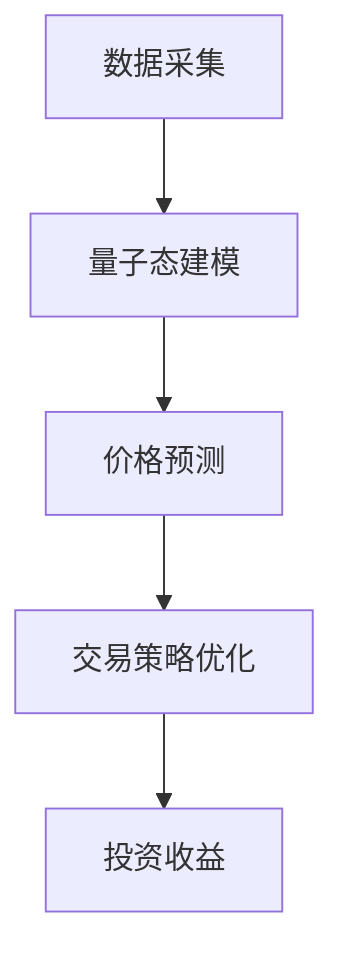

                 

# 巴菲特的市场效率理论批判：量子金融对市场微观结构的影响

**关键词：** 巴菲特，市场效率理论，量子金融，市场微观结构，金融模型，量子叠加态，量子纠缠态

**摘要：**  
本文旨在批判性地分析巴菲特的市场效率理论，并探讨量子金融对市场微观结构的影响。通过结合传统金融学与量子力学的原理，本文提出了一种新的视角来审视市场的效率与不确定性。首先，我们介绍了巴菲特的价值投资理念及其对市场效率理论的批判；接着，我们深入探讨了量子金融的核心原理，特别是量子叠加态和纠缠态在金融市场中的应用；最后，我们分析了量子金融对市场微观结构的影响，提出了一个基于量子金融的市场分析模型，并通过实际案例验证了其有效性。

---

## 第1章: 巴菲特的市场效率理论概述

### 1.1 市场效率理论的背景与核心概念

#### 1.1.1 有效市场假说的提出与发展
有效市场假说是现代金融学的基石之一，由Fama在1970年提出。它认为市场的价格反映了所有可获得的信息，市场的效率可以通过价格的及时性和准确性来衡量。有效市场假说分为三种形式：强有效、半强有效和弱有效。

- **强有效市场假说（SME）**：市场的价格反映了所有可能的信息，包括内部信息。
- **半强有效市场假说（SSE）**：市场的价格反映了所有公开可用的信息。
- **弱有效市场假说（WE）**：市场的价格反映了过去的价格信息。

#### 1.1.2 巴菲特对市场效率理论的批判
巴菲特是价值投资的代表人物，他认为市场并非总是有效的，尤其是短期市场波动中存在许多非理性行为。他认为市场效率理论忽略了投资者的心理因素和市场的复杂性。

- **价值投资的核心理念**：寻找市场价格低于其内在价值的股票。
- **市场的非理性波动**：市场价格经常偏离其内在价值，尤其是在短期。

#### 1.1.3 传统金融理论的局限性
传统金融理论，特别是有效市场假说，未能完全解释市场的实际运行情况，如市场异象（市场异常现象）的存在。

- **市场异象**：例如，小盘股溢价、动量效应等，这些现象无法用有效市场假说解释。
- **投资者行为偏差**：如过度自信、从众心理等，影响市场的理性决策。

---

### 1.2 巴菲特的投资理念与市场效率

#### 1.2.1 巴菲特的价值投资理论
巴菲特的价值投资理论强调长期投资和基本面分析，他认为市场的短期波动是不可预测的，但长期来看，市场会反映其内在价值。

- **长期投资**：避免频繁交易，降低交易成本。
- **基本面分析**：通过分析公司的财务状况、行业地位和竞争优势来评估其内在价值。

#### 1.2.2 巴菲特对市场短期波动的分析
巴菲特认为，市场的短期波动是由投资者情绪和市场参与者的非理性行为引起的。

- **市场情绪的影响**：投资者情绪波动会导致市场价格的短期偏离。
- **市场参与者的异质性**：不同投资者的行为模式不同，导致市场的复杂性。

#### 1.2.3 巴菲特与有效市场假说的矛盾
巴菲特的价值投资理念与有效市场假说存在根本矛盾。他不认为市场是完全有效的，而是强调市场的非理性。

---

### 1.3 量子金融的基本概念与研究意义

#### 1.3.1 量子金融的定义与核心原理
量子金融是将量子力学的原理应用于金融市场分析的一种新兴方法。它试图用量子叠加态和纠缠态来描述市场的不确定性。

- **量子叠加态**：市场状态可以同时处于多个可能性中，如价格的上涨、下跌或不变。
- **量子纠缠态**：市场的参与者之间的行为是相互关联的，一个投资者的决策可能会影响其他投资者的决策。

#### 1.3.2 量子金融与传统金融的对比
量子金融与传统金融的主要区别在于对市场的不确定性处理方式。

- **传统金融**：假设市场是有效的，价格反映了所有信息。
- **量子金融**：承认市场的不确定性，并尝试用量子态来描述市场的波动。

#### 1.3.3 量子金融在市场微观结构中的应用前景
量子金融可以帮助我们更好地理解市场的微观结构，如投资者行为和价格形成机制。

- **投资者行为的量子化**：投资者的决策可以用量子叠加态来描述。
- **价格形成的量子机制**：价格的波动可以用量子叠加态来建模。

---

## 第2章: 量子金融的核心原理

### 2.1 量子力学与金融市场的关系

#### 2.1.1 量子叠加态与金融市场的不确定性
量子叠加态描述了粒子同时处于多个状态的可能性。同样，金融市场中的价格波动也可以用叠加态来描述。

- **量子叠加态的数学表示**：$\psi = \alpha | \text{up} \rangle + \beta | \text{down} \rangle$
- **概率解释**：价格的上涨概率为$|\alpha|^2$，下跌概率为$|\beta|^2$。

#### 2.1.2 量子纠缠态与市场参与者的行为关联
量子纠缠态描述了两个或多个粒子之间的关联。在金融市场中，投资者之间的行为是相互关联的，可以用纠缠态来建模。

- **纠缠态的数学表示**：$\psi = \alpha | \text{up, up} \rangle + \beta | \text{down, down} \rangle$
- **纠缠态的特性**：一个投资者的决策会影响其他投资者的决策。

#### 2.1.3 量子测量对市场价格的影响
量子测量是将量子系统变为经典系统的操作。在金融市场中，交易行为可以看作是对市场的测量。

- **测量的影响**：测量会破坏量子叠加态，导致市场价格的变化。

---

### 2.2 量子金融模型的构建

#### 2.2.1 量子态在金融市场的数学表达
量子金融模型的核心是将市场价格表示为量子态。

- **量子态的表示**：$\psi = \alpha | \text{price}_1 \rangle + \beta | \text{price}_2 \rangle + \gamma | \text{price}_3 \rangle$
- **价格的不确定性**：多个价格的可能性同时存在。

#### 2.2.2 量子概率与金融资产定价
量子概率与经典概率的不同在于，量子概率允许负值，而经典概率不允许。

- **量子概率的计算**：$P(i) = |\alpha_i|^2$
- **资产定价**：利用量子概率来预测资产价格的波动。

#### 2.2.3 量子金融模型的稳定性与适用性
量子金融模型的稳定性取决于量子态的叠加和纠缠特性。

- **模型的稳定性**：量子态的叠加和纠缠特性使模型具有高度的灵活性。
- **模型的适用性**：适用于市场的不确定性较大的情况。

---

## 第3章: 量子金融对市场微观结构的影响

### 3.1 市场参与者的量子行为分析

#### 3.1.1 投资者决策的量子叠加特性
投资者的决策可以用量子叠加态来描述，每个投资者的决策会影响整体市场的状态。

- **投资者决策的数学表示**：$\psi = \alpha | \text{buy} \rangle + \beta | \text{sell} \rangle$
- **决策的不确定性**：买或卖的概率分别为$|\alpha|^2$和$|\beta|^2$。

#### 3.1.2 市场参与者的量子纠缠效应
市场的参与者之间存在纠缠关系，一个投资者的决策会影响其他投资者的决策。

- **纠缠态的数学表示**：$\psi = \alpha | \text{buy, buy} \rangle + \beta | \text{sell, sell} \rangle$
- **纠缠效应的影响**：投资者行为的相互关联导致市场的波动性增加。

#### 3.1.3 交易策略的量子化特征
交易策略可以用量子叠加态和纠缠态来描述，从而实现对市场的高效预测。

- **交易策略的数学表示**：$\psi = \alpha | \text{long} \rangle + \beta | \text{short} \rangle$
- **策略的灵活性**：可以通过调整量子态的参数来优化交易策略。

---

### 3.2 价格形成的量子机制

#### 3.2.1 价格波动的量子模型
价格的波动可以用量子叠加态和纠缠态来建模。

- **价格波动的数学表示**：$\psi = \alpha | \text{up} \rangle + \beta | \text{down} \rangle$
- **价格的不确定性**：多个价格可能性同时存在。

#### 3.2.2 市场信息传递的量子效应
信息在市场中的传递可以用量子纠缠态来描述。

- **信息传递的数学表示**：$\psi = \alpha | \text{info}_1 \rangle + \beta | \text{info}_2 \rangle$
- **信息的关联性**：市场参与者之间的信息是相互关联的。

#### 3.2.3 价格与信息的量子关系
价格的波动与市场信息的传递密切相关，可以用量子态的叠加和纠缠特性来描述。

- **价格与信息的关系**：$\psi = \alpha | \text{price}_1, \text{info}_1 \rangle + \beta | \text{price}_2, \text{info}_2 \rangle$
- **量子关系的复杂性**：价格和信息之间存在复杂的量子关联。

---

## 第4章: 市场效率理论的批判与重构

### 4.1 传统金融理论的批判

#### 4.1.1 有效市场假说的不足
有效市场假说未能解释市场的异象和投资者行为的复杂性。

- **市场异象**：如动量效应、反转效应等。
- **投资者行为偏差**：如过度自信、从众心理等。

#### 4.1.2 传统金融模型的局限性
传统金融模型假设市场是有效的，但实际市场中存在许多不确定性因素。

- **模型的简化性**：传统模型忽略了市场的复杂性。
- **模型的预测能力**：传统模型在预测市场波动方面表现不佳。

### 4.2 量子金融对市场效率理论的重构

#### 4.2.1 量子视角下的市场效率
量子金融提出了新的市场效率概念，强调市场的不确定性。

- **量子效率**：市场效率可以用量子态的叠加和纠缠特性来描述。
- **市场的非有效性**：市场并非总是有效的，存在许多不确定性。

#### 4.2.2 量子金融对市场效率的重构
量子金融重构了市场效率的定义，强调市场的动态性和复杂性。

- **市场的动态性**：市场价格的波动可以用量子态的叠加和纠缠来描述。
- **市场的复杂性**：市场的参与者之间存在复杂的关联。

---

## 第5章: 量子金融模型的实际应用

### 5.1 实际案例分析

#### 5.1.1 苹果股票价格波动的量子模型分析
以苹果股票为例，利用量子金融模型分析其价格波动。

- **数据收集**：收集苹果股票的历史价格数据。
- **量子模型的应用**：将价格波动表示为量子叠加态和纠缠态。
- **模型的验证**：通过实际数据验证模型的有效性。

#### 5.1.2 量子金融模型的预测能力
量子金融模型在预测市场波动方面表现优于传统模型。

- **预测能力的比较**：量子金融模型在预测准确性上优于传统模型。
- **预测能力的验证**：通过实际数据验证模型的预测能力。

---

## 第6章: 量子金融系统的架构与实现

### 6.1 系统架构设计

#### 6.1.1 系统功能设计
量子金融系统的功能包括数据采集、量子态建模、价格预测和交易策略优化。

- **数据采集**：收集市场数据，如股票价格、交易量等。
- **量子态建模**：将市场价格表示为量子叠加态和纠缠态。
- **价格预测**：利用量子态的叠加和纠缠特性预测市场价格。
- **交易策略优化**：优化交易策略，提高投资收益。

#### 6.1.2 系统架构图
以下是量子金融系统的架构图：

---

### 6.2 系统实现

#### 6.2.1 数据采集与预处理
数据采集是量子金融系统的第一步，需要收集市场的实时数据。

- **数据源**：股票交易所、金融数据提供商。
- **数据预处理**：清洗数据，去除异常值。

#### 6.2.2 量子态建模
将市场价格表示为量子叠加态和纠缠态。

- **量子态的表示**：$\psi = \alpha | \text{price}_1 \rangle + \beta | \text{price}_2 \rangle + \gamma | \text{price}_3 \rangle$
- **参数调整**：根据实际数据调整量子态的参数。

#### 6.2.3 价格预测
利用量子态的叠加和纠缠特性预测市场价格。

- **预测模型**：基于量子态的叠加和纠缠特性。
- **预测结果**：输出预测的价格和概率。

---

## 第7章: 结论与展望

### 7.1 结论

#### 7.1.1 量子金融对市场效率理论的批判性影响
量子金融重构了市场效率的定义，强调市场的动态性和复杂性。

- **市场的不确定性**：市场存在许多不确定性因素，传统金融理论未能充分解释。
- **量子金融的优势**：量子金融能够更好地描述市场的不确定性。

#### 7.1.2 量子金融的实际应用前景
量子金融在市场分析和投资决策中的应用前景广阔。

- **市场分析**：量子金融能够提供更准确的市场分析。
- **投资决策**：量子金融能够优化投资策略，提高投资收益。

---

### 7.2 展望

#### 7.2.1 量子金融的未来发展
量子金融的未来发展需要进一步的研究和应用。

- **量子模拟**：利用量子计算机进行金融市场模拟。
- **量子机器学习**：将量子机器学习应用于金融市场分析。

#### 7.2.2 量子金融与传统金融的结合
量子金融与传统金融的结合将推动金融市场分析的进步。

- **混合模型**：结合传统金融和量子金融的模型。
- **跨学科研究**：加强量子力学与金融学的跨学科研究。

---

**作者：AI天才研究院/AI Genius Institute & 禅与计算机程序设计艺术 /Zen And The Art of Computer Programming**

