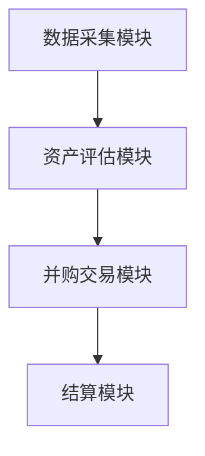
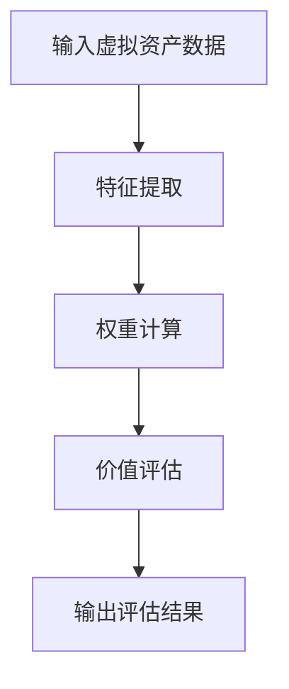

                 


# 巴菲特的并购策略在元宇宙虚拟资产整合中的新思路

> **关键词**: 巴菲特并购策略, 元宇宙, 虚拟资产, 价值评估, 风险控制, 系统架构

> **摘要**:  
> 本文探讨了巴菲特并购策略在元宇宙虚拟资产整合中的新思路。通过分析元宇宙虚拟资产的特点及其经济模型，结合巴菲特投资哲学的核心理念，提出了一套适用于元宇宙虚拟资产整合的质量型投资策略。文章详细介绍了元宇宙虚拟资产的价值评估方法、并购策略的具体应用以及系统架构设计，并通过实际案例展示了如何将巴菲特并购策略与元宇宙虚拟资产整合相结合，为未来的虚拟资产投资提供了新的视角。

---

# 正文

## 第一部分: 巴菲特并购策略与元宇宙虚拟资产整合的背景与概念

### 第1章: 巴菲特并购策略的核心思想

#### 1.1 巴菲特并购策略概述

##### 1.1.1 巴菲特投资哲学的核心理念  
巴菲特的投资哲学以“价值投资”为核心，强调通过深入研究企业的基本面，寻找具有持续竞争优势和良好管理团队的企业进行长期投资。其并购策略注重企业内在价值的评估，追求以合理的价格 acquiring high-quality assets.

##### 1.1.2 并购策略在巴菲特投资组合中的地位  
并购策略是巴菲特投资组合的重要组成部分。他倾向于收购那些具有强大现金流、良好护城河和管理团队的企业，并通过长期持有实现价值增长。

##### 1.1.3 巴菲特并购策略的成功案例分析  
以可口可乐和吉列公司为例，巴菲特通过并购这些具有强大品牌优势和市场地位的企业，实现了长期稳定的收益。

---

#### 1.2 元宇宙虚拟资产的基本概念

##### 1.2.1 元宇宙的定义与特征  
元宇宙（Metaverse）是基于区块链、AR/VR、人工智能等技术构建的虚拟空间，具有去中心化、沉浸式体验、实时性、经济系统和社交互动等特征。

##### 1.2.2 元宇宙虚拟资产的分类与特点  
元宇宙虚拟资产包括虚拟土地、数字艺术品、NFT、虚拟货币等，具有稀缺性、可编程性和可转让性等特点。

##### 1.2.3 元宇宙虚拟资产的经济模型  
元宇宙虚拟资产的经济模型基于区块链技术，通过智能合约实现资产的发行、交易和价值评估。

---

### 第2章: 巴菲特并购策略与元宇宙虚拟资产的结合

#### 2.1 元宇宙虚拟资产整合的背景与意义  
随着元宇宙的快速发展，虚拟资产的种类和价值不断提升，传统的并购策略需要与新兴技术结合，以应对虚拟资产整合的挑战。

#### 2.2 巴菲特并购策略在元宇宙中的应用潜力  
巴菲特并购策略的核心思想——寻找具有持续竞争优势和良好管理团队的企业——可以应用于元宇宙虚拟资产的整合，通过评估虚拟资产的内在价值和长期潜力，实现高质量的虚拟资产并购。

---

## 第二部分: 巴菲特并购策略在元宇宙虚拟资产整合中的应用策略

### 第3章: 元宇宙虚拟资产的价值评估与并购策略

#### 3.1 元宇宙虚拟资产的价值评估模型  
##### 3.1.1 传统资产价值评估方法的局限性  
传统资产价值评估方法难以适应虚拟资产的多样性和复杂性。

##### 3.1.2 元宇宙虚拟资产价值评估的独特性  
虚拟资产的价值受技术、市场需求和社区影响力等多种因素影响。

##### 3.1.3 元宇宙虚拟资产价值评估的多维度模型  
通过结合技术、经济和社区影响力等多维度因素，构建虚拟资产价值评估模型。

---

#### 3.2 巴菲特并购策略在元宇宙虚拟资产整合中的应用

##### 3.2.1 质量型投资策略在元宇宙中的应用  
选择具有强大品牌优势和市场地位的虚拟资产进行投资。

##### 3.2.2 价格型投资策略在元宇宙中的应用  
通过分析虚拟资产的市场供需关系，寻找被低估的虚拟资产进行投资。

##### 3.2.3 风险控制策略在元宇宙中的应用  
通过分散投资、设置止损等方式，降低虚拟资产整合中的风险。

---

### 第4章: 元宇宙虚拟资产整合中的风险与挑战

#### 4.1 元宇宙虚拟资产整合的主要风险  
##### 4.1.1 技术风险  
虚拟资产的技术实现可能面临安全漏洞和性能瓶颈。

##### 4.1.2 市场风险  
虚拟资产价格波动剧烈，可能影响投资收益。

##### 4.1.3 法律与合规风险  
虚拟资产的法律地位和监管政策尚不明确，可能引发合规风险。

#### 4.2 巴菲特并购策略在风险控制中的应用  
##### 4.2.1 风险评估与量化  
通过定量分析和定性评估，识别虚拟资产整合中的潜在风险。

##### 4.2.2 风险分散策略  
通过多元化投资，降低单一资产的风险敞口。

##### 4.2.3 风险应对机制  
建立风险管理团队，制定应急预案，应对突发事件。

---

### 第5章: 元宇宙虚拟资产整合的系统架构与实现方案

#### 5.1 元宇宙虚拟资产整合的系统架构  
##### 5.1.1 系统功能模块设计  
- 数据采集模块：采集虚拟资产的市场数据和交易信息。  
- 资产评估模块：基于多维度模型评估虚拟资产价值。  
- 并购交易模块：实现虚拟资产的并购交易和结算。  

##### 5.1.2 系统架构图（使用mermaid）  



---

#### 5.2 元宇宙虚拟资产整合的实现方案  
##### 5.2.1 数据采集与处理  
通过爬虫和API接口采集虚拟资产的市场数据，进行清洗和预处理。

##### 5.2.2 资产评估与匹配  
基于多维度模型评估虚拟资产价值，匹配潜在并购目标。

##### 5.2.3 并购交易与结算  
通过智能合约实现虚拟资产的并购交易和结算。

---

### 第6章: 巴菲特并购策略在元宇宙虚拟资产整合中的算法实现

#### 6.1 元宇宙虚拟资产评估算法  

##### 6.1.1 算法原理与流程图（使用mermaid）  



##### 6.1.2 算法实现的Python代码示例  

```python
import pandas as pd
import numpy as np

def value_assessment(data):
    # 特征提取
    features = data[['price', 'market_cap', 'volume']]
    # 权重计算
    weights = [0.5, 0.3, 0.2]
    # 价值评估
    assessment = np.dot(features, weights)
    return assessment

# 示例数据
data = pd.DataFrame({
    'price': [100, 200, 300],
    'market_cap': [500, 600, 700],
    'volume': [10, 20, 30]
})

# 评估结果
result = value_assessment(data)
print(result)
```

---

### 第7章: 项目实战与总结

#### 7.1 项目实战  
##### 7.1.1 环境安装  
安装必要的Python库，如Pandas、Numpy、Scikit-learn等。

##### 7.1.2 核心代码实现  
实现虚拟资产价值评估算法和并购交易模块。

##### 7.1.3 案例分析  
以某个虚拟资产为例，展示如何通过算法实现其价值评估和并购交易。

---

#### 7.2 总结与展望  
巴菲特并购策略在元宇宙虚拟资产整合中的应用具有广阔的前景。通过结合传统投资哲学与新兴技术，可以为虚拟资产投资提供新的思路和方法。

---

## 第三部分: 最佳实践与小结

### 第8章: 小结与注意事项

#### 8.1 小结  
本文探讨了巴菲特并购策略在元宇宙虚拟资产整合中的新思路，提出了基于质量型投资策略的虚拟资产整合方法。

#### 8.2 注意事项  
在实际应用中，需注意技术风险、市场风险和法律合规风险，确保虚拟资产整合的稳健性。

---

### 第9章: 拓展阅读与未来研究方向

#### 9.1 拓展阅读  
推荐相关领域的书籍和论文，如《巴菲特传》、《元宇宙经济学》等。

#### 9.2 未来研究方向  
进一步研究虚拟资产的经济模型、并购策略的优化以及风险管理技术。

---

## 作者信息

**作者：AI天才研究院/AI Genius Institute & 禅与计算机程序设计艺术/Zen And The Art of Computer Programming**

---

以上是文章的完整大纲和内容，希望对您有所帮助！

