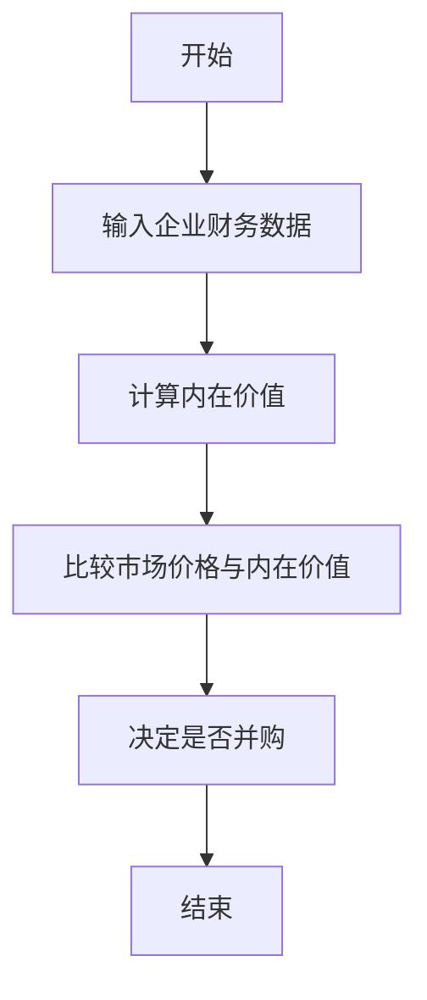

                 


# 巴菲特的并购策略：在跨境并购中的新考量

> **关键词**：巴菲特，并购策略，跨境并购，投资哲学，价值评估，风险管理

> **摘要**：本文详细探讨了巴菲特的并购策略及其在跨境并购中的新考量。通过分析巴菲特的核心投资哲学、并购策略的特点，以及跨境并购的背景与趋势，本文结合实际案例，探讨了在当前全球化背景下，巴菲特并购策略的新变化和应对之道。文章从背景介绍、核心概念、算法原理、系统分析、项目实战到最佳实践，全面解析了巴菲特并购策略在跨境并购中的应用。

---

## 第一部分：背景介绍

### 第1章：巴菲特并购策略概述

#### 1.1 巴菲特并购策略的核心概念

##### 1.1.1 并购的基本定义与分类

并购（Mergers and Acquisitions，简称 M&A）是指一家企业与其他企业（被并购企业）通过股权或资产的收购与合并，以实现资源优化配置和战略目标的过程。并购可以分为横向并购、纵向并购和混合并购三种类型：

- **横向并购**：同一行业内的企业并购，旨在扩大市场份额或消除竞争。
- **纵向并购**：产业链上下游企业之间的并购，以增强垂直整合能力。
- **混合并购**：与企业主业无关的并购，通常以获取新技术或进入新市场为目的。

##### 1.1.2 巴菲特并购策略的特点

巴菲特的并购策略以“价值投资”为核心，强调以下特点：

1. **注重内在价值**：巴菲特认为并购的核心在于被并购企业的内在价值，而非市场波动。
2. **长期持有**：巴菲特倾向于长期持有优质资产，追求稳定的收益。
3. **安全边际**：在并购中，巴菲特注重安全边际，即以低于内在价值的价格收购资产。
4. **管理层信任**：巴菲特重视被并购企业的管理层能力，并与管理层建立信任关系。

##### 1.1.3 巴菲特并购策略的边界与外延

巴菲特的并购策略不仅适用于企业并购，还可延伸至投资领域。其核心在于通过价值评估找到被低估的资产，并通过长期持有实现价值增长。并购策略的外延包括资产配置、风险管理等。

#### 1.2 巴菲特投资理念与并购策略的关系

##### 1.2.1 巴菲特的投资哲学

巴菲特的投资哲学基于“价值投资”，强调以下几点：

1. **寻找具有持续竞争优势的企业**：巴菲特倾向于投资那些具有强大护城河的企业，这些企业在长期竞争中能够保持领先地位。
2. **关注企业基本面**：巴菲特注重企业的财务状况、盈利能力、现金流等基本面指标。
3. **长期投资**：巴菲特倡导长期投资，避免短期市场波动的干扰。

##### 1.2.2 并购策略在投资中的地位

并购策略是巴菲特投资组合的重要组成部分。通过并购，巴菲特能够以低于内在价值的价格收购优质资产，并通过长期持有实现收益。并购策略不仅是巴菲特投资的一部分，也是其实现财富增长的重要手段。

##### 1.2.3 巴菲特并购策略的核心要素

1. **价值评估**：通过分析企业的财务数据、行业地位、竞争优势等，确定其内在价值。
2. **安全边际**：以低于内在价值的价格收购资产，确保投资的安全性。
3. **管理层信任**：与被并购企业的管理层建立信任关系，确保企业长期稳定发展。

#### 1.3 跨境并购的背景与趋势

##### 1.3.1 全球化背景下的跨境并购

随着全球经济一体化的深入，企业之间的竞争日益激烈。跨境并购成为企业拓展国际市场、获取资源和竞争优势的重要手段。近年来，中国企业在海外的并购活动频繁，涉及能源、科技、金融等多个领域。

##### 1.3.2 跨境并购的驱动因素

1. **资源获取**：通过并购获取海外的资源、技术、品牌等。
2. **市场拓展**：进入新的市场，扩大销售网络。
3. **成本控制**：通过并购降低生产成本。
4. **战略协同**：实现产业链的整合和协同效应。

##### 1.3.3 当前跨境并购的趋势与挑战

1. **趋势**：跨境并购呈现多元化和本地化趋势，企业更倾向于本地化管理以适应不同市场的法规和文化差异。
2. **挑战**：包括文化差异、法律法规、汇率波动、税收政策等。

---

## 第二部分：核心概念与联系

### 第2章：巴菲特并购策略的核心要素

#### 2.1 并购策略的原理

##### 2.1.1 价值评估模型

巴菲特的并购策略基于价值评估模型，核心是找到被低估的资产。以下是常见的价值评估模型：

1. **股息贴现模型（DDM）**：通过预测未来股息的现值来评估股票的价值。
2. **市盈率模型（P/E）**：通过比较市盈率与行业平均水平，判断股票是否被低估。
3. **内在价值模型**：通过分析企业的财务数据，计算其内在价值。

##### 2.1.2 并购的协同效应

协同效应是并购成功的关键因素之一。以下是常见的协同效应类型：

1. **成本协同效应**：通过合并运营降低成本。
2. **收入协同效应**：通过市场扩展增加收入。
3. **技术协同效应**：通过技术整合提升创新能力。

##### 2.1.3 并购的风险管理

并购过程中存在多种风险，包括：

1. **财务风险**：并购可能导致财务负担加重。
2. **整合风险**：企业文化和管理风格的差异可能导致整合失败。
3. **法律风险**：并购涉及复杂的法律法规问题。

#### 2.2 核心概念对比分析

##### 2.2.1 巴菲特并购策略与传统并购策略的对比

| 对比维度         | 巴菲特并购策略                  | 传统并购策略                  |
|------------------|---------------------------------|-------------------------------|
| 核心目标         | 寻找被低估的资产                | 扩大市场份额或实现协同效应     |
| 价值评估         | 侧重内在价值                   | 侧重市场价值                   |
| 风险管理         | 强调安全边际                   | 强调尽职调查                   |

##### 2.2.2 不同并购策略的优劣势分析

| 策略类型         | 优势                           | 劣势                           |
|------------------|--------------------------------|--------------------------------|
| 巴菲特并购策略   | 强调内在价值，风险较低          | 对企业治理要求较高              |
| 传统并购策略     | 短期收益明显                   | 风险较高，整合难度大             |

##### 2.2.3 并购策略的核心要素

1. **价值评估**：准确评估企业价值。
2. **风险管理**：控制并购风险。
3. **协同效应**：实现资源整合。

---

## 第三部分：算法原理

### 第3章：巴菲特并购策略的算法实现

#### 3.1 价值评估模型的数学公式

以下是巴菲特常用的价值评估模型之一——股息贴现模型（DDM）的数学公式：

$$ V = \frac{D}{k - g} $$

其中：
- \( V \) 表示股票的内在价值
- \( D \) 表示预期的股息
- \( k \) 表示折现率
- \( g \) 表示股息增长率

#### 3.2 价值评估算法的流程图



#### 3.3 价值评估算法的Python代码实现

```python
def calculate_intrinsic_value(dividends, growth_rate, discount_rate):
    return dividends / (discount_rate - growth_rate)

# 示例数据
dividends = 1  # 预期股息
growth_rate = 0.05  # 股息增长率
discount_rate = 0.1  # 折现率

intrinsic_value = calculate_intrinsic_value(dividends, growth_rate, discount_rate)
print(f"内在价值: {intrinsic_value}")
```

---

## 第四部分：系统分析与架构设计

### 第4章：系统架构设计

#### 4.1 问题场景介绍

在跨境并购中，企业需要考虑的因素包括：

1. **法律风险**：不同国家的法律法规差异。
2. **文化差异**：企业文化的融合问题。
3. **市场风险**：汇率波动、政策变化等。

#### 4.2 系统功能设计

##### 4.2.1 领域模型

```mermaid
classDiagram
    class 股票 {
        名称：String
        市场价格：Float
        内在价值：Float
        股息率：Float
    }
    class 并购决策 {
        决策：Boolean
        理由：String
    }
    class 价值评估 {
        评估结果：Float
    }
    stock -> 价值评估
    价值评估 -> 并购决策
```

#### 4.3 系统架构设计

##### 4.3.1 系统架构图


---

## 第五部分：项目实战

### 第5章：项目实战

#### 5.1 环境安装

需要安装以下工具：

1. Python 3.x
2. Mermaid工具
3. 常用开发工具（如PyCharm）

#### 5.2 核心代码实现

以下是价值评估模型的Python代码实现：

```python
def calculate_intrinsic_value(dividends, growth_rate, discount_rate):
    return dividends / (discount_rate - growth_rate)

# 示例数据
dividends = 1
growth_rate = 0.05
discount_rate = 0.1

intrinsic_value = calculate_intrinsic_value(dividends, growth_rate, discount_rate)
print(f"内在价值: {intrinsic_value}")
```

#### 5.3 实际案例分析

以某公司为例，分析其并购策略：

1. **价值评估**：计算公司的内在价值。
2. **市场分析**：评估市场风险。
3. **风险管理**：制定风险管理措施。

---

## 第六部分：最佳实践

### 第6章：最佳实践

#### 6.1 小结

巴菲特的并购策略以价值投资为核心，强调内在价值和长期持有。在跨境并购中，企业需要考虑法律、文化和市场风险，制定相应的风险管理措施。

#### 6.2 注意事项

1. **风险控制**：并购前进行充分的尽职调查。
2. **文化融合**：重视企业文化的融合。
3. **法律合规**：遵守目标国家的法律法规。

#### 6.3 拓展阅读

推荐阅读以下书籍和文章：

1. 巴菲特的《投资之道》。
2. 罗伯特·希勒的《非理性繁荣》。

---

## 作者

**作者：AI天才研究院/AI Genius Institute & 禅与计算机程序设计艺术/Zen And The Art of Computer Programming**

