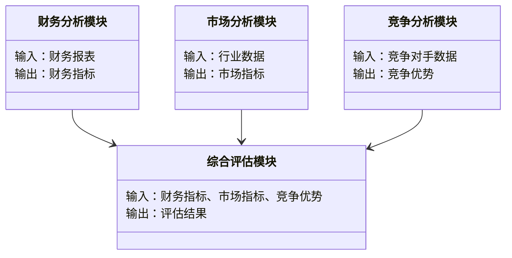
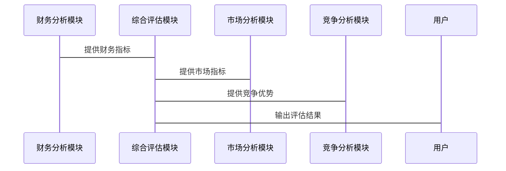

                 


# 巴菲特的并购策略：如何评估收购目标

> 关键词：巴菲特，并购策略，企业评估，财务分析，价值投资，安全边际

> 摘要：本文详细探讨了巴菲特的并购策略，从其投资哲学、并购目标评估的核心指标、财务分析方法、数学模型与算法、系统架构设计，到实际项目实战案例，层层深入地剖析了如何进行有效的并购评估。文章结合理论与实践，为读者提供了从基础概念到高级策略的全面指导。

---

## 第1章: 巴菲特的投资哲学与并购策略概述

### 1.1 巴菲特的投资哲学
#### 1.1.1 价值投资的核心理念
价值投资是一种长期投资策略，强调购买被市场低估的资产。巴菲特的哲学基于以下几点：
- **安全边际**：购买价格低于内在价值，确保即使有误差也能获利。
- **长期视角**：关注企业的长期盈利能力，而非短期市场波动。
- **企业基本面**：重视企业的财务状况、行业地位和竞争优势。

#### 1.1.2 安全边际的概念与重要性
安全边际是巴菲特策略的核心。它确保在市场价格波动时，投资者仍有获利空间。例如，如果一家公司的内在价值为100美元，购买价格为80美元，安全边际为20%。

#### 1.1.3 巴菲特并购策略的背景
20世纪70年代，巴菲特开始转向并购，寻找具有持续盈利能力且估值合理的企业。这一策略在收购可口可乐和吉列等公司中得到了成功应用。

### 1.2 并购策略的核心要素
#### 1.2.1 并购的基本概念与分类
并购分为横向、纵向和混合并购。巴菲特倾向于横向并购，以扩大市场份额。

#### 1.2.2 巴菲特并购的独特视角
- **聚焦行业龙头**：选择行业内的佼佼者，确保竞争优势。
- **长期稳定的现金流**：并购目标应具备稳定的现金流。

#### 1.2.3 并购与企业价值创造的关系
并购的目的是通过整合资源和优化管理，创造更大的企业价值。巴菲特注重企业内在价值的提升，而非单纯的市场份额扩大。

### 1.3 巴菲特并购策略的案例启示
#### 1.3.1 可口可乐收购案例分析
1985年，巴菲特收购可口可乐，看重其强大的品牌和持续的现金流。通过长期持有，实现了巨额收益。

#### 1.3.2 左右手公司战略解析
左手公司（被并购方）和右手公司（并购方）战略是指通过内部并购优化资源配置，降低成本。

#### 1.3.3 巴菲特并购策略的总结与启示
巴菲特的并购策略强调长期价值、安全边际和竞争优势，为投资者提供了宝贵的借鉴。

### 1.4 本章小结
本章介绍了巴菲特的投资哲学和并购策略的核心要素，通过案例分析，展示了其策略的有效性和独特性。

---

## 第2章: 并购目标评估的核心指标

### 2.1 财务指标分析
#### 2.1.1 市盈率（P/E）的计算与应用
市盈率=股价/每股收益。低市盈率可能意味着低估，但需结合行业和企业具体情况分析。

#### 2.1.2 市净率（P/B）的计算与应用
市净率=股价/每股净资产。适用于银行等资产密集型行业，衡量资产价值。

#### 2.1.3 净资产收益率（ROE）的计算与应用
ROE=净利润/净资产。高ROE表明企业利用资产效率高，但需排除杠杆效应影响。

### 2.2 非财务指标分析
#### 2.2.1 行业地位与竞争优势
企业是否是行业领导者，是否具备独特竞争优势。

#### 2.2.2 管理团队的能力评估
管理团队的经验、战略眼光和执行能力直接影响企业价值。

#### 2.2.3 企业治理结构的优劣
良好的治理结构能确保企业决策透明，减少代理成本。

### 2.3 巴菲特并购目标的筛选标准
#### 2.3.1 寻找具有持续盈利能力的企业
巴菲特倾向于投资那些能够持续盈利的企业，确保长期价值。

#### 2.3.2 评估企业的竞争优势
企业必须具备独特的竞争优势，如品牌、技术或成本优势。

#### 2.3.3 判断企业的财务健康状况
健康的财务状况是并购的基础，需关注资产负债表、利润表和现金流量表。

### 2.4 本章小结
本章详细探讨了并购目标评估的核心指标，包括财务和非财务指标，为读者提供了全面的评估框架。

---

## 第3章: 并购评估的财务分析方法

### 3.1 财务报表分析基础
#### 3.1.1 资产负债表的关键指标
- 资产负债率：衡量企业的财务杠杆和偿债能力。
- 流动比率：评估企业的短期偿债能力。

#### 3.1.2 利润表的关键指标
- 净利润：衡量企业的盈利能力。
- 营业利润率：评估企业的经营效率。

#### 3.1.3 现金流量表的关键指标
- 经营活动现金流：反映企业的造血能力。
- 自由现金流：衡量企业可分配的现金流。

### 3.2 资产评估方法
#### 3.2.1 市场法
基于市场可比交易价格进行评估。

#### 3.2.2 收益法
通过预测未来现金流，折现计算现值。

#### 3.2.3 成本法
基于重置成本进行评估。

### 3.3 并购定价策略
#### 3.3.1 市场公允价值的确定
参考市场价，结合企业实际情况调整。

#### 3.3.2 企业内在价值的评估
通过DCF模型计算企业内在价值。

#### 3.3.3 并购溢价的合理控制
合理控制溢价，避免过度支付。

### 3.4 本章小结
本章详细介绍了并购评估的财务分析方法，包括财务报表分析、资产评估方法和定价策略。

---

## 第4章: 巴菲特并购策略的数学模型与算法

### 4.1 并购评估的数学模型
#### 4.1.1 现金流折现模型（DCF）
$$DCF = \sum_{t=1}^{n} \frac{CF_t}{(1 + r)^t} + \frac{FV}{(1 + r)^n}$$
其中，CF_t为第t年的现金流，r为折现率，FV为终值。

#### 4.1.2 市盈率模型
$$P = \frac{P/E_{industry} \times EPS}{1}$$
其中，P/E为行业平均市盈率，EPS为每股收益。

#### 4.1.3 市净率模型
$$P = \frac{P/B_{industry} \times BPS}{1}$$
其中，P/B为行业平均市净率，BPS为每股净资产。

### 4.2 并购定价的算法实现
#### 4.2.1 现金流折现模型的步骤
1. 确定未来现金流。
2. 确定合适的折现率。
3. 计算现值。
4. 加上终值，得到企业价值。

#### 4.2.2 市盈率模型的计算公式
$$P = \frac{P/E_{target} \times EPS}{1}$$

#### 4.2.3 市净率模型的计算公式
$$P = \frac{P/B_{target} \times BPS}{1}$$

### 4.3 巴菲特并购策略的优化算法
通过动态调整模型参数，优化企业价值评估。

### 4.4 本章小结
本章通过数学模型和算法，详细介绍了并购评估的科学方法，为读者提供了理论依据和实践指导。

---

## 第5章: 系统分析与架构设计方案

### 5.1 问题场景介绍
企业并购评估需要综合分析财务、市场和管理等多方面因素，构建一个全面的评估系统。

### 5.2 系统功能设计
#### 5.2.1 领域模型（mermaid类图）


### 5.3 系统架构设计（mermaid架构图）


### 5.4 系统接口设计
- 财务分析模块接口：接收财务报表，输出财务指标。
- 市场分析模块接口：接收行业数据，输出市场指标。
- 竞争分析模块接口：接收竞争对手数据，输出竞争优势。

### 5.5 系统交互（mermaid序列图）


### 5.6 本章小结
本章通过系统分析与架构设计，展示了如何构建一个全面的并购评估系统，为实际应用提供了框架。

---

## 第6章: 项目实战

### 6.1 环境安装
- 安装Python和相关库（如pandas、numpy、scipy）。

### 6.2 系统核心实现源代码
#### 6.2.1 现金流折现模型的实现
```python
import numpy as np

def dcf_model(cash_flows, discount_rate, terminal_value):
    return np.sum(cash_flows / (1 + discount_rate)**np.arange(len(cash_flows))) + terminal_value / (1 + discount_rate)**len(cash_flows)
```

#### 6.2.2 市盈率模型的实现
```python
def pe_ratio_model(pe_industry, eps):
    return pe_industry * eps
```

#### 6.2.3 市净率模型的实现
```python
def pb_ratio_model(pb_industry, bps):
    return pb_industry * bps
```

### 6.3 代码应用解读与分析
通过代码实现并购评估模型，计算企业价值。

### 6.4 实际案例分析和详细讲解剖析
以可口可乐为例，分析其并购过程中的财务指标和模型应用。

### 6.5 项目小结
本章通过实际案例和代码实现，展示了并购评估的具体操作步骤。

---

## 第7章: 最佳实践、小结、注意事项与未来展望

### 7.1 最佳实践
- 结合多种模型进行评估，确保结果的准确性。
- 注重企业的长期价值，而不仅仅是短期收益。

### 7.2 小结
本文详细探讨了巴菲特的并购策略，从理论到实践，为读者提供了全面的指导。

### 7.3 注意事项
- 并购评估需结合实际情况，避免过于依赖模型。
- 注重风险控制，确保安全边际。

### 7.4 未来展望
随着人工智能和大数据技术的发展，并购评估将更加精准和高效。

### 7.5 本章小结
本章总结了并购评估的关键点，为读者提供了实际应用中的注意事项和未来展望。

---

## 作者信息

作者：AI天才研究院/AI Genius Institute & 禅与计算机程序设计艺术 /Zen And The Art of Computer Programming

---

通过以上目录结构，本文从理论到实践，系统地介绍了巴菲特的并购策略，为读者提供了全面的指导和实用的工具。

