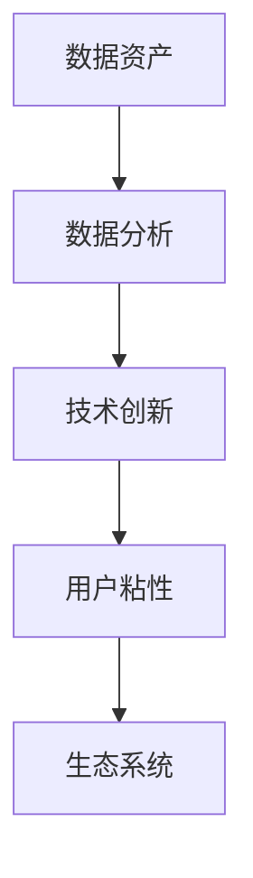

                 

# 巴菲特的护城河理论2.0：数字经济时代的竞争优势

> 关键词：巴菲特护城河理论，数字经济，竞争优势，企业战略，技术驱动

> 摘要：本文深入探讨了巴菲特护城河理论在数字经济时代的演变与应用，分析了数字经济时代竞争优势的核心要素，提出了构建可持续竞争优势的战略方法。

---

## 第1章: 巴菲特护城河理论概述

### 1.1 护城河理论的基本概念

#### 1.1.1 什么是护城河

护城河是指企业在市场上建立的竞争优势，这种优势能够阻止竞争对手轻易进入市场并获取市场份额。巴菲特将护城河视为企业长期盈利能力的基石，认为拥有强大护城河的企业能够在长期内持续创造超额价值。

$$
\text{护城河的宽度} = \frac{\text{市场份额} \times \text{利润率}}{\text{行业增长率}}
$$

护城河的宽度反映了企业在市场中的竞争优势强度。

#### 1.1.2 护城河的核心要素

以下是护城河的核心要素：

1. **成本优势**：企业通过规模效应、技术优势或供应链管理降低成本，从而在价格竞争中占据优势。
2. **品牌优势**：强大的品牌认知度和忠诚度能够吸引客户，降低市场竞争的压力。
3. **网络效应**：用户数量的增加会增强产品的价值，从而形成正反馈效应。
4. **技术壁垒**：企业通过技术创新建立技术壁垒，防止竞争对手快速复制。

### 1.2 护城河理论的演变

#### 1.2.1 从巴菲特1.0到2.0的演变

巴菲特的护城河理论最初主要关注企业的财务表现和竞争优势的稳定性。而在数字经济时代，护城河的内涵发生了变化，需要结合数字技术的特点进行优化和扩展。

$$
\text{护城河2.0} = \text{护城河1.0} \times \text{数字技术的影响力}
$$

数字经济时代的护城河2.0更加注重数据资产、技术驱动和生态系统建设。

---

## 第2章: 数字经济时代的竞争优势

### 2.1 数字经济的核心特征

#### 2.1.1 数据驱动的经济模式

数字经济的核心是数据的产生、处理和利用。数据已经成为企业的核心资产，能够为企业创造巨大的价值。

#### 2.1.2 数字技术的快速迭代

技术的快速迭代使得竞争优势难以持久，企业需要不断创新以保持护城河的宽度。

#### 2.1.3 网络效应与平台经济

网络效应和平台经济是数字经济时代的重要特征。企业通过构建平台，吸引更多的用户和参与者，形成正反馈效应。

### 2.2 数字经济中的护城河要素

#### 2.2.1 数据资产的积累与价值

数据资产是数字经济的核心资源。企业需要通过数据的收集、分析和利用，构建数据驱动的护城河。

#### 2.2.2 技术创新的门槛

技术创新是数字经济时代护城河的重要组成部分。企业需要通过持续的技术创新，建立技术壁垒，防止竞争对手的模仿。

#### 2.2.3 用户粘性与生态系统

用户粘性和生态系统是数字经济时代护城河的重要要素。企业需要通过提升用户体验、构建生态系统，增强用户的粘性和忠诚度。

---

## 第3章: 护城河理论2.0的核心模型与数学框架

### 3.1 护城河的数学模型

#### 3.1.1 护城河宽度的衡量公式

$$
\text{护城河宽度} = \frac{\text{数据资产价值} + \text{技术创新能力} + \text{用户粘性}}{\text{行业竞争程度}}
$$

#### 3.1.2 竞争优势的持续性分析

$$
\text{竞争优势持续性} = \text{护城河宽度} \times \text{创新能力}
$$

#### 3.1.3 数字经济时代护城河的动态变化模型

$$
\text{护城河动态变化} = \frac{\text{技术创新速度} + \text{数据增长速度}}{\text{市场变化速度}}
$$

### 3.2 护城河的系统架构

#### 3.2.1 护城河系统的组成要素

- 数据资产：数据的收集、存储、分析和利用。
- 技术创新：技术研发、专利布局和技术创新能力。
- 用户粘性：用户体验、用户忠诚度和用户参与度。
- 生态系统：合作伙伴、供应链和用户社区。

#### 3.2.2 数字经济时代护城河的系统架构图

#### 3.2.3 系统要素之间的关系分析

系统要素之间的关系是相互依赖、相互促进的。数据资产支持技术创新，技术创新增强用户粘性，用户粘性促进生态系统的扩展。

---

## 第4章: 数字经济中的护城河构建策略

### 4.1 数据驱动的护城河

#### 4.1.1 数据资产的积累与管理

数据资产的积累需要通过数据的收集、存储和分析来实现。企业需要建立数据治理体系，确保数据的准确性和可用性。

#### 4.1.2 数据分析与决策支持

数据分析是数据驱动护城河的核心。企业需要利用数据分析技术，支持业务决策，优化运营效率。

#### 4.1.3 数据安全与隐私保护

数据安全是数据驱动护城河的重要保障。企业需要通过数据加密、访问控制等手段，确保数据的安全性。

### 4.2 技术创新的护城河

#### 4.2.1 技术研发的投入与产出

技术创新需要持续的研发投入。企业需要通过技术研发，形成技术壁垒，防止竞争对手的模仿。

#### 4.2.2 技术壁垒的建立与维护

技术壁垒是技术创新护城河的核心。企业需要通过专利布局、技术标准等手段，建立技术壁垒。

#### 4.2.3 技术创新的持续性与扩展性

技术创新的持续性与扩展性是护城河的重要特征。企业需要通过持续的技术创新，扩展技术的应用场景，增强护城河的宽度。

---

## 第5章: 用户粘性与生态系统

### 5.1 用户粘性的构建策略

#### 5.1.1 用户体验的优化

用户体验是用户粘性的核心。企业需要通过优化用户体验，增强用户的满意度和忠诚度。

#### 5.1.2 用户忠诚度的提升

用户忠诚度是用户粘性的关键。企业需要通过品牌建设、用户关怀等手段，提升用户的忠诚度。

#### 5.1.3 用户参与度的增强

用户参与度是用户粘性的重要指标。企业需要通过互动活动、社区建设等手段，增强用户的参与度。

### 5.2 生态系统的构建与管理

#### 5.2.1 生态系统的构成要素

生态系统由合作伙伴、用户、开发者等多方参与者构成。企业需要通过生态系统的构建，形成协同效应。

#### 5.2.2 生态系统的协同效应

生态系统的协同效应是其核心价值。企业需要通过生态系统的协同，实现资源的优化配置，增强竞争优势。

#### 5.2.3 生态系统的动态平衡与优化

生态系统的动态平衡与优化是其持续发展的关键。企业需要通过持续的优化和调整，保持生态系统的活力。

---

## 第6章: 网络效应与平台经济

### 6.1 网络效应的定义与特点

#### 6.1.1 网络效应的产生机制

网络效应是通过用户的增加，产品或服务的价值也随之增加。这种正反馈效应是网络效应的核心特征。

#### 6.1.2 网络效应的放大效应

网络效应的放大效应使得竞争优势能够快速扩大。企业需要通过网络效应的放大，增强市场影响力。

#### 6.1.3 网络效应的边界与局限

网络效应的边界与局限是其发展的瓶颈。企业需要通过技术创新和生态系统的优化，突破网络效应的边界。

### 6.2 平台经济的护城河构建

#### 6.2.1 平台的双边市场模式

平台的双边市场模式是其核心特征。企业需要通过双边市场的构建，实现资源的优化配置。

#### 6.2.2 平台的网络效应与数据优势

平台的网络效应与数据优势是其竞争优势的重要来源。企业需要通过数据的积累和利用，增强网络效应。

#### 6.2.3 平台的生态整合与协同发展

平台的生态整合与协同发展是其持续发展的关键。企业需要通过生态系统的整合与协同发展，增强平台的竞争力。

---

## 第7章: 护城河的动态管理与持续优化

### 7.1 护城河的动态变化机制

#### 7.1.1 技术进步对护城河的影响

技术进步是护城河动态变化的重要驱动力。企业需要通过技术创新，保持护城河的宽度。

#### 7.1.2 市场变化对护城河的影响

市场变化是护城河动态变化的外部因素。企业需要通过市场分析，及时调整护城河的策略。

#### 7.1.3 竞争对手的应对策略

竞争对手的应对策略是护城河动态变化的挑战。企业需要通过竞争分析，制定有效的应对策略。

### 7.2 护城河的持续优化策略

#### 7.2.1 技术创新的持续投入

技术创新是护城河持续优化的核心。企业需要通过持续的技术创新，增强技术壁垒。

#### 7.2.2 数据资产的持续积累

数据资产的持续积累是护城河持续优化的重要保障。企业需要通过数据的收集和分析，增强数据资产的价值。

#### 7.2.3 用户粘性的持续增强

用户粘性的持续增强是护城河持续优化的关键。企业需要通过用户体验优化和用户参与度提升，增强用户粘性。

---

## 作者：AI天才研究院/AI Genius Institute & 禅与计算机程序设计艺术 /Zen And The Art of Computer Programming

---

### 项目实战：护城河理论2.0的应用案例

#### 案例1：科技公司A的护城河构建

科技公司A通过技术创新和数据驱动，成功构建了强大的护城河。公司通过持续的研发投入，形成了技术壁垒，同时通过数据的积累和分析，增强了竞争优势。

#### 案例2：电商平台B的网络效应

电商平台B通过构建双边市场模式，实现了网络效应的放大效应。公司通过吸引更多的用户和商家，形成了协同效应，增强了市场影响力。

#### 案例3：社交媒体C的生态系统

社交媒体C通过构建生态系统，实现了资源的优化配置。公司通过合作伙伴的整合和用户社区的建设，增强了生态系统的活力，提升了竞争优势。

---

## 总结

数字经济时代，护城河的构建需要结合数字技术的特点，注重数据资产、技术创新和用户粘性的提升。企业需要通过护城河理论2.0的指导，构建可持续的竞争优势，实现长期的盈利能力。

---

通过以上内容，我们可以看到，护城河理论在数字经济时代的应用具有重要的战略意义。企业需要结合自身的实际情况，灵活运用护城河理论，构建可持续的竞争优势。

