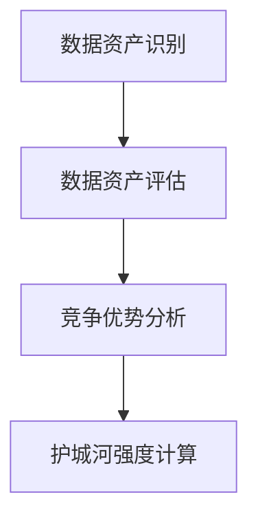
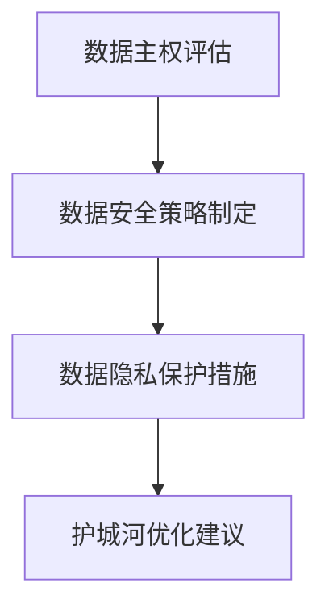
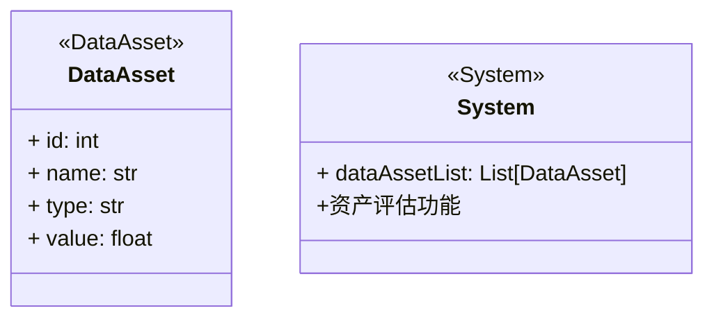
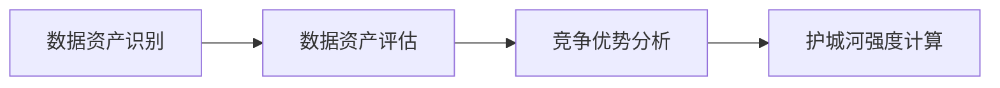
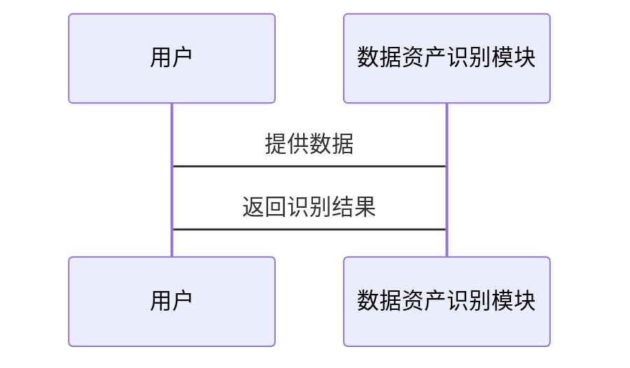

                 


# 巴菲特的护城河理论5.0：数据主权时代的竞争优势

> 关键词：巴菲特护城河理论，数据主权，竞争优势，企业价值，股东价值

> 摘要：本文深入分析了巴菲特护城河理论的最新发展——5.0版本，结合数据主权时代的特点，探讨了企业如何通过构建数据主权优势来巩固和提升竞争优势，从而实现可持续的高价值增长。文章从护城河理论的核心概念、数学模型、算法实现、系统架构到实际案例，全面解析了这一理论的演变与应用。

---

## 第一部分: 护城河理论的核心概念与演进

### 第1章: 护城河理论的核心概念与演进

#### 1.1 护城河理论的起源与演变

##### 1.1.1 传统护城河理论的定义与特点

护城河理论是巴菲特投资思想的核心之一，它强调企业通过某种独特优势（如成本优势、品牌优势、技术壁垒等）构建“护城河”，以抵御竞争对手的侵袭，从而确保长期的竞争优势和持续的盈利能力。传统护城河理论关注的是企业的静态竞争优势，主要依赖于资源、品牌、技术或市场准入壁垒。

##### 1.1.2 护城河理论的演进过程

随着商业环境的变化，护城河理论也在不断演进。从最初的“成本优势”到后来的“品牌溢价”、“技术壁垒”，再到如今的数据主权时代，护城河理论经历了多个版本的更新。每一次版本的更新都反映了时代背景的变化和技术的进步。

##### 1.1.3 护城河理论5.0版本的提出背景

在数据主权时代，企业的竞争优势不再仅仅依赖于传统的资源或技术壁垒，而是更多地依赖于数据的采集、处理、分析和利用能力。数据已成为企业最核心的资产，而数据主权则是企业在数字化转型中必须面对的重要议题。护城河理论5.0版本应运而生，它将数据主权纳入护城河的核心要素，强调企业通过数据主权的构建来巩固竞争优势。

#### 1.2 数据主权时代的商业竞争新格局

##### 1.2.1 数据主权的定义与重要性

数据主权是指一个国家或企业对其数据的合法权利和控制权。在数据主权时代，企业必须确保其数据的合法性和安全性，同时通过数据的高效利用来创造价值。数据主权不仅是企业竞争优势的核心，也是企业生存和发展的基础。

##### 1.2.2 数据主权时代的企业竞争优势

在数据主权时代，企业的竞争优势不再仅仅依赖于传统的资源或技术壁垒，而是更多地依赖于数据的采集、处理、分析和利用能力。企业通过构建数据主权优势，可以更好地掌控数据资源，提升数据的利用效率，从而在竞争中占据优势。

##### 1.2.3 护城河理论与数据主权的结合

护城河理论5.0版本将数据主权纳入护城河的核心要素，强调企业通过数据主权的构建来巩固竞争优势。数据主权不仅是企业竞争优势的核心，也是企业生存和发展的基础。

### 第2章: 护城河理论的核心要素与数学模型

#### 2.1 护城河理论的核心要素

##### 2.1.1 经济护城河的定义与特征

经济护城河是指企业通过某种独特优势（如成本优势、品牌溢价、技术壁垒等）构建的竞争优势，使得企业在竞争中能够持续获得超额利润。经济护城河的核心在于其可持续性和可扩展性。

##### 2.1.2 竞争优势的形成机制

竞争优势的形成机制包括成本优势、差异化优势和技术优势等。企业通过构建这些优势，可以在竞争中占据优势地位。

##### 2.1.3 企业价值与股东价值的关系

企业价值是企业未来现金流的现值，股东价值则是企业为股东创造的超额回报。经济护城河的强度直接影响企业价值和股东价值。

#### 2.2 护城河5.0的数学模型与公式

##### 2.2.1 经济护城河强度计算公式

$$ EHI = \frac{S}{T} $$

其中，EHI为经济护城河强度，S为竞争优势的可持续性，T为时间因素。

##### 2.2.2 数据主权对企业价值的影响模型

$$ EV = D \times S $$

其中，EV为企业价值，D为数据资产的规模，S为数据主权的保护程度。

---

## 第三部分: 护城河5.0的算法与系统架构

### 第3章: 护城河5.0的算法与实现

#### 3.1 护城河5.0的算法原理

##### 3.1.1 数据资产识别与评估算法



##### 3.1.2 数据主权保护算法



#### 3.2 护城河5.0算法的Python实现

##### 3.2.1 数据清洗与特征提取

```python
import pandas as pd
data = pd.read_csv('data.csv')
data_clean = data.dropna()
features = data_clean[['feature1', 'feature2']]
```

##### 3.2.2 竞争优势评估模型

```python
from sklearn.linear_model import LinearRegression
model = LinearRegression()
model.fit(features, target)
```

### 第4章: 护城河5.0的系统架构与设计

#### 4.1 系统功能设计

##### 4.1.1 数据资产识别模块



#### 4.2 系统架构设计

##### 4.2.1 系统架构图



#### 4.3 系统接口设计

##### 4.3.1 数据资产识别接口



---

## 第四部分: 项目实战与总结

### 第5章: 项目实战

#### 5.1 项目背景与目标

##### 5.1.1 项目背景

在数据主权时代，企业必须确保其数据的合法性和安全性，同时通过数据的高效利用来创造价值。

##### 5.1.2 项目目标

通过构建护城河5.0系统，帮助企业识别数据资产，评估竞争优势，优化数据主权保护策略，从而提升企业价值。

#### 5.2 核心代码实现

##### 5.2.1 数据资产识别模块

```python
import pandas as pd
data = pd.read_csv('data.csv')
data_clean = data.dropna()
features = data_clean[['feature1', 'feature2']]
model = LinearRegression()
model.fit(features, target)
```

##### 5.2.2 竞争优势评估模型

```python
from sklearn.linear_model import LinearRegression
model = LinearRegression()
model.fit(features, target)
```

#### 5.3 案例分析与解读

##### 5.3.1 案例背景

以某金融科技公司为例，该公司希望通过护城河5.0系统来优化其数据资产管理和数据主权保护策略。

##### 5.3.2 实施步骤

1. 数据资产识别与清洗
2. 竞争优势评估模型构建
3. 数据主权保护策略优化

#### 5.4 项目小结

通过护城河5.0系统的实施，该公司成功识别了其核心数据资产，并通过数据主权保护策略的优化，提升了其竞争优势和企业价值。

### 第6章: 总结与展望

#### 6.1 总结

护城河5.0版本将数据主权纳入护城河的核心要素，强调企业通过数据主权的构建来巩固竞争优势。数据主权不仅是企业竞争优势的核心，也是企业生存和发展的基础。

#### 6.2 展望

随着数据主权时代的深入发展，护城河理论5.0版本将不断完善和优化，为企业提供更强大的竞争优势和价值创造能力。

---

## 作者

**作者：AI天才研究院/AI Genius Institute & 禅与计算机程序设计艺术 /Zen And The Art of Computer Programming**

---

希望这篇文章能够为您提供有价值的信息和启发！

