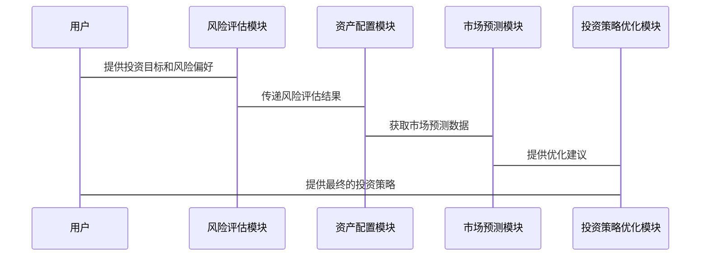

                 

# 巴菲特的焦点投资：集中vs分散的争论

## 关键词：巴菲特、投资策略、集中投资、分散投资、风险管理、资产配置、价值投资

## 摘要：本文深入探讨了巴菲特的投资理念，重点分析了集中投资与分散投资的策略，通过数学模型和实际案例，分析了两者的风险与收益平衡，提出了在不同市场环境和风险偏好下的投资策略选择。

---

# 1. 投资的基础与巴菲特的焦点投资理念

## 1.1 投资的基本概念与背景介绍

### 1.1.1 投资的定义与分类

投资是指将资金用于购买资产，以期在未来获得收益的行为。根据投资对象的不同，可以分为股票、债券、房地产等多种类型。投资的核心目标是实现财富的保值与增值。

### 1.1.2 投资的基本原则与目标

投资的基本原则包括分散风险、长期持有、价值投资等。投资的目标通常包括追求高回报、保值、资产增值等。

### 1.1.3 投资与风险管理的关系

风险管理是投资过程中不可忽视的一部分。投资者需要通过分散投资、选择优质资产等方式来降低风险。

## 1.2 巴菲特的投资理念概述

### 1.2.1 巴菲特的生平简介

沃伦·巴菲特是世界著名投资者，以价值投资和长期持有的策略闻名。他的投资理念深受格雷厄姆价值投资理论的影响。

### 1.2.2 巴菲特的投资哲学

巴菲特强调购买优质资产，长期持有，并在市场恐慌时买入，在市场狂热时卖出。他的投资哲学包括“安全边际”和“企业内在价值”等核心概念。

### 1.2.3 巴菲特的投资风格与特点

巴菲特的投资风格以集中投资为主，偏好那些具有持续竞争优势、稳定现金流和良好管理的公司。他的投资策略强调长期持有，避免频繁交易。

---

# 2. 巴菲特集中投资策略的数学模型与算法原理

## 2.1 集中投资的定义与特点

### 2.1.1 集中投资的定义

集中投资是指将大部分资金投资于少数几只股票或资产，希望通过这些优质资产的长期增长获得高回报。

### 2.1.2 集中投资的核心要素与属性

集中投资的核心要素包括选择优质资产、长期持有、避免过度分散等。其属性包括高风险、高回报、对管理能力要求高等。

### 2.1.3 集中投资与分散投资的对比分析

集中投资的风险较高，但潜在回报也较高；分散投资的风险较低，回报相对稳定。

## 2.2 集中投资的数学模型与算法

### 2.2.1 集中投资的风险-收益模型

风险与收益的关系可以通过现代投资组合理论（MPT）进行分析。集中投资的收益可以表示为：

$$ E(R_i) = R_f + \beta_i (R_m - R_f) $$

其中，\( E(R_i) \) 是资产 \( i \) 的预期收益，\( R_f \) 是无风险利率，\( \beta_i \) 是资产 \( i \) 的贝塔系数，\( R_m \) 是市场预期收益。

### 2.2.2 集中投资的资产配置模型

集中投资的资产配置模型可以表示为：

$$ w_i = \frac{w_i^*}{\sum w_j^*} $$

其中，\( w_i^* \) 是目标权重，\( w_i \) 是实际权重。

### 2.2.3 集中投资的市场预期模型

市场预期模型可以通过对市场整体走势的预测来调整集中投资的策略。

---

# 3. 巴菲特分散投资策略的数学模型与算法原理

## 3.1 分散投资的定义与特点

### 3.1.1 分散投资的定义

分散投资是指将资金分配到多种不同的资产或行业中，以降低整体投资的风险。

### 3.1.2 分散投资的核心要素与属性

分散投资的核心要素包括资产多样化、风险分散化、收益稳定化等。其属性包括风险较低、回报相对稳定、对市场波动不敏感等。

### 3.1.3 分散投资与集中投资的优缺点对比

分散投资的风险较低，但回报相对有限；集中投资的风险较高，但潜在回报也较高。

## 3.2 分散投资的数学模型与算法

### 3.2.1 分散投资的风险-收益模型

分散投资的风险可以通过现代投资组合理论（MPT）进行分析。分散投资的收益可以表示为：

$$ E(R_p) = w_i E(R_i) + (1 - w_i) E(R_j) $$

其中，\( E(R_p) \) 是投资组合的预期收益，\( w_i \) 和 \( (1 - w_i) \) 是资产 \( i \) 和 \( j \) 的权重。

### 3.2.2 分散投资的资产配置模型

分散投资的资产配置模型可以表示为：

$$ w_i = \frac{w_i^*}{\sum w_j^*} $$

其中，\( w_i^* \) 是目标权重，\( w_i \) 是实际权重。

### 3.2.3 分散投资的市场预期模型

分散投资的市场预期模型可以通过对市场整体走势的预测来调整分散投资的策略。

---

# 4. 巴菲特投资策略的实际案例分析

## 4.1 巴菲特集中投资的经典案例

### 4.1.1 可口可乐的投资案例

巴菲特在1988年买入可口可乐的股票，并长期持有。他的投资成功源于对可口可乐品牌价值和竞争优势的认可。

### 4.1.2 苹果公司的投资案例

巴菲特通过长期持有苹果股票，获得了巨大的回报。他的投资策略成功地捕捉到了苹果的增长潜力。

### 4.1.3 其他集中投资的成功案例

包括美国运通、富国银行等公司的投资案例。

## 4.2 分散投资的实际应用

### 4.2.1 分散投资在组合管理中的应用

通过将资金分配到不同的资产类别和行业中，降低整体投资风险。

### 4.2.2 分散投资在风险控制中的应用

通过分散投资，投资者可以降低单一资产的风险，实现整体投资的稳定性。

---

# 5. 巴菲特投资策略的系统分析与架构设计方案

## 5.1 系统分析

### 5.1.1 问题场景介绍

集中投资和分散投资的策略在不同市场环境下的表现不同。投资者需要根据自身的风险偏好和市场环境选择合适的策略。

### 5.1.2 项目介绍

本项目旨在分析集中投资和分散投资的策略，提供投资决策的参考。

## 5.2 系统架构设计

### 5.2.1 系统功能设计

- 风险评估模块
- 资产配置模块
- 市场预测模块
- 投资策略优化模块

### 5.2.2 系统架构图

### 5.2.3 系统接口设计

- 风险评估模块接口
- 资产配置模块接口
- 市场预测模块接口
- 投资策略优化模块接口

### 5.2.4 系统交互序列图

---

# 6. 巴菲特投资策略的实际案例分析

## 6.1 集中投资的实际案例

### 6.1.1 可口可乐的投资案例

巴菲特在1988年买入可口可乐的股票，并长期持有。他的投资成功源于对可口可乐品牌价值和竞争优势的认可。

### 6.1.2 苹果公司的投资案例

巴菲特通过长期持有苹果股票，获得了巨大的回报。他的投资策略成功地捕捉到了苹果的增长潜力。

### 6.1.3 其他集中投资的成功案例

包括美国运通、富国银行等公司的投资案例。

## 6.2 分散投资的实际应用

### 6.2.1 分散投资在组合管理中的应用

通过将资金分配到不同的资产类别和行业中，降低整体投资风险。

### 6.2.2 分散投资在风险控制中的应用

通过分散投资，投资者可以降低单一资产的风险，实现整体投资的稳定性。

---

# 7. 巴菲特投资策略的总结与展望

## 7.1 总结

集中投资与分散投资各有优缺点，投资者需要根据自身的风险偏好和市场环境选择合适的策略。巴菲特的投资理念强调长期持有和选择优质资产，这为投资者提供了重要的参考。

## 7.2 展望

随着市场环境的变化，集中投资与分散投资的策略也需要不断调整。未来，投资者需要更加注重风险管理和资产配置，以应对复杂的市场环境。

---

# 8. 附录

## 8.1 术语表

- 集中投资：将大部分资金投资于少数几只股票或资产。
- 分散投资：将资金分配到多种不同的资产或行业中。

## 8.2 参考文献

- 巴菲特的《致股东的信》
- 格雷厄姆的《证券分析》
- 现代投资组合理论（MPT）

---

# 作者：AI天才研究院/AI Genius Institute & 禅与计算机程序设计艺术 /Zen And The Art of Computer Programming

